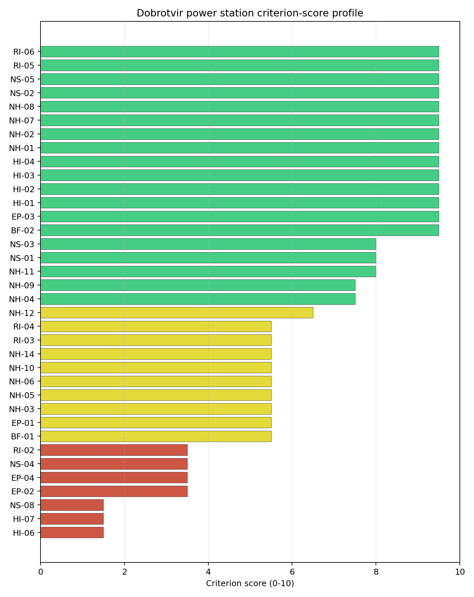
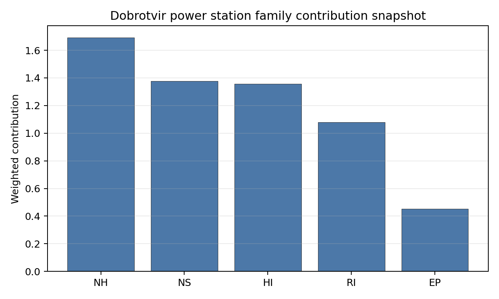

# Dobrotvir power station Site Profile

Dobrotvir power station is a Ukrainian coal/thermal site tested against the NuScale VOYGR-6 reference deployment envelope. This profile summarises Stage 1-2 desk-study evidence for post-war review. It is not a site-suitability determination, vendor recommendation, licensing finding, or near-term progression recommendation.

**Ukraine conflict and territorial-access caveat.** Current war conditions, security constraints, infrastructure-condition uncertainty, regulator access, emergency-planning continuity and data currency prevent this site from being treated as a practical near-term Stage 3 candidate. The profile does not make a legal or conflict-status determination for the site; it identifies what would need to be verified after stable access is available.

## Site Snapshot

| Field | Value |
| --- | --- |
| Site name | Dobrotvir power station |
| Coordinates | 50.2143, 24.3747 |
| Subnational unit | Lviv |
| Installed thermal capacity (source data) | 1,110 MW |
| Available surface area | 215.1 ha |
| Available surface area for development | 215.1 ha |
| Composite score (baseline weights) | 7.372 (6.533-8.006 MC band) |
| National stability band | B (top-10% hit rate 100%) |
| National rank | 2 |

_See the country status map in_ [Ukraine Country Profile](../UA_country_prototype.md#country-status-map).

## Ownership and Coal-to-Nuclear Context

Ownership records identify **DTEK Westenergy JSC [100%]** as the immediate owner or operator recorded for Dobrotvir power station. The parentage evidence includes DTEK Group BV, DTEK Energy Holdings BV, DTEK Energy BV, natural person(s). Several upstream share fields remain incomplete, so this profile reports the ownership chain as screening evidence only and does not infer land control, project rights, public acceptance, or procurement feasibility.

Generating units on record: 1 cancelled, 4 mothballed. Earliest unit commissioning: 1960; most recent: 1964. The brownfield value is the inherited grid, cooling, transport and industrial-land context; under the Ukraine caveat, every asset-condition claim requires post-war physical verification before Stage 3 work can be scoped.

## Natural Hazards (NH)

- **Seismic: Ground Motion (NH-01)** - score 9.5/10 (MC 9.0-10.0) - favourable: Well below the risk boundary., weight 0.0455, data quality high. Evidence: PGA at 475-year return period 0.018 g; PGA at 2,475-year return period 0.065 g; Vs30 reference (m/s): 760.0.
- **Seismic: Surface Rupture (NH-02)** - score 9.5/10 (MC 9.0-10.0) - favourable: Very strong separation from mapped capable faults; surface-rupture concern effectively screened at desk-study level., weight n/a, data quality screening grade. Evidence: nearest mapped capable fault 50.0 km; fault slip rate 0 mm/yr; fault name: none_in_search_radius.
- **Geotechnical: Liquefaction (NH-03)** - score 5.5/10 (MC 5.0-6.0) - pass-mark band: Moderate susceptibility, or high/very-high with documented (or pending for `high`) mitigation., weight n/a, data quality medium. Evidence: liquefaction susceptibility: high; dominant soil type: loam.
- **Geotechnical: Slope Stability (NH-04)** - score 7.5/10 (MC 7.0-8.0), weight n/a, data quality screening grade. Evidence: site slope 8.32 deg; max slope in 1 km box 82.4 deg; slope stability class: moderate.
- **Geotechnical: Subsidence (NH-05)** - score 5.5/10 (MC 5.0-6.0) - pass-mark band: At or above the mine-distance score-5 pivot; review possible., weight 0.0354, data quality medium. Evidence: karst present: no; karst severity: moderate; formation type: carbonate (Continuous carbonate rocks).
- **Geotechnical: Foundation (NH-06)** - score 5.5/10 (MC 5.0-6.0) - pass-mark band: Typical European mixed conditions (bearing 80-150 kPa)., weight 0.0253, data quality medium. Evidence: bearing capacity 80.7 kPa; depth to bedrock 16.0 m.
- **Volcanism (NH-07)** - score 9.5/10 (MC 9.0-10.0) - favourable: Very strong margin above the score-5 boundary (or no in-radius signal is recorded)., weight n/a, data quality high. Evidence: volcanic hazard class: negligible.
- **Coastal Flooding (NH-08)** - score 9.5/10 (MC 9.0-10.0) - favourable: Non-coastal OR elevation >= 50 m AMSL OR landlocked country, with no positive marine-hazard signal., weight 0.0303, data quality medium. Evidence: distance to coast 567.9 km.
- **River Flooding (NH-09)** - score 7.5/10 (MC 5.5-9.5), weight 0.0404, data quality insufficient. Evidence: flood zone class: negligible.
- **Extreme Winds (NH-10)** - score 5.5/10 (MC 5.0-6.0) - pass-mark band: Middle relative wind exposure around the observed cohort mean (9.0-10.5 m/s)., weight 0.0152, data quality medium. Evidence: screening wind-speed index 10.1 m/s.
- **Extreme Precipitation (NH-11)** - score 8.0/10 (MC 8.0-9.0) - favourable: aggregated(mean_of_sub_scores), weight 0.0152, data quality medium. Evidence: screening extreme-precipitation index 0.23 mm; screening precipitation index 24.9 mm/yr.
- **Extreme Temperatures (NH-12)** - score 6.5/10 (MC 6.0-7.0) - pass-mark band: aggregated(mean_of_sub_scores), weight 0.0202, data quality medium. Evidence: extreme high temperature 22.5 deg C; extreme low temperature -8.67 deg C.
- **Combined Hazards (NH-14)** - score 5.5/10 (MC 5.0-6.0) - pass-mark band: At least 5 resolved, exactly one moderate hazard (3-5) or moderate interaction only., weight 0.0152, data quality n/a. Evidence: values not in measurement tables.

### Interpretation - Natural Hazards (NH)

Natural hazards at Dobrotvir power station are acceptable for desk-study screening, but they are not a substitute for field characterisation. Foundation screening remains material because the bundle records bearing capacity at 80.7 kPa. The main natural-hazard follow-up items are Geotechnical: Liquefaction (NH-03) at 5.5/10, Geotechnical: Subsidence (NH-05) at 5.5/10, Geotechnical: Foundation (NH-06) at 5.5/10. Post-war Stage 3 review should confirm seismic inputs, site geotechnics, flood and drainage assumptions, and design meteorology from measured Ukrainian records and site access surveys.

## Human-Induced and Security-Relevant Hazards (HI)

- **Aircraft Crash (HI-01)** - score 9.5/10 (MC 9.0-10.0) - favourable: Only small / GA / heliport airport >= 10 km nearby, no flight-path proxy < 4 km, no major airport within 30 km, and no military airbase within 60 km., weight 0.0354, data quality high. Evidence: nearest airport 29.7 km; nearest flight path 14.8 km; airports within search radius 1; airport name: Zhalizhnia; airport type: small airfield.
- **Industrial Explosions (HI-02)** - score 9.5/10 (MC 9.0-10.0) - favourable: Very strong margin above the score-5 boundary (or completed search confirmed no in-radius signal)., weight 0.0354, data quality screening grade. Evidence: values not in measurement tables.
- **Toxic/Gas Releases (HI-03)** - score 9.5/10 (MC 9.0-10.0) - favourable: Very strong margin above the score-5 boundary (or completed search confirmed no in-radius signal)., weight 0.0354, data quality screening grade. Evidence: values not in measurement tables.
- **External Fires (HI-04)** - score 9.5/10 (MC 9.0-10.0) - favourable: > 15 km, or completed flammable-storage search found nothing in radius., weight 0.0303, data quality screening grade. Evidence: values not in measurement tables.
- **Military Installations (HI-06)** - score 1.5/10 (MC 1.0-2.0), weight 0.0303, data quality medium. Evidence: nearest military installation 12.7 km; military installations within radius 4; installation name: unnamed.
- **Electromagnetic Interference (HI-07)** - score 1.5/10 (MC 1.0-2.0), weight 0.0101, data quality medium. Evidence: nearest high-power transmitter 0.24 km; transmitters within radius 89; transmitter type: communication.

### Interpretation - Human-Induced and Security-Relevant Hazards (HI)

Human-induced and security-relevant hazards at Dobrotvir power station require conservative treatment because the source evidence is a desk-study snapshot. The nearest airport proxy is 29.7 km away. The nearest recorded military-installation proxy is 12.7 km away, but the current security context means the cadastre must be refreshed before any siting decision relies on it. The limiting screening items are Military Installations (HI-06) at 1.5/10, Electromagnetic Interference (HI-07) at 1.5/10, Aircraft Crash (HI-01) at 9.5/10. The post-war work package should refresh airspace, military, hazardous-neighbour, transport-hazard and electromagnetic-interference evidence with competent Ukrainian authorities.

## Radiological Impact and Emergency Planning (RI / EP)

- **Emergency Planning Feasibility (EP-01)** - score 5.5/10 (MC 5.0-6.0) - pass-mark band: At or above the composite score-5 boundary., weight n/a, data quality high. Evidence: EP feasibility composite 60.9 /100; road sub-score 33.4 /100; special-population sub-score 90.0 /100; geography sub-score 95.0 /100; population sub-score 80.0 /100; evacuation feasible: yes.
- **Evacuation Routes (EP-02)** - score 3.5/10 (MC 3.0-4.0), weight 0.0303, data quality medium. Evidence: road density in EPZ 0.357 km/km2; road length in EPZ 701.7 km; motorway access: no.
- **Physical Geography Constraints (EP-03)** - score 9.5/10 (MC 9.0-10.0) - favourable: No measured relief; open river/waterway context (interim screening)., weight 0.0253, data quality medium. Evidence: waterways crossing EPZ 0; major river barrier: no.
- **Special Populations (EP-04)** - score 3.5/10 (MC 3.0-4.0), weight 0.0303, data quality medium. Evidence: hospitals in EPZ 29; prisons in EPZ 0; care homes in EPZ 0.
- **Atmospheric Dispersion (RI-01)** - score no native score (unscored - no band matched), weight 0.0303, data quality medium. Evidence: annual mean wind speed 1.44 m/s; atmospheric mixing height 543.7 m; prevailing wind direction: WSW.
- **Surface Water Dispersion (RI-02)** - score 3.5/10 (MC 3.0-4.0), weight 0.0253, data quality n/a. Evidence: values not in measurement tables.
- **Groundwater Dispersion (RI-03)** - score 5.5/10 (MC 5.0-6.0) - pass-mark band: Moderate-permeability aquifer screening proxy., weight 0.0253, data quality medium. Evidence: aquifer type: alluvial.
- **Population Density at EPZ Radii (RI-04)** - score 5.5/10 (MC 5.0-6.0) - pass-mark band: aggregated(min_of_sub_scores), weight 0.0404, data quality screening grade. Evidence: population density within 5 km 109.3 /km2; population density within 16 km 61.5 /km2; population density within 25 km 93.4 /km2; population density within 80 km 102.8 /km2; population within 25 km 183,350 people.
- **Distance to Population Centres (RI-05)** - score 9.5/10 (MC 9.0-10.0) - favourable: Nearest >=50k population-centre proxy exceeds required distance by >= 50 %., weight 0.0505, data quality screening grade. Evidence: nearest city above 50k people 97.0 km; nearest city population 58,231 people; city name: Zamość.
- **Population Projections (RI-06)** - score 9.5/10 (MC 9.0-10.0) - favourable: Declining (< -0.5 %/yr)., weight 0.0253, data quality screening grade. Evidence: annual population growth rate -1.218 %/yr; projected population at 25 km in 60 yr 109,767 people.

### Interpretation - Radiological Impact and Emergency Planning (RI / EP)

Radiological impact and emergency-planning evidence at Dobrotvir power station supports comparison within Ukraine, not near-term implementation. Evacuation-route density is 0.357 km/km2 inside the emergency-planning zone, making road-network confirmation an early post-war task. The main RI/EP constraints are Evacuation Routes (EP-02) at 3.5/10, Special Populations (EP-04) at 3.5/10, Surface Water Dispersion (RI-02) at 3.5/10, Atmospheric Dispersion (RI-01) at 5.0/10. Stage 3 should therefore begin with updated population, special-population, evacuation, hydrology and meteorological dispersion studies, all under stable access and regulator engagement.

## Non-Safety and Implementation Considerations (NS)

- **Grid Capacity Basic Filter (BF-01)** - score 5.5/10 (MC 5.0-6.0) - pass-mark band: Note: substation 15-30 km OR 110-219 kV; reinforcement plausible., weight n/a, data quality n/a. Evidence: values not in measurement tables.
- **Land Area Basic Filter (BF-02)** - score 9.5/10 (MC 9.0-10.0) - favourable: Contiguous and buildable >= ideal area (70 ha/module)., weight 0.0253, data quality n/a. Evidence: values not in measurement tables.
- **Cooling Water Availability (NS-01)** - score 8.0/10 (MC 8.0-9.0) - favourable: aggregated(weighted_mean_of_sub_scores), weight 0.0404, data quality screening grade. Evidence: distance to cooling source 1.06 km; cooling source flow 14.4 m3/s; cooling source type: river; cooling source name: Zakhidnyi Buh; water stress label: Low.
- **Grid Connection (NS-02)** - score 9.5/10 (MC 9.0-10.0) - favourable: aggregated(min_of_sub_scores), weight 0.0404, data quality high. Evidence: nearest substation 0.24 km; nearest high-voltage line 0.27 km; grid export capacity 1,110 MW; substations within radius 428; HV lines within radius 536.
- **Transport Access (NS-03)** - score 8.0/10 (MC 8.0-9.0) - favourable: aggregated(weighted_mean_of_sub_scores), weight 0.0404, data quality high. Evidence: nearest highway 7.04 km; nearest rail line 0.05 km; heavy-haul capable: yes.
- **Site Topography (NS-04)** - score 3.5/10 (MC 3.0-4.0), weight 0.0303, data quality screening grade. Evidence: favourable land cover 35.7 %; moderate land cover 32.3 %; unfavourable land cover 32.0 %; favourable area 77.4 ha; dominant land class: 321.
- **Site Footprint Adequacy (NS-05)** - score 9.5/10 (MC 9.0-10.0) - favourable: Very strong margin above the score-5 boundary., weight 0.0253, data quality screening grade. Evidence: buildable area 215.1 ha; largest contiguous patch 829.1 ha; buildable patch count 7.
- **Existing Infrastructure (NS-06)** - score no native score (unscored - no band matched), weight 0.0253, data quality n/a. Evidence: not measured at this site (criterion remains unscored).
- **Ecological Sensitivity (NS-08)** - score 1.5/10 (MC 0.0-3.5), weight n/a, data quality insufficient. Evidence: natural land cover 32.0 %; distance to nearest protected area 0.634 km; Natura 2000 sensitivity class: unknown; protected-area overlap: no; protected-area sensitivity class: high; Natura 2000 sites within 5 km: 0; nearest protected-area designation: Emerald Network.
- **Workforce Availability (NS-10)** - score no native score (unscored - no band matched), weight 0.0202, data quality n/a. Evidence: not measured at this site (criterion remains unscored).
- **Regulatory/Political Environment (NS-12)** - score no native score (unscored - no band matched), weight 0.0303, data quality n/a. Evidence: not measured at this site (criterion remains unscored).
- **Construction Logistics (NS-13)** - score no native score (unscored - no band matched), weight 0.0202, data quality n/a. Evidence: not measured at this site (criterion remains unscored).

### Interpretation - Non-Safety and Implementation Considerations (NS)

Non-safety and implementation factors are the main reason Dobrotvir power station remains in the Ukraine top-five desk-study set. The canonical site surface area is 215.1 ha, and the current area for development is 215.1 ha; these figures do not prove land availability, contiguity, permitting or control. Grid screening is favourable on proximity: nearest substation 0.24 km, nearest high-voltage line 0.27 km, grid export-capacity proxy 1110 MW. The limiting non-safety items are Ecological Sensitivity (NS-08) at 1.5/10, Site Topography (NS-04) at 3.5/10, Existing Infrastructure (NS-06) at 5.0/10, Workforce Availability (NS-10) at 5.0/10. Post-war review should verify switchyard condition, transmission voltage path, cooling-water availability, ecological constraints, land title, construction logistics and workforce evidence before any progression decision.

## Composite Score and Stability

Baseline composite score is 7.372, bracketed by Monte Carlo at 6.533-8.006. National stability band is `B` with a top-10% hit rate of 100% across 12 scored Monte Carlo scenarios.

Dobrotvir power station ranks 2 nationally with a baseline composite score of 7.372 and a Monte Carlo bracket of 6.533-8.006. Its national stability band is B, with a national top-10% hit rate of 100%. This is a robust national screening position within the Ukrainian desk-study pool. The result should sequence evidence collection, not construction readiness: the Ukraine conflict and territorial-access caveat prevents treatment of any Ukrainian site as a practical near-term Stage 3 candidate in this report pass.

## Residual Risk Register

| Concern | Evidence | Consequence | Stage 3 action | Owner discipline |
| --- | --- | --- | --- | --- |
| Conflict and territorial access | Current war conditions affect access, security, infrastructure-condition evidence and emergency-planning currency. | Near-term progression cannot be supported from desk-study data alone. | Defer progression decision until stable access, regulator engagement and updated territorial-control evidence are available. | programme |
| Military Installations (HI-06) | Native score 1.5/10; confidence medium. | Could alter the screening class, design basis or mitigation burden if confirmed in field evidence. | Re-measure Military Installations with site-specific post-war data before Stage 3 scoping. | security |
| Electromagnetic Interference (HI-07) | Native score 1.5/10; confidence medium. | Could alter the screening class, design basis or mitigation burden if confirmed in field evidence. | Re-measure Electromagnetic Interference with site-specific post-war data before Stage 3 scoping. | security |
| Ecological Sensitivity (NS-08) | Native score 1.5/10; confidence insufficient. | Could alter the screening class, design basis or mitigation burden if confirmed in field evidence. | Re-measure Ecological Sensitivity with site-specific post-war data before Stage 3 scoping. | site engineering / environment |
| Evacuation Routes (EP-02) | Native score 3.5/10; confidence medium. | Could alter the screening class, design basis or mitigation burden if confirmed in field evidence. | Re-measure Evacuation Routes with site-specific post-war data before Stage 3 scoping. | emergency planning |
| Special Populations (EP-04) | Native score 3.5/10; confidence medium. | Could alter the screening class, design basis or mitigation burden if confirmed in field evidence. | Re-measure Special Populations with site-specific post-war data before Stage 3 scoping. | emergency planning |

This register is a post-war evidence plan for Dobrotvir power station. It is not a finding of site approval or a recommendation to start Stage 3 work under current conditions.

## Stage 3 Follow-Up Checklist

- Re-measure **Military Installations (HI-06)** - native score 1.5/10 with confidence medium.
- Re-measure **Electromagnetic Interference (HI-07)** - native score 1.5/10 with confidence medium.
- Re-measure **Ecological Sensitivity (NS-08)** - native score 1.5/10 with confidence low.
- Re-measure **Evacuation Routes (EP-02)** - native score 3.5/10 with confidence medium.
- Re-measure **Special Populations (EP-04)** - native score 3.5/10 with confidence medium.

## Evidence Limitations

- No criterion-family quality fields are flagged as low or missing in this bundle.
