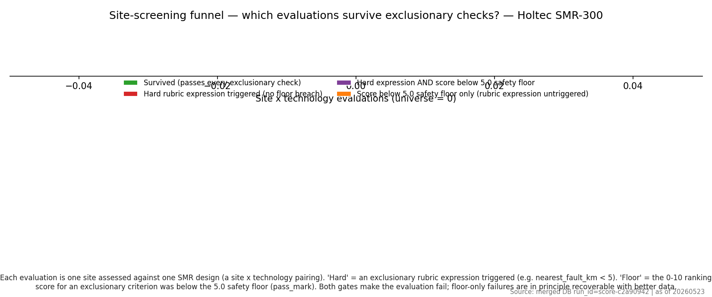

# Phase 1.6 failure-mode analysis — 20260523 — Holtec SMR-300

> Holtec SMR-300 — 300 MWe

- Run ID: `score-c2a90942`
- Stamp: **20260523**
- Universe: **0** site × technology evaluations.

> **TL;DR (Holtec SMR-300)**
> - **Universe**: **0** site × technology evaluations across **0** sites × **0** SMR design(s).
> - **Survivors**: **0** (n/a); **failed any check**: **0** (n/a).
> - **Floor share**: **n/a** of failed pairings are caught by the safety floor (alone or together with a hard E-code).

Source artefacts:
- `audit/post_processing/06_scoring/per_smr/holtec_smr300/20260523_failure_summary.csv` — top-level counts.
- `audit/post_processing/06_scoring/per_smr/holtec_smr300/20260523_failure_per_criterion.csv` — per-criterion fails.
- `audit/post_processing/06_scoring/per_smr/holtec_smr300/20260523_failure_per_country.csv` — per-country fails.
- `audit/post_processing/06_scoring/per_smr/holtec_smr300/20260523_failure_per_pair.csv` — one row per (site, SMR).

Two failure mechanisms are tracked side by side: a **hard E-code** rubric expression triggering, and a **safety floor** breach where the 0–10 ranking score for an exclusionary criterion is below its `pass_mark` (5.0). See [`exclusionary_floors.md`](./exclusionary_floors.md). Both produce `passed_exclusionary = False` and `composite_score = NULL`. Per-criterion ranking rows are kept on disk for transparency, so the audit can show *why* a site failed without contaminating the suitable-site ranking.

## Glossary

See the canonical glossary in [`failure_analysis.md` § Glossary](./failure_analysis.md#glossary). Terms are identical across the global and SMR-specific failure reports; only the population filter changes (this file is the `smr_key = holtec_smr300` filter).

## 1. Funnel — universe → survivors

## 2. Failures by exclusionary criterion

Pivot view: Pivot view: per-criterion failure counts filtered to `smr_key = holtec_smr300`. Canonical home: `failure_analysis.md` § 2. Source: `audit/post_processing/06_scoring/20260523_failure_breakdown_holtec_smr300_per_criterion.csv` (slice `smr_key=holtec_smr300`)._

Counts are unique pairs (a pair that triggers both `EP-01` hard and `EP-01:floor` is counted once in `Hard ∧ floor`, **not** twice). The *Share of all failures* column expresses each criterion's contribution against the total of **0** failed pairings.

| Criterion | Name | Hard fails | Floor fails | Hard ∧ floor | Total pairs failed | Share of all failures |
| --- | --- | ---: | ---: | ---: | ---: | ---: |

## 3. Failures by country

Pivot view: Pivot view: per-country survivorship filtered to `smr_key = holtec_smr300`. Canonical home: `failure_analysis.md` § 3. Source: `audit/post_processing/06_scoring/20260523_failure_breakdown_holtec_smr300_per_country.csv` (slice `smr_key=holtec_smr300`)._

ISO codes follow ISO 3166-1 alpha-2. *Survival rate* is the share of evaluations within the country that pass every exclusionary check.

| ISO | Country | n sites | n pairs | Survived | Survival rate | Hard only | Hard ∧ floor | Floor only | Sites w/ survivor |
| --- | --- | ---: | ---: | ---: | ---: | ---: | ---: | ---: | ---: |

## 5. Compound vs. single-criterion failures

Pivot view: Pivot view: compound-failure histogram filtered to `smr_key = holtec_smr300`. Canonical home: `failure_analysis.md` § 5. Source: `audit/post_processing/06_scoring/20260523_failure_breakdown_holtec_smr300_multi_failure.csv` (slice `smr_key=holtec_smr300`)._

_No compound failures observed._

## 6. How to read this

- **Floor-only pairs are recoverable in principle**: the underlying rubric expression did not trigger; tightening the rubric or improving the data behind the criterion can move the score above `pass_mark`.
- **Hard-only and `Hard ∧ floor` pairs are not recoverable**: the rubric's hard expression triggered, so the site is geophysically or logistically incompatible with the SMR design.
- **Compound failures** (≥ 2 distinct criteria) cluster the truly unsuitable sites; single-criterion failures are the candidates for re-examination once data quality improves.
