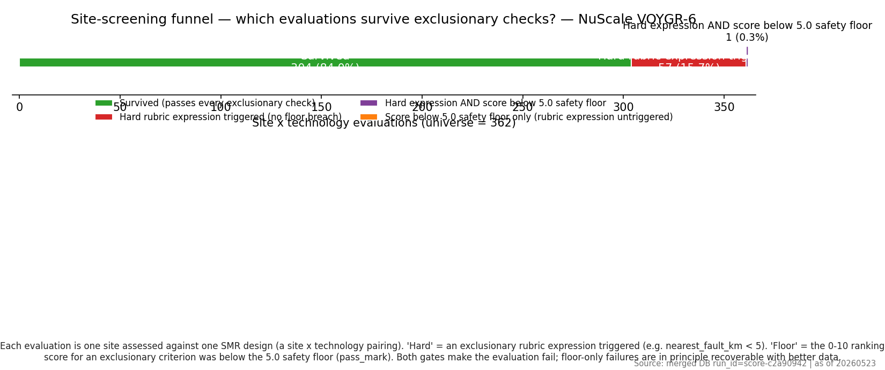
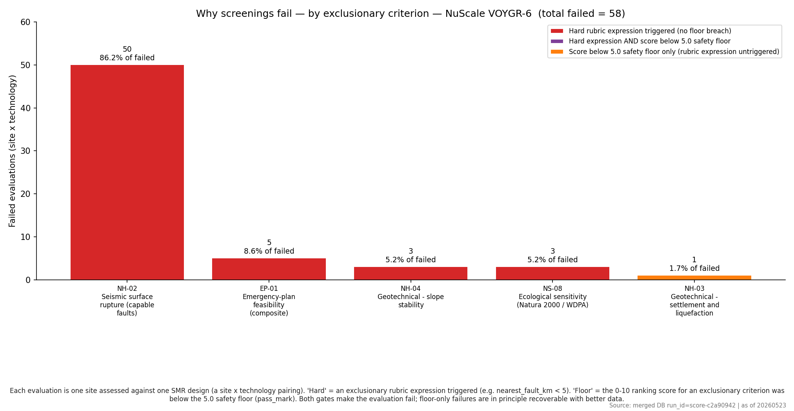
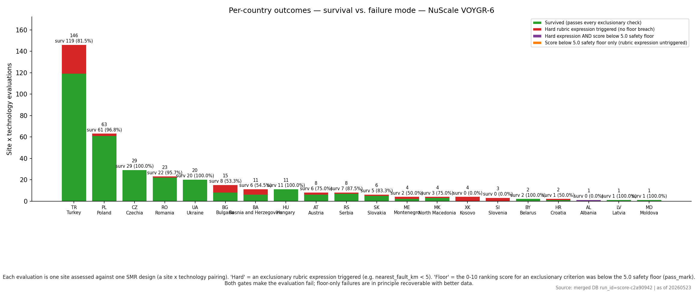
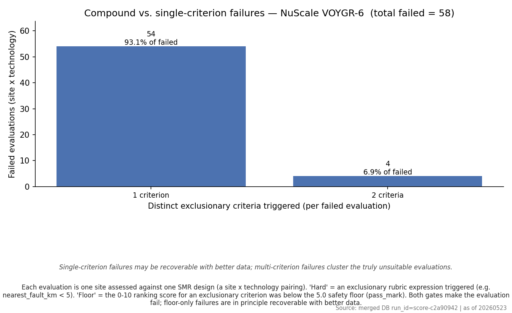

# Phase 1.6 failure-mode analysis — 20260523 — NuScale VOYGR-6

> NuScale VOYGR-6 — 462 MWe

- Run ID: `score-c2a90942`
- Stamp: **20260523**
- Universe: **362** site × technology evaluations.

> **TL;DR (NuScale VOYGR-6)**
> - **Universe**: **362** site × technology evaluations across **362** sites × **1** SMR design(s).
> - **Survivors**: **304** (84.0%); **failed any check**: **58** (16.0%).
> - **Dominant filter**: `NH-02` — Seismic surface rupture (capable faults); rejects **50** pairings (86.2% of failed).
> - **Floor share**: **1.7%** of failed pairings are caught by the safety floor (alone or together with a hard E-code).

Source artefacts:
- `audit/post_processing/06_scoring/per_smr/nuscale_voygr6/20260523_failure_summary.csv` — top-level counts.
- `audit/post_processing/06_scoring/per_smr/nuscale_voygr6/20260523_failure_per_criterion.csv` — per-criterion fails.
- `audit/post_processing/06_scoring/per_smr/nuscale_voygr6/20260523_failure_per_country.csv` — per-country fails.
- `audit/post_processing/06_scoring/per_smr/nuscale_voygr6/20260523_failure_per_pair.csv` — one row per (site, SMR).

Two failure mechanisms are tracked side by side: a **hard E-code** rubric expression triggering, and a **safety floor** breach where the 0–10 ranking score for an exclusionary criterion is below its `pass_mark` (5.0). See [`exclusionary_floors.md`](./exclusionary_floors.md). Both produce `passed_exclusionary = False` and `composite_score = NULL`. Per-criterion ranking rows are kept on disk for transparency, so the audit can show *why* a site failed without contaminating the suitable-site ranking.

## Glossary

| Term | Definition |
| --- | --- |
| **Site** | One candidate parcel identified by `site_id`, associated with a country code. |
| **SMR design** | One vendor / model identified by `smr_key` (e.g. `nuscale_voygr6`). 8 designs are evaluated. |
| **Site × technology evaluation (pair)** | One row per `(site_id, smr_key)` pairing. The universe is sites × designs. |
| **Exclusionary phase** | Pre-scoring screening: a pair is rejected before any composite score is computed. |
| **Hard E-code** (`prompt_key = E1, E2, …`) | A rubric `condition_expr` evaluated to true (e.g. `nearest_fault_km < 5`). |
| **Safety floor** (`prompt_key = E<k>:floor`) | The 0–10 ranking score for an exclusionary criterion is strictly below its `pass_mark` (5.0 by default). |
| **Survived** | Pair passed every hard E-code and every floor. |
| **Hard only** | Hard expression triggered; floor not breached. |
| **Floor only** | Score below 5.0 floor; rubric expression did not trigger. |
| **Hard ∧ floor** | Both gates failed for the same pair. |

## 1. Funnel — universe → survivors

## 2. Failures by exclusionary criterion

Counts are unique pairs (a pair that triggers both `EP-01` hard and `EP-01:floor` is counted once in `Hard ∧ floor`, **not** twice). The *Share of all failures* column expresses each criterion's contribution against the total of **58** failed pairings.

| Criterion | Name | Hard fails | Floor fails | Hard ∧ floor | Total pairs failed | Share of all failures |
| --- | --- | ---: | ---: | ---: | ---: | ---: |
| `NH-02` | Seismic surface rupture (capable faults) | 50 | 0 | 0 | 50 | 86.2% |
| `EP-01` | Emergency-plan feasibility (composite) | 5 | 0 | 0 | 5 | 8.6% |
| `NH-04` | Geotechnical - slope stability | 3 | 0 | 0 | 3 | 5.2% |
| `NS-08` | Ecological sensitivity (Natura 2000 / WDPA) | 3 | 0 | 0 | 3 | 5.2% |
| `NH-03` | Geotechnical - settlement and liquefaction | 0 | 1 | 0 | 1 | 1.7% |

**Criterion glossary**   
`NH-02` Seismic surface rupture (capable faults)  
`EP-01` Emergency-plan feasibility (composite)  
`NH-04` Geotechnical - slope stability  
`NS-08` Ecological sensitivity (Natura 2000 / WDPA)  
`NH-03` Geotechnical - settlement and liquefaction

## 3. Failures by country

ISO codes follow ISO 3166-1 alpha-2. *Survival rate* is the share of evaluations within the country that pass every exclusionary check.

| ISO | Country | n sites | n pairs | Survived | Survival rate | Hard only | Hard ∧ floor | Floor only | Sites w/ survivor |
| --- | --- | ---: | ---: | ---: | ---: | ---: | ---: | ---: | ---: |
| TR | Turkey | 146 | 146 | 119 | 81.5% | 27 | 0 | 0 | 119 |
| PL | Poland | 63 | 63 | 61 | 96.8% | 2 | 0 | 0 | 61 |
| CZ | Czechia | 29 | 29 | 29 | 100.0% | 0 | 0 | 0 | 29 |
| RO | Romania | 23 | 23 | 22 | 95.7% | 1 | 0 | 0 | 22 |
| UA | Ukraine | 20 | 20 | 20 | 100.0% | 0 | 0 | 0 | 20 |
| BG | Bulgaria | 15 | 15 | 8 | 53.3% | 7 | 0 | 0 | 8 |
| BA | Bosnia and Herzegovina | 11 | 11 | 6 | 54.5% | 5 | 0 | 0 | 6 |
| HU | Hungary | 11 | 11 | 11 | 100.0% | 0 | 0 | 0 | 11 |
| AT | Austria | 8 | 8 | 6 | 75.0% | 2 | 0 | 0 | 6 |
| RS | Serbia | 8 | 8 | 7 | 87.5% | 1 | 0 | 0 | 7 |
| SK | Slovakia | 6 | 6 | 5 | 83.3% | 1 | 0 | 0 | 5 |
| ME | Montenegro | 4 | 4 | 2 | 50.0% | 2 | 0 | 0 | 2 |
| MK | North Macedonia | 4 | 4 | 3 | 75.0% | 1 | 0 | 0 | 3 |
| XK | Kosovo | 4 | 4 | 0 | 0.0% | 4 | 0 | 0 | 0 |
| SI | Slovenia | 3 | 3 | 0 | 0.0% | 3 | 0 | 0 | 0 |
| BY | Belarus | 2 | 2 | 2 | 100.0% | 0 | 0 | 0 | 2 |
| HR | Croatia | 2 | 2 | 1 | 50.0% | 1 | 0 | 0 | 1 |
| AL | Albania | 1 | 1 | 0 | 0.0% | 0 | 1 | 0 | 0 |
| LV | Latvia | 1 | 1 | 1 | 100.0% | 0 | 0 | 0 | 1 |
| MD | Moldova | 1 | 1 | 1 | 100.0% | 0 | 0 | 0 | 1 |

## 5. Compound vs. single-criterion failures

| Distinct criteria failed | Pairs | Share of failed |
| ---: | ---: | ---: |
| 1 | 54 | 93.1% |
| 2 | 4 | 6.9% |

## 6. How to read this

- **Floor-only pairs are recoverable in principle**: the underlying rubric expression did not trigger; tightening the rubric or improving the data behind the criterion can move the score above `pass_mark`.
- **Hard-only and `Hard ∧ floor` pairs are not recoverable**: the rubric's hard expression triggered, so the site is geophysically or logistically incompatible with the SMR design.
- **Compound failures** (≥ 2 distinct criteria) cluster the truly unsuitable sites; single-criterion failures are the candidates for re-examination once data quality improves.
