# Regional Atoms vs Ashes Shortlist

_Reference SMR: NuScale VOYGR-6. Analytical basis: national sensitivity (50,000-iteration Monte Carlo profile-rank treatment) over the current baseline scoring rubric._

## Provenance

- **Scoring run**: `score-2ffc8a70`
- **National sensitivity run**: `nat-sens-139d3947`
- **SMR key**: `nuscale_voygr6`
- **Weight profile**: `baseline`
- **Git SHA**: `4e1e8f1a5af7119d100078de5711b29ebefe7d61`

National ranks are ordered by baseline composite score within each country. Stability bands and top-tier hit rates come from `site_bands` under national sensitivity run `nat-sens-139d3947`. Composite scores, family means, criterion scores, and screening status come from the scoring run.

Belarus is excluded from this shortlist under the published country roster (inherited from version 1.2).

Each country section lists up to **five** sites by national rank (normal qualification: avoidance-flagged sites may appear). Per-country locator maps tag every shortlisted site with rank, status, and composite score.

---

## Austria (AT)

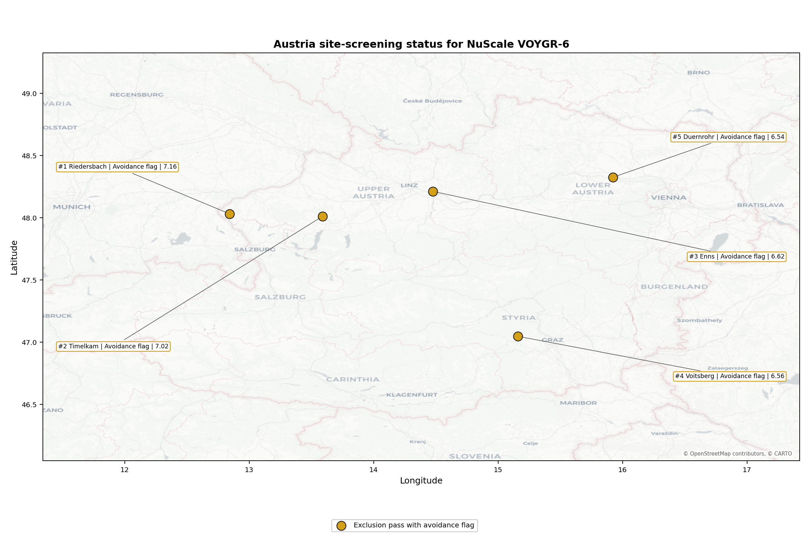

| # | Site | Status | Composite | MC low | MC high | Band | Top-10% | NH | HI | RI | EP | NS | Coverage | Confidence | Cap (MW) | Reg. rank |
| ---: | --- | --- | ---: | ---: | ---: | :---: | ---: | ---: | ---: | ---: | ---: | ---: | ---: | :--- | ---: | ---: |
| 1 | Riedersbach power station | Avoidance flag | 7.16 | 6.36 | 7.65 | A | 100% | 8.1 | 7.2 | 7.3 | 6.7 | 6.0 | 76 | low | 220 | 25 |
| 2 | Timelkam power station | Avoidance flag | 7.02 | 6.25 | 7.49 | H | 0% | 7.8 | 7.4 | 7.3 | 4.3 | 6.7 | 76 | low | 66 | 41 |
| 3 | Enns Power Station | Avoidance flag | 6.62 | 5.92 | 7.16 | H | 0% | 8.0 | 5.8 | 4.2 | 6.0 | 7.8 | 76 | low | 800 | 111 |
| 4 | Voitsberg power station | Avoidance flag | 6.56 | 5.88 | 7.05 | H | 0% | 7.2 | 7.2 | 5.9 | 6.0 | 6.0 | 76 | low | 330 | 122 |
| 5 | Duernrohr power station | Avoidance flag | 6.54 | 5.86 | 7.08 | H | 0% | 7.1 | 5.8 | 3.5 | 7.4 | 8.6 | 76 | low | 802 | 125 |

### Criterion scores (0–10)

**Riedersbach power station** — national rank 1

| Criterion | Score |
| :--- | ---: |
| BF-01 | 5.5 |
| BF-02 | 1.5 |
| EP-01 | 5.5 |
| EP-02 | 5.5 |
| EP-03 | 9.5 |
| EP-04 | 5.5 |
| HI-01 | 7.5 |
| HI-02 | 9.5 |
| HI-03 | 7.5 |
| HI-04 | 9.5 |
| HI-06 | 3.5 |
| HI-07 | 1.5 |
| NH-01 | 9.5 |
| NH-02 | 7.5 |
| NH-03 | 5.5 |
| NH-04 | 5.5 |
| NH-05 | 9.5 |
| NH-06 | 5.5 |
| NH-07 | 9.5 |
| NH-08 | 9.5 |
| NH-09 | 7.5 |
| NH-10 | 7.5 |
| NH-11 | 6.0 |
| NH-12 | 7.5 |
| NH-14 | 5.5 |
| NS-01 | 9.0 |
| NS-02 | 1.5 |
| NS-03 | 8.0 |
| NS-04 | 5.5 |
| NS-05 | 5.5 |
| NS-06 | 5.0 |
| NS-08 | 1.5 |
| NS-10 | 5.0 |
| NS-12 | 5.0 |
| NS-13 | 5.0 |
| RI-01 | 5.0 |
| RI-02 | 7.5 |
| RI-03 | 7.5 |
| RI-04 | 5.5 |
| RI-05 | 9.5 |
| RI-06 | 5.5 |

**Timelkam power station** — national rank 2

| Criterion | Score |
| :--- | ---: |
| BF-01 | 5.5 |
| BF-02 | 3.5 |
| EP-01 | 5.5 |
| EP-02 | 5.5 |
| EP-03 | 1.5 |
| EP-04 | 5.5 |
| HI-01 | 9.5 |
| HI-02 | 9.5 |
| HI-03 | 9.5 |
| HI-04 | 9.5 |
| HI-06 | 0.0 |
| HI-07 | 1.5 |
| NH-01 | 9.5 |
| NH-02 | 9.5 |
| NH-03 | 9.5 |
| NH-04 | 5.5 |
| NH-05 | 9.5 |
| NH-06 | 3.5 |
| NH-07 | 9.5 |
| NH-08 | 9.5 |
| NH-09 | 7.5 |
| NH-10 | 5.5 |
| NH-11 | 6.0 |
| NH-12 | 7.5 |
| NH-14 | 5.5 |
| NS-01 | 8.0 |
| NS-02 | 3.5 |
| NS-03 | 9.0 |
| NS-04 | 5.5 |
| NS-05 | 7.5 |
| NS-06 | 5.0 |
| NS-08 | 3.5 |
| NS-10 | 5.0 |
| NS-12 | 5.0 |
| NS-13 | 5.0 |
| RI-01 | 5.0 |
| RI-02 | 1.5 |
| RI-03 | 5.5 |
| RI-04 | 5.5 |
| RI-05 | 9.5 |
| RI-06 | 7.5 |

**Enns Power Station** — national rank 3

| Criterion | Score |
| :--- | ---: |
| BF-01 | 5.5 |
| BF-02 | 1.5 |
| EP-01 | 7.5 |
| EP-02 | 7.5 |
| EP-03 | 9.5 |
| EP-04 | 1.5 |
| HI-01 | 7.5 |
| HI-02 | 9.5 |
| HI-03 | 3.5 |
| HI-04 | 9.5 |
| HI-06 | 0.0 |
| HI-07 | 1.5 |
| NH-01 | 9.5 |
| NH-02 | 9.5 |
| NH-03 | 5.5 |
| NH-04 | 7.5 |
| NH-05 | 9.5 |
| NH-06 | 5.5 |
| NH-07 | 9.5 |
| NH-08 | 9.5 |
| NH-09 | 7.5 |
| NH-10 | 5.5 |
| NH-11 | 6.0 |
| NH-12 | 7.5 |
| NH-14 | 5.5 |
| NS-01 | 8.0 |
| NS-02 | 5.5 |
| NS-03 | 9.0 |
| NS-04 | 9.5 |
| NS-05 | 7.5 |
| NS-06 | 5.0 |
| NS-08 | 1.5 |
| NS-10 | 5.0 |
| NS-12 | 5.0 |
| NS-13 | 5.0 |
| RI-01 | 5.0 |
| RI-02 | 9.5 |
| RI-03 | 5.5 |
| RI-04 | 3.5 |
| RI-05 | 3.5 |
| RI-06 | 5.5 |

**Voitsberg power station** — national rank 4

| Criterion | Score |
| :--- | ---: |
| BF-01 | 5.5 |
| BF-02 | 5.5 |
| EP-01 | 5.5 |
| EP-02 | 5.5 |
| EP-03 | 9.5 |
| EP-04 | 3.5 |
| HI-01 | 7.5 |
| HI-02 | 9.5 |
| HI-03 | 7.5 |
| HI-04 | 9.5 |
| HI-06 | 3.5 |
| HI-07 | 1.5 |
| NH-01 | 7.5 |
| NH-02 | 7.5 |
| NH-03 | 9.5 |
| NH-04 | 7.5 |
| NH-05 | 5.5 |
| NH-06 | 3.5 |
| NH-07 | 9.5 |
| NH-08 | 9.5 |
| NH-09 | 7.5 |
| NH-10 | 9.5 |
| NH-11 | 8.0 |
| NH-12 | 7.5 |
| NH-14 | 9.5 |
| NS-01 | 8.0 |
| NS-02 | 1.5 |
| NS-03 | 9.0 |
| NS-04 | 5.5 |
| NS-05 | 5.5 |
| NS-06 | 5.0 |
| NS-08 | 3.5 |
| NS-10 | 5.0 |
| NS-12 | 5.0 |
| NS-13 | 5.0 |
| RI-01 | 5.0 |
| RI-02 | 1.5 |
| RI-03 | 5.5 |
| RI-04 | 5.5 |
| RI-05 | 7.5 |
| RI-06 | 3.5 |

**Duernrohr power station** — national rank 5

| Criterion | Score |
| :--- | ---: |
| BF-01 | 7.5 |
| BF-02 | 1.5 |
| EP-01 | 7.5 |
| EP-02 | 7.5 |
| EP-03 | 9.5 |
| EP-04 | 5.5 |
| HI-01 | 9.5 |
| HI-02 | 9.5 |
| HI-03 | 0.0 |
| HI-04 | 9.5 |
| HI-06 | 1.5 |
| HI-07 | 1.5 |
| NH-01 | 5.5 |
| NH-02 | 7.5 |
| NH-03 | 5.5 |
| NH-04 | 7.5 |
| NH-05 | 9.5 |
| NH-06 | 5.5 |
| NH-07 | 9.5 |
| NH-08 | 9.5 |
| NH-09 | 7.5 |
| NH-10 | 3.5 |
| NH-11 | 8.0 |
| NH-12 | 6.5 |
| NH-14 | 5.5 |
| NS-01 | 9.0 |
| NS-02 | 7.5 |
| NS-03 | 8.0 |
| NS-04 | 9.5 |
| NS-05 | 9.5 |
| NS-06 | 5.0 |
| NS-08 | 1.5 |
| NS-10 | 5.0 |
| NS-12 | 5.0 |
| NS-13 | 5.0 |
| RI-01 | 5.0 |
| RI-02 | 9.5 |
| RI-03 | 5.5 |
| RI-04 | 3.5 |
| RI-05 | 1.5 |
| RI-06 | 5.5 |

---

## Bosnia And Herzegovina (BA)

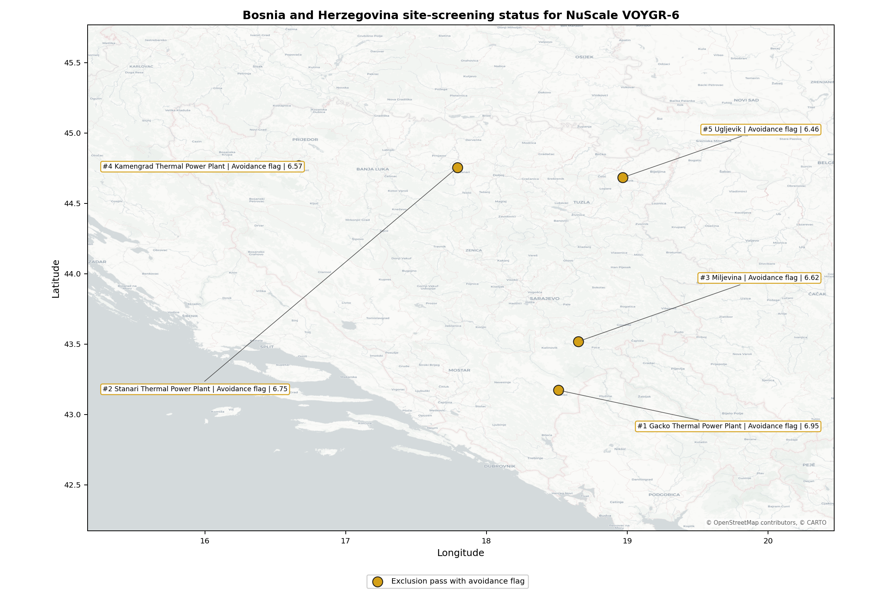

| # | Site | Status | Composite | MC low | MC high | Band | Top-10% | NH | HI | RI | EP | NS | Coverage | Confidence | Cap (MW) | Reg. rank |
| ---: | --- | --- | ---: | ---: | ---: | :---: | ---: | ---: | ---: | ---: | ---: | ---: | ---: | :--- | ---: | ---: |
| 1 | Stanari Thermal Power Plant | Avoidance flag | 6.75 | 6.03 | 7.24 | A | 92% | 6.5 | 7.9 | 7.6 | 5.3 | 6.0 | 76 | low | 300 | 86 |
| 2 | Miljevina power station | Avoidance flag | 6.62 | 5.93 | 7.13 | H | 8% | 5.7 | 8.1 | 8.2 | 5.3 | 5.6 | 76 | low | 220 | 109 |
| 3 | Kamengrad Thermal Power Plant | Avoidance flag | 6.57 | 5.89 | 7.13 | H | 0% | 6.8 | 6.9 | 7.1 | 5.3 | 6.2 | 76 | low | 430 | 119 |
| 4 | Ugljevik power station | Avoidance flag | 6.46 | 5.71 | 6.93 | H | 0% | 6.6 | 7.4 | 6.8 | 5.3 | 5.7 | 74 | low | 1000 | 137 |
| 5 | Banovici power station | Avoidance flag | 5.93 | 5.33 | 6.42 | H | 0% | 7.1 | 7.5 | 5.1 | 2.2 | 5.3 | 76 | low | 350 | 231 |

### Criterion scores (0–10)

**Stanari Thermal Power Plant** — national rank 1

| Criterion | Score |
| :--- | ---: |
| BF-01 | 5.5 |
| BF-02 | 3.5 |
| EP-01 | 7.5 |
| EP-02 | 3.5 |
| EP-03 | 9.5 |
| EP-04 | 3.5 |
| HI-01 | 9.5 |
| HI-02 | 9.5 |
| HI-03 | 9.5 |
| HI-04 | 9.5 |
| HI-06 | 1.5 |
| HI-07 | 5.5 |
| NH-01 | 5.5 |
| NH-02 | 7.5 |
| NH-03 | 5.5 |
| NH-04 | 5.0 |
| NH-05 | 3.5 |
| NH-06 | 5.5 |
| NH-07 | 9.5 |
| NH-08 | 9.5 |
| NH-09 | 7.5 |
| NH-10 | 9.5 |
| NH-11 | 6.0 |
| NH-12 | 6.5 |
| NH-14 | 5.5 |
| NS-01 | 8.0 |
| NS-02 | 1.5 |
| NS-03 | 8.0 |
| NS-04 | 3.5 |
| NS-05 | 9.5 |
| NS-06 | 5.0 |
| NS-08 | 7.5 |
| NS-10 | 5.0 |
| NS-12 | 5.0 |
| NS-13 | 5.0 |
| RI-01 | 5.0 |
| RI-02 | 1.5 |
| RI-03 | 5.5 |
| RI-04 | 5.5 |
| RI-05 | 9.5 |
| RI-06 | 9.5 |

**Miljevina power station** — national rank 2

| Criterion | Score |
| :--- | ---: |
| BF-01 | 5.5 |
| BF-02 | 9.5 |
| EP-01 | 5.5 |
| EP-02 | 1.5 |
| EP-03 | 9.5 |
| EP-04 | 5.5 |
| HI-01 | 9.5 |
| HI-02 | 9.5 |
| HI-03 | 9.5 |
| HI-04 | 9.5 |
| HI-06 | 1.5 |
| HI-07 | 9.5 |
| NH-01 | 5.5 |
| NH-02 | 5.5 |
| NH-03 | 9.5 |
| NH-04 | 5.5 |
| NH-05 | 1.5 |
| NH-06 | 3.5 |
| NH-07 | 9.5 |
| NH-08 | 9.5 |
| NH-09 | 7.5 |
| NH-10 | 5.5 |
| NH-11 | 6.0 |
| NH-12 | 7.5 |
| NH-14 | 5.5 |
| NS-01 | 8.0 |
| NS-02 | 1.5 |
| NS-03 | 8.0 |
| NS-04 | 1.5 |
| NS-05 | 9.5 |
| NS-06 | 5.0 |
| NS-08 | 1.5 |
| NS-10 | 5.0 |
| NS-12 | 5.0 |
| NS-13 | 5.0 |
| RI-01 | 5.0 |
| RI-02 | 1.5 |
| RI-03 | 5.5 |
| RI-04 | 7.5 |
| RI-05 | 9.5 |
| RI-06 | 9.5 |

**Kamengrad Thermal Power Plant** — national rank 3

| Criterion | Score |
| :--- | ---: |
| BF-01 | 5.5 |
| BF-02 | 1.5 |
| EP-01 | 5.5 |
| EP-02 | 1.5 |
| EP-03 | 9.5 |
| EP-04 | 5.5 |
| HI-01 | 3.5 |
| HI-02 | 9.5 |
| HI-03 | 9.5 |
| HI-04 | 9.5 |
| HI-06 | 3.5 |
| HI-07 | 3.5 |
| NH-01 | 5.5 |
| NH-02 | 7.5 |
| NH-03 | 5.5 |
| NH-04 | 7.5 |
| NH-05 | 5.5 |
| NH-06 | 5.5 |
| NH-07 | 9.5 |
| NH-08 | 9.5 |
| NH-09 | 7.5 |
| NH-10 | 9.5 |
| NH-11 | 6.0 |
| NH-12 | 6.5 |
| NH-14 | 5.5 |
| NS-01 | 8.0 |
| NS-02 | 3.5 |
| NS-03 | 7.0 |
| NS-04 | 3.5 |
| NS-05 | 9.5 |
| NS-06 | 5.0 |
| NS-08 | 7.5 |
| NS-10 | 5.0 |
| NS-12 | 5.0 |
| NS-13 | 5.0 |
| RI-01 | 5.0 |
| RI-02 | 3.5 |
| RI-03 | 5.5 |
| RI-04 | 3.5 |
| RI-05 | 9.5 |
| RI-06 | 9.5 |

**Ugljevik power station** — national rank 4

| Criterion | Score |
| :--- | ---: |
| BF-01 | 5.5 |
| BF-02 | 5.5 |
| EP-01 | 5.5 |
| EP-02 | 3.5 |
| EP-03 | 9.5 |
| EP-04 | 3.5 |
| HI-01 | 9.5 |
| HI-02 | 9.5 |
| HI-03 | 9.5 |
| HI-04 | 9.5 |
| HI-06 | 0.0 |
| HI-07 | 1.5 |
| NH-01 | 5.5 |
| NH-02 | 7.5 |
| NH-03 | 5.5 |
| NH-04 | 5.5 |
| NH-05 | 3.5 |
| NH-06 | 5.5 |
| NH-07 | 9.5 |
| NH-08 | 9.5 |
| NH-09 | 7.5 |
| NH-10 | 9.5 |
| NH-11 | 8.0 |
| NH-12 | 6.5 |
| NH-14 | 5.5 |
| NS-01 | 6.0 |
| NS-02 | 1.5 |
| NS-03 | 10.0 |
| NS-04 | 3.5 |
| NS-05 | 7.5 |
| NS-06 | 5.0 |
| NS-08 | 7.5 |
| NS-10 | 5.0 |
| NS-12 | 5.0 |
| NS-13 | 5.0 |
| RI-01 | 5.0 |
| RI-02 | 1.5 |
| RI-03 | 5.0 |
| RI-04 | 5.5 |
| RI-05 | 9.5 |
| RI-06 | 3.5 |

**Banovici power station** — national rank 5

| Criterion | Score |
| :--- | ---: |
| BF-01 | 5.5 |
| BF-02 | 7.5 |
| EP-01 | 5.5 |
| EP-02 | 1.5 |
| EP-03 | 1.5 |
| EP-04 | 3.5 |
| HI-01 | 7.5 |
| HI-02 | 9.5 |
| HI-03 | 9.5 |
| HI-04 | 9.5 |
| HI-06 | 1.5 |
| HI-07 | 5.5 |
| NH-01 | 5.5 |
| NH-02 | 5.5 |
| NH-03 | 9.5 |
| NH-04 | 5.5 |
| NH-05 | 7.5 |
| NH-06 | 5.5 |
| NH-07 | 9.5 |
| NH-08 | 9.5 |
| NH-09 | 7.5 |
| NH-10 | 9.5 |
| NH-11 | 6.0 |
| NH-12 | 6.5 |
| NH-14 | 5.5 |
| NS-01 | 7.0 |
| NS-02 | 1.5 |
| NS-03 | 9.0 |
| NS-04 | 1.5 |
| NS-05 | 7.5 |
| NS-06 | 5.0 |
| NS-08 | 3.5 |
| NS-10 | 5.0 |
| NS-12 | 5.0 |
| NS-13 | 5.0 |
| RI-01 | 5.0 |
| RI-02 | 1.5 |
| RI-03 | 5.5 |
| RI-04 | 5.5 |
| RI-05 | 3.5 |
| RI-06 | 7.5 |

---

## Bulgaria (BG)

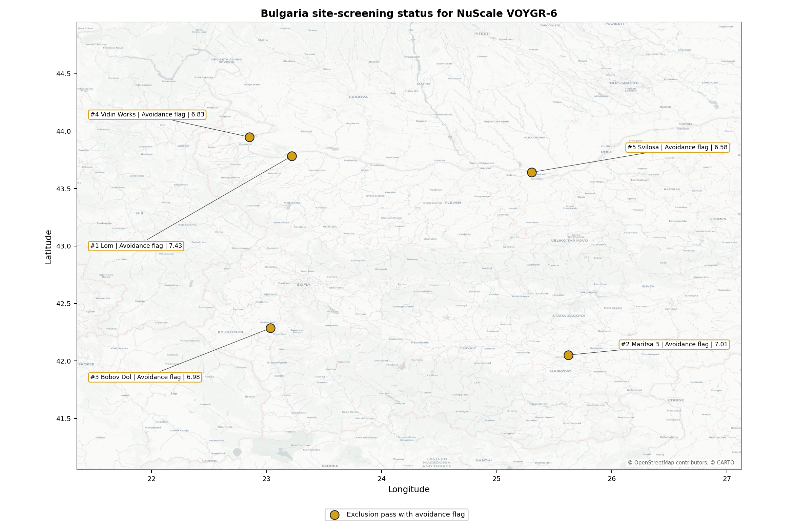

| # | Site | Status | Composite | MC low | MC high | Band | Top-10% | NH | HI | RI | EP | NS | Coverage | Confidence | Cap (MW) | Reg. rank |
| ---: | --- | --- | ---: | ---: | ---: | :---: | ---: | ---: | ---: | ---: | ---: | ---: | ---: | :--- | ---: | ---: |
| 1 | Lom Power Station | Avoidance flag | 7.43 | 6.58 | 7.85 | A | 100% | 7.8 | 7.5 | 7.6 | 6.0 | 7.3 | 76 | low | 400 | 6 |
| 2 | Maritsa 3 power station | Avoidance flag | 7.01 | 6.24 | 7.57 | D | 0% | 7.5 | 7.7 | 7.4 | 6.0 | 5.8 | 76 | low | 120 | 44 |
| 3 | Bobov Dol power station | Avoidance flag | 6.98 | 6.22 | 7.53 | G | 0% | 7.7 | 6.1 | 8.0 | 5.3 | 7.0 | 76 | low | 1030 | 48 |
| 4 | Vidin Works power station | Avoidance flag | 6.83 | 6.09 | 7.37 | H | 0% | 7.3 | 6.2 | 7.6 | 6.0 | 6.5 | 76 | low | 120 | 70 |
| 5 | Svilosa power station | Avoidance flag | 6.58 | 5.89 | 7.12 | H | 0% | 7.4 | 6.3 | 6.4 | 6.0 | 6.2 | 76 | low | 120 | 118 |

### Criterion scores (0–10)

**Lom Power Station** — national rank 1

| Criterion | Score |
| :--- | ---: |
| BF-01 | 5.5 |
| BF-02 | 1.5 |
| EP-01 | 5.5 |
| EP-02 | 1.5 |
| EP-03 | 9.5 |
| EP-04 | 7.5 |
| HI-01 | 9.5 |
| HI-02 | 9.5 |
| HI-03 | 9.5 |
| HI-04 | 9.5 |
| HI-06 | 0.0 |
| HI-07 | 3.5 |
| NH-01 | 7.5 |
| NH-02 | 7.5 |
| NH-03 | 9.5 |
| NH-04 | 5.0 |
| NH-05 | 9.5 |
| NH-06 | 5.5 |
| NH-07 | 9.5 |
| NH-08 | 9.5 |
| NH-09 | 7.5 |
| NH-10 | 7.5 |
| NH-11 | 10.0 |
| NH-12 | 5.5 |
| NH-14 | 9.5 |
| NS-01 | 9.0 |
| NS-02 | 3.5 |
| NS-03 | 8.0 |
| NS-04 | 7.5 |
| NS-05 | 9.5 |
| NS-06 | 5.0 |
| NS-08 | 1.5 |
| NS-10 | 5.0 |
| NS-12 | 5.0 |
| NS-13 | 5.0 |
| RI-01 | 5.0 |
| RI-02 | 1.5 |
| RI-03 | 5.5 |
| RI-04 | 5.5 |
| RI-05 | 9.5 |
| RI-06 | 9.5 |

**Maritsa 3 power station** — national rank 2

| Criterion | Score |
| :--- | ---: |
| BF-01 | 5.5 |
| BF-02 | 1.5 |
| EP-01 | 5.5 |
| EP-02 | 3.5 |
| EP-03 | 9.5 |
| EP-04 | 5.5 |
| HI-01 | 9.5 |
| HI-02 | 9.5 |
| HI-03 | 9.5 |
| HI-04 | 9.5 |
| HI-06 | 1.5 |
| HI-07 | 1.5 |
| NH-01 | 5.5 |
| NH-02 | 5.5 |
| NH-03 | 5.5 |
| NH-04 | 7.5 |
| NH-05 | 9.5 |
| NH-06 | 5.5 |
| NH-07 | 9.5 |
| NH-08 | 9.5 |
| NH-09 | 7.5 |
| NH-10 | 9.5 |
| NH-11 | 8.0 |
| NH-12 | 6.5 |
| NH-14 | 5.5 |
| NS-01 | 6.0 |
| NS-02 | 1.5 |
| NS-03 | 9.0 |
| NS-04 | 7.5 |
| NS-05 | 5.5 |
| NS-06 | 5.0 |
| NS-08 | 1.5 |
| NS-10 | 5.0 |
| NS-12 | 5.0 |
| NS-13 | 5.0 |
| RI-01 | 5.0 |
| RI-02 | 5.5 |
| RI-03 | 7.5 |
| RI-04 | 3.5 |
| RI-05 | 9.5 |
| RI-06 | 9.5 |

**Bobov Dol power station** — national rank 3

| Criterion | Score |
| :--- | ---: |
| BF-01 | 7.5 |
| BF-02 | 9.5 |
| EP-01 | 7.5 |
| EP-02 | 1.5 |
| EP-03 | 9.5 |
| EP-04 | 5.5 |
| HI-01 | 3.5 |
| HI-02 | 9.5 |
| HI-03 | 7.5 |
| HI-04 | 9.5 |
| HI-06 | 1.5 |
| HI-07 | 1.5 |
| NH-01 | 5.5 |
| NH-02 | 5.5 |
| NH-03 | 5.5 |
| NH-04 | 5.0 |
| NH-05 | 9.5 |
| NH-06 | 5.5 |
| NH-07 | 9.5 |
| NH-08 | 9.5 |
| NH-09 | 7.5 |
| NH-10 | 9.5 |
| NH-11 | 10.0 |
| NH-12 | 6.5 |
| NH-14 | 5.5 |
| NS-01 | 4.0 |
| NS-02 | 7.5 |
| NS-03 | 9.0 |
| NS-04 | 7.5 |
| NS-05 | 7.5 |
| NS-06 | 5.0 |
| NS-08 | 5.5 |
| NS-10 | 5.0 |
| NS-12 | 5.0 |
| NS-13 | 5.0 |
| RI-01 | 5.0 |
| RI-02 | 1.5 |
| RI-03 | 7.5 |
| RI-04 | 5.5 |
| RI-05 | 9.5 |
| RI-06 | 9.5 |

**Vidin Works power station** — national rank 4

| Criterion | Score |
| :--- | ---: |
| BF-01 | 5.5 |
| BF-02 | 9.5 |
| EP-01 | 5.5 |
| EP-02 | 3.5 |
| EP-03 | 9.5 |
| EP-04 | 5.5 |
| HI-01 | 3.5 |
| HI-02 | 9.5 |
| HI-03 | 9.5 |
| HI-04 | 9.5 |
| HI-06 | 0.0 |
| HI-07 | 1.5 |
| NH-01 | 7.5 |
| NH-02 | 9.5 |
| NH-03 | 5.5 |
| NH-04 | 9.5 |
| NH-05 | 9.5 |
| NH-06 | 5.5 |
| NH-07 | 9.5 |
| NH-08 | 9.5 |
| NH-09 | 5.5 |
| NH-10 | 7.5 |
| NH-11 | 8.0 |
| NH-12 | 5.5 |
| NH-14 | 5.5 |
| NS-01 | 9.0 |
| NS-02 | 1.5 |
| NS-03 | 8.0 |
| NS-04 | 5.5 |
| NS-05 | 9.5 |
| NS-06 | 5.0 |
| NS-08 | 1.5 |
| NS-10 | 5.0 |
| NS-12 | 5.0 |
| NS-13 | 5.0 |
| RI-01 | 5.0 |
| RI-02 | 9.5 |
| RI-03 | 5.5 |
| RI-04 | 5.5 |
| RI-05 | 9.5 |
| RI-06 | 9.5 |

**Svilosa power station** — national rank 5

| Criterion | Score |
| :--- | ---: |
| BF-01 | 5.5 |
| BF-02 | 9.5 |
| EP-01 | 5.5 |
| EP-02 | 1.5 |
| EP-03 | 9.5 |
| EP-04 | 7.5 |
| HI-01 | 3.5 |
| HI-02 | 9.5 |
| HI-03 | 9.5 |
| HI-04 | 9.5 |
| HI-06 | 0.0 |
| HI-07 | 3.5 |
| NH-01 | 5.5 |
| NH-02 | 9.5 |
| NH-03 | 5.5 |
| NH-04 | 9.5 |
| NH-05 | 9.5 |
| NH-06 | 5.5 |
| NH-07 | 9.5 |
| NH-08 | 9.5 |
| NH-09 | 7.5 |
| NH-10 | 9.5 |
| NH-11 | 8.0 |
| NH-12 | 5.5 |
| NH-14 | 5.5 |
| NS-01 | 9.0 |
| NS-02 | 1.5 |
| NS-03 | 8.0 |
| NS-04 | 3.5 |
| NS-05 | 9.5 |
| NS-06 | 5.0 |
| NS-08 | 1.5 |
| NS-10 | 5.0 |
| NS-12 | 5.0 |
| NS-13 | 5.0 |
| RI-01 | 5.0 |
| RI-02 | 9.5 |
| RI-03 | 1.5 |
| RI-04 | 3.5 |
| RI-05 | 9.5 |
| RI-06 | 9.5 |

---

## Czechia (CZ)

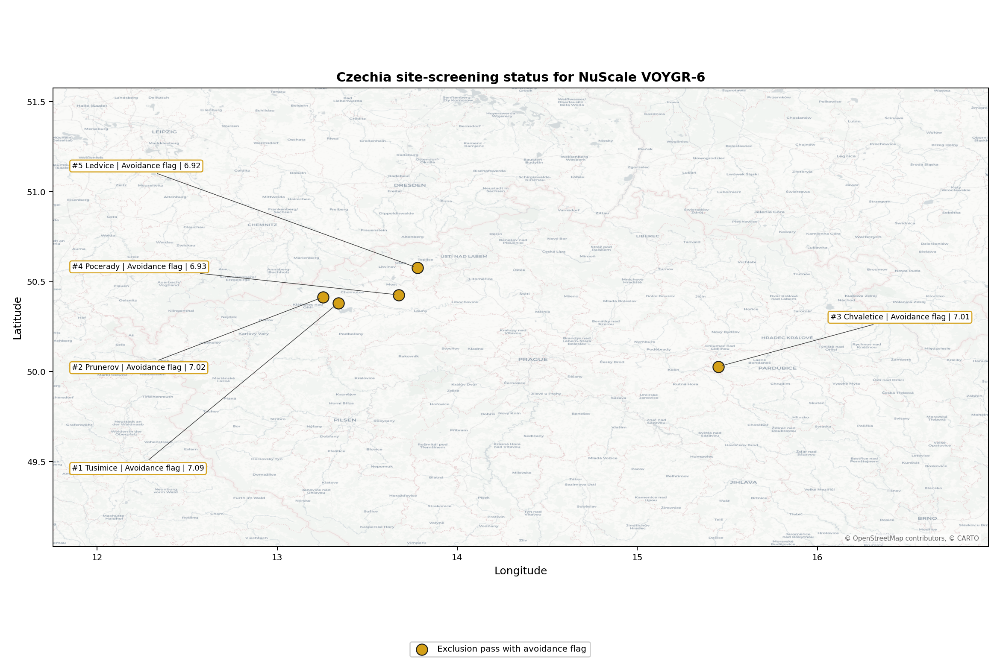

| # | Site | Status | Composite | MC low | MC high | Band | Top-10% | NH | HI | RI | EP | NS | Coverage | Confidence | Cap (MW) | Reg. rank |
| ---: | --- | --- | ---: | ---: | ---: | :---: | ---: | ---: | ---: | ---: | ---: | ---: | ---: | :--- | ---: | ---: |
| 1 | Tusimice power station | Avoidance flag | 7.09 | 6.14 | 7.69 | A | 92% | 7.3 | 6.2 | 6.7 | 6.7 | 8.6 | 74 | low | 800 | 35 |
| 2 | Prunerov power station | Avoidance flag | 7.02 | 6.08 | 7.56 | C | 67% | 7.3 | 6.2 | 6.7 | 6.7 | 8.2 | 74 | low | 2240 | 42 |
| 3 | Chvaletice power station | Avoidance flag | 7.01 | 6.24 | 7.59 | D | 33% | 6.7 | 6.5 | 6.7 | 6.7 | 8.4 | 76 | low | 820 | 45 |
| 4 | Pocerady power station | Avoidance flag | 6.93 | 6.02 | 7.53 | D | 0% | 7.1 | 6.5 | 6.0 | 6.0 | 8.8 | 74 | low | 1000 | 59 |
| 5 | Ledvice power station | Avoidance flag | 6.92 | 6.16 | 7.51 | D | 0% | 7.4 | 6.2 | 7.1 | 6.0 | 7.3 | 76 | low | 990 | 60 |

### Criterion scores (0–10)

**Tusimice power station** — national rank 1

| Criterion | Score |
| :--- | ---: |
| BF-01 | 9.5 |
| BF-02 | 9.5 |
| EP-01 | 5.5 |
| EP-02 | 5.5 |
| EP-03 | 9.5 |
| EP-04 | 5.5 |
| HI-01 | 3.5 |
| HI-02 | 9.5 |
| HI-03 | 9.5 |
| HI-04 | 9.5 |
| HI-06 | 0.0 |
| HI-07 | 1.5 |
| NH-01 | 9.5 |
| NH-02 | 9.5 |
| NH-03 | 5.5 |
| NH-04 | 7.5 |
| NH-05 | 5.5 |
| NH-06 | 5.5 |
| NH-07 | 9.5 |
| NH-08 | 9.5 |
| NH-09 | 7.5 |
| NH-10 | 1.5 |
| NH-11 | 8.0 |
| NH-12 | 7.5 |
| NH-14 | 5.0 |
| NS-01 | 8.0 |
| NS-02 | 9.5 |
| NS-03 | 5.0 |
| NS-04 | 7.5 |
| NS-05 | 9.5 |
| NS-06 | 5.0 |
| NS-08 | 1.5 |
| NS-10 | 5.0 |
| NS-12 | 5.0 |
| NS-13 | 5.0 |
| RI-01 | 5.0 |
| RI-02 | 3.5 |
| RI-03 | 5.5 |
| RI-04 | 3.5 |
| RI-05 | 9.5 |
| RI-06 | 7.5 |

**Prunerov power station** — national rank 2

| Criterion | Score |
| :--- | ---: |
| BF-01 | 5.5 |
| BF-02 | 9.5 |
| EP-01 | 7.5 |
| EP-02 | 5.5 |
| EP-03 | 9.5 |
| EP-04 | 5.5 |
| HI-01 | 3.5 |
| HI-02 | 9.5 |
| HI-03 | 9.5 |
| HI-04 | 9.5 |
| HI-06 | 0.0 |
| HI-07 | 1.5 |
| NH-01 | 9.5 |
| NH-02 | 9.5 |
| NH-03 | 9.5 |
| NH-04 | 7.5 |
| NH-05 | 5.5 |
| NH-06 | 5.5 |
| NH-07 | 9.5 |
| NH-08 | 9.5 |
| NH-09 | 7.5 |
| NH-10 | 1.5 |
| NH-11 | 8.0 |
| NH-12 | 7.5 |
| NH-14 | 5.0 |
| NS-01 | 8.0 |
| NS-02 | 9.5 |
| NS-03 | 5.0 |
| NS-04 | 5.5 |
| NS-05 | 9.5 |
| NS-06 | 5.0 |
| NS-08 | 3.5 |
| NS-10 | 5.0 |
| NS-12 | 5.0 |
| NS-13 | 5.0 |
| RI-01 | 5.0 |
| RI-02 | 3.5 |
| RI-03 | 5.5 |
| RI-04 | 3.5 |
| RI-05 | 9.5 |
| RI-06 | 7.5 |

**Chvaletice power station** — national rank 3

| Criterion | Score |
| :--- | ---: |
| BF-01 | 9.5 |
| BF-02 | 9.5 |
| EP-01 | 7.5 |
| EP-02 | 7.5 |
| EP-03 | 9.5 |
| EP-04 | 3.5 |
| HI-01 | 3.5 |
| HI-02 | 9.5 |
| HI-03 | 9.5 |
| HI-04 | 9.5 |
| HI-06 | 1.5 |
| HI-07 | 1.5 |
| NH-01 | 9.5 |
| NH-02 | 9.5 |
| NH-03 | 9.5 |
| NH-04 | 9.5 |
| NH-05 | 1.5 |
| NH-06 | 3.5 |
| NH-07 | 9.5 |
| NH-08 | 9.5 |
| NH-09 | 7.5 |
| NH-10 | 5.5 |
| NH-11 | 8.0 |
| NH-12 | 7.5 |
| NH-14 | 7.5 |
| NS-01 | 8.0 |
| NS-02 | 9.5 |
| NS-03 | 9.0 |
| NS-04 | 5.5 |
| NS-05 | 9.5 |
| NS-06 | 5.0 |
| NS-08 | 1.5 |
| NS-10 | 5.0 |
| NS-12 | 5.0 |
| NS-13 | 5.0 |
| RI-01 | 5.0 |
| RI-02 | 5.5 |
| RI-03 | 5.5 |
| RI-04 | 3.5 |
| RI-05 | 9.5 |
| RI-06 | 7.5 |

**Pocerady power station** — national rank 4

| Criterion | Score |
| :--- | ---: |
| BF-01 | 9.5 |
| BF-02 | 9.5 |
| EP-01 | 7.5 |
| EP-02 | 5.5 |
| EP-03 | 9.5 |
| EP-04 | 3.5 |
| HI-01 | 3.5 |
| HI-02 | 9.5 |
| HI-03 | 9.5 |
| HI-04 | 9.5 |
| HI-06 | 1.5 |
| HI-07 | 1.5 |
| NH-01 | 9.5 |
| NH-02 | 9.5 |
| NH-03 | 5.5 |
| NH-04 | 5.0 |
| NH-05 | 3.5 |
| NH-06 | 5.5 |
| NH-07 | 9.5 |
| NH-08 | 9.5 |
| NH-09 | 7.5 |
| NH-10 | 3.5 |
| NH-11 | 10.0 |
| NH-12 | 6.5 |
| NH-14 | 5.5 |
| NS-01 | 7.0 |
| NS-02 | 9.5 |
| NS-03 | 5.0 |
| NS-04 | 9.5 |
| NS-05 | 9.5 |
| NS-06 | 5.0 |
| NS-08 | 1.5 |
| NS-10 | 5.0 |
| NS-12 | 5.0 |
| NS-13 | 5.0 |
| RI-01 | 5.0 |
| RI-02 | 5.5 |
| RI-03 | 5.5 |
| RI-04 | 3.5 |
| RI-05 | 7.5 |
| RI-06 | 7.5 |

**Ledvice power station** — national rank 5

| Criterion | Score |
| :--- | ---: |
| BF-01 | 5.5 |
| BF-02 | 9.5 |
| EP-01 | 5.5 |
| EP-02 | 5.5 |
| EP-03 | 9.5 |
| EP-04 | 3.5 |
| HI-01 | 3.5 |
| HI-02 | 9.5 |
| HI-03 | 9.5 |
| HI-04 | 9.5 |
| HI-06 | 0.0 |
| HI-07 | 1.5 |
| NH-01 | 9.5 |
| NH-02 | 9.5 |
| NH-03 | 5.5 |
| NH-04 | 5.0 |
| NH-05 | 5.5 |
| NH-06 | 5.5 |
| NH-07 | 9.5 |
| NH-08 | 9.5 |
| NH-09 | 7.5 |
| NH-10 | 3.5 |
| NH-11 | 10.0 |
| NH-12 | 6.5 |
| NH-14 | 5.5 |
| NS-01 | 7.0 |
| NS-02 | 5.5 |
| NS-03 | 9.0 |
| NS-04 | 7.5 |
| NS-05 | 7.5 |
| NS-06 | 5.0 |
| NS-08 | 3.5 |
| NS-10 | 5.0 |
| NS-12 | 5.0 |
| NS-13 | 5.0 |
| RI-01 | 5.0 |
| RI-02 | 1.5 |
| RI-03 | 7.5 |
| RI-04 | 3.5 |
| RI-05 | 9.5 |
| RI-06 | 7.5 |

---

## Croatia (HR)

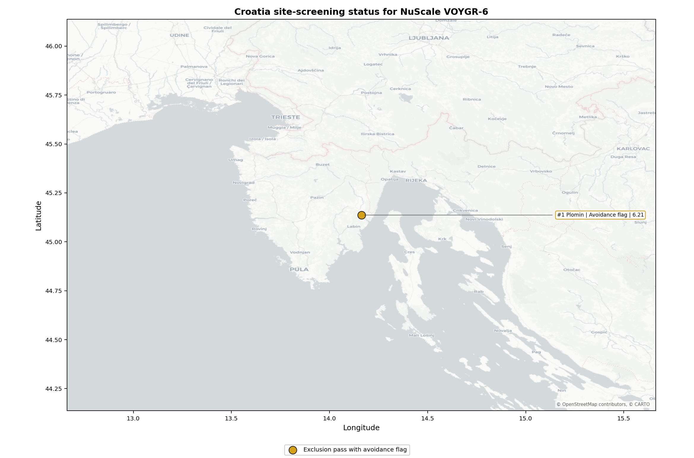

| # | Site | Status | Composite | MC low | MC high | Band | Top-10% | NH | HI | RI | EP | NS | Coverage | Confidence | Cap (MW) | Reg. rank |
| ---: | --- | --- | ---: | ---: | ---: | :---: | ---: | ---: | ---: | ---: | ---: | ---: | ---: | :--- | ---: | ---: |
| 1 | Plomin power station | Avoidance flag | 6.21 | 5.47 | 6.73 | A | 100% | 5.2 | 7.4 | 7.1 | 6.7 | 5.1 | 74 | low | 842 | 184 |

### Criterion scores (0–10)

**Plomin power station** — national rank 1

| Criterion | Score |
| :--- | ---: |
| BF-01 | 5.5 |
| BF-02 | 1.5 |
| EP-01 | 7.5 |
| EP-02 | 3.5 |
| EP-03 | 9.5 |
| EP-04 | 7.5 |
| HI-01 | 9.5 |
| HI-02 | 9.5 |
| HI-03 | 9.5 |
| HI-04 | 9.5 |
| HI-06 | 0.0 |
| HI-07 | 1.5 |
| NH-01 | 5.5 |
| NH-02 | 5.5 |
| NH-03 | 9.5 |
| NH-04 | 5.5 |
| NH-05 | 5.5 |
| NH-06 | 3.5 |
| NH-07 | 9.5 |
| NH-08 | 3.5 |
| NH-09 | 7.5 |
| NH-10 | 3.5 |
| NH-11 | 2.0 |
| NH-12 | 7.5 |
| NH-14 | 3.5 |
| NS-01 | 6.0 |
| NS-02 | 5.5 |
| NS-03 | 5.0 |
| NS-04 | 1.5 |
| NS-05 | 7.5 |
| NS-06 | 5.0 |
| NS-08 | 1.5 |
| NS-10 | 5.0 |
| NS-12 | 5.0 |
| NS-13 | 5.0 |
| RI-01 | 5.0 |
| RI-02 | 1.5 |
| RI-03 | 1.5 |
| RI-04 | 7.5 |
| RI-05 | 9.5 |
| RI-06 | 7.5 |

---

## Hungary (HU)

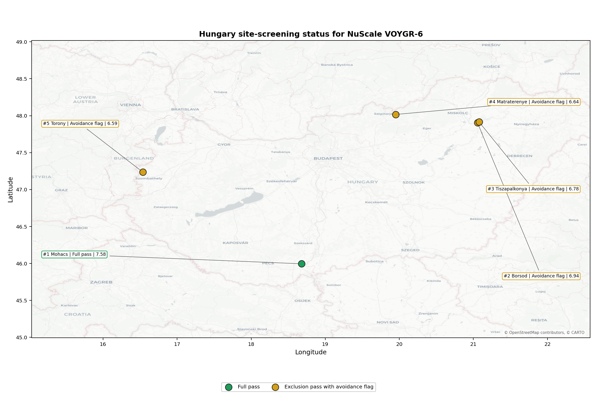

| # | Site | Status | Composite | MC low | MC high | Band | Top-10% | NH | HI | RI | EP | NS | Coverage | Confidence | Cap (MW) | Reg. rank |
| ---: | --- | --- | ---: | ---: | ---: | :---: | ---: | ---: | ---: | ---: | ---: | ---: | ---: | :--- | ---: | ---: |
| 1 | Mohacs power station | Full pass | 7.58 | 6.71 | 8.07 | A | 100% | 7.7 | 7.6 | 7.6 | 6.7 | 7.7 | 76 | low | 1200 | 3 |
| 2 | Borsod power station | Avoidance flag | 6.94 | 6.18 | 7.38 | D | 0% | 7.5 | 5.8 | 6.9 | 6.7 | 7.5 | 76 | low | 420 | 55 |
| 3 | Tiszapalkonya power station | Avoidance flag | 6.78 | 6.05 | 7.32 | D | 0% | 7.8 | 6.2 | 6.9 | 6.7 | 6.0 | 76 | low | 265 | 82 |
| 4 | Matraterenye power station | Avoidance flag | 6.64 | 5.79 | 7.16 | H | 0% | 6.9 | 7.3 | 7.3 | 6.0 | 5.2 | 74 | low | 50 | 105 |
| 5 | Torony power station | Avoidance flag | 6.59 | 5.76 | 7.06 | H | 0% | 7.5 | 5.8 | 5.1 | 7.4 | 7.1 | 74 | low | 600 | 115 |

### Criterion scores (0–10)

**Mohacs power station** — national rank 1

| Criterion | Score |
| :--- | ---: |
| BF-01 | 5.5 |
| BF-02 | 3.5 |
| EP-01 | 5.5 |
| EP-02 | 3.5 |
| EP-03 | 9.5 |
| EP-04 | 7.5 |
| HI-01 | 9.5 |
| HI-02 | 9.5 |
| HI-03 | 7.5 |
| HI-04 | 9.5 |
| HI-06 | 3.5 |
| HI-07 | 1.5 |
| NH-01 | 7.5 |
| NH-02 | 9.5 |
| NH-03 | 5.5 |
| NH-04 | 7.5 |
| NH-05 | 7.5 |
| NH-06 | 5.5 |
| NH-07 | 9.5 |
| NH-08 | 9.5 |
| NH-09 | 7.5 |
| NH-10 | 9.5 |
| NH-11 | 10.0 |
| NH-12 | 6.5 |
| NH-14 | 7.5 |
| NS-01 | 9.0 |
| NS-02 | 5.5 |
| NS-03 | 9.0 |
| NS-04 | 7.5 |
| NS-05 | 7.5 |
| NS-06 | 5.0 |
| NS-08 | 1.5 |
| NS-10 | 5.0 |
| NS-12 | 5.0 |
| NS-13 | 5.0 |
| RI-01 | 5.0 |
| RI-02 | 9.5 |
| RI-03 | 5.5 |
| RI-04 | 5.5 |
| RI-05 | 9.5 |
| RI-06 | 9.5 |

**Borsod power station** — national rank 2

| Criterion | Score |
| :--- | ---: |
| BF-01 | 5.5 |
| BF-02 | 5.5 |
| EP-01 | 5.5 |
| EP-02 | 3.5 |
| EP-03 | 9.5 |
| EP-04 | 7.5 |
| HI-01 | 9.5 |
| HI-02 | 9.5 |
| HI-03 | 1.5 |
| HI-04 | 9.5 |
| HI-06 | 0.0 |
| HI-07 | 1.5 |
| NH-01 | 7.5 |
| NH-02 | 9.5 |
| NH-03 | 5.5 |
| NH-04 | 9.5 |
| NH-05 | 7.5 |
| NH-06 | 5.5 |
| NH-07 | 9.5 |
| NH-08 | 9.5 |
| NH-09 | 7.5 |
| NH-10 | 7.5 |
| NH-11 | 8.0 |
| NH-12 | 6.5 |
| NH-14 | 7.5 |
| NS-01 | 10.0 |
| NS-02 | 3.5 |
| NS-03 | 9.0 |
| NS-04 | 7.5 |
| NS-05 | 7.5 |
| NS-06 | 5.0 |
| NS-08 | 1.5 |
| NS-10 | 5.0 |
| NS-12 | 5.0 |
| NS-13 | 5.0 |
| RI-01 | 5.0 |
| RI-02 | 9.5 |
| RI-03 | 5.5 |
| RI-04 | 5.5 |
| RI-05 | 9.5 |
| RI-06 | 5.5 |

**Tiszapalkonya power station** — national rank 3

| Criterion | Score |
| :--- | ---: |
| BF-01 | 5.5 |
| BF-02 | 1.5 |
| EP-01 | 5.5 |
| EP-02 | 3.5 |
| EP-03 | 9.5 |
| EP-04 | 7.5 |
| HI-01 | 9.5 |
| HI-02 | 9.5 |
| HI-03 | 3.5 |
| HI-04 | 9.5 |
| HI-06 | 0.0 |
| HI-07 | 1.5 |
| NH-01 | 7.5 |
| NH-02 | 9.5 |
| NH-03 | 5.5 |
| NH-04 | 7.5 |
| NH-05 | 9.5 |
| NH-06 | 5.5 |
| NH-07 | 9.5 |
| NH-08 | 9.5 |
| NH-09 | 7.5 |
| NH-10 | 7.5 |
| NH-11 | 8.0 |
| NH-12 | 6.5 |
| NH-14 | 7.5 |
| NS-01 | 9.0 |
| NS-02 | 1.5 |
| NS-03 | 8.0 |
| NS-04 | 5.5 |
| NS-05 | 5.5 |
| NS-06 | 5.0 |
| NS-08 | 1.5 |
| NS-10 | 5.0 |
| NS-12 | 5.0 |
| NS-13 | 5.0 |
| RI-01 | 5.0 |
| RI-02 | 9.5 |
| RI-03 | 5.5 |
| RI-04 | 5.5 |
| RI-05 | 9.5 |
| RI-06 | 5.5 |

**Matraterenye power station** — national rank 4

| Criterion | Score |
| :--- | ---: |
| BF-01 | 5.5 |
| BF-02 | 1.5 |
| EP-01 | 7.5 |
| EP-02 | 3.5 |
| EP-03 | 9.5 |
| EP-04 | 5.5 |
| HI-01 | 9.5 |
| HI-02 | 9.5 |
| HI-03 | 7.5 |
| HI-04 | 9.5 |
| HI-06 | 1.5 |
| HI-07 | 1.5 |
| NH-01 | 7.5 |
| NH-02 | 9.5 |
| NH-03 | 5.5 |
| NH-04 | 5.5 |
| NH-05 | 3.5 |
| NH-06 | 5.5 |
| NH-07 | 9.5 |
| NH-08 | 9.5 |
| NH-09 | 7.5 |
| NH-10 | 7.5 |
| NH-11 | 8.0 |
| NH-12 | 6.5 |
| NH-14 | 5.5 |
| NS-01 | 6.0 |
| NS-02 | 1.5 |
| NS-03 | 5.0 |
| NS-04 | 5.5 |
| NS-05 | 9.5 |
| NS-06 | 5.0 |
| NS-08 | 5.5 |
| NS-10 | 5.0 |
| NS-12 | 5.0 |
| NS-13 | 5.0 |
| RI-01 | 5.0 |
| RI-02 | 1.5 |
| RI-03 | 5.5 |
| RI-04 | 5.5 |
| RI-05 | 9.5 |
| RI-06 | 7.5 |

**Torony power station** — national rank 5

| Criterion | Score |
| :--- | ---: |
| BF-01 | 5.5 |
| BF-02 | 9.5 |
| EP-01 | 5.5 |
| EP-02 | 5.5 |
| EP-03 | 9.5 |
| EP-04 | 7.5 |
| HI-01 | 3.5 |
| HI-02 | 9.5 |
| HI-03 | 7.5 |
| HI-04 | 9.5 |
| HI-06 | 0.0 |
| HI-07 | 1.5 |
| NH-01 | 7.5 |
| NH-02 | 9.5 |
| NH-03 | 5.5 |
| NH-04 | 7.5 |
| NH-05 | 7.5 |
| NH-06 | 5.5 |
| NH-07 | 9.5 |
| NH-08 | 9.5 |
| NH-09 | 7.5 |
| NH-10 | 7.5 |
| NH-11 | 8.0 |
| NH-12 | 6.5 |
| NH-14 | 7.5 |
| NS-01 | 7.0 |
| NS-02 | 5.5 |
| NS-03 | 5.0 |
| NS-04 | 7.5 |
| NS-05 | 9.5 |
| NS-06 | 5.0 |
| NS-08 | 5.5 |
| NS-10 | 5.0 |
| NS-12 | 5.0 |
| NS-13 | 5.0 |
| RI-01 | 5.0 |
| RI-02 | 1.5 |
| RI-03 | 5.5 |
| RI-04 | 5.5 |
| RI-05 | 3.5 |
| RI-06 | 7.5 |

---

## Latvia (LV)

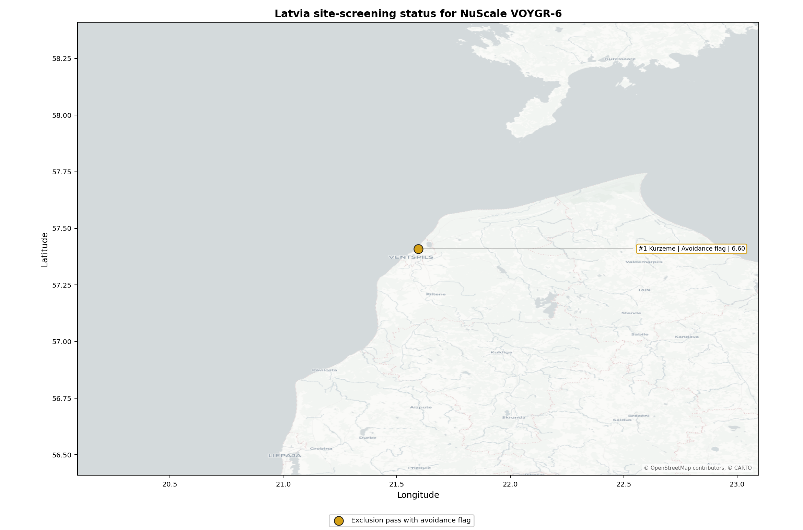

| # | Site | Status | Composite | MC low | MC high | Band | Top-10% | NH | HI | RI | EP | NS | Coverage | Confidence | Cap (MW) | Reg. rank |
| ---: | --- | --- | ---: | ---: | ---: | :---: | ---: | ---: | ---: | ---: | ---: | ---: | ---: | :--- | ---: | ---: |
| 1 | Kurzeme power station | Avoidance flag | 6.60 | 5.91 | 7.20 | A | 100% | 7.1 | 5.8 | 7.1 | 6.0 | 6.7 | 76 | low | 435 | 114 |

### Criterion scores (0–10)

**Kurzeme power station** — national rank 1

| Criterion | Score |
| :--- | ---: |
| BF-01 | 5.5 |
| BF-02 | 1.5 |
| EP-01 | 5.5 |
| EP-02 | 1.5 |
| EP-03 | 9.5 |
| EP-04 | 7.5 |
| HI-01 | 3.5 |
| HI-02 | 9.5 |
| HI-03 | 7.5 |
| HI-04 | 9.5 |
| HI-06 | 0.0 |
| HI-07 | 1.5 |
| NH-01 | 9.5 |
| NH-02 | 9.5 |
| NH-03 | 5.5 |
| NH-04 | 9.5 |
| NH-05 | 9.5 |
| NH-06 | 5.5 |
| NH-07 | 9.5 |
| NH-08 | 3.5 |
| NH-09 | 7.5 |
| NH-10 | 1.5 |
| NH-11 | 8.0 |
| NH-12 | 7.5 |
| NH-14 | 3.5 |
| NS-01 | 9.0 |
| NS-02 | 3.5 |
| NS-03 | 9.0 |
| NS-04 | 7.5 |
| NS-05 | 3.5 |
| NS-06 | 5.0 |
| NS-08 | 3.5 |
| NS-10 | 5.0 |
| NS-12 | 5.0 |
| NS-13 | 5.0 |
| RI-01 | 5.0 |
| RI-02 | 7.5 |
| RI-03 | 5.5 |
| RI-04 | 3.5 |
| RI-05 | 9.5 |
| RI-06 | 9.5 |

---

## Moldova (MD)

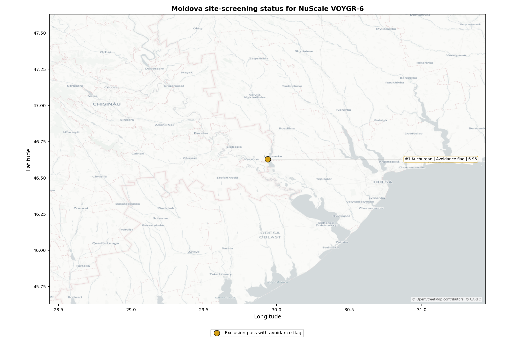

| # | Site | Status | Composite | MC low | MC high | Band | Top-10% | NH | HI | RI | EP | NS | Coverage | Confidence | Cap (MW) | Reg. rank |
| ---: | --- | --- | ---: | ---: | ---: | :---: | ---: | ---: | ---: | ---: | ---: | ---: | ---: | :--- | ---: | ---: |
| 1 | Kuchurgan power station | Avoidance flag | 6.96 | 6.20 | 7.50 | A | 100% | 7.2 | 6.5 | 7.3 | 5.3 | 7.7 | 76 | low | 1400 | 50 |

### Criterion scores (0–10)

**Kuchurgan power station** — national rank 1

| Criterion | Score |
| :--- | ---: |
| BF-01 | 7.5 |
| BF-02 | 9.5 |
| EP-01 | 7.5 |
| EP-02 | 1.5 |
| EP-03 | 9.5 |
| EP-04 | 5.5 |
| HI-01 | 3.5 |
| HI-02 | 9.5 |
| HI-03 | 9.5 |
| HI-04 | 9.5 |
| HI-06 | 1.5 |
| HI-07 | 1.5 |
| NH-01 | 7.5 |
| NH-02 | 9.5 |
| NH-03 | 9.5 |
| NH-04 | 9.5 |
| NH-05 | 5.5 |
| NH-06 | 5.5 |
| NH-07 | 9.5 |
| NH-08 | 9.5 |
| NH-09 | 7.5 |
| NH-10 | 7.5 |
| NH-11 | 10.0 |
| NH-12 | 5.5 |
| NH-14 | 9.5 |
| NS-01 | 8.0 |
| NS-02 | 7.5 |
| NS-03 | 8.0 |
| NS-04 | 5.5 |
| NS-05 | 9.5 |
| NS-06 | 5.0 |
| NS-08 | 5.5 |
| NS-10 | 5.0 |
| NS-12 | 5.0 |
| NS-13 | 5.0 |
| RI-01 | 5.0 |
| RI-02 | 1.5 |
| RI-03 | 5.5 |
| RI-04 | 5.5 |
| RI-05 | 9.5 |
| RI-06 | 7.5 |

---

## Montenegro (ME)

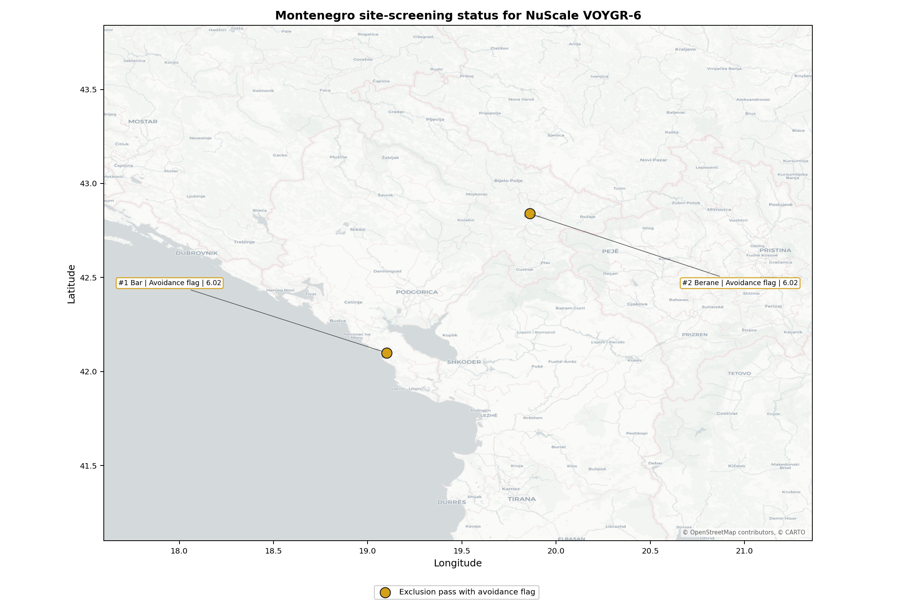

| # | Site | Status | Composite | MC low | MC high | Band | Top-10% | NH | HI | RI | EP | NS | Coverage | Confidence | Cap (MW) | Reg. rank |
| ---: | --- | --- | ---: | ---: | ---: | :---: | ---: | ---: | ---: | ---: | ---: | ---: | ---: | :--- | ---: | ---: |
| 1 | Bar power station | Avoidance flag | 6.02 | 5.32 | 6.47 | A | 100% | 4.8 | 7.4 | 6.4 | 5.3 | 6.4 | 74 | low | 800 | 213 |

### Criterion scores (0–10)

**Bar power station** — national rank 1

| Criterion | Score |
| :--- | ---: |
| BF-01 | 5.5 |
| BF-02 | 1.5 |
| EP-01 | 5.5 |
| EP-02 | 1.5 |
| EP-03 | 9.5 |
| EP-04 | 5.5 |
| HI-01 | 9.5 |
| HI-02 | 9.5 |
| HI-03 | 9.5 |
| HI-04 | 9.5 |
| HI-06 | 0.0 |
| HI-07 | 1.5 |
| NH-01 | 3.5 |
| NH-02 | 5.5 |
| NH-03 | 5.5 |
| NH-04 | 9.5 |
| NH-05 | 5.5 |
| NH-06 | 5.5 |
| NH-07 | 9.5 |
| NH-08 | 0.0 |
| NH-09 | 7.5 |
| NH-10 | 7.5 |
| NH-11 | 2.0 |
| NH-12 | 7.5 |
| NH-14 | 0.0 |
| NS-01 | 6.0 |
| NS-02 | 5.5 |
| NS-03 | 5.0 |
| NS-04 | 5.5 |
| NS-05 | 9.5 |
| NS-06 | 5.0 |
| NS-08 | 1.5 |
| NS-10 | 5.0 |
| NS-12 | 5.0 |
| NS-13 | 5.0 |
| RI-01 | 5.0 |
| RI-02 | 1.5 |
| RI-03 | 7.5 |
| RI-04 | 3.5 |
| RI-05 | 9.5 |
| RI-06 | 3.5 |

---

## North Macedonia (MK)

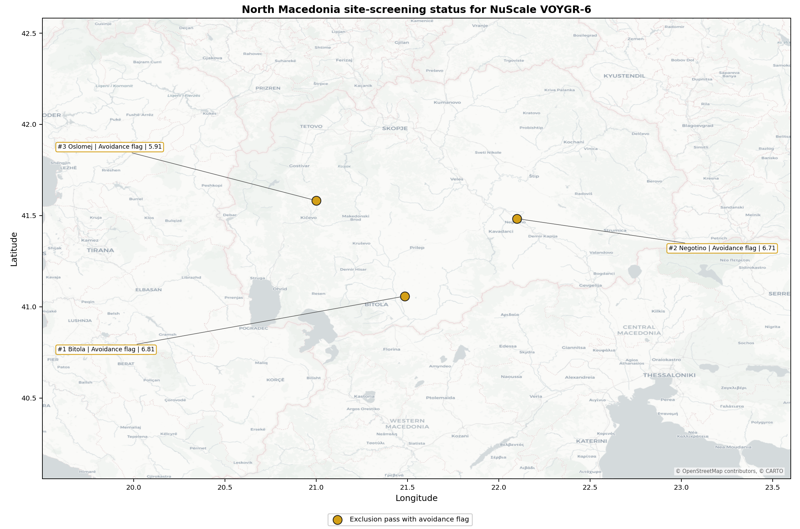

| # | Site | Status | Composite | MC low | MC high | Band | Top-10% | NH | HI | RI | EP | NS | Coverage | Confidence | Cap (MW) | Reg. rank |
| ---: | --- | --- | ---: | ---: | ---: | :---: | ---: | ---: | ---: | ---: | ---: | ---: | ---: | :--- | ---: | ---: |
| 1 | Bitola power station | Avoidance flag | 6.81 | 5.93 | 7.33 | A | 100% | 7.3 | 6.8 | 6.4 | 6.0 | 7.0 | 74 | low | 699 | 73 |
| 2 | Negotino power station | Avoidance flag | 6.71 | 5.85 | 7.17 | H | 0% | 7.7 | 6.6 | 6.2 | 6.0 | 6.2 | 74 | low | 300 | 97 |
| 3 | Oslomej power station | Avoidance flag | 5.91 | 5.23 | 6.42 | H | 0% | 6.6 | 6.5 | 5.9 | 6.0 | 4.0 | 74 | low | 254 | 237 |

### Criterion scores (0–10)

**Bitola power station** — national rank 1

| Criterion | Score |
| :--- | ---: |
| BF-01 | 9.5 |
| BF-02 | 9.5 |
| EP-01 | 7.5 |
| EP-02 | 1.5 |
| EP-03 | 9.5 |
| EP-04 | 7.5 |
| HI-01 | 3.5 |
| HI-02 | 9.5 |
| HI-03 | 9.5 |
| HI-04 | 9.5 |
| HI-06 | 3.5 |
| HI-07 | 1.5 |
| NH-01 | 3.5 |
| NH-02 | 5.5 |
| NH-03 | 5.5 |
| NH-04 | 9.5 |
| NH-05 | 9.5 |
| NH-06 | 5.5 |
| NH-07 | 9.5 |
| NH-08 | 9.5 |
| NH-09 | 7.5 |
| NH-10 | 9.5 |
| NH-11 | 10.0 |
| NH-12 | 6.5 |
| NH-14 | 5.5 |
| NS-01 | 7.0 |
| NS-02 | 9.5 |
| NS-03 | 5.0 |
| NS-04 | 1.5 |
| NS-05 | 9.5 |
| NS-06 | 5.0 |
| NS-08 | 5.5 |
| NS-10 | 5.0 |
| NS-12 | 5.0 |
| NS-13 | 5.0 |
| RI-01 | 5.0 |
| RI-02 | 3.5 |
| RI-03 | 5.5 |
| RI-04 | 7.5 |
| RI-05 | 5.5 |
| RI-06 | 7.5 |

**Negotino power station** — national rank 2

| Criterion | Score |
| :--- | ---: |
| BF-01 | 5.5 |
| BF-02 | 1.5 |
| EP-01 | 5.5 |
| EP-02 | 1.5 |
| EP-03 | 9.5 |
| EP-04 | 7.5 |
| HI-01 | 3.5 |
| HI-02 | 9.5 |
| HI-03 | 9.5 |
| HI-04 | 9.5 |
| HI-06 | 1.5 |
| HI-07 | 3.5 |
| NH-01 | 5.5 |
| NH-02 | 7.5 |
| NH-03 | 5.5 |
| NH-04 | 7.5 |
| NH-05 | 9.5 |
| NH-06 | 5.5 |
| NH-07 | 9.5 |
| NH-08 | 9.5 |
| NH-09 | 7.5 |
| NH-10 | 9.5 |
| NH-11 | 10.0 |
| NH-12 | 6.5 |
| NH-14 | 5.5 |
| NS-01 | 8.0 |
| NS-02 | 1.5 |
| NS-03 | 5.0 |
| NS-04 | 7.5 |
| NS-05 | 9.5 |
| NS-06 | 5.0 |
| NS-08 | 3.5 |
| NS-10 | 5.0 |
| NS-12 | 5.0 |
| NS-13 | 5.0 |
| RI-01 | 5.0 |
| RI-02 | 7.5 |
| RI-03 | 7.5 |
| RI-04 | 5.5 |
| RI-05 | 5.5 |
| RI-06 | 7.5 |

**Oslomej power station** — national rank 3

| Criterion | Score |
| :--- | ---: |
| BF-01 | 5.5 |
| BF-02 | 1.5 |
| EP-01 | 5.5 |
| EP-02 | 1.5 |
| EP-03 | 9.5 |
| EP-04 | 7.5 |
| HI-01 | 3.5 |
| HI-02 | 9.5 |
| HI-03 | 9.5 |
| HI-04 | 9.5 |
| HI-06 | 1.5 |
| HI-07 | 1.5 |
| NH-01 | 3.5 |
| NH-02 | 5.5 |
| NH-03 | 9.5 |
| NH-04 | 7.5 |
| NH-05 | 5.5 |
| NH-06 | 5.5 |
| NH-07 | 9.5 |
| NH-08 | 9.5 |
| NH-09 | 7.5 |
| NH-10 | 7.5 |
| NH-11 | 10.0 |
| NH-12 | 7.5 |
| NH-14 | 5.5 |
| NS-01 | 6.0 |
| NS-02 | 1.5 |
| NS-03 | 5.0 |
| NS-04 | 3.5 |
| NS-05 | 5.5 |
| NS-06 | 5.0 |
| NS-08 | 7.5 |
| NS-10 | 5.0 |
| NS-12 | 5.0 |
| NS-13 | 5.0 |
| RI-01 | 5.0 |
| RI-02 | 1.5 |
| RI-03 | 5.5 |
| RI-04 | 5.5 |
| RI-05 | 5.5 |
| RI-06 | 7.5 |

---

## Poland (PL)

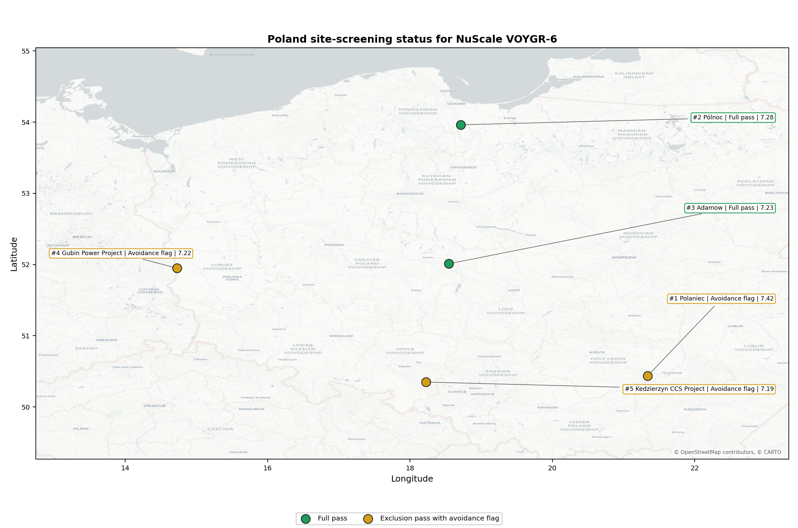

| # | Site | Status | Composite | MC low | MC high | Band | Top-10% | NH | HI | RI | EP | NS | Coverage | Confidence | Cap (MW) | Reg. rank |
| ---: | --- | --- | ---: | ---: | ---: | :---: | ---: | ---: | ---: | ---: | ---: | ---: | ---: | :--- | ---: | ---: |
| 1 | Polaniec power station | Avoidance flag | 7.42 | 6.57 | 7.96 | A | 100% | 7.4 | 6.4 | 7.6 | 6.7 | 8.6 | 76 | low | 1882 | 7 |
| 2 | Pólnoc power station | Full pass | 7.28 | 6.46 | 7.87 | A | 100% | 8.0 | 6.9 | 6.9 | 6.0 | 7.7 | 76 | low | 1600 | 14 |
| 3 | Adamow power station | Full pass | 7.23 | 6.25 | 7.82 | B | 92% | 7.9 | 7.4 | 6.7 | 6.7 | 6.7 | 74 | low | 600 | 18 |
| 4 | Gubin Power Project | Avoidance flag | 7.22 | 6.41 | 7.80 | B | 92% | 7.6 | 6.5 | 6.7 | 6.0 | 8.5 | 76 | low | 3000 | 19 |
| 5 | Kedzierzyn CCS Project | Avoidance flag | 7.19 | 6.39 | 7.74 | C | 75% | 8.1 | 7.4 | 6.9 | 6.7 | 6.4 | 76 | low | 910 | 21 |

### Criterion scores (0–10)

**Polaniec power station** — national rank 1

| Criterion | Score |
| :--- | ---: |
| BF-01 | 9.5 |
| BF-02 | 9.5 |
| EP-01 | 5.5 |
| EP-02 | 5.5 |
| EP-03 | 9.5 |
| EP-04 | 5.5 |
| HI-01 | 3.5 |
| HI-02 | 9.5 |
| HI-03 | 7.5 |
| HI-04 | 9.5 |
| HI-06 | 3.5 |
| HI-07 | 1.5 |
| NH-01 | 9.5 |
| NH-02 | 9.5 |
| NH-03 | 5.5 |
| NH-04 | 9.5 |
| NH-05 | 5.5 |
| NH-06 | 5.5 |
| NH-07 | 9.5 |
| NH-08 | 9.5 |
| NH-09 | 7.5 |
| NH-10 | 5.5 |
| NH-11 | 8.0 |
| NH-12 | 6.5 |
| NH-14 | 5.5 |
| NS-01 | 9.0 |
| NS-02 | 9.5 |
| NS-03 | 9.0 |
| NS-04 | 5.5 |
| NS-05 | 9.5 |
| NS-06 | 5.0 |
| NS-08 | 1.5 |
| NS-10 | 5.0 |
| NS-12 | 5.0 |
| NS-13 | 5.0 |
| RI-01 | 5.0 |
| RI-02 | 7.5 |
| RI-03 | 7.5 |
| RI-04 | 5.5 |
| RI-05 | 9.5 |
| RI-06 | 7.5 |

**Pólnoc power station** — national rank 2

| Criterion | Score |
| :--- | ---: |
| BF-01 | 5.5 |
| BF-02 | 1.5 |
| EP-01 | 7.5 |
| EP-02 | 5.5 |
| EP-03 | 9.5 |
| EP-04 | 3.5 |
| HI-01 | 7.5 |
| HI-02 | 9.5 |
| HI-03 | 7.5 |
| HI-04 | 9.5 |
| HI-06 | 1.5 |
| HI-07 | 1.5 |
| NH-01 | 9.5 |
| NH-02 | 9.5 |
| NH-03 | 9.5 |
| NH-04 | 7.5 |
| NH-05 | 9.5 |
| NH-06 | 5.5 |
| NH-07 | 9.5 |
| NH-08 | 9.5 |
| NH-09 | 7.5 |
| NH-10 | 3.5 |
| NH-11 | 8.0 |
| NH-12 | 7.5 |
| NH-14 | 5.5 |
| NS-01 | 8.0 |
| NS-02 | 5.5 |
| NS-03 | 7.0 |
| NS-04 | 9.5 |
| NS-05 | 9.5 |
| NS-06 | 5.0 |
| NS-08 | 3.5 |
| NS-10 | 5.0 |
| NS-12 | 5.0 |
| NS-13 | 5.0 |
| RI-01 | 5.0 |
| RI-02 | 3.5 |
| RI-03 | 5.5 |
| RI-04 | 5.5 |
| RI-05 | 9.5 |
| RI-06 | 5.5 |

**Adamow power station** — national rank 3

| Criterion | Score |
| :--- | ---: |
| BF-01 | 5.5 |
| BF-02 | 1.5 |
| EP-01 | 5.5 |
| EP-02 | 5.5 |
| EP-03 | 9.5 |
| EP-04 | 5.5 |
| HI-01 | 9.5 |
| HI-02 | 9.5 |
| HI-03 | 9.5 |
| HI-04 | 9.5 |
| HI-06 | 0.0 |
| HI-07 | 1.5 |
| NH-01 | 9.5 |
| NH-02 | 9.5 |
| NH-03 | 5.5 |
| NH-04 | 7.5 |
| NH-05 | 9.5 |
| NH-06 | 5.5 |
| NH-07 | 9.5 |
| NH-08 | 9.5 |
| NH-09 | 7.5 |
| NH-10 | 3.5 |
| NH-11 | 8.0 |
| NH-12 | 6.5 |
| NH-14 | 5.5 |
| NS-01 | 4.0 |
| NS-02 | 5.5 |
| NS-03 | 5.0 |
| NS-04 | 9.5 |
| NS-05 | 9.5 |
| NS-06 | 5.0 |
| NS-08 | 3.5 |
| NS-10 | 5.0 |
| NS-12 | 5.0 |
| NS-13 | 5.0 |
| RI-01 | 5.0 |
| RI-02 | 1.5 |
| RI-03 | 5.5 |
| RI-04 | 3.5 |
| RI-05 | 9.5 |
| RI-06 | 7.5 |

**Gubin Power Project** — national rank 4

| Criterion | Score |
| :--- | ---: |
| BF-01 | 5.5 |
| BF-02 | 1.5 |
| EP-01 | 5.5 |
| EP-02 | 3.5 |
| EP-03 | 9.5 |
| EP-04 | 5.5 |
| HI-01 | 3.5 |
| HI-02 | 9.5 |
| HI-03 | 9.5 |
| HI-04 | 9.5 |
| HI-06 | 1.5 |
| HI-07 | 1.5 |
| NH-01 | 9.5 |
| NH-02 | 9.5 |
| NH-03 | 9.5 |
| NH-04 | 9.5 |
| NH-05 | 9.5 |
| NH-06 | 5.5 |
| NH-07 | 9.5 |
| NH-08 | 9.5 |
| NH-09 | 5.5 |
| NH-10 | 3.5 |
| NH-11 | 8.0 |
| NH-12 | 6.5 |
| NH-14 | 5.5 |
| NS-01 | 8.0 |
| NS-02 | 9.5 |
| NS-03 | 8.0 |
| NS-04 | 9.5 |
| NS-05 | 7.5 |
| NS-06 | 5.0 |
| NS-08 | 1.5 |
| NS-10 | 5.0 |
| NS-12 | 5.0 |
| NS-13 | 5.0 |
| RI-01 | 5.0 |
| RI-02 | 3.5 |
| RI-03 | 5.5 |
| RI-04 | 3.5 |
| RI-05 | 9.5 |
| RI-06 | 7.5 |

**Kedzierzyn CCS Project** — national rank 5

| Criterion | Score |
| :--- | ---: |
| BF-01 | 5.5 |
| BF-02 | 1.5 |
| EP-01 | 5.5 |
| EP-02 | 5.5 |
| EP-03 | 9.5 |
| EP-04 | 5.5 |
| HI-01 | 9.5 |
| HI-02 | 9.5 |
| HI-03 | 9.5 |
| HI-04 | 9.5 |
| HI-06 | 0.0 |
| HI-07 | 1.5 |
| NH-01 | 9.5 |
| NH-02 | 9.5 |
| NH-03 | 5.5 |
| NH-04 | 7.5 |
| NH-05 | 9.5 |
| NH-06 | 5.5 |
| NH-07 | 9.5 |
| NH-08 | 9.5 |
| NH-09 | 7.5 |
| NH-10 | 5.5 |
| NH-11 | 8.0 |
| NH-12 | 6.5 |
| NH-14 | 5.5 |
| NS-01 | 7.0 |
| NS-02 | 5.5 |
| NS-03 | 9.0 |
| NS-04 | 5.5 |
| NS-05 | 3.5 |
| NS-06 | 5.0 |
| NS-08 | 5.5 |
| NS-10 | 5.0 |
| NS-12 | 5.0 |
| NS-13 | 5.0 |
| RI-01 | 5.0 |
| RI-02 | 5.5 |
| RI-03 | 7.5 |
| RI-04 | 1.5 |
| RI-05 | 9.5 |
| RI-06 | 9.5 |

---

## Romania (RO)

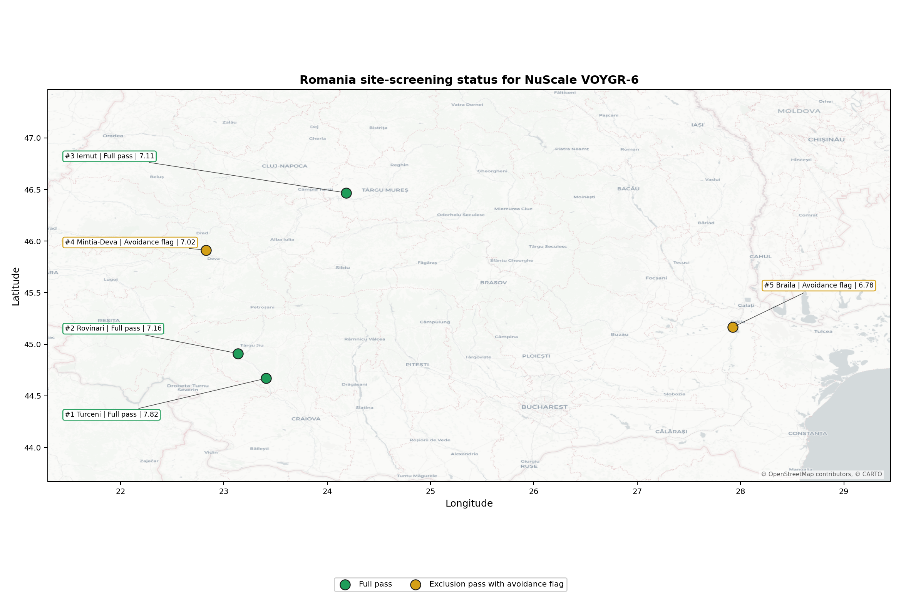

| # | Site | Status | Composite | MC low | MC high | Band | Top-10% | NH | HI | RI | EP | NS | Coverage | Confidence | Cap (MW) | Reg. rank |
| ---: | --- | --- | ---: | ---: | ---: | :---: | ---: | ---: | ---: | ---: | ---: | ---: | ---: | :--- | ---: | ---: |
| 1 | Turceni power station | Full pass | 7.82 | 6.89 | 8.26 | A | 100% | 7.8 | 7.5 | 8.2 | 6.7 | 8.4 | 76 | low | 2640 | 1 |
| 2 | Rovinari power station | Full pass | 7.16 | 6.36 | 7.70 | B | 100% | 7.5 | 7.9 | 7.3 | 4.3 | 7.2 | 76 | low | 1920 | 26 |
| 3 | Iernut power station | Full pass | 7.11 | 5.29 | 7.55 | D | 0% | 6.6 | 7.9 | 7.7 | 4.3 | 8.3 | 53 | low | 800 | 33 |
| 4 | Mintia-Deva power station | Avoidance flag | 7.02 | 6.25 | 7.49 | D | 0% | 7.7 | 6.2 | 6.8 | 5.3 | 7.9 | 76 | low | 1285 | 43 |
| 5 | Braila power station | Avoidance flag | 6.78 | 6.06 | 7.28 | D | 0% | 7.4 | 7.3 | 5.1 | 5.3 | 7.5 | 76 | low | 850 | 81 |

### Criterion scores (0–10)

**Turceni power station** — national rank 1

| Criterion | Score |
| :--- | ---: |
| BF-01 | 5.5 |
| BF-02 | 9.5 |
| EP-01 | 7.5 |
| EP-02 | 3.5 |
| EP-03 | 9.5 |
| EP-04 | 7.5 |
| HI-01 | 9.5 |
| HI-02 | 9.5 |
| HI-03 | 9.5 |
| HI-04 | 9.5 |
| HI-06 | 0.0 |
| HI-07 | 3.5 |
| NH-01 | 7.5 |
| NH-02 | 9.5 |
| NH-03 | 5.5 |
| NH-04 | 7.5 |
| NH-05 | 9.5 |
| NH-06 | 5.5 |
| NH-07 | 9.5 |
| NH-08 | 9.5 |
| NH-09 | 7.5 |
| NH-10 | 9.5 |
| NH-11 | 6.0 |
| NH-12 | 6.5 |
| NH-14 | 7.5 |
| NS-01 | 8.0 |
| NS-02 | 5.5 |
| NS-03 | 10.0 |
| NS-04 | 9.5 |
| NS-05 | 9.5 |
| NS-06 | 5.0 |
| NS-08 | 1.5 |
| NS-10 | 5.0 |
| NS-12 | 5.0 |
| NS-13 | 5.0 |
| RI-01 | 5.0 |
| RI-02 | 3.5 |
| RI-03 | 5.5 |
| RI-04 | 7.5 |
| RI-05 | 9.5 |
| RI-06 | 9.5 |

**Rovinari power station** — national rank 2

| Criterion | Score |
| :--- | ---: |
| BF-01 | 5.5 |
| BF-02 | 7.5 |
| EP-01 | 5.5 |
| EP-02 | 3.5 |
| EP-03 | 1.5 |
| EP-04 | 7.5 |
| HI-01 | 9.5 |
| HI-02 | 9.5 |
| HI-03 | 9.5 |
| HI-04 | 9.5 |
| HI-06 | 1.5 |
| HI-07 | 5.5 |
| NH-01 | 5.5 |
| NH-02 | 9.5 |
| NH-03 | 9.5 |
| NH-04 | 5.5 |
| NH-05 | 9.5 |
| NH-06 | 5.5 |
| NH-07 | 9.5 |
| NH-08 | 9.5 |
| NH-09 | 7.5 |
| NH-10 | 9.5 |
| NH-11 | 8.0 |
| NH-12 | 6.5 |
| NH-14 | 5.5 |
| NS-01 | 7.0 |
| NS-02 | 5.5 |
| NS-03 | 9.0 |
| NS-04 | 5.5 |
| NS-05 | 9.5 |
| NS-06 | 5.0 |
| NS-08 | 7.5 |
| NS-10 | 5.0 |
| NS-12 | 5.0 |
| NS-13 | 5.0 |
| RI-01 | 5.0 |
| RI-02 | 3.5 |
| RI-03 | 5.5 |
| RI-04 | 5.5 |
| RI-05 | 9.5 |
| RI-06 | 7.5 |

**Iernut power station** — national rank 3

| Criterion | Score |
| :--- | ---: |
| BF-01 | 1.5 |
| BF-02 | 7.5 |
| EP-01 | 5.5 |
| EP-02 | 3.5 |
| EP-03 | 1.5 |
| EP-04 | 7.5 |
| HI-01 | 7.5 |
| HI-02 | 9.5 |
| HI-03 | 5.5 |
| HI-04 | 9.5 |
| HI-06 | 5.0 |
| HI-07 | 5.0 |
| NH-01 | 5.0 |
| NH-02 | 9.5 |
| NH-03 | 5.5 |
| NH-04 | 7.5 |
| NH-05 | 7.5 |
| NH-06 | 3.5 |
| NH-07 | 9.5 |
| NH-08 | 9.5 |
| NH-09 | 7.5 |
| NH-10 | 9.5 |
| NH-11 | 8.0 |
| NH-12 | 5.5 |
| NH-14 | 7.5 |
| NS-01 | 8.0 |
| NS-02 | 5.0 |
| NS-03 | 9.0 |
| NS-04 | 5.0 |
| NS-05 | 7.5 |
| NS-06 | 5.0 |
| NS-08 | 1.5 |
| NS-10 | 5.0 |
| NS-12 | 5.0 |
| NS-13 | 5.0 |
| RI-01 | 5.0 |
| RI-02 | 5.5 |
| RI-03 | 7.5 |
| RI-04 | 5.5 |
| RI-05 | 9.5 |
| RI-06 | 5.0 |

**Mintia-Deva power station** — national rank 4

| Criterion | Score |
| :--- | ---: |
| BF-01 | 5.5 |
| BF-02 | 1.5 |
| EP-01 | 7.5 |
| EP-02 | 3.5 |
| EP-03 | 9.5 |
| EP-04 | 3.5 |
| HI-01 | 9.5 |
| HI-02 | 9.5 |
| HI-03 | 3.5 |
| HI-04 | 9.5 |
| HI-06 | 0.0 |
| HI-07 | 1.5 |
| NH-01 | 7.5 |
| NH-02 | 9.5 |
| NH-03 | 5.5 |
| NH-04 | 5.5 |
| NH-05 | 7.5 |
| NH-06 | 5.5 |
| NH-07 | 9.5 |
| NH-08 | 9.5 |
| NH-09 | 7.5 |
| NH-10 | 9.5 |
| NH-11 | 10.0 |
| NH-12 | 6.5 |
| NH-14 | 5.5 |
| NS-01 | 9.0 |
| NS-02 | 5.5 |
| NS-03 | 10.0 |
| NS-04 | 5.5 |
| NS-05 | 9.5 |
| NS-06 | 5.0 |
| NS-08 | 1.5 |
| NS-10 | 5.0 |
| NS-12 | 5.0 |
| NS-13 | 5.0 |
| RI-01 | 5.0 |
| RI-02 | 7.5 |
| RI-03 | 5.5 |
| RI-04 | 7.5 |
| RI-05 | 5.5 |
| RI-06 | 9.5 |

**Braila power station** — national rank 5

| Criterion | Score |
| :--- | ---: |
| BF-01 | 5.5 |
| BF-02 | 5.5 |
| EP-01 | 7.5 |
| EP-02 | 1.5 |
| EP-03 | 9.5 |
| EP-04 | 5.5 |
| HI-01 | 9.5 |
| HI-02 | 9.5 |
| HI-03 | 7.5 |
| HI-04 | 9.5 |
| HI-06 | 1.5 |
| HI-07 | 1.5 |
| NH-01 | 5.5 |
| NH-02 | 9.5 |
| NH-03 | 5.5 |
| NH-04 | 9.5 |
| NH-05 | 9.5 |
| NH-06 | 5.5 |
| NH-07 | 9.5 |
| NH-08 | 9.5 |
| NH-09 | 7.5 |
| NH-10 | 7.5 |
| NH-11 | 10.0 |
| NH-12 | 5.5 |
| NH-14 | 5.5 |
| NS-01 | 9.0 |
| NS-02 | 5.5 |
| NS-03 | 8.0 |
| NS-04 | 7.5 |
| NS-05 | 7.5 |
| NS-06 | 5.0 |
| NS-08 | 1.5 |
| NS-10 | 5.0 |
| NS-12 | 5.0 |
| NS-13 | 5.0 |
| RI-01 | 5.0 |
| RI-02 | 9.5 |
| RI-03 | 5.5 |
| RI-04 | 5.5 |
| RI-05 | 3.5 |
| RI-06 | 7.5 |

---

## Serbia (RS)

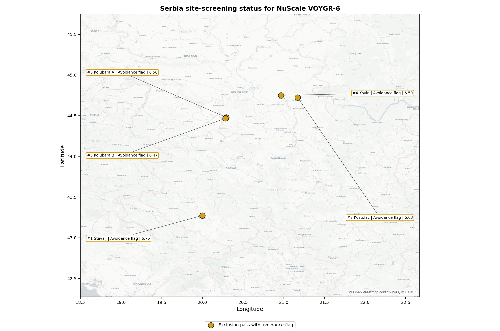

| # | Site | Status | Composite | MC low | MC high | Band | Top-10% | NH | HI | RI | EP | NS | Coverage | Confidence | Cap (MW) | Reg. rank |
| ---: | --- | --- | ---: | ---: | ---: | :---: | ---: | ---: | ---: | ---: | ---: | ---: | ---: | :--- | ---: | ---: |
| 1 | Štavalj Power Station | Avoidance flag | 6.75 | 5.93 | 7.17 | A | 92% | 6.9 | 7.4 | 7.6 | 4.3 | 6.4 | 76 | low | 300 | 85 |
| 2 | Kostolac power station | Avoidance flag | 6.63 | 5.91 | 7.24 | H | 8% | 7.3 | 6.5 | 6.2 | 6.0 | 6.6 | 76 | low | 1360 | 107 |
| 3 | Kolubara A power station | Avoidance flag | 6.56 | 5.83 | 7.07 | H | 0% | 7.1 | 8.0 | 4.6 | 6.7 | 5.9 | 76 | low | 271 | 123 |
| 4 | Kovin power station | Avoidance flag | 6.50 | 5.83 | 7.09 | H | 0% | 7.0 | 5.8 | 5.5 | 6.0 | 7.6 | 76 | low | 700 | 132 |
| 5 | Kolubara B power station | Avoidance flag | 6.47 | 5.74 | 6.98 | H | 0% | 6.8 | 8.0 | 4.6 | 6.7 | 5.9 | 76 | low | 725 | 135 |

### Criterion scores (0–10)

**Štavalj Power Station** — national rank 1

| Criterion | Score |
| :--- | ---: |
| BF-01 | 5.5 |
| BF-02 | 1.5 |
| EP-01 | 5.5 |
| EP-02 | 1.5 |
| EP-03 | 1.5 |
| EP-04 | 9.5 |
| HI-01 | 9.5 |
| HI-02 | 9.5 |
| HI-03 | 9.5 |
| HI-04 | 9.5 |
| HI-06 | 0.0 |
| HI-07 | 1.5 |
| NH-01 | 5.5 |
| NH-02 | 7.5 |
| NH-03 | 5.5 |
| NH-04 | 7.5 |
| NH-05 | 5.5 |
| NH-06 | 5.5 |
| NH-07 | 9.5 |
| NH-08 | 9.5 |
| NH-09 | 7.5 |
| NH-10 | 7.5 |
| NH-11 | 8.0 |
| NH-12 | 7.5 |
| NH-14 | 5.5 |
| NS-01 | 8.0 |
| NS-02 | 1.5 |
| NS-03 | 10.0 |
| NS-04 | 3.5 |
| NS-05 | 9.5 |
| NS-06 | 5.0 |
| NS-08 | 3.5 |
| NS-10 | 5.0 |
| NS-12 | 5.0 |
| NS-13 | 5.0 |
| RI-01 | 5.0 |
| RI-02 | 1.5 |
| RI-03 | 5.5 |
| RI-04 | 5.5 |
| RI-05 | 9.5 |
| RI-06 | 9.5 |

**Kostolac power station** — national rank 2

| Criterion | Score |
| :--- | ---: |
| BF-01 | 5.5 |
| BF-02 | 3.5 |
| EP-01 | 7.5 |
| EP-02 | 3.5 |
| EP-03 | 9.5 |
| EP-04 | 5.5 |
| HI-01 | 3.5 |
| HI-02 | 9.5 |
| HI-03 | 9.5 |
| HI-04 | 9.5 |
| HI-06 | 1.5 |
| HI-07 | 1.5 |
| NH-01 | 5.5 |
| NH-02 | 9.5 |
| NH-03 | 5.5 |
| NH-04 | 9.5 |
| NH-05 | 9.5 |
| NH-06 | 5.5 |
| NH-07 | 9.5 |
| NH-08 | 9.5 |
| NH-09 | 7.5 |
| NH-10 | 5.5 |
| NH-11 | 8.0 |
| NH-12 | 6.5 |
| NH-14 | 5.5 |
| NS-01 | 8.0 |
| NS-02 | 5.5 |
| NS-03 | 7.0 |
| NS-04 | 3.5 |
| NS-05 | 9.5 |
| NS-06 | 5.0 |
| NS-08 | 3.5 |
| NS-10 | 5.0 |
| NS-12 | 5.0 |
| NS-13 | 5.0 |
| RI-01 | 5.0 |
| RI-02 | 9.5 |
| RI-03 | 5.5 |
| RI-04 | 5.5 |
| RI-05 | 5.5 |
| RI-06 | 9.5 |

**Kolubara A power station** — national rank 3

| Criterion | Score |
| :--- | ---: |
| BF-01 | 5.5 |
| BF-02 | 7.5 |
| EP-01 | 7.5 |
| EP-02 | 5.5 |
| EP-03 | 9.5 |
| EP-04 | 5.5 |
| HI-01 | 9.5 |
| HI-02 | 9.5 |
| HI-03 | 9.5 |
| HI-04 | 9.5 |
| HI-06 | 3.5 |
| HI-07 | 1.5 |
| NH-01 | 5.5 |
| NH-02 | 5.5 |
| NH-03 | 5.5 |
| NH-04 | 9.5 |
| NH-05 | 7.5 |
| NH-06 | 5.5 |
| NH-07 | 9.5 |
| NH-08 | 9.5 |
| NH-09 | 7.5 |
| NH-10 | 9.5 |
| NH-11 | 8.0 |
| NH-12 | 5.5 |
| NH-14 | 5.5 |
| NS-01 | 8.0 |
| NS-02 | 1.5 |
| NS-03 | 9.0 |
| NS-04 | 3.5 |
| NS-05 | 7.5 |
| NS-06 | 5.0 |
| NS-08 | 5.5 |
| NS-10 | 5.0 |
| NS-12 | 5.0 |
| NS-13 | 5.0 |
| RI-01 | 5.0 |
| RI-02 | 3.5 |
| RI-03 | 5.5 |
| RI-04 | 3.5 |
| RI-05 | 3.5 |
| RI-06 | 7.5 |

**Kovin power station** — national rank 4

| Criterion | Score |
| :--- | ---: |
| BF-01 | 5.5 |
| BF-02 | 1.5 |
| EP-01 | 7.5 |
| EP-02 | 3.5 |
| EP-03 | 9.5 |
| EP-04 | 5.5 |
| HI-01 | 3.5 |
| HI-02 | 9.5 |
| HI-03 | 7.5 |
| HI-04 | 9.5 |
| HI-06 | 0.0 |
| HI-07 | 1.5 |
| NH-01 | 5.5 |
| NH-02 | 9.5 |
| NH-03 | 5.5 |
| NH-04 | 9.5 |
| NH-05 | 9.5 |
| NH-06 | 3.5 |
| NH-07 | 9.5 |
| NH-08 | 9.5 |
| NH-09 | 7.5 |
| NH-10 | 5.5 |
| NH-11 | 8.0 |
| NH-12 | 6.5 |
| NH-14 | 5.5 |
| NS-01 | 8.0 |
| NS-02 | 5.5 |
| NS-03 | 8.0 |
| NS-04 | 7.5 |
| NS-05 | 9.5 |
| NS-06 | 5.0 |
| NS-08 | 5.5 |
| NS-10 | 5.0 |
| NS-12 | 5.0 |
| NS-13 | 5.0 |
| RI-01 | 5.0 |
| RI-02 | 9.5 |
| RI-03 | 5.5 |
| RI-04 | 5.5 |
| RI-05 | 3.5 |
| RI-06 | 9.5 |

**Kolubara B power station** — national rank 5

| Criterion | Score |
| :--- | ---: |
| BF-01 | 5.5 |
| BF-02 | 7.5 |
| EP-01 | 7.5 |
| EP-02 | 5.5 |
| EP-03 | 9.5 |
| EP-04 | 5.5 |
| HI-01 | 9.5 |
| HI-02 | 9.5 |
| HI-03 | 9.5 |
| HI-04 | 9.5 |
| HI-06 | 3.5 |
| HI-07 | 1.5 |
| NH-01 | 5.5 |
| NH-02 | 5.5 |
| NH-03 | 9.5 |
| NH-04 | 7.5 |
| NH-05 | 5.5 |
| NH-06 | 5.5 |
| NH-07 | 9.5 |
| NH-08 | 9.5 |
| NH-09 | 7.5 |
| NH-10 | 9.5 |
| NH-11 | 8.0 |
| NH-12 | 5.5 |
| NH-14 | 7.5 |
| NS-01 | 8.0 |
| NS-02 | 1.5 |
| NS-03 | 9.0 |
| NS-04 | 3.5 |
| NS-05 | 7.5 |
| NS-06 | 5.0 |
| NS-08 | 7.5 |
| NS-10 | 5.0 |
| NS-12 | 5.0 |
| NS-13 | 5.0 |
| RI-01 | 5.0 |
| RI-02 | 3.5 |
| RI-03 | 5.5 |
| RI-04 | 3.5 |
| RI-05 | 3.5 |
| RI-06 | 7.5 |

---

## Slovakia (SK)

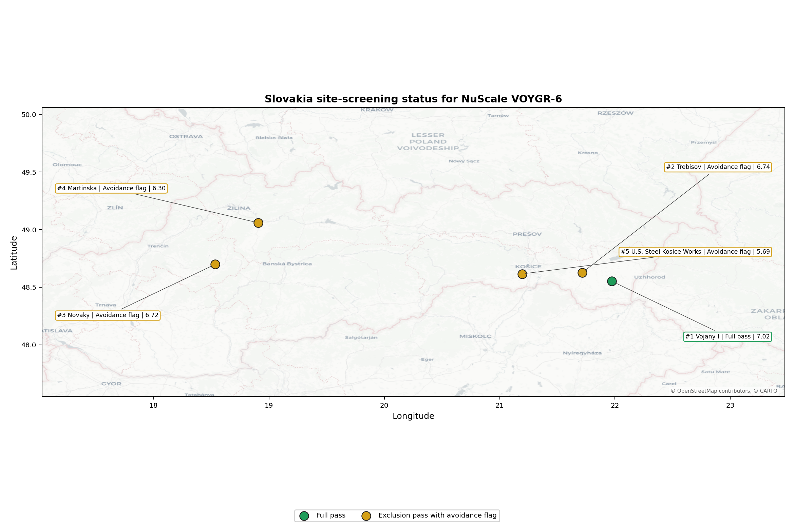

| # | Site | Status | Composite | MC low | MC high | Band | Top-10% | NH | HI | RI | EP | NS | Coverage | Confidence | Cap (MW) | Reg. rank |
| ---: | --- | --- | ---: | ---: | ---: | :---: | ---: | ---: | ---: | ---: | ---: | ---: | ---: | :--- | ---: | ---: |
| 1 | Vojany I power station | Full pass | 7.02 | 6.25 | 7.48 | A | 100% | 6.8 | 7.3 | 7.3 | 5.3 | 7.7 | 76 | low | 660 | 39 |
| 2 | Trebisov power station | Avoidance flag | 6.74 | 6.02 | 7.28 | H | 0% | 7.2 | 6.2 | 6.4 | 6.0 | 7.4 | 76 | low | 885 | 87 |
| 3 | Novaky power station | Avoidance flag | 6.72 | 6.00 | 7.24 | H | 0% | 7.5 | 6.2 | 7.6 | 3.6 | 7.0 | 76 | low | 472 | 96 |
| 4 | Martinska power station | Avoidance flag | 6.30 | 5.67 | 6.78 | H | 0% | 6.1 | 6.2 | 5.8 | 6.0 | 7.2 | 76 | low | 32 | 161 |
| 5 | U.S. Steel Kosice Works power station | Avoidance flag | 5.69 | 5.17 | 6.18 | H | 0% | 6.9 | 6.2 | 3.1 | 5.3 | 5.9 | 76 | low | 208 | 265 |

### Criterion scores (0–10)

**Vojany I power station** — national rank 1

| Criterion | Score |
| :--- | ---: |
| BF-01 | 5.5 |
| BF-02 | 9.5 |
| EP-01 | 7.5 |
| EP-02 | 3.5 |
| EP-03 | 9.5 |
| EP-04 | 3.5 |
| HI-01 | 7.5 |
| HI-02 | 9.5 |
| HI-03 | 9.5 |
| HI-04 | 9.5 |
| HI-06 | 1.5 |
| HI-07 | 1.5 |
| NH-01 | 5.5 |
| NH-02 | 9.5 |
| NH-03 | 5.5 |
| NH-04 | 7.5 |
| NH-05 | 5.5 |
| NH-06 | 5.5 |
| NH-07 | 9.5 |
| NH-08 | 9.5 |
| NH-09 | 7.5 |
| NH-10 | 7.5 |
| NH-11 | 8.0 |
| NH-12 | 6.5 |
| NH-14 | 5.5 |
| NS-01 | 8.0 |
| NS-02 | 5.5 |
| NS-03 | 10.0 |
| NS-04 | 7.5 |
| NS-05 | 7.5 |
| NS-06 | 5.0 |
| NS-08 | 1.5 |
| NS-10 | 5.0 |
| NS-12 | 5.0 |
| NS-13 | 5.0 |
| RI-01 | 5.0 |
| RI-02 | 5.5 |
| RI-03 | 5.5 |
| RI-04 | 5.5 |
| RI-05 | 9.5 |
| RI-06 | 7.5 |

**Trebisov power station** — national rank 2

| Criterion | Score |
| :--- | ---: |
| BF-01 | 5.5 |
| BF-02 | 1.5 |
| EP-01 | 5.5 |
| EP-02 | 3.5 |
| EP-03 | 9.5 |
| EP-04 | 5.5 |
| HI-01 | 3.5 |
| HI-02 | 9.5 |
| HI-03 | 9.5 |
| HI-04 | 9.5 |
| HI-06 | 0.0 |
| HI-07 | 1.5 |
| NH-01 | 5.5 |
| NH-02 | 9.5 |
| NH-03 | 5.5 |
| NH-04 | 9.5 |
| NH-05 | 9.5 |
| NH-06 | 3.5 |
| NH-07 | 9.5 |
| NH-08 | 9.5 |
| NH-09 | 7.5 |
| NH-10 | 7.5 |
| NH-11 | 8.0 |
| NH-12 | 6.5 |
| NH-14 | 5.5 |
| NS-01 | 6.0 |
| NS-02 | 5.5 |
| NS-03 | 9.0 |
| NS-04 | 9.5 |
| NS-05 | 7.5 |
| NS-06 | 5.0 |
| NS-08 | 1.5 |
| NS-10 | 5.0 |
| NS-12 | 5.0 |
| NS-13 | 5.0 |
| RI-01 | 5.0 |
| RI-02 | 3.5 |
| RI-03 | 5.5 |
| RI-04 | 3.5 |
| RI-05 | 9.5 |
| RI-06 | 5.5 |

**Novaky power station** — national rank 3

| Criterion | Score |
| :--- | ---: |
| BF-01 | 5.5 |
| BF-02 | 9.5 |
| EP-01 | 5.5 |
| EP-02 | 3.5 |
| EP-03 | 1.5 |
| EP-04 | 5.5 |
| HI-01 | 3.5 |
| HI-02 | 9.5 |
| HI-03 | 9.5 |
| HI-04 | 9.5 |
| HI-06 | 0.0 |
| HI-07 | 1.5 |
| NH-01 | 7.5 |
| NH-02 | 9.5 |
| NH-03 | 5.5 |
| NH-04 | 7.5 |
| NH-05 | 7.5 |
| NH-06 | 5.5 |
| NH-07 | 9.5 |
| NH-08 | 9.5 |
| NH-09 | 7.5 |
| NH-10 | 7.5 |
| NH-11 | 8.0 |
| NH-12 | 6.5 |
| NH-14 | 7.5 |
| NS-01 | 7.0 |
| NS-02 | 5.5 |
| NS-03 | 9.0 |
| NS-04 | 7.5 |
| NS-05 | 5.5 |
| NS-06 | 5.0 |
| NS-08 | 3.5 |
| NS-10 | 5.0 |
| NS-12 | 5.0 |
| NS-13 | 5.0 |
| RI-01 | 5.0 |
| RI-02 | 1.5 |
| RI-03 | 7.5 |
| RI-04 | 5.5 |
| RI-05 | 9.5 |
| RI-06 | 7.5 |

**Martinska power station** — national rank 4

| Criterion | Score |
| :--- | ---: |
| BF-01 | 5.5 |
| BF-02 | 9.5 |
| EP-01 | 5.5 |
| EP-02 | 3.5 |
| EP-03 | 9.5 |
| EP-04 | 5.5 |
| HI-01 | 3.5 |
| HI-02 | 9.5 |
| HI-03 | 9.5 |
| HI-04 | 9.5 |
| HI-06 | 0.0 |
| HI-07 | 1.5 |
| NH-01 | 5.5 |
| NH-02 | 9.5 |
| NH-03 | 5.5 |
| NH-04 | 7.5 |
| NH-05 | 3.5 |
| NH-06 | 3.5 |
| NH-07 | 9.5 |
| NH-08 | 9.5 |
| NH-09 | 7.5 |
| NH-10 | 5.5 |
| NH-11 | 8.0 |
| NH-12 | 6.5 |
| NH-14 | 5.5 |
| NS-01 | 8.0 |
| NS-02 | 1.5 |
| NS-03 | 9.0 |
| NS-04 | 9.5 |
| NS-05 | 9.5 |
| NS-06 | 5.0 |
| NS-08 | 1.5 |
| NS-10 | 5.0 |
| NS-12 | 5.0 |
| NS-13 | 5.0 |
| RI-01 | 5.0 |
| RI-02 | 1.5 |
| RI-03 | 5.5 |
| RI-04 | 1.5 |
| RI-05 | 9.5 |
| RI-06 | 5.5 |

**U.S. Steel Kosice Works power station** — national rank 5

| Criterion | Score |
| :--- | ---: |
| BF-01 | 5.5 |
| BF-02 | 1.5 |
| EP-01 | 7.5 |
| EP-02 | 5.5 |
| EP-03 | 9.5 |
| EP-04 | 1.5 |
| HI-01 | 3.5 |
| HI-02 | 9.5 |
| HI-03 | 9.5 |
| HI-04 | 9.5 |
| HI-06 | 0.0 |
| HI-07 | 1.5 |
| NH-01 | 5.5 |
| NH-02 | 9.5 |
| NH-03 | 5.5 |
| NH-04 | 9.5 |
| NH-05 | 7.5 |
| NH-06 | 3.5 |
| NH-07 | 9.5 |
| NH-08 | 9.5 |
| NH-09 | 7.5 |
| NH-10 | 7.5 |
| NH-11 | 8.0 |
| NH-12 | 6.5 |
| NH-14 | 5.5 |
| NS-01 | 6.0 |
| NS-02 | 1.5 |
| NS-03 | 9.0 |
| NS-04 | 9.5 |
| NS-05 | 3.5 |
| NS-06 | 5.0 |
| NS-08 | 3.5 |
| NS-10 | 5.0 |
| NS-12 | 5.0 |
| NS-13 | 5.0 |
| RI-01 | 5.0 |
| RI-02 | 1.5 |
| RI-03 | 5.5 |
| RI-04 | 3.5 |
| RI-05 | 1.5 |
| RI-06 | 3.5 |

---

## Turkey (TR)

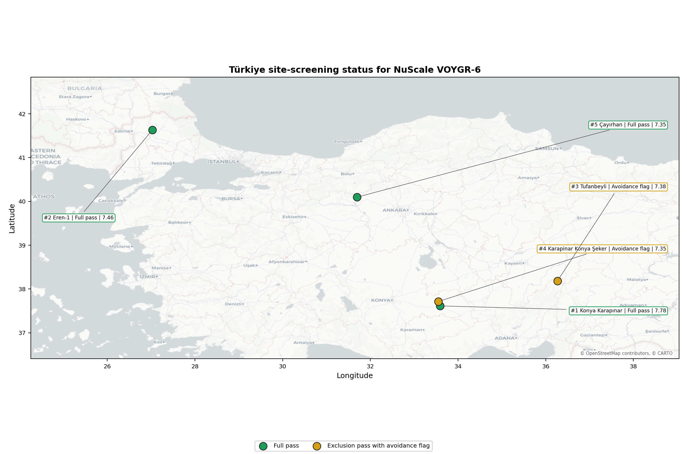

| # | Site | Status | Composite | MC low | MC high | Band | Top-10% | NH | HI | RI | EP | NS | Coverage | Confidence | Cap (MW) | Reg. rank |
| ---: | --- | --- | ---: | ---: | ---: | :---: | ---: | ---: | ---: | ---: | ---: | ---: | ---: | :--- | ---: | ---: |
| 1 | Konya Karapınar power station | Full pass | 7.78 | 6.53 | 8.30 | A | 100% | 7.4 | 9.2 | 7.9 | 7.4 | 7.0 | 71 | low | 1000 | 2 |
| 2 | Eren-1 power station | Full pass | 7.46 | 6.60 | 7.90 | A | 100% | 7.4 | 7.7 | 7.5 | 6.7 | 7.7 | 76 | low | 490 | 4 |
| 3 | Tufanbeyli power station | Avoidance flag | 7.38 | 6.41 | 7.89 | A | 100% | 7.3 | 9.2 | 7.9 | 6.0 | 6.3 | 74 | low | 450 | 8 |
| 4 | Karapinar Konya Şeker power station | Avoidance flag | 7.35 | 6.39 | 7.86 | A | 100% | 7.1 | 8.9 | 6.7 | 7.4 | 6.9 | 74 | low | 2000 | 11 |
| 5 | Çayırhan power station | Full pass | 7.35 | 6.51 | 7.81 | B | 100% | 6.9 | 8.1 | 6.6 | 7.4 | 7.7 | 76 | low | 1420 | 12 |

### Criterion scores (0–10)

**Konya Karapınar power station** — national rank 1

| Criterion | Score |
| :--- | ---: |
| BF-01 | 5.5 |
| BF-02 | 9.5 |
| EP-01 | 7.5 |
| EP-02 | 3.5 |
| EP-03 | 9.5 |
| EP-04 | 9.5 |
| HI-01 | 9.5 |
| HI-02 | 9.5 |
| HI-03 | 9.5 |
| HI-04 | 9.5 |
| HI-06 | 5.0 |
| HI-07 | 5.5 |
| NH-01 | 5.5 |
| NH-02 | 9.5 |
| NH-03 | 5.5 |
| NH-04 | 9.5 |
| NH-05 | 9.5 |
| NH-06 | 5.5 |
| NH-07 | 5.5 |
| NH-08 | 9.5 |
| NH-09 | 7.5 |
| NH-10 | 9.5 |
| NH-11 | 8.0 |
| NH-12 | 5.5 |
| NH-14 | 5.5 |
| NS-01 | 5.0 |
| NS-02 | 5.5 |
| NS-03 | 5.0 |
| NS-04 | 9.5 |
| NS-05 | 9.5 |
| NS-06 | 5.0 |
| NS-08 | 5.5 |
| NS-10 | 5.0 |
| NS-12 | 5.0 |
| NS-13 | 5.0 |
| RI-01 | 5.0 |
| RI-02 | 3.5 |
| RI-03 | 5.5 |
| RI-04 | 7.5 |
| RI-05 | 9.5 |
| RI-06 | 7.5 |

**Eren-1 power station** — national rank 2

| Criterion | Score |
| :--- | ---: |
| BF-01 | 5.5 |
| BF-02 | 9.5 |
| EP-01 | 7.5 |
| EP-02 | 5.5 |
| EP-03 | 9.5 |
| EP-04 | 5.5 |
| HI-01 | 9.5 |
| HI-02 | 9.5 |
| HI-03 | 9.5 |
| HI-04 | 9.5 |
| HI-06 | 1.5 |
| HI-07 | 1.5 |
| NH-01 | 5.5 |
| NH-02 | 7.5 |
| NH-03 | 5.5 |
| NH-04 | 9.5 |
| NH-05 | 9.5 |
| NH-06 | 5.5 |
| NH-07 | 9.5 |
| NH-08 | 9.5 |
| NH-09 | 7.5 |
| NH-10 | 5.5 |
| NH-11 | 10.0 |
| NH-12 | 6.5 |
| NH-14 | 5.5 |
| NS-01 | 7.0 |
| NS-02 | 5.5 |
| NS-03 | 8.0 |
| NS-04 | 9.5 |
| NS-05 | 9.5 |
| NS-06 | 5.0 |
| NS-08 | 9.5 |
| NS-10 | 5.0 |
| NS-12 | 5.0 |
| NS-13 | 5.0 |
| RI-01 | 5.0 |
| RI-02 | 1.5 |
| RI-03 | 7.5 |
| RI-04 | 7.5 |
| RI-05 | 9.5 |
| RI-06 | 3.5 |

**Tufanbeyli power station** — national rank 3

| Criterion | Score |
| :--- | ---: |
| BF-01 | 5.5 |
| BF-02 | 9.5 |
| EP-01 | 7.5 |
| EP-02 | 1.5 |
| EP-03 | 9.5 |
| EP-04 | 7.5 |
| HI-01 | 9.5 |
| HI-02 | 9.5 |
| HI-03 | 9.5 |
| HI-04 | 9.5 |
| HI-06 | 5.0 |
| HI-07 | 5.5 |
| NH-01 | 5.5 |
| NH-02 | 7.5 |
| NH-03 | 9.5 |
| NH-04 | 5.5 |
| NH-05 | 9.5 |
| NH-06 | 5.5 |
| NH-07 | 5.5 |
| NH-08 | 9.5 |
| NH-09 | 7.5 |
| NH-10 | 5.5 |
| NH-11 | 8.0 |
| NH-12 | 6.5 |
| NH-14 | 5.5 |
| NS-01 | 6.0 |
| NS-02 | 3.5 |
| NS-03 | 8.0 |
| NS-04 | 5.5 |
| NS-05 | 9.5 |
| NS-06 | 5.0 |
| NS-08 | 9.5 |
| NS-10 | 5.0 |
| NS-12 | 5.0 |
| NS-13 | 5.0 |
| RI-01 | 5.0 |
| RI-02 | 3.5 |
| RI-03 | 7.5 |
| RI-04 | 7.5 |
| RI-05 | 9.5 |
| RI-06 | 5.5 |

**Karapinar Konya Şeker power station** — national rank 4

| Criterion | Score |
| :--- | ---: |
| BF-01 | 5.5 |
| BF-02 | 9.5 |
| EP-01 | 5.5 |
| EP-02 | 3.5 |
| EP-03 | 9.5 |
| EP-04 | 9.5 |
| HI-01 | 9.5 |
| HI-02 | 9.5 |
| HI-03 | 9.5 |
| HI-04 | 9.5 |
| HI-06 | 5.0 |
| HI-07 | 1.5 |
| NH-01 | 5.5 |
| NH-02 | 9.5 |
| NH-03 | 5.5 |
| NH-04 | 9.5 |
| NH-05 | 9.5 |
| NH-06 | 3.5 |
| NH-07 | 5.5 |
| NH-08 | 9.5 |
| NH-09 | 7.5 |
| NH-10 | 7.5 |
| NH-11 | 8.0 |
| NH-12 | 5.5 |
| NH-14 | 5.5 |
| NS-01 | 3.0 |
| NS-02 | 5.5 |
| NS-03 | 10.0 |
| NS-04 | 7.5 |
| NS-05 | 9.5 |
| NS-06 | 5.0 |
| NS-08 | 5.5 |
| NS-10 | 5.0 |
| NS-12 | 5.0 |
| NS-13 | 5.0 |
| RI-01 | 5.0 |
| RI-02 | 1.5 |
| RI-03 | 5.5 |
| RI-04 | 3.5 |
| RI-05 | 9.5 |
| RI-06 | 7.5 |

**Çayırhan power station** — national rank 5

| Criterion | Score |
| :--- | ---: |
| BF-01 | 5.5 |
| BF-02 | 3.5 |
| EP-01 | 5.5 |
| EP-02 | 3.5 |
| EP-03 | 9.5 |
| EP-04 | 9.5 |
| HI-01 | 9.5 |
| HI-02 | 9.5 |
| HI-03 | 9.5 |
| HI-04 | 9.5 |
| HI-06 | 3.5 |
| HI-07 | 3.5 |
| NH-01 | 5.5 |
| NH-02 | 9.5 |
| NH-03 | 9.5 |
| NH-04 | 5.5 |
| NH-05 | 5.5 |
| NH-06 | 5.5 |
| NH-07 | 9.5 |
| NH-08 | 9.5 |
| NH-09 | 7.5 |
| NH-10 | 9.5 |
| NH-11 | 8.0 |
| NH-12 | 6.5 |
| NH-14 | 5.5 |
| NS-01 | 8.0 |
| NS-02 | 5.5 |
| NS-03 | 10.0 |
| NS-04 | 7.5 |
| NS-05 | 7.5 |
| NS-06 | 5.0 |
| NS-08 | 9.5 |
| NS-10 | 5.0 |
| NS-12 | 5.0 |
| NS-13 | 5.0 |
| RI-01 | 5.0 |
| RI-02 | 3.5 |
| RI-03 | 7.5 |
| RI-04 | 5.5 |
| RI-05 | 9.5 |
| RI-06 | 1.5 |

---

## Ukraine (UA)

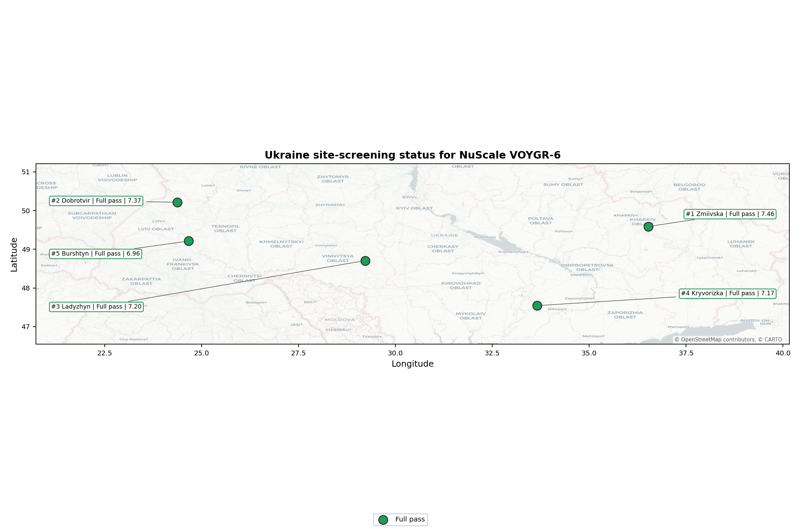

| # | Site | Status | Composite | MC low | MC high | Band | Top-10% | NH | HI | RI | EP | NS | Coverage | Confidence | Cap (MW) | Reg. rank |
| ---: | --- | --- | ---: | ---: | ---: | :---: | ---: | ---: | ---: | ---: | ---: | ---: | ---: | :--- | ---: | ---: |
| 1 | Zmiivska power station | Full pass | 7.46 | 6.26 | 7.95 | A | 92% | 7.3 | 8.9 | 7.6 | 5.3 | 7.3 | 71 | low | 2270 | 5 |
| 2 | Dobrotvir power station | Full pass | 7.37 | 6.53 | 8.01 | B | 100% | 7.4 | 7.7 | 7.6 | 5.3 | 7.8 | 76 | low | 1110 | 10 |
| 3 | Ladyzhyn power station | Full pass | 7.20 | 6.39 | 7.71 | D | 8% | 7.5 | 7.7 | 8.0 | 6.0 | 6.3 | 76 | low | 1800 | 20 |
| 4 | Kryvorizka power station | Full pass | 7.17 | 6.05 | 7.66 | D | 0% | 6.8 | 8.9 | 7.6 | 5.3 | 6.6 | 71 | low | 2925 | 24 |
| 5 | Burshtyn power station | Full pass | 6.96 | 6.20 | 7.45 | D | 0% | 6.4 | 8.1 | 6.2 | 6.0 | 7.6 | 76 | low | 3166 | 51 |

### Criterion scores (0–10)

**Zmiivska power station** — national rank 1

| Criterion | Score |
| :--- | ---: |
| BF-01 | 7.5 |
| BF-02 | 9.5 |
| EP-01 | 5.5 |
| EP-02 | 1.5 |
| EP-03 | 9.5 |
| EP-04 | 5.5 |
| HI-01 | 9.5 |
| HI-02 | 9.5 |
| HI-03 | 9.5 |
| HI-04 | 9.5 |
| HI-06 | 5.0 |
| HI-07 | 1.5 |
| NH-01 | 5.0 |
| NH-02 | 9.5 |
| NH-03 | 5.5 |
| NH-04 | 7.5 |
| NH-05 | 7.5 |
| NH-06 | 3.5 |
| NH-07 | 9.5 |
| NH-08 | 9.5 |
| NH-09 | 7.5 |
| NH-10 | 7.5 |
| NH-11 | 10.0 |
| NH-12 | 5.5 |
| NH-14 | 7.5 |
| NS-01 | 7.0 |
| NS-02 | 7.5 |
| NS-03 | 9.0 |
| NS-04 | 3.5 |
| NS-05 | 9.5 |
| NS-06 | 5.0 |
| NS-08 | 1.5 |
| NS-10 | 5.0 |
| NS-12 | 5.0 |
| NS-13 | 5.0 |
| RI-01 | 5.0 |
| RI-02 | 5.5 |
| RI-03 | 5.5 |
| RI-04 | 5.5 |
| RI-05 | 9.5 |
| RI-06 | 9.5 |

**Dobrotvir power station** — national rank 2

| Criterion | Score |
| :--- | ---: |
| BF-01 | 5.5 |
| BF-02 | 9.5 |
| EP-01 | 5.5 |
| EP-02 | 3.5 |
| EP-03 | 9.5 |
| EP-04 | 3.5 |
| HI-01 | 9.5 |
| HI-02 | 9.5 |
| HI-03 | 9.5 |
| HI-04 | 9.5 |
| HI-06 | 1.5 |
| HI-07 | 1.5 |
| NH-01 | 9.5 |
| NH-02 | 9.5 |
| NH-03 | 5.5 |
| NH-04 | 7.5 |
| NH-05 | 5.5 |
| NH-06 | 5.5 |
| NH-07 | 9.5 |
| NH-08 | 9.5 |
| NH-09 | 7.5 |
| NH-10 | 5.5 |
| NH-11 | 8.0 |
| NH-12 | 6.5 |
| NH-14 | 5.5 |
| NS-01 | 8.0 |
| NS-02 | 9.5 |
| NS-03 | 8.0 |
| NS-04 | 3.5 |
| NS-05 | 9.5 |
| NS-06 | 5.0 |
| NS-08 | 1.5 |
| NS-10 | 5.0 |
| NS-12 | 5.0 |
| NS-13 | 5.0 |
| RI-01 | 5.0 |
| RI-02 | 3.5 |
| RI-03 | 5.5 |
| RI-04 | 5.5 |
| RI-05 | 9.5 |
| RI-06 | 9.5 |

**Ladyzhyn power station** — national rank 3

| Criterion | Score |
| :--- | ---: |
| BF-01 | 5.5 |
| BF-02 | 9.5 |
| EP-01 | 5.5 |
| EP-02 | 3.5 |
| EP-03 | 9.5 |
| EP-04 | 5.5 |
| HI-01 | 9.5 |
| HI-02 | 9.5 |
| HI-03 | 9.5 |
| HI-04 | 9.5 |
| HI-06 | 1.5 |
| HI-07 | 1.5 |
| NH-01 | 9.5 |
| NH-02 | 9.5 |
| NH-03 | 9.5 |
| NH-04 | 7.5 |
| NH-05 | 5.5 |
| NH-06 | 5.5 |
| NH-07 | 9.5 |
| NH-08 | 9.5 |
| NH-09 | 7.5 |
| NH-10 | 7.5 |
| NH-11 | 8.0 |
| NH-12 | 5.5 |
| NH-14 | 9.5 |
| NS-01 | 7.0 |
| NS-02 | 5.5 |
| NS-03 | 8.0 |
| NS-04 | 1.5 |
| NS-05 | 9.5 |
| NS-06 | 5.0 |
| NS-08 | 1.5 |
| NS-10 | 5.0 |
| NS-12 | 5.0 |
| NS-13 | 5.0 |
| RI-01 | 5.0 |
| RI-02 | 5.5 |
| RI-03 | 7.5 |
| RI-04 | 5.5 |
| RI-05 | 9.5 |
| RI-06 | 9.5 |

**Kryvorizka power station** — national rank 4

| Criterion | Score |
| :--- | ---: |
| BF-01 | 5.5 |
| BF-02 | 9.5 |
| EP-01 | 5.5 |
| EP-02 | 1.5 |
| EP-03 | 9.5 |
| EP-04 | 5.5 |
| HI-01 | 9.5 |
| HI-02 | 9.5 |
| HI-03 | 9.5 |
| HI-04 | 9.5 |
| HI-06 | 5.0 |
| HI-07 | 1.5 |
| NH-01 | 5.0 |
| NH-02 | 9.5 |
| NH-03 | 5.5 |
| NH-04 | 9.5 |
| NH-05 | 5.5 |
| NH-06 | 3.5 |
| NH-07 | 9.5 |
| NH-08 | 9.5 |
| NH-09 | 7.5 |
| NH-10 | 7.5 |
| NH-11 | 10.0 |
| NH-12 | 4.5 |
| NH-14 | 7.5 |
| NS-01 | 7.0 |
| NS-02 | 5.5 |
| NS-03 | 8.0 |
| NS-04 | 3.5 |
| NS-05 | 9.5 |
| NS-06 | 5.0 |
| NS-08 | 5.5 |
| NS-10 | 5.0 |
| NS-12 | 5.0 |
| NS-13 | 5.0 |
| RI-01 | 5.0 |
| RI-02 | 1.5 |
| RI-03 | 5.5 |
| RI-04 | 5.5 |
| RI-05 | 9.5 |
| RI-06 | 9.5 |

**Burshtyn power station** — national rank 5

| Criterion | Score |
| :--- | ---: |
| BF-01 | 7.5 |
| BF-02 | 9.5 |
| EP-01 | 5.5 |
| EP-02 | 3.5 |
| EP-03 | 9.5 |
| EP-04 | 5.5 |
| HI-01 | 9.5 |
| HI-02 | 9.5 |
| HI-03 | 9.5 |
| HI-04 | 9.5 |
| HI-06 | 3.5 |
| HI-07 | 3.5 |
| NH-01 | 7.5 |
| NH-02 | 9.5 |
| NH-03 | 5.5 |
| NH-04 | 7.5 |
| NH-05 | 1.5 |
| NH-06 | 5.5 |
| NH-07 | 9.5 |
| NH-08 | 9.5 |
| NH-09 | 7.5 |
| NH-10 | 5.5 |
| NH-11 | 8.0 |
| NH-12 | 6.5 |
| NH-14 | 5.5 |
| NS-01 | 7.0 |
| NS-02 | 7.5 |
| NS-03 | 10.0 |
| NS-04 | 3.5 |
| NS-05 | 9.5 |
| NS-06 | 5.0 |
| NS-08 | 1.5 |
| NS-10 | 5.0 |
| NS-12 | 5.0 |
| NS-13 | 5.0 |
| RI-01 | 5.0 |
| RI-02 | 1.5 |
| RI-03 | 5.5 |
| RI-04 | 5.5 |
| RI-05 | 5.5 |
| RI-06 | 9.5 |

---

## Status legend

- **Full pass** — clears exclusionary and avoidance screens.
- **Avoidance flag** — clears exclusionary screen; at least one avoidance criterion is flagged.
- **Hard-fail** — fails the exclusionary screen.

## Family codes

- **NH** — Natural hazards
- **HI** — Human-induced hazards
- **RI** — Radiological impact
- **EP** — Emergency planning
- **NS** — Non-safety / infrastructure
