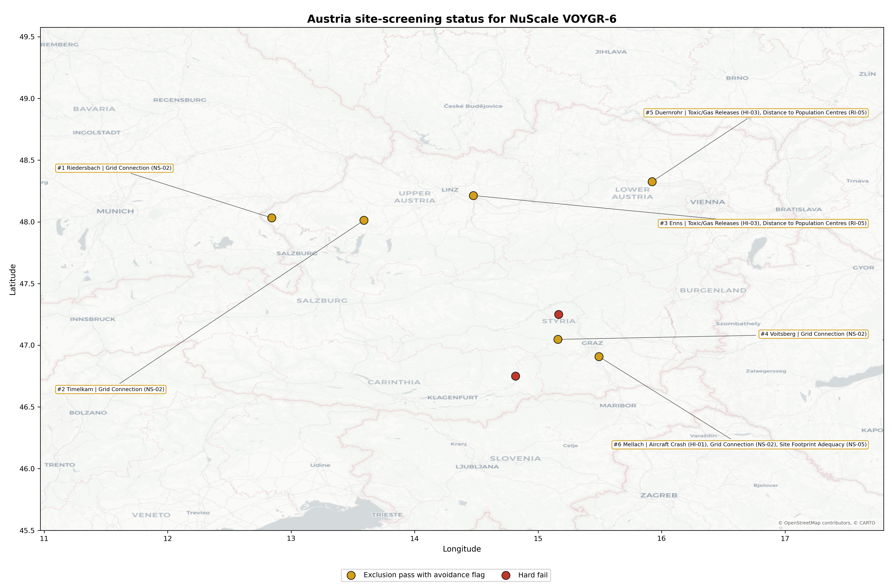
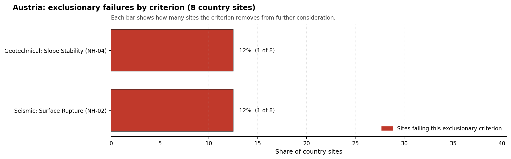

# Austria Country Profile

Austria has 8 thermal and coal-site records that have been tested against the NuScale VOYGR-6 reference deployment envelope. 0 sites pass both the exclusionary and avoidance screens, 6 pass the exclusionary screen but retain avoidance flags, and 2 fail one or more exclusionary checks. The country therefore has no candidate that currently clears the full screening pathway without a remediation step; the relevant pool is the exclusionary-pass group with one or more avoidance flags still to resolve.

The leading site is **Riedersbach power station**, with a composite score of 7.159 and a Monte Carlo interval of 6.361-7.650. Its national stability band is `A` with a national top-10% hit rate of 100%. The leader is therefore not only the current point-estimate front-runner; it is also a stable national candidate under the sensitivity treatment used for the report.

<!-- specialist key=country_exec scope=country country_code=AT bundle=AT_country_bundle.json status=pending -->

<!-- /specialist key=country_exec -->

Interactive review map with marker tooltips: [AT_site_status_map.html](figures/AT_site_status_map.html).

## Austria Site Ledger

| Rank | Site | Status | Composite | MC Low | MC High | Band | Top-10 Hit | Coverage |
|---:|---|---|---:|---:|---:|---|---:|---:|
| 1 | Riedersbach power station | Exclusion pass with avoidance flag | 7.159 | 6.361 | 7.650 | A | 100% | 76% |
| 2 | Timelkam power station | Exclusion pass with avoidance flag | 7.016 | 6.245 | 7.487 | H | 0% | 76% |
| 3 | Enns Power Station | Exclusion pass with avoidance flag | 6.616 | 5.922 | 7.156 | H | 0% | 76% |
| 4 | Voitsberg power station | Exclusion pass with avoidance flag | 6.559 | 5.876 | 7.050 | H | 0% | 76% |
| 5 | Duernrohr power station | Exclusion pass with avoidance flag | 6.544 | 5.864 | 7.081 | H | 0% | 76% |
| 6 | Mellach power station | Exclusion pass with avoidance flag | 6.347 | 5.705 | 6.837 | H | 0% | 76% |
| - | St Andrae power station | Hard fail | - | - | - | - | - | 0% |
| - | Zeltweg power station | Hard fail | - | - | - | - | - | 0% |

## Avoidance Flag Pareto

Of the 6 sites that pass the exclusionary screen, the avoidance-phase flags concentrate on a small set of criteria. Resolving them is what would move the country from a small leading group to a broader candidate pool.

- **Grid Connection (NS-02)** - 4 of 6 exclusionary-pass sites (67%).
- **Toxic/Gas Releases (HI-03)** - 2 of 6 exclusionary-pass sites (33%).
- **Distance to Population Centres (RI-05)** - 2 of 6 exclusionary-pass sites (33%).
- **Aircraft Crash (HI-01)** - 1 of 6 exclusionary-pass sites (17%).
- **Site Footprint Adequacy (NS-05)** - 1 of 6 exclusionary-pass sites (17%).

## Exclusionary Failure Pareto

The exclusionary failures across the country trace back to a small number of criteria. They identify which screening checks are responsible for removing sites from further consideration.

- **Seismic: Surface Rupture (NH-02)** - 1 of 8 country sites (12%).
- **Geotechnical: Slope Stability (NH-04)** - 1 of 8 country sites (12%).

## Family Strength and Weakness

Across the country the strongest criterion family is **Natural Hazards** at a mean normalised score of 7.65/10. The weakest family is **Radiological Impact** at 5.54/10. The bottom three individual criteria across the country are:

- **Electromagnetic Interference (HI-07)** - mean 1.50/10 across 8 scored sites (min 1.5, max 1.5).
- **Military Installations (HI-06)** - mean 1.62/10 across 8 scored sites (min 0.0, max 3.5).
- **Ecological Sensitivity (NS-08)** - mean 2.50/10 across 8 scored sites (min 1.5, max 5.5).

## Interpretation for Site Selection

The Austria result shows a clear separation between sites that can support further Stage 3 consideration and sites that should remain in the evidence base only as comparators. With no full-pass candidate in Austria, the relevant pool for progression is the leading exclusionary-pass group with avoidance flags still to resolve. Avoidance-flag sites are not discarded; they identify locations where a specific constraint must be resolved before the site can be treated as a full-pass equivalent.

The chart shows where focused remediation effort would broaden the candidate pool. The criteria at the top of the Pareto are the policy and engineering levers that, if resolved, move avoidance-flag sites into the leading group.

An IAEA-style reading of the table focuses less on the exact rank number and more on screening class, score stability, and the nature of remaining uncertainty. **Riedersbach power station** is important because it leads nationally and sits inside the strongest stability band, even though it remains an avoidance-flag candidate rather than a full-pass site. That does not establish final site suitability. It is a defensible reason to spend Stage 3 effort on resolving the leader's avoidance flag, field confirmation, national data review, and stakeholder engagement before lower-ranked locations.

The Monte Carlo interval is a caution against false precision: several sites have overlapping score bands, so small score differences should not be overinterpreted. The decisive distinction is whether a site combines acceptable exclusionary performance with a stable ranking position and no unresolved avoidance flag.

The main Stage 3 questions are therefore targeted rather than generic: confirm local natural-hazard inputs, verify emergency-planning assumptions, test land and ownership constraints, assess cooling and grid interface conditions, and reconcile environmental constraints with national permitting requirements.

## Status Counts

- Full pass: 0
- Exclusion pass with avoidance flag: 6
- Hard fail: 2
