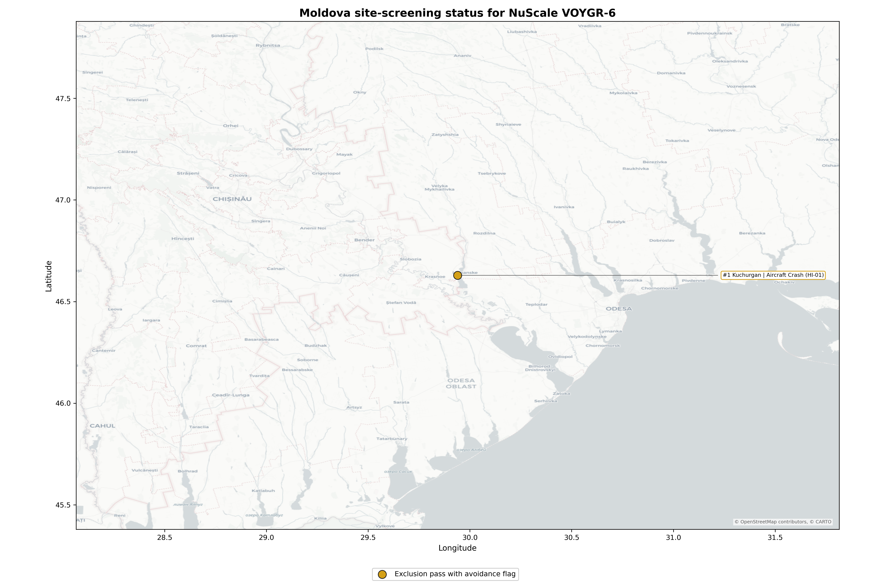
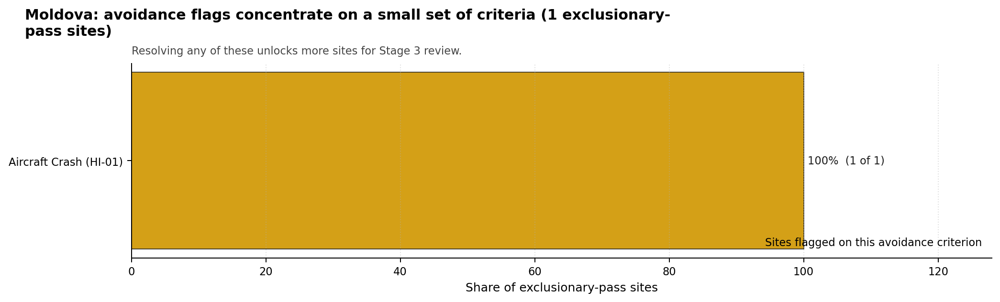

# Moldova Country Profile

Moldova has 1 thermal and coal-site records that have been tested against the NuScale VOYGR-6 reference deployment envelope. 0 sites pass both the exclusionary and avoidance screens, 1 pass the exclusionary screen but retain avoidance flags, and 0 fail one or more exclusionary checks. The country is therefore not a single-site case, but only a small subset of the national site population currently clears the full screening pathway without a remediation step.

The leading avoidance-flag candidate is **Kuchurgan power station**, with a composite score of 6.959 and a Monte Carlo interval of 6.199-7.500. Its national stability band is `A` with a national top-10% hit rate of 100%. The site is the current point-estimate front-runner and a stable national candidate under the sensitivity treatment used for the report, but it carries unresolved avoidance flags; Moldova has no full-pass candidate in the current screening run.

<!-- specialist key=country_exec scope=country country_code=MD bundle=MD_country_bundle.json status=pending -->

<!-- /specialist key=country_exec -->

Interactive review map with marker tooltips: [MD_site_status_map.html](figures/MD_site_status_map.html).

## Moldova Site Ledger

| Rank | Site | Status | Composite | MC Low | MC High | Band | Top-10 Hit | Coverage |
|---:|---|---|---:|---:|---:|---|---:|---:|
| 1 | Kuchurgan power station | Exclusion pass with avoidance flag | 6.959 | 6.199 | 7.500 | A | 100% | 76% |

## Avoidance Flag Pareto

Of the 1 sites that pass the exclusionary screen, the avoidance-phase flags concentrate on a small set of criteria. Resolving them is what would move the country from a small leading group to a broader candidate pool.

- **Aircraft Crash (HI-01)** - 1 of 1 exclusionary-pass sites (100%).

## Family Strength and Weakness

Across the country the strongest criterion family is **Non-Safety / Implementation** at a mean normalised score of 7.67/10. The weakest family is **Emergency Planning** at 5.26/10. The bottom three individual criteria across the country are:

- **Military Installations (HI-06)** - mean 1.50/10 across 1 scored sites (min 1.5, max 1.5).
- **Surface Water Dispersion (RI-02)** - mean 1.50/10 across 1 scored sites (min 1.5, max 1.5).
- **Evacuation Routes (EP-02)** - mean 1.50/10 across 1 scored sites (min 1.5, max 1.5).

## Interpretation for Site Selection

The Moldova result shows a clear separation between sites that can support further Stage 3 consideration and sites that should remain in the evidence base only as comparators. With no full-pass site in the national population, the leading avoidance-flag candidate defines the practical progression pool: it is not discarded, but it identifies the locations where specific constraints must be resolved before the site can be treated as equivalent to a full-pass leader elsewhere.

The chart shows where focused remediation effort would broaden the candidate pool. The criteria at the top of the Pareto are the policy and engineering levers that, if resolved, move avoidance-flag sites into the leading group.

An IAEA-style reading of the table focuses less on the exact rank number and more on screening class, score stability, and the nature of remaining uncertainty. **Kuchurgan power station** is important because it leads nationally, sits inside the strongest stability band, and is the leading avoidance-flag candidate in a country without a full-pass site. That does not establish final site suitability. It is a defensible reason to spend Stage 3 effort on field confirmation, national data review, and stakeholder engagement to test whether the unresolved avoidance flags can be lifted.

The Monte Carlo interval is a caution against false precision: several sites have overlapping score bands, so small score differences should not be overinterpreted. The decisive distinction is whether a site combines acceptable exclusionary performance with a stable ranking position and no unresolved avoidance flag.

The main Stage 3 questions are therefore targeted rather than generic: confirm local natural-hazard inputs, verify emergency-planning assumptions, test land and ownership constraints, assess cooling and grid interface conditions, and reconcile environmental constraints with national permitting requirements.

## Status Counts

- Full pass: 0
- Exclusion pass with avoidance flag: 1
- Hard fail: 0
