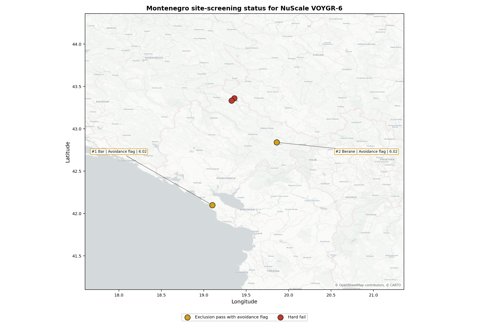
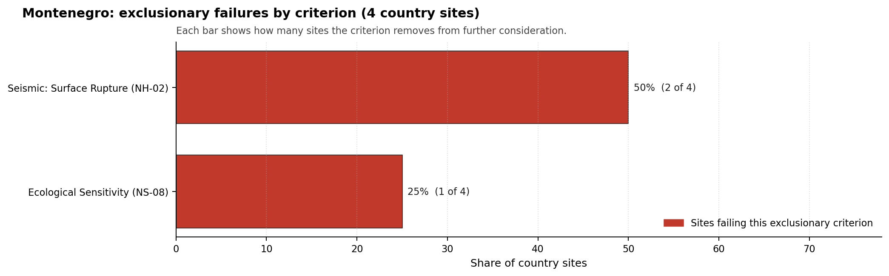

# Montenegro Country Profile

Analytical basis: scoring `score-c2a90942` and sensitivity `nat-sens-b1a62885`.

Montenegro has 4 thermal and coal-site records that have been tested against the NuScale VOYGR-6 reference deployment envelope. 0 sites pass both the exclusionary and avoidance screens, 2 pass the exclusionary screen but retain avoidance flags, and 2 fail one or more exclusionary checks. The country is therefore not a single-site case, but only a small subset of the national site population currently clears the full screening pathway without a remediation step.

The leading site is **Bar power station**, with a composite score of 6.023 and a Monte Carlo interval of 5.321-6.467. Its national stability band is `F` with a national top-10% hit rate of 42%. The leader is therefore not only the current point-estimate front-runner; it is also a stable national candidate under the sensitivity treatment used for the report.

<!-- specialist key=country_exec scope=country country_code=ME bundle=ME_country_bundle.json status=pending -->
> _Specialist interpretation pending: Country coal-to-nuclear executive read (full-pass leadership pool, avoidance unlock potential, greenfield lever, and credible programme cadence). Cursor agent fills via `python -m scripts.run_specialist_pass show --country ME --key country_exec` then `... patch --country ME --key country_exec --text-file <draft.md>`._
<!-- /specialist key=country_exec -->

Interactive review map with marker tooltips: [ME_site_status_map.html](figures/ME_site_status_map.html).

## Montenegro Site Ledger

| Rank | Site | Status | Composite | MC Low | MC High | Band | Top-10 Hit | Coverage |
|---:|---|---|---:|---:|---:|---|---:|---:|
| 1 | Bar power station | Exclusion pass with avoidance flag | 6.023 | 5.321 | 6.467 | F | 42% | 74% |
| 2 | Berane power station | Exclusion pass with avoidance flag | 6.023 | 5.321 | 6.559 | C | 58% | 74% |
| - | Maoce Power Station | Hard fail | - | - | - | - | - | 0% |
| - | Pljevlja power station | Hard fail | - | - | - | - | - | 0% |

## Avoidance Flag Pareto

Of the 2 sites that pass the exclusionary screen, the avoidance-phase flags concentrate on a small set of criteria. Resolving them is what would move the country from a small leading group to a broader candidate pool.

- **Aircraft Crash (HI-01)** - 1 of 2 exclusionary-pass sites (50%).
- **Seismic: Ground Motion (NH-01)** - 1 of 2 exclusionary-pass sites (50%).
- **Coastal Flooding (NH-08)** - 1 of 2 exclusionary-pass sites (50%).
- **Grid Connection (NS-02)** - 1 of 2 exclusionary-pass sites (50%).

## Exclusionary Failure Pareto

The exclusionary failures across the country trace back to a small number of criteria. They identify which screening checks are responsible for removing sites from further consideration.

- **Seismic: Surface Rupture (NH-02)** - 2 of 4 country sites (50%).
- **Ecological Sensitivity (NS-08)** - 1 of 4 country sites (25%).

## Family Strength and Weakness

Across the country the strongest criterion family is **Human-Induced Hazards** at a mean normalised score of 6.94/10. The weakest family is **Emergency Planning** at 4.44/10. The bottom three individual criteria across the country are:

- **Military Installations (HI-06)** - mean 0.38/10 across 4 scored sites (min 0.0, max 1.5).
- **Ecological Sensitivity (NS-08)** - mean 1.50/10 across 4 scored sites (min 1.5, max 1.5).
- **Evacuation Routes (EP-02)** - mean 1.50/10 across 4 scored sites (min 1.5, max 1.5).

## Interpretation for Site Selection

The Montenegro result shows a clear separation between sites that can support further Stage 3 consideration and sites that should remain in the evidence base only as comparators. The full-pass group is the relevant pool for progression. Avoidance-flag sites are not discarded, but they identify locations where a specific constraint must be resolved before the site can be treated as equivalent to the leading group.

The chart shows where focused remediation effort would broaden the candidate pool. The criteria at the top of the Pareto are the policy and engineering levers that, if resolved, move avoidance-flag sites into the leading group.

An IAEA-style reading of the table focuses less on the exact rank number and more on screening class, score stability, and the nature of remaining uncertainty. **Bar power station** is important because it leads nationally, sits inside the strongest stability band, and retains a full-pass status. That does not establish final site suitability. It is a defensible reason to spend Stage 3 effort on field confirmation, national data review, and stakeholder engagement before lower-ranked or avoidance-flag locations.

The Monte Carlo interval is a caution against false precision: several sites have overlapping score bands, so small score differences should not be overinterpreted. The decisive distinction is whether a site combines acceptable exclusionary performance with a stable ranking position and no unresolved avoidance flag.

The main Stage 3 questions are therefore targeted rather than generic: confirm local natural-hazard inputs, verify emergency-planning assumptions, test land and ownership constraints, assess cooling and grid interface conditions, and reconcile environmental constraints with national permitting requirements.

## Status Counts

- Full pass: 0
- Exclusion pass with avoidance flag: 2
- Hard fail: 2
