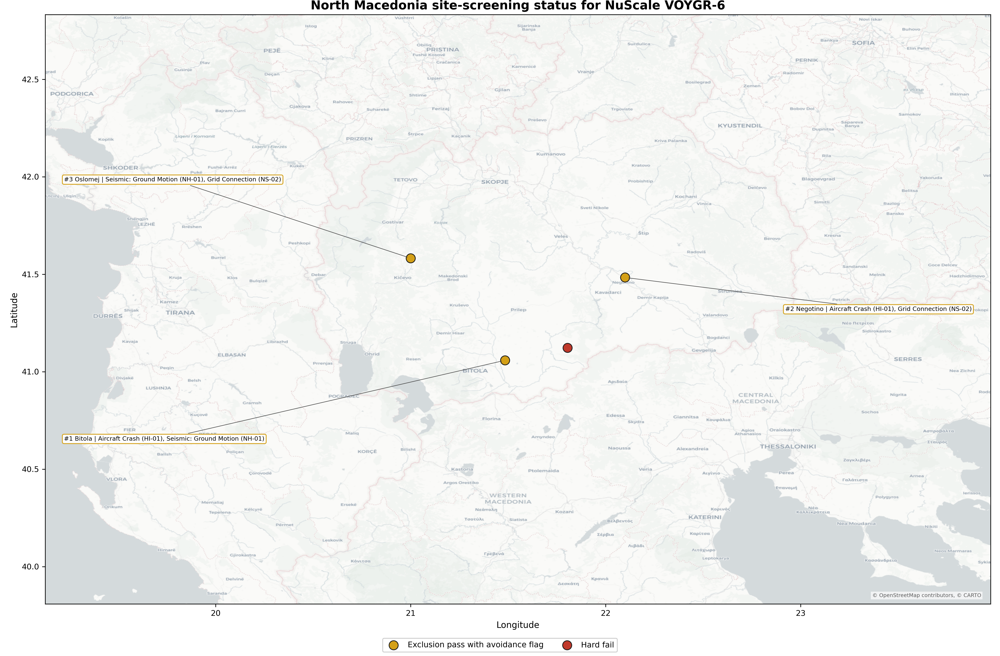
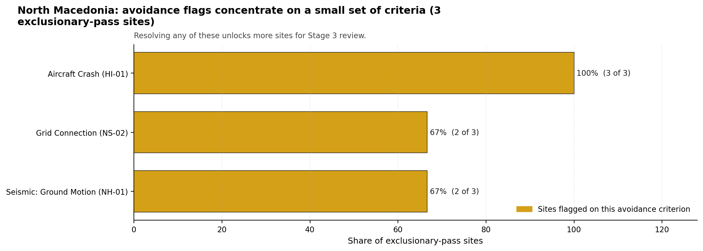

# North Macedonia Country Profile

North Macedonia has 4 thermal and coal-site records that have been tested against the NuScale VOYGR-6 reference deployment envelope. 0 sites pass both the exclusionary and avoidance screens, 3 pass the exclusionary screen but retain avoidance flags, and 1 fail one or more exclusionary checks. The country is therefore not a single-site case, but only a small subset of the national site population currently clears the full screening pathway without a remediation step.

No site clears both the exclusionary and avoidance screens, so there is no full-pass national leader. The leading exclusion-pass site is **Bitola power station**, with a composite score of 6.812 and a Monte Carlo interval of 5.927-7.329. Its national stability band is `A` with a national top-10% hit rate of 100%, so it is the leading avoidance-flag candidate and a stable national candidate under the sensitivity treatment used for the report — but it does not currently pass the avoidance screen.

<!-- specialist key=country_exec scope=country country_code=MK bundle=MK_country_bundle.json status=pending -->

<!-- /specialist key=country_exec -->

Interactive review map with marker tooltips: [MK_site_status_map.html](figures/MK_site_status_map.html).

## North Macedonia Site Ledger

| Rank | Site | Status | Composite | MC Low | MC High | Band | Top-10 Hit | Coverage |
|---:|---|---|---:|---:|---:|---|---:|---:|
| 1 | Bitola power station | Exclusion pass with avoidance flag | 6.812 | 5.927 | 7.329 | A | 100% | 74% |
| 2 | Negotino power station | Exclusion pass with avoidance flag | 6.707 | 5.846 | 7.171 | H | 0% | 74% |
| 3 | Oslomej power station | Exclusion pass with avoidance flag | 6.181 | 5.442 | 6.697 | H | 0% | 74% |
| - | Mariovo power station | Hard fail | - | - | - | - | - | 0% |

## Avoidance Flag Pareto

Of the 3 sites that pass the exclusionary screen, the avoidance-phase flags concentrate on a small set of criteria. Resolving them is what would move the country from a small leading group to a broader candidate pool.

- **Aircraft Crash (HI-01)** - 2 of 3 exclusionary-pass sites (67%).
- **Seismic: Ground Motion (NH-01)** - 2 of 3 exclusionary-pass sites (67%).
- **Grid Connection (NS-02)** - 2 of 3 exclusionary-pass sites (67%).

## Exclusionary Failure Pareto

The exclusionary failures across the country trace back to a small number of criteria. They identify which screening checks are responsible for removing sites from further consideration.

- **Ecological Sensitivity (NS-08)** - 1 of 4 country sites (25%).

## Family Strength and Weakness

Across the country the strongest criterion family is **Natural Hazards** at a mean normalised score of 7.17/10. The weakest family is **Non-Safety / Implementation** at 5.75/10. The bottom three individual criteria across the country are:

- **Evacuation Routes (EP-02)** - mean 1.50/10 across 4 scored sites (min 1.5, max 1.5).
- **Military Installations (HI-06)** - mean 2.00/10 across 4 scored sites (min 1.5, max 3.5).
- **Electromagnetic Interference (HI-07)** - mean 2.00/10 across 4 scored sites (min 1.5, max 3.5).

## Interpretation for Site Selection

The North Macedonia result shows a clear separation between sites that can support further Stage 3 consideration and sites that should remain in the evidence base only as comparators. No site clears both the exclusionary and avoidance screens, so there is no full-pass pool to draw from; the leading exclusion-pass sites with avoidance flags are the relevant pool for progression once those specific constraints are resolved.

The chart shows where focused remediation effort would broaden the candidate pool. The criteria at the top of the Pareto are the policy and engineering levers that, if resolved, move avoidance-flag sites into the leading group.

An IAEA-style reading of the table focuses less on the exact rank number and more on screening class, score stability, and the nature of remaining uncertainty. **Bitola power station** is important because it leads nationally and sits inside the strongest stability band `A` with a top-10% hit rate of 100%, even though it retains an avoidance flag rather than a full-pass status. That does not establish final site suitability. It is a defensible reason to spend Stage 3 effort on field confirmation, national data review, and stakeholder engagement on the leading avoidance-flag candidate and on resolving the criteria that currently prevent a full-pass classification before lower-ranked locations.

The Monte Carlo interval is a caution against false precision: several sites have overlapping score bands, so small score differences should not be overinterpreted. The decisive distinction is whether a site combines acceptable exclusionary performance with a stable ranking position and no unresolved avoidance flag.

The main Stage 3 questions are therefore targeted rather than generic: confirm local natural-hazard inputs, verify emergency-planning assumptions, test land and ownership constraints, assess cooling and grid interface conditions, and reconcile environmental constraints with national permitting requirements.

## Status Counts

- Full pass: 0
- Exclusion pass with avoidance flag: 3
- Hard fail: 1
