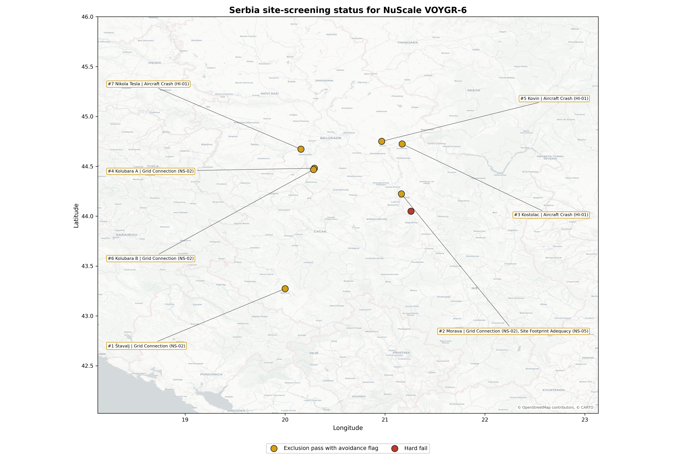
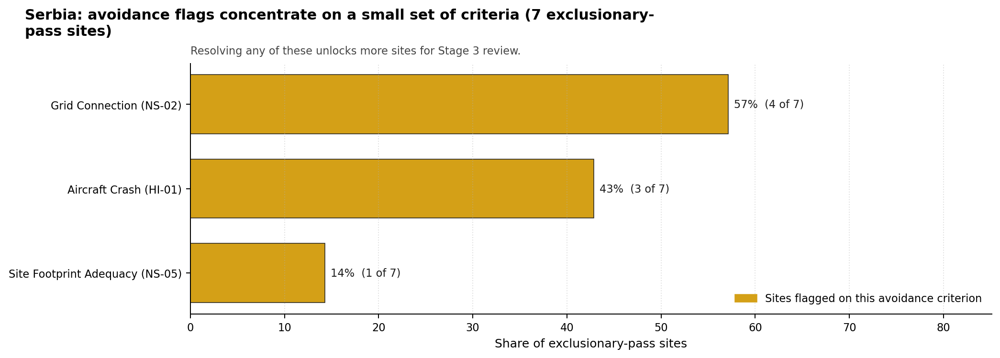
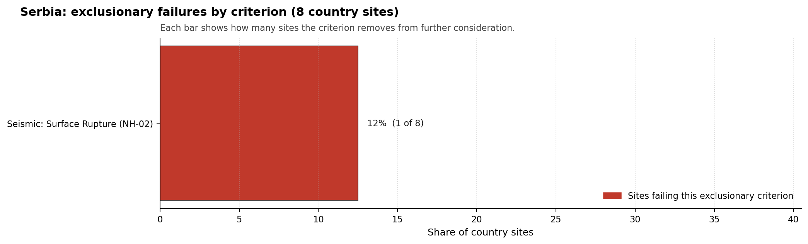

# Serbia Country Profile

Serbia has 8 thermal and coal-site records that have been tested against the NuScale VOYGR-6 reference deployment envelope. 0 sites pass both the exclusionary and avoidance screens, 7 pass the exclusionary screen but retain avoidance flags, and 1 fail one or more exclusionary checks. The country is therefore not a single-site case, but only a small subset of the national site population currently clears the full screening pathway without a remediation step.

The leading site is **Štavalj Power Station**, with a composite score of 6.753 and a Monte Carlo interval of 5.928-7.175. Its national stability band is `A` with a national top-10% hit rate of 83%. The leader is therefore not only the current point-estimate front-runner; it is also a stable national candidate under the sensitivity treatment used for the report.

<!-- specialist key=country_exec scope=country country_code=RS bundle=RS_country_bundle.json status=pending -->

<!-- /specialist key=country_exec -->

Interactive review map with marker tooltips: [RS_site_status_map.html](figures/RS_site_status_map.html).

## Serbia Site Ledger

| Rank | Site | Status | Composite | MC Low | MC High | Band | Top-10 Hit | Coverage |
|---:|---|---|---:|---:|---:|---|---:|---:|
| 1 | Štavalj Power Station | Exclusion pass with avoidance flag | 6.753 | 5.928 | 7.175 | A | 83% | 76% |
| 2 | Morava power station | Exclusion pass with avoidance flag | 6.716 | 6.003 | 7.256 | D | 8% | 76% |
| 3 | Kostolac power station | Exclusion pass with avoidance flag | 6.634 | 5.906 | 7.244 | H | 8% | 76% |
| 4 | Kolubara A power station | Exclusion pass with avoidance flag | 6.559 | 5.831 | 7.069 | H | 0% | 76% |
| 5 | Kovin power station | Exclusion pass with avoidance flag | 6.503 | 5.831 | 7.094 | H | 0% | 76% |
| 6 | Kolubara B power station | Exclusion pass with avoidance flag | 6.472 | 5.744 | 6.981 | H | 0% | 76% |
| 7 | Nikola Tesla power station | Exclusion pass with avoidance flag | 6.453 | 5.694 | 6.994 | H | 0% | 76% |
| - | Despotovac power station | Hard fail | - | - | - | - | - | 0% |

## Avoidance Flag Pareto

Of the 7 sites that pass the exclusionary screen, the avoidance-phase flags concentrate on a small set of criteria. Resolving them is what would move the country from a small leading group to a broader candidate pool.

- **Grid Connection (NS-02)** - 4 of 7 exclusionary-pass sites (57%).
- **Aircraft Crash (HI-01)** - 3 of 7 exclusionary-pass sites (43%).
- **Site Footprint Adequacy (NS-05)** - 1 of 7 exclusionary-pass sites (14%).

## Exclusionary Failure Pareto

The exclusionary failures across the country trace back to a small number of criteria. They identify which screening checks are responsible for removing sites from further consideration.

- **Seismic: Surface Rupture (NH-02)** - 1 of 8 country sites (12%).

## Family Strength and Weakness

Across the country the strongest criterion family is **Natural Hazards** at a mean normalised score of 7.10/10. The weakest family is **Radiological Impact** at 5.53/10. The bottom three individual criteria across the country are:

- **Military Installations (HI-06)** - mean 1.25/10 across 8 scored sites (min 0.0, max 3.5).
- **Electromagnetic Interference (HI-07)** - mean 1.75/10 across 8 scored sites (min 1.5, max 3.5).
- **Grid Connection (NS-02)** - mean 3.25/10 across 8 scored sites (min 1.5, max 7.5).

## Interpretation for Site Selection

The Serbia result shows a clear separation between sites that can support further Stage 3 consideration and sites that should remain in the evidence base only as comparators. No Serbian site currently clears both the exclusionary and avoidance screens, so the leading exclusion-pass group with the most stable rankings is the relevant pool for progression. Avoidance-flag sites are not discarded, but they identify locations where a specific constraint must be resolved before the site can be treated as equivalent to a clean-pass leader.

The chart shows where focused remediation effort would broaden the candidate pool. The criteria at the top of the Pareto are the policy and engineering levers that, if resolved, move avoidance-flag sites into the leading group.

An IAEA-style reading of the table focuses less on the exact rank number and more on screening class, score stability, and the nature of remaining uncertainty. **Štavalj Power Station** is important because it leads nationally and sits inside the strongest stability band; no Serbian site is currently a full-pass candidate, so it remains an exclusion-pass-with-avoidance-flag leader rather than a clean-pass front-runner. That does not establish final site suitability. It is a defensible reason to spend Stage 3 effort on field confirmation, national data review, and stakeholder engagement before lower-ranked or otherwise avoidance-flagged locations.

The Monte Carlo interval is a caution against false precision: several sites have overlapping score bands, so small score differences should not be overinterpreted. The decisive distinction is whether a site combines acceptable exclusionary performance with a stable ranking position and no unresolved avoidance flag.

The main Stage 3 questions are therefore targeted rather than generic: confirm local natural-hazard inputs, verify emergency-planning assumptions, test land and ownership constraints, assess cooling and grid interface conditions, and reconcile environmental constraints with national permitting requirements.

## Status Counts

- Full pass: 0
- Exclusion pass with avoidance flag: 7
- Hard fail: 1
