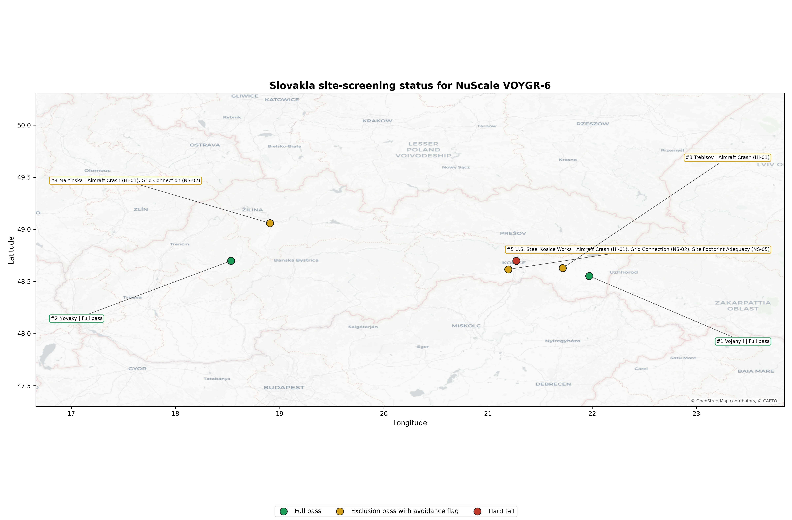
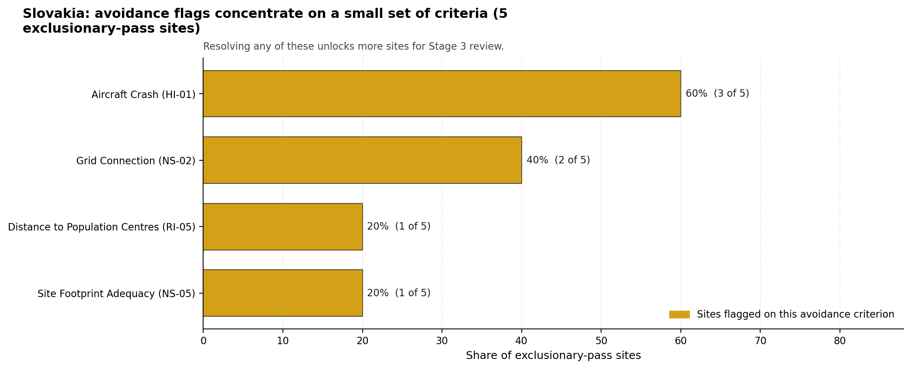
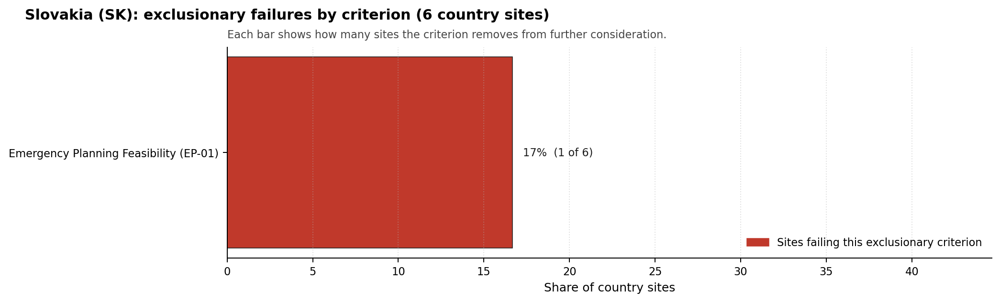

# Slovakia Country Profile

Slovakia has 6 thermal and coal-site records that have been tested against the NuScale VOYGR-6 reference deployment envelope. 2 sites pass both the exclusionary and avoidance screens, 3 pass the exclusionary screen but retain avoidance flags, and 1 fail one or more exclusionary checks. The country is therefore not a single-site case, but only a small subset of the national site population currently clears the full screening pathway without a remediation step.

The country has two full-pass candidates that share national leadership. **Vojany I power station** is the point-estimate front-runner with a composite score of 7.022 and a Monte Carlo interval of 6.250-7.481, sitting in national stability band `A` with a top-10% hit rate of 100%. **Novaky power station** is the co-leader in the full-pass pool with a composite score of 6.978 and a Monte Carlo interval of 6.215-7.500, in national stability band `H` with a top-10% hit rate of 0%. Both clear the exclusionary and avoidance screens; Vojany I is the more stable of the two under the sensitivity treatment used for the report, while Novaky's lower band reflects a less stable position despite a comparable point-estimate composite.

<!-- specialist key=country_exec scope=country country_code=SK bundle=SK_country_bundle.json status=pending -->

<!-- /specialist key=country_exec -->

Interactive review map with marker tooltips: [SK_site_status_map.html](figures/SK_site_status_map.html).

## Slovakia Site Ledger

| Rank | Site | Status | Composite | MC Low | MC High | Band | Top-10 Hit | Coverage |
|---:|---|---|---:|---:|---:|---|---:|---:|
| 1 | Vojany I power station | Full pass | 7.022 | 6.250 | 7.481 | A | 100% | 76% |
| 2 | Novaky power station | Full pass | 6.978 | 6.215 | 7.500 | H | 0% | 76% |
| 3 | Trebisov power station | Exclusion pass with avoidance flag | 6.741 | 6.023 | 7.281 | H | 0% | 76% |
| 4 | Martinska power station | Exclusion pass with avoidance flag | 6.303 | 5.669 | 6.775 | H | 0% | 76% |
| 5 | U.S. Steel Kosice Works power station | Exclusion pass with avoidance flag | 5.691 | 5.174 | 6.181 | H | 0% | 76% |
| - | Kosice power station | Hard fail | - | - | - | - | - | 0% |

## Avoidance Flag Pareto

Of the 5 sites that pass the exclusionary screen, the avoidance-phase flags concentrate on a small set of criteria. Resolving them is what would move the country from a small leading group to a broader candidate pool.

- **Aircraft Crash (HI-01)** - 3 of 5 exclusionary-pass sites (60%).
- **Grid Connection (NS-02)** - 2 of 5 exclusionary-pass sites (40%).
- **Site Footprint Adequacy (NS-05)** - 1 of 5 exclusionary-pass sites (20%).
- **Distance to Population Centres (RI-05)** - 1 of 5 exclusionary-pass sites (20%).

## Exclusionary Failure Pareto

The exclusionary failures across the country trace back to a small number of criteria. They identify which screening checks are responsible for removing sites from further consideration.

- **Emergency Planning Feasibility (EP-01)** - 1 of 6 country sites (17%).

## Family Strength and Weakness

Across the country the strongest criterion family is **Non-Safety / Implementation** at a mean normalised score of 7.04/10. The weakest family is **Emergency Planning** at 5.22/10. The bottom three individual criteria across the country are:

- **Military Installations (HI-06)** - mean 0.25/10 across 6 scored sites (min 0.0, max 1.5).
- **Electromagnetic Interference (HI-07)** - mean 1.50/10 across 6 scored sites (min 1.5, max 1.5).
- **Ecological Sensitivity (NS-08)** - mean 2.17/10 across 6 scored sites (min 1.5, max 3.5).

## Interpretation for Site Selection

The Slovakia result shows a clear separation between sites that can support further Stage 3 consideration and sites that should remain in the evidence base only as comparators. The full-pass group is the relevant pool for progression. Avoidance-flag sites are not discarded, but they identify locations where a specific constraint must be resolved before the site can be treated as equivalent to the leading group.

The chart shows where focused remediation effort would broaden the candidate pool. The criteria at the top of the Pareto are the policy and engineering levers that, if resolved, move avoidance-flag sites into the leading group.

An IAEA-style reading of the table focuses less on the exact rank number and more on screening class, score stability, and the nature of remaining uncertainty. **Vojany I power station** and **Novaky power station** are important because they are the country's two full-pass candidates: Vojany I leads nationally, sits inside the strongest stability band, and retains a full-pass status, while Novaky also clears both screening gates with a comparable point-estimate composite though in a lower stability band. That does not establish final site suitability for either site. It is a defensible reason to spend Stage 3 effort on field confirmation, national data review, and stakeholder engagement on the two-site full-pass leadership pool before lower-ranked or avoidance-flag locations.

The Monte Carlo interval is a caution against false precision: several sites have overlapping score bands, so small score differences should not be overinterpreted. The decisive distinction is whether a site combines acceptable exclusionary performance with a stable ranking position and no unresolved avoidance flag.

The main Stage 3 questions are therefore targeted rather than generic: confirm local natural-hazard inputs, verify emergency-planning assumptions, test land and ownership constraints, assess cooling and grid interface conditions, and reconcile environmental constraints with national permitting requirements.

## Status Counts

- Full pass: 2
- Exclusion pass with avoidance flag: 3
- Hard fail: 1
