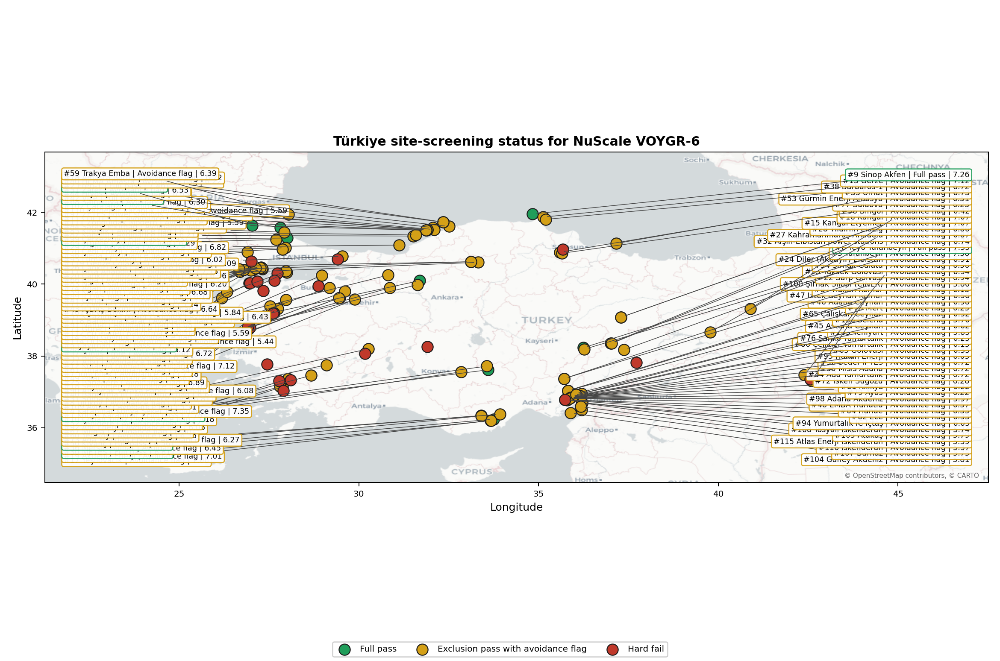
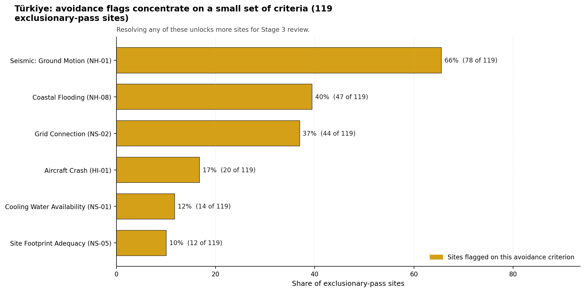
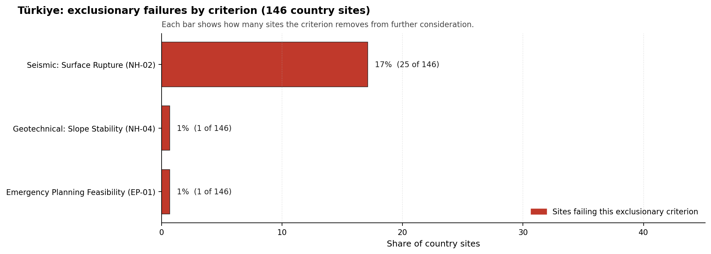

# Türkiye Country Profile

Analytical basis: scoring `score-c2a90942` and sensitivity `nat-sens-b1a62885`.

Türkiye has 146 thermal and coal-site records that have been tested against the NuScale VOYGR-6 reference deployment envelope. 9 sites pass both the exclusionary and avoidance screens, 110 pass the exclusionary screen but retain avoidance flags, and 27 fail one or more exclusionary checks. The country is therefore not a single-site case, but only a small subset of the national site population currently clears the full screening pathway without a remediation step.

The leading site is **Konya Karapınar power station**, with a composite score of 7.784 and a Monte Carlo interval of 6.528-8.301. Its national stability band is `A` with a national top-10% hit rate of 100%. The leader is therefore not only the current point-estimate front-runner; it is also a stable national candidate under the sensitivity treatment used for the report.

<!-- specialist key=country_exec scope=country country_code=TR bundle=TR_country_bundle.json status=pending -->
> _Specialist interpretation pending: Country coal-to-nuclear executive read (full-pass leadership pool, avoidance unlock potential, greenfield lever, and credible programme cadence). Cursor agent fills via `python -m scripts.run_specialist_pass show --country TR --key country_exec` then `... patch --country TR --key country_exec --text-file <draft.md>`._
<!-- /specialist key=country_exec -->

Interactive review map with marker tooltips: [TR_site_status_map.html](figures/TR_site_status_map.html).

## Türkiye Site Ledger

| Rank | Site | Status | Composite | MC Low | MC High | Band | Top-10 Hit | Coverage |
|---:|---|---|---:|---:|---:|---|---:|---:|
| 1 | Konya Karapınar power station | Full pass | 7.784 | 6.528 | 8.301 | A | 100% | 71% |
| 2 | Eren-1 power station | Full pass | 7.459 | 6.604 | 7.900 | A | 100% | 76% |
| 3 | Tufanbeyli power station | Exclusion pass with avoidance flag | 7.380 | 6.407 | 7.890 | A | 100% | 74% |
| 4 | Karapinar Konya Şeker power station | Exclusion pass with avoidance flag | 7.354 | 6.386 | 7.864 | A | 100% | 74% |
| 5 | Çayırhan power station | Full pass | 7.347 | 6.513 | 7.806 | B | 100% | 76% |
| 6 | Teyo Tufanbeyli power station | Full pass | 7.328 | 6.366 | 7.838 | B | 92% | 74% |
| 7 | Tunçbilek power station | Exclusion pass with avoidance flag | 7.276 | 6.326 | 7.818 | B | 100% | 74% |
| 8 | Uluköy power station | Exclusion pass with avoidance flag | 7.263 | 6.316 | 7.701 | B | 100% | 74% |
| 9 | Sinop Akfen power station | Full pass | 7.260 | 6.270 | 7.724 | B | 100% | 74% |
| 10 | Çoban Yıldız power station | Exclusion pass with avoidance flag | 7.185 | 6.255 | 7.675 | B | 92% | 74% |
| 11 | Orta Anadolu power station | Exclusion pass with avoidance flag | 7.154 | 6.063 | 7.692 | C | 67% | 71% |
| 12 | Kütahya Domaniç power station | Exclusion pass with avoidance flag | 7.121 | 6.101 | 7.557 | D | 0% | 71% |
| 13 | Gerze power station | Exclusion pass with avoidance flag | 7.116 | 6.326 | 7.587 | D | 17% | 76% |
| 14 | Bolu Göynük power station | Exclusion pass with avoidance flag | 7.107 | 6.194 | 7.565 | D | 8% | 74% |
| 15 | Kangal Etyemez power station | Exclusion pass with avoidance flag | 7.072 | 6.290 | 7.550 | D | 0% | 76% |
| 16 | Kangal power station | Exclusion pass with avoidance flag | 7.072 | 6.290 | 7.550 | D | 8% | 76% |
| 17 | Yeşilovacık power station | Exclusion pass with avoidance flag | 7.059 | 6.280 | 7.569 | D | 8% | 76% |
| 18 | Seyitömer power station | Exclusion pass with avoidance flag | 7.022 | 6.250 | 7.562 | D | 0% | 76% |
| 19 | Akdeniz Enerji power station | Exclusion pass with avoidance flag | 7.009 | 6.240 | 7.519 | D | 0% | 76% |
| 20 | Çankırı Yıldızlar power station | Exclusion pass with avoidance flag | 6.957 | 6.038 | 7.441 | D | 0% | 74% |
| 21 | Alpu power station | Exclusion pass with avoidance flag | 6.947 | 6.189 | 7.437 | D | 8% | 76% |
| 22 | Sarp Golvasi power station | Exclusion pass with avoidance flag | 6.938 | 6.063 | 7.448 | D | 0% | 74% |
| 23 | Yüksek Gölovası power station | Exclusion pass with avoidance flag | 6.938 | 6.063 | 7.448 | D | 0% | 74% |
| 24 | Diler (Akbayir) Elbistan power station | Exclusion pass with avoidance flag | 6.908 | 5.881 | 7.370 | D | 0% | 71% |
| 25 | Babadere power station | Exclusion pass with avoidance flag | 6.891 | 5.987 | 7.355 | D | 0% | 74% |
| 26 | Çankırı Orta power station | Exclusion pass with avoidance flag | 6.880 | 5.861 | 7.418 | D | 0% | 71% |
| 27 | Kahramanmaraş Anadolu power station | Exclusion pass with avoidance flag | 6.872 | 5.972 | 7.368 | D | 0% | 74% |
| 28 | Yıldırım Elazığ power station | Exclusion pass with avoidance flag | 6.862 | 6.121 | 7.394 | D | 0% | 76% |
| 29 | Zorlu Akçakoca power station | Exclusion pass with avoidance flag | 6.815 | 5.967 | 7.253 | D | 0% | 74% |
| 30 | METES power station | Full pass | 6.809 | 6.078 | 7.319 | D | 0% | 76% |
| 31 | Soma Kolin power station | Exclusion pass with avoidance flag | 6.809 | 6.078 | 7.269 | D | 0% | 76% |
| 32 | Afşin-Elbistan power stations | Exclusion pass with avoidance flag | 6.740 | 5.871 | 7.237 | D | 0% | 74% |
| 33 | Umut power station | Exclusion pass with avoidance flag | 6.734 | 5.987 | 7.175 | E | 0% | 76% |
| 34 | Ada Yumurtalık power station | Exclusion pass with avoidance flag | 6.722 | 5.994 | 7.181 | E | 0% | 76% |
| 35 | Misis Adana power station | Exclusion pass with avoidance flag | 6.722 | 5.994 | 7.181 | E | 0% | 76% |
| 36 | Sedef II TES power station | Exclusion pass with avoidance flag | 6.722 | 5.994 | 7.181 | F | 0% | 76% |
| 37 | Yunus Emre power station | Exclusion pass with avoidance flag | 6.720 | 5.856 | 7.257 | D | 0% | 74% |
| 38 | Barbaros-1 power station | Exclusion pass with avoidance flag | 6.719 | 6.005 | 7.125 | G | 0% | 76% |
| 39 | Karaburun power station | Exclusion pass with avoidance flag | 6.681 | 5.826 | 7.217 | H | 0% | 74% |
| 40 | Bandırma III power station | Exclusion pass with avoidance flag | 6.672 | 5.967 | 7.181 | H | 0% | 76% |
| 41 | Cenal power station | Exclusion pass with avoidance flag | 6.668 | 5.816 | 7.151 | H | 0% | 74% |
| 42 | Vize power station | Full pass | 6.653 | 5.952 | 7.144 | H | 0% | 76% |
| 43 | İÇDAŞ Bekirli power station | Exclusion pass with avoidance flag | 6.641 | 5.931 | 7.081 | H | 0% | 76% |
| 44 | Filyos power station | Exclusion pass with avoidance flag | 6.628 | 5.900 | 7.050 | H | 0% | 76% |
| 45 | Astoria Ceyhan power station | Exclusion pass with avoidance flag | 6.622 | 5.894 | 7.081 | H | 0% | 76% |
| 46 | Adana Ceyhan power station | Exclusion pass with avoidance flag | 6.584 | 5.856 | 7.044 | H | 0% | 76% |
| 47 | Iztek Ceyhan Komur power station | Exclusion pass with avoidance flag | 6.584 | 5.856 | 7.044 | H | 0% | 76% |
| 48 | EMBA Hunutlu power station | Exclusion pass with avoidance flag | 6.572 | 5.844 | 7.031 | H | 0% | 76% |
| 49 | Polat power station | Exclusion pass with avoidance flag | 6.562 | 5.770 | 7.000 | H | 0% | 74% |
| 50 | Kıvanç power station | Full pass | 6.556 | 5.730 | 7.122 | H | 0% | 74% |
| 51 | Zafer power station | Exclusion pass with avoidance flag | 6.534 | 5.787 | 6.975 | H | 0% | 76% |
| 52 | Yenidere power station | Exclusion pass with avoidance flag | 6.523 | 5.705 | 7.007 | H | 0% | 74% |
| 53 | Gürmin Enerji Amasya power station | Exclusion pass with avoidance flag | 6.509 | 5.812 | 6.950 | H | 0% | 76% |
| 54 | Şırnak Galata power station | Exclusion pass with avoidance flag | 6.503 | 5.794 | 6.944 | H | 0% | 76% |
| 55 | Bursa power station | Exclusion pass with avoidance flag | 6.470 | 5.664 | 6.934 | H | 0% | 74% |
| 56 | Mersin Gülnar power station | Exclusion pass with avoidance flag | 6.451 | 5.649 | 7.016 | H | 0% | 74% |
| 57 | Kirazlıdere power complex | Exclusion pass with avoidance flag | 6.431 | 5.737 | 6.856 | H | 0% | 76% |
| 58 | Bingöl power station | Exclusion pass with avoidance flag | 6.421 | 5.626 | 6.908 | H | 0% | 74% |
| 59 | Trakya Emba power station | Exclusion pass with avoidance flag | 6.391 | 5.662 | 6.812 | H | 0% | 76% |
| 60 | Yeniköy power station | Exclusion pass with avoidance flag | 6.355 | 5.576 | 6.842 | H | 0% | 74% |
| 61 | Irmak power station | Exclusion pass with avoidance flag | 6.344 | 5.681 | 6.862 | H | 0% | 76% |
| 62 | Ece power station | Exclusion pass with avoidance flag | 6.328 | 5.619 | 6.769 | H | 0% | 76% |
| 63 | Gölovası power station | Exclusion pass with avoidance flag | 6.328 | 5.619 | 6.769 | H | 0% | 76% |
| 64 | Hande power station | Exclusion pass with avoidance flag | 6.328 | 5.619 | 6.769 | H | 0% | 76% |
| 65 | Çalışkan Ceyhan power station | Exclusion pass with avoidance flag | 6.322 | 5.594 | 6.781 | H | 0% | 76% |
| 66 | Biga power station | Exclusion pass with avoidance flag | 6.306 | 5.538 | 6.770 | H | 0% | 74% |
| 67 | Muğla power station | Exclusion pass with avoidance flag | 6.299 | 5.533 | 6.763 | H | 0% | 74% |
| 68 | Saltukova power station | Exclusion pass with avoidance flag | 6.299 | 5.533 | 6.816 | H | 0% | 74% |
| 69 | Ergene power station | Exclusion pass with avoidance flag | 6.291 | 5.631 | 6.731 | H | 0% | 76% |
| 70 | Çebi Enerji power station | Exclusion pass with avoidance flag | 6.278 | 5.619 | 6.769 | H | 0% | 76% |
| 71 | Güreci power station | Exclusion pass with avoidance flag | 6.278 | 5.550 | 6.700 | H | 0% | 76% |
| 72 | İsken Sugözü power station | Exclusion pass with avoidance flag | 6.278 | 5.569 | 6.719 | H | 0% | 76% |
| 73 | Ada Yesildag Enerji power station | Exclusion pass with avoidance flag | 6.266 | 5.606 | 6.756 | H | 0% | 76% |
| 74 | Ağan power station | Exclusion pass with avoidance flag | 6.253 | 5.497 | 6.770 | H | 0% | 74% |
| 75 | Mert power station | Exclusion pass with avoidance flag | 6.253 | 5.525 | 6.675 | H | 0% | 76% |
| 76 | Sanko Yumurtalık power station | Exclusion pass with avoidance flag | 6.234 | 5.506 | 6.694 | H | 0% | 76% |
| 77 | Suluova power station | Exclusion pass with avoidance flag | 6.234 | 5.537 | 6.675 | H | 0% | 76% |
| 78 | Amasra Bartın power station | Exclusion pass with avoidance flag | 6.216 | 5.537 | 6.687 | H | 0% | 76% |
| 79 | Ayas power station | Exclusion pass with avoidance flag | 6.216 | 5.506 | 6.656 | H | 0% | 76% |
| 80 | HEMA Amasra power station | Exclusion pass with avoidance flag | 6.216 | 5.537 | 6.687 | H | 0% | 76% |
| 81 | Kilikya power station | Exclusion pass with avoidance flag | 6.216 | 5.506 | 6.656 | H | 0% | 76% |
| 82 | Kandilli power station | Exclusion pass with avoidance flag | 6.209 | 5.512 | 6.700 | H | 0% | 76% |
| 83 | Naren Karabiga power station | Exclusion pass with avoidance flag | 6.201 | 5.457 | 6.717 | H | 0% | 74% |
| 84 | Saray Tekirdağ power station | Exclusion pass with avoidance flag | 6.166 | 5.506 | 6.656 | H | 0% | 76% |
| 85 | Kireçlik power station | Exclusion pass with avoidance flag | 6.153 | 5.425 | 6.575 | H | 0% | 76% |
| 86 | Çelikler Yumurtalık power station | Exclusion pass with avoidance flag | 6.148 | 5.417 | 6.612 | H | 0% | 74% |
| 87 | Hakan Kömür power station | Exclusion pass with avoidance flag | 6.134 | 5.406 | 6.594 | H | 0% | 76% |
| 88 | Çan-2 power station | Exclusion pass with avoidance flag | 6.122 | 5.444 | 6.631 | H | 0% | 76% |
| 89 | İÇDAŞ Biga power station | Exclusion pass with avoidance flag | 6.122 | 5.396 | 6.586 | H | 0% | 74% |
| 90 | Albayrak Varaka Paper power station | Exclusion pass with avoidance flag | 6.084 | 5.437 | 6.575 | H | 0% | 76% |
| 91 | Namal power station | Exclusion pass with avoidance flag | 6.082 | 5.366 | 6.526 | H | 0% | 74% |
| 92 | Ant Enerji power station | Exclusion pass with avoidance flag | 6.062 | 5.349 | 6.546 | H | 0% | 74% |
| 93 | Hakan Enerji power station | Exclusion pass with avoidance flag | 6.053 | 5.344 | 6.494 | H | 0% | 76% |
| 94 | Yumurtalık IC İçtaş power station | Exclusion pass with avoidance flag | 6.028 | 5.319 | 6.469 | H | 0% | 76% |
| 95 | Lüminer Enerji power station | Exclusion pass with avoidance flag | 6.016 | 5.259 | 6.503 | H | 0% | 76% |
| 96 | Meda power station | Exclusion pass with avoidance flag | 6.016 | 5.356 | 6.506 | H | 0% | 76% |
| 97 | ZETES power stations | Exclusion pass with avoidance flag | 5.971 | 5.286 | 6.442 | H | 0% | 74% |
| 98 | Adana Akdeniz power station | Exclusion pass with avoidance flag | 5.966 | 5.256 | 6.406 | H | 0% | 76% |
| 99 | Çerkezköy power station | Full pass | 5.928 | 5.319 | 6.469 | H | 0% | 76% |
| 100 | Şırnak Silopi (CİNER) power station | Exclusion pass with avoidance flag | 5.859 | 5.194 | 6.355 | H | 0% | 74% |
| 101 | Şevketiye Lapseki power station | Exclusion pass with avoidance flag | 5.845 | 5.132 | 6.289 | H | 0% | 74% |
| 102 | Çatalağzı power station | Exclusion pass with avoidance flag | 5.841 | 5.156 | 6.312 | H | 0% | 74% |
| 103 | Yeniyurt power station | Exclusion pass with avoidance flag | 5.834 | 5.087 | 6.275 | H | 0% | 76% |
| 104 | Güney Akdeniz power station | Exclusion pass with avoidance flag | 5.812 | 5.169 | 6.312 | H | 0% | 76% |
| 105 | Atakaş power station | Exclusion pass with avoidance flag | 5.791 | 5.131 | 6.281 | H | 0% | 76% |
| 106 | Selena power station | Exclusion pass with avoidance flag | 5.756 | 5.062 | 6.181 | H | 0% | 76% |
| 107 | Burnaz power station | Exclusion pass with avoidance flag | 5.747 | 5.119 | 6.256 | H | 0% | 76% |
| 108 | Tosyalı İskenderun power station | Exclusion pass with avoidance flag | 5.741 | 5.131 | 6.281 | H | 0% | 76% |
| 109 | Avdan power station | Exclusion pass with avoidance flag | 5.706 | 5.012 | 6.131 | H | 0% | 76% |
| 110 | Kardemir Karabük Demir Çelik power station | Exclusion pass with avoidance flag | 5.594 | 4.909 | 6.065 | H | 0% | 74% |
| 111 | Zonguldak Modern power station | Exclusion pass with avoidance flag | 5.594 | 4.909 | 6.065 | H | 0% | 74% |
| 112 | Eti Maden Bandirma power station | Exclusion pass with avoidance flag | 5.591 | 4.931 | 6.131 | H | 0% | 76% |
| 113 | DETES 1 power station | Exclusion pass with avoidance flag | 5.464 | 4.831 | 5.987 | H | 0% | 74% |
| 114 | DOSAB cogeneration plant | Exclusion pass with avoidance flag | 5.444 | 4.800 | 5.919 | H | 0% | 76% |
| 115 | Atlas Enerji İskenderun power station | Exclusion pass with avoidance flag | 5.394 | 4.800 | 5.919 | H | 0% | 76% |
| 116 | İskenderun power station | Exclusion pass with avoidance flag | 5.369 | 4.775 | 5.894 | H | 0% | 76% |
| 117 | Evrese power station | Exclusion pass with avoidance flag | 5.237 | 4.556 | 5.612 | H | 0% | 76% |
| 118 | Bandırma Karat power station | Exclusion pass with avoidance flag | 5.200 | 4.528 | 5.656 | H | 0% | 76% |
| 119 | Gebze Çolakoğlu power station | Exclusion pass with avoidance flag | 5.087 | 4.512 | 5.544 | H | 0% | 76% |
| - | Aksa Akrilik power station | Hard fail | - | - | - | - | - | 0% |
| - | Aliağa Enka power station | Hard fail | - | - | - | - | - | 0% |
| - | Bandırma Elektrik power station | Hard fail | - | - | - | - | - | 0% |
| - | Çan (18 Mart) power station | Hard fail | - | - | - | - | - | 0% |
| - | Çırpılar power station | Hard fail | - | - | - | - | - | 0% |
| - | Demirtaş power station | Hard fail | - | - | - | - | - | 0% |
| - | Deniz power station | Hard fail | - | - | - | - | - | 0% |
| - | Dinar power station | Hard fail | - | - | - | - | - | 0% |
| - | Enyat Samsun power station | Hard fail | - | - | - | - | - | 0% |
| - | Gönen power station | Hard fail | - | - | - | - | - | 0% |
| - | Güneybatı Anadolu power station | Hard fail | - | - | - | - | - | 0% |
| - | Habaş power station | Hard fail | - | - | - | - | - | 0% |
| - | Helvacı power station | Hard fail | - | - | - | - | - | 0% |
| - | Ilgın power station | Hard fail | - | - | - | - | - | 0% |
| - | İzdemir Enerji power station | Hard fail | - | - | - | - | - | 0% |
| - | Kemerköy power station | Hard fail | - | - | - | - | - | 0% |
| - | Kipas MMP power station | Hard fail | - | - | - | - | - | 0% |
| - | Kınık power station | Hard fail | - | - | - | - | - | 0% |
| - | Orhaneli power station | Hard fail | - | - | - | - | - | 0% |
| - | Petkim power station | Hard fail | - | - | - | - | - | 0% |
| - | Sanko Gölbaşı power station | Hard fail | - | - | - | - | - | 0% |
| - | Silopi (Şırnak) power station | Hard fail | - | - | - | - | - | 0% |
| - | Soma power station | Hard fail | - | - | - | - | - | 0% |
| - | Star Refinery Socar power station | Hard fail | - | - | - | - | - | 0% |
| - | Tekirdağ Malkara power station | Hard fail | - | - | - | - | - | 0% |
| - | Yatağan power station | Hard fail | - | - | - | - | - | 0% |
| - | Zorlu Soma power station | Hard fail | - | - | - | - | - | 0% |

## Avoidance Flag Pareto

Of the 119 sites that pass the exclusionary screen, the avoidance-phase flags concentrate on a small set of criteria. Resolving them is what would move the country from a small leading group to a broader candidate pool.

- **Seismic: Ground Motion (NH-01)** - 78 of 119 exclusionary-pass sites (66%).
- **Coastal Flooding (NH-08)** - 47 of 119 exclusionary-pass sites (40%).
- **Grid Connection (NS-02)** - 44 of 119 exclusionary-pass sites (37%).
- **Aircraft Crash (HI-01)** - 20 of 119 exclusionary-pass sites (17%).
- **Cooling Water Availability (NS-01)** - 14 of 119 exclusionary-pass sites (12%).
- **Site Footprint Adequacy (NS-05)** - 12 of 119 exclusionary-pass sites (10%).

## Exclusionary Failure Pareto

The exclusionary failures across the country trace back to a small number of criteria. They identify which screening checks are responsible for removing sites from further consideration.

- **Seismic: Surface Rupture (NH-02)** - 25 of 146 country sites (17%).
- **Emergency Planning Feasibility (EP-01)** - 1 of 146 country sites (1%).
- **Geotechnical: Slope Stability (NH-04)** - 1 of 146 country sites (1%).

## Family Strength and Weakness

Across the country the strongest criterion family is **Human-Induced Hazards** at a mean normalised score of 7.79/10. The weakest family is **Radiological Impact** at 5.39/10. The bottom three individual criteria across the country are:

- **Military Installations (HI-06)** - mean 2.44/10 across 146 scored sites (min 0.0, max 5.0).
- **Surface Water Dispersion (RI-02)** - mean 2.62/10 across 146 scored sites (min 1.5, max 7.5).
- **Electromagnetic Interference (HI-07)** - mean 3.29/10 across 146 scored sites (min 1.5, max 9.5).

## Interpretation for Site Selection

The Türkiye result shows a clear separation between sites that can support further Stage 3 consideration and sites that should remain in the evidence base only as comparators. The full-pass group is the relevant pool for progression. Avoidance-flag sites are not discarded, but they identify locations where a specific constraint must be resolved before the site can be treated as equivalent to the leading group.

The chart shows where focused remediation effort would broaden the candidate pool. The criteria at the top of the Pareto are the policy and engineering levers that, if resolved, move avoidance-flag sites into the leading group.

An IAEA-style reading of the table focuses less on the exact rank number and more on screening class, score stability, and the nature of remaining uncertainty. **Konya Karapınar power station** is important because it leads nationally, sits inside the strongest stability band, and retains a full-pass status. That does not establish final site suitability. It is a defensible reason to spend Stage 3 effort on field confirmation, national data review, and stakeholder engagement before lower-ranked or avoidance-flag locations.

The Monte Carlo interval is a caution against false precision: several sites have overlapping score bands, so small score differences should not be overinterpreted. The decisive distinction is whether a site combines acceptable exclusionary performance with a stable ranking position and no unresolved avoidance flag.

The main Stage 3 questions are therefore targeted rather than generic: confirm local natural-hazard inputs, verify emergency-planning assumptions, test land and ownership constraints, assess cooling and grid interface conditions, and reconcile environmental constraints with national permitting requirements.

## Status Counts

- Full pass: 9
- Exclusion pass with avoidance flag: 110
- Hard fail: 27
