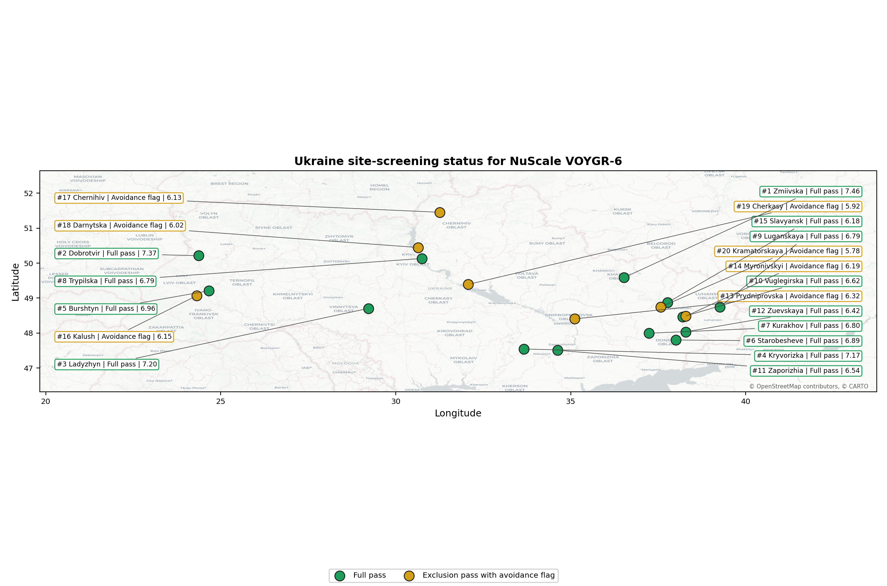
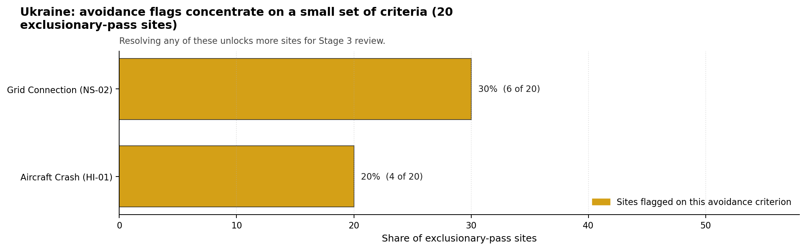

# Ukraine Country Profile

Analytical basis: scoring `score-c2a90942` and sensitivity `nat-sens-b1a62885`.

Ukraine has 20 thermal and coal-site records that have been tested against the NuScale VOYGR-6 reference deployment envelope. 13 sites pass both the exclusionary and avoidance screens, 7 pass the exclusionary screen but retain avoidance flags, and 0 fail one or more exclusionary checks. The country is therefore not a single-site case, but only a small subset of the national site population currently clears the full screening pathway without a remediation step.

The leading site is **Zmiivska power station**, with a composite score of 7.455 and a Monte Carlo interval of 6.263-7.945. Its national stability band is `A` with a national top-10% hit rate of 92%. The leader is therefore not only the current point-estimate front-runner; it is also a stable national candidate under the sensitivity treatment used for the report.

<!-- specialist key=country_exec scope=country country_code=UA bundle=UA_country_bundle.json status=pending -->
> _Specialist interpretation pending: Country coal-to-nuclear executive read (full-pass leadership pool, avoidance unlock potential, greenfield lever, and credible programme cadence). Cursor agent fills via `python -m scripts.run_specialist_pass show --country UA --key country_exec` then `... patch --country UA --key country_exec --text-file <draft.md>`._
<!-- /specialist key=country_exec -->

Interactive review map with marker tooltips: [UA_site_status_map.html](figures/UA_site_status_map.html).

## Ukraine Site Ledger

| Rank | Site | Status | Composite | MC Low | MC High | Band | Top-10 Hit | Coverage |
|---:|---|---|---:|---:|---:|---|---:|---:|
| 1 | Zmiivska power station | Full pass | 7.455 | 6.263 | 7.945 | A | 92% | 71% |
| 2 | Dobrotvir power station | Full pass | 7.372 | 6.533 | 8.006 | B | 100% | 76% |
| 3 | Ladyzhyn power station | Full pass | 7.197 | 6.391 | 7.706 | D | 8% | 76% |
| 4 | Kryvorizka power station | Full pass | 7.166 | 6.051 | 7.655 | D | 0% | 71% |
| 5 | Burshtyn power station | Full pass | 6.959 | 6.199 | 7.450 | D | 0% | 76% |
| 6 | Starobesheve power station | Full pass | 6.887 | 5.965 | 7.377 | D | 0% | 74% |
| 7 | Kurakhov power station | Full pass | 6.797 | 5.742 | 7.315 | H | 0% | 71% |
| 8 | Trypilska power station | Full pass | 6.795 | 5.894 | 7.364 | H | 0% | 74% |
| 9 | Luganskaya power station | Full pass | 6.788 | 5.889 | 7.258 | H | 0% | 74% |
| 10 | Vuglegirska power station | Full pass | 6.616 | 5.758 | 7.139 | H | 0% | 74% |
| 11 | Zaporizhia power station | Full pass | 6.543 | 5.702 | 7.033 | H | 0% | 74% |
| 12 | Zuevskaya power station | Full pass | 6.417 | 5.606 | 6.887 | H | 0% | 74% |
| 13 | Prydniprovska power station | Exclusion pass with avoidance flag | 6.318 | 5.530 | 6.808 | H | 0% | 74% |
| 14 | Myronivskyi power station | Exclusion pass with avoidance flag | 6.192 | 5.434 | 6.609 | H | 0% | 74% |
| 15 | Slavyansk power station | Full pass | 6.185 | 5.429 | 6.728 | H | 0% | 74% |
| 16 | Kalush power station | Exclusion pass with avoidance flag | 6.153 | 5.548 | 6.694 | H | 0% | 76% |
| 17 | Chernihiv power station | Exclusion pass with avoidance flag | 6.126 | 5.384 | 6.748 | H | 0% | 74% |
| 18 | Darnytska power station | Exclusion pass with avoidance flag | 6.020 | 5.303 | 6.623 | H | 0% | 74% |
| 19 | Cherkasy power station | Exclusion pass with avoidance flag | 5.921 | 5.227 | 6.358 | H | 0% | 74% |
| 20 | Kramatorskaya power station | Exclusion pass with avoidance flag | 5.781 | 5.121 | 6.252 | H | 0% | 74% |

## Avoidance Flag Pareto

Of the 20 sites that pass the exclusionary screen, the avoidance-phase flags concentrate on a small set of criteria. Resolving them is what would move the country from a small leading group to a broader candidate pool.

- **Grid Connection (NS-02)** - 6 of 20 exclusionary-pass sites (30%).
- **Aircraft Crash (HI-01)** - 4 of 20 exclusionary-pass sites (20%).

## Family Strength and Weakness

Across the country the strongest criterion family is **Human-Induced Hazards** at a mean normalised score of 7.34/10. The weakest family is **Emergency Planning** at 4.78/10. The bottom three individual criteria across the country are:

- **Military Installations (HI-06)** - mean 1.55/10 across 20 scored sites (min 0.0, max 5.0).
- **Electromagnetic Interference (HI-07)** - mean 1.80/10 across 20 scored sites (min 1.5, max 3.5).
- **Ecological Sensitivity (NS-08)** - mean 2.60/10 across 20 scored sites (min 1.5, max 5.5).

## Interpretation for Site Selection

The Ukraine result shows a clear separation between sites that can support further Stage 3 consideration and sites that should remain in the evidence base only as comparators. The full-pass group is the relevant pool for progression. Avoidance-flag sites are not discarded, but they identify locations where a specific constraint must be resolved before the site can be treated as equivalent to the leading group.

The chart shows where focused remediation effort would broaden the candidate pool. The criteria at the top of the Pareto are the policy and engineering levers that, if resolved, move avoidance-flag sites into the leading group.

An IAEA-style reading of the table focuses less on the exact rank number and more on screening class, score stability, and the nature of remaining uncertainty. **Zmiivska power station** is important because it leads nationally, sits inside the strongest stability band, and retains a full-pass status. That does not establish final site suitability. It is a defensible reason to spend Stage 3 effort on field confirmation, national data review, and stakeholder engagement before lower-ranked or avoidance-flag locations.

The Monte Carlo interval is a caution against false precision: several sites have overlapping score bands, so small score differences should not be overinterpreted. The decisive distinction is whether a site combines acceptable exclusionary performance with a stable ranking position and no unresolved avoidance flag.

The main Stage 3 questions are therefore targeted rather than generic: confirm local natural-hazard inputs, verify emergency-planning assumptions, test land and ownership constraints, assess cooling and grid interface conditions, and reconcile environmental constraints with national permitting requirements.

## Status Counts

- Full pass: 13
- Exclusion pass with avoidance flag: 7
- Hard fail: 0
