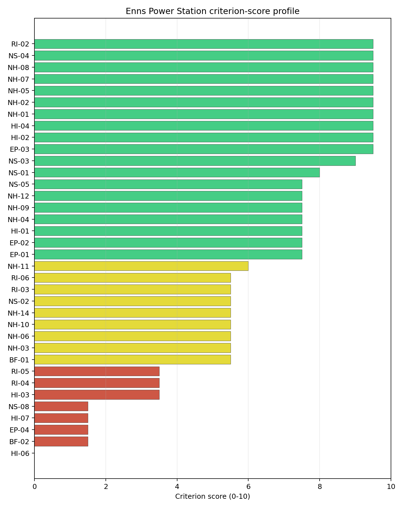

# Enns Power Station Site Profile

Enns Power Station is a coal/thermal site in Austria that has been tested against the NuScale VOYGR-6 reference deployment envelope. This profile reads the screening evidence at a level that supports a decision to progress toward Stage 3 characterization. It is not a site-suitability determination, vendor recommendation, or licensing finding.

## Site Snapshot

| Field | Value |
| --- | --- |
| Site name | Enns Power Station |
| Coordinates | 48.2131, 14.4752 |
| Subnational unit | Enns |
| Installed thermal capacity (source data) | 800 MW |
| Available surface area | 41.5 ha |
| Available surface area for development | 5.7 ha |
| Composite score (baseline weights) | 6.616 (5.922-7.156 MC band) |
| National stability band | H (top-10% hit rate 0%) |
| National rank | 3 |

_See the country status map in_ [Austria Country Profile](../AT_country_prototype.md#country-status-map).

## Ownership and Coal-to-Nuclear Context

- **Bank für Tirol und Vorarlberg AG** (0.85% share), headquartered in Austria; immediate operator Energie AG Oberösterreich. Path: Bank für Tirol und Vorarlberg AG -> Oberbank AG [16.45%] -> Energie AG Oberösterreich  [5.18%] -> Enns Power Station -- [100.0%]
- **Unicredit SpA** (nan% share), headquartered in Italy; immediate operator Energie AG Oberösterreich. Path: Unicredit SpA -> UniCredit Bank Austria AG [unknown %] -> Oberbank AG [3.41%] -> Energie AG Oberösterreich  [5.18%] -> Enns Power Station -- [100.0%]
- **Wiener Stadtwerke GmbH** (nan% share), headquartered in Austria; immediate operator Energie AG Oberösterreich. Path: Wiener Stadtwerke GmbH -> Verbund AG [unknown %] -> Energie AG Oberösterreich  [5.2%] -> Enns Power Station -- [100.0%]
- **City of Linz** (10.36% share), headquartered in Austria; immediate operator Energie AG Oberösterreich. Path: City of Linz  -> Linz AG [100.0%] -> Energie AG Oberösterreich  [10.36%] -> Enns Power Station -- [100.0%]
- **UniCredit Bank Austria AG** (0.18% share), headquartered in Austria; immediate operator Energie AG Oberösterreich. Path: UniCredit Bank Austria AG -> Oberbank AG [3.41%] -> Energie AG Oberösterreich  [5.18%] -> Enns Power Station -- [100.0%]
- **Government of Austria** (2.65% share), headquartered in Austria; immediate operator Energie AG Oberösterreich. Path: Government of Austria  -> Verbund AG [51.0%] -> Energie AG Oberösterreich  [5.2%] -> Enns Power Station -- [100.0%]
- **CABO Beteiligungsgesellschaft mbH** (1.23% share), headquartered in Austria; immediate operator Energie AG Oberösterreich. Path: CABO Beteiligungsgesellschaft mbH -> Oberbank AG [23.76%] -> Energie AG Oberösterreich  [5.18%] -> Enns Power Station -- [100.0%]
- **Raiffeisenlandesbank Oberösterreich AG** (13.98% share), headquartered in Austria; immediate operator Energie AG Oberösterreich. Path: Raiffeisenlandesbank Oberösterreich AG -> Energie AG Oberösterreich  [13.98%] -> Enns Power Station -- [100.0%]
- **G3B Holding AG** (0.08% share), headquartered in Austria; immediate operator Energie AG Oberösterreich. Path: G3B Holding AG -> Oberbank AG [1.62%] -> Energie AG Oberösterreich  [5.18%] -> Enns Power Station -- [100.0%]
- **EVN AG** (nan% share), headquartered in Austria; immediate operator Energie AG Oberösterreich. Path: EVN AG -> Verbund AG [unknown %] -> Energie AG Oberösterreich  [5.2%] -> Enns Power Station -- [100.0%]
- **BKS Bank AG** (0.76% share), headquartered in Austria; immediate operator Energie AG Oberösterreich. Path: BKS Bank AG -> Oberbank AG [14.74%] -> Energie AG Oberösterreich  [5.18%] -> Enns Power Station -- [100.0%]
- **Oberbank AG** (5.18% share), headquartered in Austria; immediate operator Energie AG Oberösterreich. Path: Oberbank AG -> Energie AG Oberösterreich  [5.18%] -> Enns Power Station -- [100.0%]
- **OÖ Landesholding GmbH** (52.71% share), headquartered in Austria; immediate operator Energie AG Oberösterreich. Path: OÖ Landesholding GmbH -> Energie AG Oberösterreich  [52.71%] -> Enns Power Station -- [100.0%]
- **Verbund AG** (5.20% share), headquartered in Austria; immediate operator Energie AG Oberösterreich. Path: Verbund AG -> Energie AG Oberösterreich  [5.2%] -> Enns Power Station -- [100.0%]
- **TIWAG-Tiroler Wasserkraft AG** (8.28% share), headquartered in Austria; immediate operator Energie AG Oberösterreich. Path: TIWAG-Tiroler Wasserkraft AG -> Energie AG Oberösterreich  [8.28%] -> Enns Power Station -- [100.0%]
- **Linz AG** (10.36% share), headquartered in Austria; immediate operator Energie AG Oberösterreich. Path: Linz AG -> Energie AG Oberösterreich  [10.36%] -> Enns Power Station -- [100.0%]
- **small shareholder(s)** (4.29% share); immediate operator Energie AG Oberösterreich. Path: small shareholder(s)  -> Energie AG Oberösterreich  [4.29%] -> Enns Power Station -- [100.0%]
- **CABET Holding GmbH** (1.23% share), headquartered in Austria; immediate operator Energie AG Oberösterreich. Path: CABET Holding GmbH -> CABO Beteiligungsgesellschaft mbH [100.0%] -> Oberbank AG [23.76%] -> Energie AG Oberösterreich  [5.18%] -> Enns Power Station -- [100.0%]

Generating units on record: 1 cancelled.

## Natural Hazards (NH)

- **Seismic: Ground Motion (NH-01)** - score 9.5/10 (MC 9.0-10.0) — favorable: Well below the risk boundary., weight 0.0455, data quality high. Evidence: PGA at 475-year return period 0.036 g; PGA at 2,475-year return period 0.068 g; Vs30 reference (m/s): 760.0.
- **Seismic: Surface Rupture (NH-02)** - score 9.5/10 (MC 9.0-10.0) — favorable: Very strong separation from mapped capable faults; surface-rupture concern effectively screened at desk-study level., weight n/a, data quality screening grade. Evidence: nearest mapped capable fault 50.0 km; fault slip rate 0 mm/yr; fault name: none_in_search_radius; E1 verdict (radius 5 km): outside the SSG-9 capable-fault screening envelope.
- **Geotechnical: Liquefaction (NH-03)** - score 5.5/10 (MC 5.0-6.0) — pass-mark band: Moderate susceptibility, or high/very-high with documented (or pending for `high`) mitigation., weight n/a, data quality medium. Evidence: liquefaction susceptibility: moderate; dominant soil type: silty_clay_loam.
- **Geotechnical: Slope Stability (NH-04)** - score 7.5/10 (MC 7.0-8.0), weight n/a, data quality screening grade. Evidence: site slope 5.19 deg; max slope in 1 km box 85.5 deg; slope stability class: moderate.
- **Geotechnical: Subsidence (NH-05)** - score 9.5/10 (MC 9.0-10.0) — favorable: No karst; mine-feature distance well above the score-5 pivot (or unknown)., weight 0.0354, data quality medium. Evidence: karst present: no; karst severity: none.
- **Geotechnical: Foundation (NH-06)** - score 5.5/10 (MC 5.0-6.0) — pass-mark band: Typical European mixed conditions (bearing 80-150 kPa)., weight 0.0253, data quality medium. Evidence: bearing capacity 87.3 kPa; depth to bedrock 24.7 m.
- **Volcanism (NH-07)** - score 9.5/10 (MC 9.0-10.0) — favorable: Very strong margin above the score-5 boundary (or connector confirmed no in-radius signal)., weight n/a, data quality high. Evidence: volcanic hazard class: negligible.
- **Coastal Flooding (NH-08)** - score 9.5/10 (MC 9.0-10.0) — favorable: Non-coastal OR elevation >= 50 m AMSL OR landlocked country, with no positive marine-hazard signal., weight 0.0303, data quality medium. Evidence: distance to coast 279.0 km.
- **River Flooding (NH-09)** - score 7.5/10 (MC 7.0-8.0), weight 0.0404, data quality medium. Evidence: flood zone class: negligible.
- **Extreme Winds (NH-10)** - score 5.5/10 (MC 5.0-6.0) — pass-mark band: Middle relative wind exposure around the observed set mean (9.0-10.5 m/s)., weight 0.0152, data quality medium. Evidence: design wind speed 10.4 m/s.
- **Extreme Precipitation (NH-11)** - score 6.0/10 (MC 6.0-7.0) — pass-mark band: aggregated(mean_of_sub_scores), weight 0.0152, data quality medium. Evidence: extreme daily precipitation 0.36 mm; mean annual precipitation 28.8 mm/yr.
- **Extreme Temperatures (NH-12)** - score 7.5/10 (MC 7.0-8.0), weight 0.0202, data quality medium. Evidence: extreme high temperature 23.1 deg C; extreme low temperature -3.75 deg C.
- **Combined Hazards (NH-14)** - score 5.5/10 (MC 5.0-6.0) — pass-mark band: At least 5 resolved, exactly one moderate hazard (3-5) or moderate interaction only., weight 0.0152, data quality n/a. Evidence: values not in measurement tables.

### Interpretation - Natural Hazards (NH)

<!-- specialist key=family_natural_hazards scope=site site_id=532bfb42-0d4c-42cf-a81a-287f2b3a75bf bundle=AT_enns_power_station_site_bundle.json status=pending -->
> _Specialist interpretation pending: Interpretation - Natural Hazards (NH). Cursor agent fills via `python -m scripts.run_specialist_pass show --country <CC> --site-name <name> --key family_natural_hazards` then `... patch --country <CC> --site-name <name> --key family_natural_hazards --text-file <draft.md>`._
<!-- /specialist key=family_natural_hazards -->

## Human-Induced and Security-Relevant Hazards (HI)

- **Aircraft Crash (HI-01)** - score 7.5/10 (MC 7.0-8.0), weight 0.0354, data quality high. Evidence: nearest airport 13.2 km; nearest flight path 6.6 km; airports within search radius 6; airport name: Hofkirchen Airfield; airport type: small_airport.
- **Industrial Explosions (HI-02)** - score 9.5/10 (MC 9.0-10.0) — favorable: Very strong margin above the score-5 boundary (or completed search confirmed no in-radius signal)., weight 0.0354, data quality high. Evidence: nearest industrial site 5.36 km.
- **Toxic/Gas Releases (HI-03)** - score 3.5/10 (MC 3.0-4.0), weight 0.0354, data quality high. Evidence: nearest toxic source 5.36 km.
- **External Fires (HI-04)** - score 9.5/10 (MC 9.0-10.0) — favorable: > 15 km, or completed flammable-storage search found nothing in radius., weight 0.0303, data quality high. Evidence: values not in measurement tables.
- **Military Installations (HI-06)** - score 0.0/10 (MC 0.0-0.0), weight 0.0303, data quality high. Evidence: nearest military installation 0.36 km; military installations within radius 32; installation name: unnamed.
- **Electromagnetic Interference (HI-07)** - score 1.5/10 (MC 1.0-2.0), weight 0.0101, data quality medium. Evidence: nearest high-power transmitter 0.37 km; transmitters within radius 447; transmitter type: lighting.

### Interpretation - Human-Induced and Security-Relevant Hazards (HI)

<!-- specialist key=family_human_hazards scope=site site_id=532bfb42-0d4c-42cf-a81a-287f2b3a75bf bundle=AT_enns_power_station_site_bundle.json status=pending -->
> _Specialist interpretation pending: Interpretation - Human-Induced and Security-Relevant Hazards (HI). Cursor agent fills via `python -m scripts.run_specialist_pass show --country <CC> --site-name <name> --key family_human_hazards` then `... patch --country <CC> --site-name <name> --key family_human_hazards --text-file <draft.md>`._
<!-- /specialist key=family_human_hazards -->

## Radiological Impact and Emergency Planning (RI / EP)

- **Emergency Planning Feasibility (EP-01)** - score 7.5/10 (MC 7.0-8.0), weight n/a, data quality high. Evidence: EP feasibility composite 65.2 /100; road sub-score 78.6 /100; special-population sub-score 90.0 /100; geography sub-score 95.0 /100; population sub-score 60.0 /100; evacuation feasible: yes.
- **Evacuation Routes (EP-02)** - score 7.5/10 (MC 7.0-8.0), weight 0.0303, data quality medium. Evidence: road density in EPZ 1.145 km/km2; road length in EPZ 2,249 km; motorway access: yes.
- **Physical Geography Constraints (EP-03)** - score 9.5/10 (MC 9.0-10.0) — favorable: No measured relief; open river/waterway context (interim screening)., weight 0.0253, data quality medium. Evidence: waterways crossing EPZ 0; major river barrier: no.
- **Special Populations (EP-04)** - score 1.5/10 (MC 1.0-2.0), weight 0.0303, data quality medium. Evidence: hospitals in EPZ 37; prisons in EPZ 4; care homes in EPZ 30.
- **Atmospheric Dispersion (RI-01)** - score no native score (unscored — no band matched), weight 0.0303, data quality medium. Evidence: annual mean wind speed 1.03 m/s; atmospheric mixing height 496.3 m; prevailing wind direction: W.
- **Surface Water Dispersion (RI-02)** - score 9.5/10 (MC 9.0-10.0) — favorable: > 500 m3/s., weight 0.0253, data quality n/a. Evidence: values not in measurement tables.
- **Groundwater Dispersion (RI-03)** - score 5.5/10 (MC 5.0-6.0) — pass-mark band: Moderate-permeability aquifer screening proxy., weight 0.0253, data quality medium. Evidence: aquifer type: sedimentary sands.
- **Population Density at EPZ Radii (RI-04)** - score 3.5/10 (MC 3.0-4.0), weight 0.0404, data quality screening grade. Evidence: population density within 5 km 362.9 /km2; population density within 16 km 336.7 /km2; population density within 25 km 301.0 /km2; population density within 80 km 89.2 /km2; population within 25 km 590,914 people.
- **Distance to Population Centres (RI-05)** - score 3.5/10 (MC 3.0-4.0), weight 0.0505, data quality screening grade. Evidence: nearest city above 50k people 14.9 km; nearest city population 193,814 people; city name: Greater Linz.
- **Population Projections (RI-06)** - score 5.5/10 (MC 5.0-6.0) — pass-mark band: 0 % to +0.3 %., weight 0.0253, data quality screening grade. Evidence: annual population growth rate 0.269 %/yr; projected population at 25 km in 60 yr 617,485 people.

### Interpretation - Radiological Impact and Emergency Planning (RI / EP)

<!-- specialist key=family_radiological_emergency scope=site site_id=532bfb42-0d4c-42cf-a81a-287f2b3a75bf bundle=AT_enns_power_station_site_bundle.json status=pending -->
> _Specialist interpretation pending: Interpretation - Radiological Impact and Emergency Planning (RI / EP). Cursor agent fills via `python -m scripts.run_specialist_pass show --country <CC> --site-name <name> --key family_radiological_emergency` then `... patch --country <CC> --site-name <name> --key family_radiological_emergency --text-file <draft.md>`._
<!-- /specialist key=family_radiological_emergency -->

## Non-Safety and Implementation Considerations (NS)

- **Grid Capacity Basic Filter (BF-01)** - score 5.5/10 (MC 5.0-6.0) — pass-mark band: Note: substation 15-30 km OR 110-219 kV; reinforcement plausible., weight n/a, data quality n/a. Evidence: values not in measurement tables.
- **Land Area Basic Filter (BF-02)** - score 1.5/10 (MC 1.0-2.0), weight 0.0253, data quality n/a. Evidence: values not in measurement tables.
- **Cooling Water Availability (NS-01)** - score 8.0/10 (MC 8.0-9.0) — favorable: aggregated(weighted_mean_of_sub_scores), weight 0.0404, data quality screening grade. Evidence: distance to cooling source 2.53 km; cooling source flow 1,563 m3/s; cooling source type: major_river; cooling source name: Bleicherbach (Stallbach); water stress label: Low.
- **Grid Connection (NS-02)** - score 5.5/10 (MC 5.0-6.0) — pass-mark band: aggregated(min_of_sub_scores), weight 0.0404, data quality high. Evidence: nearest substation 0.73 km; nearest high-voltage line 1.65 km; highest nearby line voltage 110.0 kV; grid export capacity 800.0 MW; substations within radius 2,090; HV lines within radius 469.
- **Transport Access (NS-03)** - score 9.0/10 (MC 9.0-10.0) — favorable: aggregated(weighted_mean_of_sub_scores), weight 0.0404, data quality high. Evidence: nearest highway 1.01 km; nearest rail line 0.91 km; nearest waterway 3.49 km; heavy-haul capable: yes.
- **Site Topography (NS-04)** - score 9.5/10 (MC 9.0-10.0) — favorable: > 80 %., weight 0.0303, data quality screening grade. Evidence: favourable land cover 81.8 %; moderate land cover 9.9 %; unfavourable land cover 8.4 %; favourable area 41.5 ha; dominant land class: 211.
- **Site Footprint Adequacy (NS-05)** - score 7.5/10 (MC 7.0-8.0), weight 0.0253, data quality medium. Evidence: buildable area 5.71 ha; largest contiguous patch 5.71 ha; buildable patch count 11.
- **Existing Infrastructure (NS-06)** - score no native score (unscored — no band matched), weight 0.0253, data quality n/a. Evidence: not measured at this site (criterion remains unscored).
- **Ecological Sensitivity (NS-08)** - score 1.5/10 (MC 1.0-2.0), weight n/a, data quality high. Evidence: natural land cover 8.4 %; distance to nearest Natura 2000 site 0.687 km; distance to nearest protected area 6.302 km; Natura 2000 overlap: no; Natura 2000 sensitivity class: high; protected-area overlap: no; protected-area sensitivity class: low; nearest Natura 2000 site: Unteres Steyr- und Ennstal; Natura 2000 sites within 5 km: 1; nearest protected-area designation: Nature Reserve.
- **Workforce Availability (NS-10)** - score no native score (unscored — no band matched), weight 0.0202, data quality n/a. Evidence: not measured at this site (criterion remains unscored).
- **Regulatory/Political Environment (NS-12)** - score no native score (unscored — no band matched), weight 0.0303, data quality n/a. Evidence: not measured at this site (criterion remains unscored).
- **Construction Logistics (NS-13)** - score no native score (unscored — no band matched), weight 0.0202, data quality n/a. Evidence: not measured at this site (criterion remains unscored).

### Interpretation - Non-Safety and Implementation Considerations (NS)

<!-- specialist key=family_infrastructure scope=site site_id=532bfb42-0d4c-42cf-a81a-287f2b3a75bf bundle=AT_enns_power_station_site_bundle.json status=pending -->
> _Specialist interpretation pending: Interpretation - Non-Safety and Implementation Considerations (NS). Cursor agent fills via `python -m scripts.run_specialist_pass show --country <CC> --site-name <name> --key family_infrastructure` then `... patch --country <CC> --site-name <name> --key family_infrastructure --text-file <draft.md>`._
<!-- /specialist key=family_infrastructure -->

## Composite Score and Stability

Baseline composite score is 6.616, bracketed by Monte Carlo at 5.922-7.156. National stability band is `H` with a top-10% hit rate of 0% across 12 scored Monte Carlo scenarios.

<!-- specialist key=stability scope=site site_id=532bfb42-0d4c-42cf-a81a-287f2b3a75bf bundle=AT_enns_power_station_site_bundle.json status=pending -->
> _Specialist interpretation pending: Composite stability and sensitivity (plain-English read). Cursor agent fills via `python -m scripts.run_specialist_pass show --country <CC> --site-name <name> --key stability` then `... patch --country <CC> --site-name <name> --key stability --text-file <draft.md>`._
<!-- /specialist key=stability -->

## Residual Risk Register

<!-- specialist key=residual_risk scope=site site_id=532bfb42-0d4c-42cf-a81a-287f2b3a75bf bundle=AT_enns_power_station_site_bundle.json status=pending -->
> _Specialist interpretation pending: Residual risk register (specialist synthesis). Cursor agent fills via `python -m scripts.run_specialist_pass show --country <CC> --site-name <name> --key residual_risk` then `... patch --country <CC> --site-name <name> --key residual_risk --text-file <draft.md>`._
<!-- /specialist key=residual_risk -->

## Stage 3 Follow-Up Checklist

- [ ] Resolve **Toxic/Gas Releases (HI-03)** avoidance flag - measured {"hi03_search_completed": true, "nearest_toxic_source_km": 5.36} vs threshold Project avoidance: >= 8 km from hazardous-cloud sources..
- [ ] Resolve **Distance to Population Centres (RI-05)** avoidance flag - measured {"nearest_city_50k_km": 14.95, "ri05_required_distance_km": 16.0} vs threshold Nearest >=50k population-centre proxy: 50k/>=8 km, 100k/>=16 km, 500k/>=32 km, 1M/>=48 km..
- [ ] Re-measure **Military Installations (HI-06)** - native score 0.0/10 with confidence high.
- [ ] Re-measure **Land Area Basic Filter (BF-02)** - native score 1.5/10 with confidence insufficient.
- [ ] Re-measure **Special Populations (EP-04)** - native score 1.5/10 with confidence medium.
- [ ] Re-measure **Electromagnetic Interference (HI-07)** - native score 1.5/10 with confidence medium.
- [ ] Re-measure **Ecological Sensitivity (NS-08)** - native score 1.5/10 with confidence high.
- [ ] Improve data quality for **Geotechnical: Subsidence & Collapse (NH-05b)** - current flag `low`.

## Evidence Limitations

- Geotechnical: Subsidence & Collapse (NH-05b) - quality `low`.
