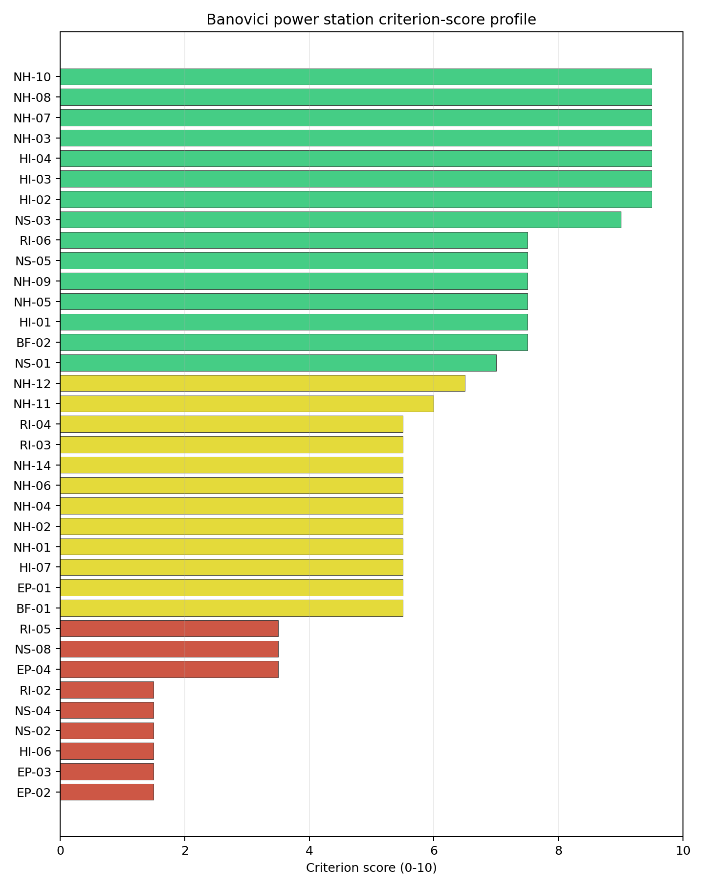
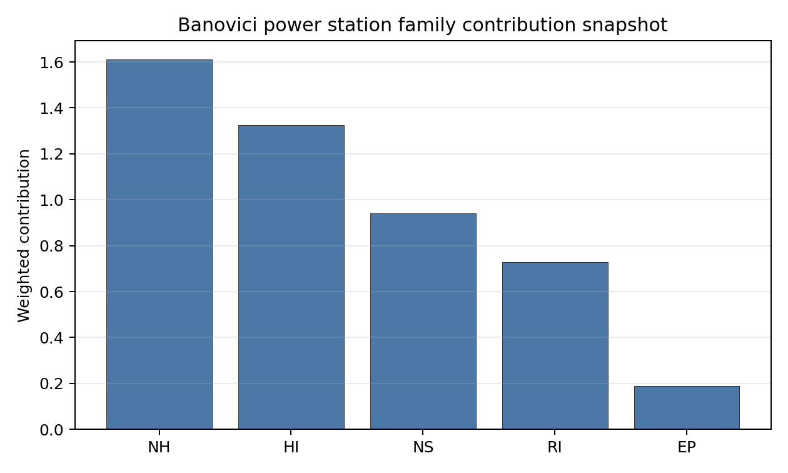

# Banovici power station Site Profile

Banovici power station is a coal/thermal site in Bosnia and Herzegovina that has been tested against the NuScale VOYGR-6 reference deployment envelope. This profile reads the screening evidence at a level that supports a decision to progress toward Stage 3 characterization. It is not a site-suitability determination, vendor recommendation, or licensing finding.

## Site Snapshot

| Field | Value |
| --- | --- |
| Site name | Banovici power station |
| Coordinates | 44.4000, 18.5333 |
| Subnational unit | FBIH |
| Installed thermal capacity (source data) | 350 MW |
| Available surface area | 56.0 ha |
| Available surface area for development | 56.0 ha |
| Composite score (baseline weights) | 5.934 (5.325-6.425 MC band) |
| National stability band | H (top-10% hit rate 0%) |
| National rank | 6 |

_See the country status map in_ [Bosnia and Herzegovina Country Profile](../BA_country_prototype.md#country-status-map).

## Ownership and Coal-to-Nuclear Context

- **ZIF HERBOS FOND d.d. Tuzla** (7.07% share), headquartered in Bosnia and Herzegovina; immediate operator RMU Banovici dd. Path: ZIF HERBOS FOND d.d. Tuzla  -> RMU Banovici dd [7.07%] -> Banovici power station Unit 1 [100.0%]
- **RMU Banovici dd** (100.00% share), headquartered in Bosnia and Herzegovina; immediate operator RMU Banovici dd. Path: RMU Banovici dd -> Banovici power station Unit 1 [100.0%]
- **Government of the Federation of Bosnia and Herzegovina** (69.53% share), headquartered in Bosnia and Herzegovina; immediate operator RMU Banovici dd. Path: Government of the Federation of Bosnia and Herzegovina  -> RMU Banovici dd [69.53%] -> Banovici power station Unit 1 [100.0%]
- **small shareholder(s)** (23.40% share); immediate operator RMU Banovici dd. Path: small shareholder(s)  -> RMU Banovici dd [23.4%] -> Banovici power station Unit 1 [100.0%]

Generating units on record: 1 cancelled.

## Natural Hazards (NH)

- **Seismic: Ground Motion (NH-01)** - score 5.5/10 (MC 5.0-6.0) — pass-mark band: At or below the score-5 risk boundary., weight 0.0455, data quality high. Evidence: PGA at 475-year return period 0.132 g; PGA at 2,475-year return period 0.282 g; Vs30 reference (m/s): 760.0.
- **Seismic: Surface Rupture (NH-02)** - score 7.5/10 (MC 7.0-8.0), weight n/a, data quality screening grade. Evidence: nearest mapped capable fault 13.3 km; fault slip rate 0.1 mm/yr; fault name: BACF007; E1 verdict (radius 5 km): outside the SSG-9 capable-fault screening envelope.
- **Geotechnical: Liquefaction (NH-03)** - score 9.5/10 (MC 9.0-10.0) — favorable: Negligible susceptibility (Stage-1 favourable default)., weight n/a, data quality medium. Evidence: liquefaction susceptibility: very_low; dominant soil type: clay_loam.
- **Geotechnical: Slope Stability (NH-04)** - score 5.5/10 (MC 5.0-6.0) — pass-mark band: At or below the score-5 risk boundary., weight n/a, data quality screening grade. Evidence: site slope 18.1 deg; max slope in 1 km box 87.2 deg; slope stability class: very_steep.
- **Geotechnical: Subsidence (NH-05)** - score 7.5/10 (MC 7.0-8.0), weight 0.0354, data quality medium. Evidence: karst present: no; karst severity: none.
- **Geotechnical: Foundation (NH-06)** - score 5.5/10 (MC 5.0-6.0) — pass-mark band: Typical European mixed conditions (bearing 80-150 kPa)., weight 0.0253, data quality medium. Evidence: bearing capacity 82.0 kPa; depth to bedrock 14.8 m.
- **Volcanism (NH-07)** - score 9.5/10 (MC 9.0-10.0) — favorable: Very strong margin above the score-5 boundary (or connector confirmed no in-radius signal)., weight n/a, data quality high. Evidence: volcanic hazard class: negligible.
- **Coastal Flooding (NH-08)** - score 9.5/10 (MC 9.0-10.0) — favorable: Non-coastal OR elevation >= 50 m AMSL OR landlocked country, with no positive marine-hazard signal., weight 0.0303, data quality medium. Evidence: distance to coast 172.2 km.
- **River Flooding (NH-09)** - score 7.5/10 (MC 7.0-8.0), weight 0.0404, data quality medium. Evidence: flood zone class: negligible.
- **Extreme Winds (NH-10)** - score 9.5/10 (MC 9.0-10.0) — favorable: Lowest relative wind exposure in the current ERA5 monthly-means gust set (< 7.5 m/s)., weight 0.0152, data quality medium. Evidence: design wind speed 6.92 m/s.
- **Extreme Precipitation (NH-11)** - score 6.0/10 (MC 5.0-6.0) — pass-mark band: aggregated(mean_of_sub_scores), weight 0.0152, data quality medium. Evidence: extreme daily precipitation 0.32 mm; mean annual precipitation 34.3 mm/yr.
- **Extreme Temperatures (NH-12)** - score 6.5/10 (MC 6.0-7.0) — pass-mark band: aggregated(mean_of_sub_scores), weight 0.0202, data quality medium. Evidence: extreme high temperature 23.3 deg C; extreme low temperature -5.97 deg C.
- **Combined Hazards (NH-14)** - score 5.5/10 (MC 5.0-6.0) — pass-mark band: At least 5 resolved, exactly one moderate hazard (3-5) or moderate interaction only., weight 0.0152, data quality n/a. Evidence: values not in measurement tables.

### Interpretation - Natural Hazards (NH)

<!-- specialist key=family_natural_hazards scope=site site_id=82011c29-a3d3-4a81-a27b-019d2649a251 bundle=BA_banovici_power_station_site_bundle.json status=pending -->

<!-- /specialist key=family_natural_hazards -->

## Human-Induced and Security-Relevant Hazards (HI)

- **Aircraft Crash (HI-01)** - score 7.5/10 (MC 7.0-8.0), weight 0.0354, data quality high. Evidence: nearest airport 12.8 km; nearest flight path 6.4 km; airports within search radius 3; airport name: Ciljuge Sport Airfield; airport type: small_airport.
- **Industrial Explosions (HI-02)** - score 9.5/10 (MC 9.0-10.0) — favorable: Very strong margin above the score-5 boundary (or completed search confirmed no in-radius signal)., weight 0.0354, data quality screening grade. Evidence: values not in measurement tables.
- **Toxic/Gas Releases (HI-03)** - score 9.5/10 (MC 9.0-10.0) — favorable: Very strong margin above the score-5 boundary (or completed search confirmed no in-radius signal)., weight 0.0354, data quality screening grade. Evidence: values not in measurement tables.
- **External Fires (HI-04)** - score 9.5/10 (MC 9.0-10.0) — favorable: > 15 km, or completed flammable-storage search found nothing in radius., weight 0.0303, data quality screening grade. Evidence: values not in measurement tables.
- **Military Installations (HI-06)** - score 1.5/10 (MC 1.0-2.0), weight 0.0303, data quality medium. Evidence: nearest military installation 10.9 km; military installations within radius 5; installation name: unnamed.
- **Electromagnetic Interference (HI-07)** - score 5.5/10 (MC 5.0-6.0) — pass-mark band: Scoreable ordinary RF environment from count/proximity evidence; power-class-specific severity deferred., weight 0.0101, data quality medium. Evidence: nearest high-power transmitter 9.65 km; transmitters within radius 11; transmitter type: mast.

### Interpretation - Human-Induced and Security-Relevant Hazards (HI)

<!-- specialist key=family_human_hazards scope=site site_id=82011c29-a3d3-4a81-a27b-019d2649a251 bundle=BA_banovici_power_station_site_bundle.json status=pending -->

<!-- /specialist key=family_human_hazards -->

## Radiological Impact and Emergency Planning (RI / EP)

- **Emergency Planning Feasibility (EP-01)** - score 5.5/10 (MC 5.0-6.0) — pass-mark band: At or above the composite score-5 boundary., weight n/a, data quality high. Evidence: EP feasibility composite 50.2 /100; road sub-score 25.0 /100; special-population sub-score 90.0 /100; geography sub-score 10.0 /100; population sub-score 80.0 /100; evacuation feasible: yes.
- **Evacuation Routes (EP-02)** - score 1.5/10 (MC 1.0-2.0), weight 0.0303, data quality medium. Evidence: road density in EPZ 0.25 km/km2; road length in EPZ 491.2 km; motorway access: no.
- **Physical Geography Constraints (EP-03)** - score 1.5/10 (MC 1.0-2.0), weight 0.0253, data quality medium. Evidence: waterways crossing EPZ 119; major river barrier: yes.
- **Special Populations (EP-04)** - score 3.5/10 (MC 3.0-4.0), weight 0.0303, data quality medium. Evidence: hospitals in EPZ 26; prisons in EPZ 1; care homes in EPZ 1.
- **Atmospheric Dispersion (RI-01)** - score no native score (unscored — no band matched), weight 0.0303, data quality medium. Evidence: annual mean wind speed 0.52 m/s; atmospheric mixing height 408.2 m; prevailing wind direction: S.
- **Surface Water Dispersion (RI-02)** - score 1.5/10 (MC 1.0-2.0), weight 0.0253, data quality n/a. Evidence: values not in measurement tables.
- **Groundwater Dispersion (RI-03)** - score 5.5/10 (MC 5.0-6.0) — pass-mark band: Moderate-permeability aquifer screening proxy., weight 0.0253, data quality medium. Evidence: aquifer type: sedimentary sands.
- **Population Density at EPZ Radii (RI-04)** - score 5.5/10 (MC 5.0-6.0) — pass-mark band: aggregated(min_of_sub_scores), weight 0.0404, data quality screening grade. Evidence: population density within 5 km 208.0 /km2; population density within 16 km 145.8 /km2; population density within 25 km 132.6 /km2; population density within 80 km 102.5 /km2; population within 25 km 260,254 people.
- **Distance to Population Centres (RI-05)** - score 3.5/10 (MC 3.0-4.0), weight 0.0505, data quality screening grade. Evidence: values not in measurement tables.
- **Population Projections (RI-06)** - score 7.5/10 (MC 7.0-8.0), weight 0.0253, data quality screening grade. Evidence: annual population growth rate -0.453 %/yr; projected population at 25 km in 60 yr 142,823 people.

### Interpretation - Radiological Impact and Emergency Planning (RI / EP)

<!-- specialist key=family_radiological_emergency scope=site site_id=82011c29-a3d3-4a81-a27b-019d2649a251 bundle=BA_banovici_power_station_site_bundle.json status=pending -->

<!-- /specialist key=family_radiological_emergency -->

## Non-Safety and Implementation Considerations (NS)

- **Grid Capacity Basic Filter (BF-01)** - score 5.5/10 (MC 5.0-6.0) — pass-mark band: Note: substation 15-30 km OR 110-219 kV; reinforcement plausible., weight n/a, data quality n/a. Evidence: values not in measurement tables.
- **Land Area Basic Filter (BF-02)** - score 7.5/10 (MC 7.0-8.0), weight 0.0253, data quality n/a. Evidence: values not in measurement tables.
- **Cooling Water Availability (NS-01)** - score 7.0/10 (MC 6.0-7.0), weight 0.0404, data quality screening grade. Evidence: distance to cooling source 3.24 km; cooling source flow 1.77 m3/s; cooling source type: small_river; cooling source name: Litva; water stress label: Low.
- **Grid Connection (NS-02)** - score 1.5/10 (MC 1.0-2.0), weight 0.0404, data quality medium. Evidence: nearest substation 6.69 km; nearest high-voltage line 12.7 km; highest nearby line voltage 220.0 kV; grid export capacity 350.0 MW; substations within radius 39; HV lines within radius 44.
- **Transport Access (NS-03)** - score 9.0/10 (MC 7.0-10.0) — favorable: aggregated(weighted_mean_of_sub_scores), weight 0.0404, data quality low. Evidence: nearest highway 0.42 km; nearest rail line 2.19 km; heavy-haul capable: yes.
- **Site Topography (NS-04)** - score 1.5/10 (MC 1.0-2.0), weight 0.0303, data quality screening grade. Evidence: favourable land cover 10.7 %; moderate land cover 20.1 %; unfavourable land cover 69.2 %; favourable area 6.16 ha; dominant land class: 311.
- **Site Footprint Adequacy (NS-05)** - score 7.5/10 (MC 7.0-8.0), weight 0.0253, data quality screening grade. Evidence: buildable area 56.0 ha; largest contiguous patch 155.4 ha; buildable patch count 22.
- **Existing Infrastructure (NS-06)** - score no native score (unscored — no band matched), weight 0.0253, data quality n/a. Evidence: not measured at this site (criterion remains unscored).
- **Ecological Sensitivity (NS-08)** - score 3.5/10 (MC 1.5-5.5), weight n/a, data quality insufficient. Evidence: natural land cover 69.2 %; distance to nearest protected area 2.951 km; Natura 2000 sensitivity class: unknown; protected-area overlap: no; protected-area sensitivity class: low; Natura 2000 sites within 5 km: 0; nearest protected-area designation: Protected Landscape - Terrestial landscape - marine landscape (FBIH law).
- **Workforce Availability (NS-10)** - score no native score (unscored — no band matched), weight 0.0202, data quality n/a. Evidence: not measured at this site (criterion remains unscored).
- **Regulatory/Political Environment (NS-12)** - score no native score (unscored — no band matched), weight 0.0303, data quality n/a. Evidence: not measured at this site (criterion remains unscored).
- **Construction Logistics (NS-13)** - score no native score (unscored — no band matched), weight 0.0202, data quality n/a. Evidence: not measured at this site (criterion remains unscored).

### Interpretation - Non-Safety and Implementation Considerations (NS)

<!-- specialist key=family_infrastructure scope=site site_id=82011c29-a3d3-4a81-a27b-019d2649a251 bundle=BA_banovici_power_station_site_bundle.json status=pending -->

<!-- /specialist key=family_infrastructure -->

## Composite Score and Stability

Baseline composite score is 5.934, bracketed by Monte Carlo at 5.325-6.425. National stability band is `H` with a top-10% hit rate of 0% across 12 scored Monte Carlo scenarios.

<!-- specialist key=stability scope=site site_id=82011c29-a3d3-4a81-a27b-019d2649a251 bundle=BA_banovici_power_station_site_bundle.json status=pending -->

<!-- /specialist key=stability -->

## Residual Risk Register

<!-- specialist key=residual_risk scope=site site_id=82011c29-a3d3-4a81-a27b-019d2649a251 bundle=BA_banovici_power_station_site_bundle.json status=pending -->

<!-- /specialist key=residual_risk -->

## Stage 3 Follow-Up Checklist

- [ ] Resolve **Grid Connection (NS-02)** avoidance flag - measured {"grid_export_capacity_mw": 350.0} vs threshold Project A13: transmission >= reference SMR net MWe within feasible distance..
- [ ] Re-measure **Evacuation Routes (EP-02)** - native score 1.5/10 with confidence medium.
- [ ] Re-measure **Physical Geography Constraints (EP-03)** - native score 1.5/10 with confidence medium.
- [ ] Re-measure **Military Installations (HI-06)** - native score 1.5/10 with confidence medium.
- [ ] Re-measure **Grid Connection (NS-02)** - native score 1.5/10 with confidence medium.
- [ ] Re-measure **Site Topography (NS-04)** - native score 1.5/10 with confidence medium.
- [ ] Improve data quality for **Transport Access (NS-03)** - current flag `low`.

## Evidence Limitations

- Transport Access (NS-03) - quality `low`.
