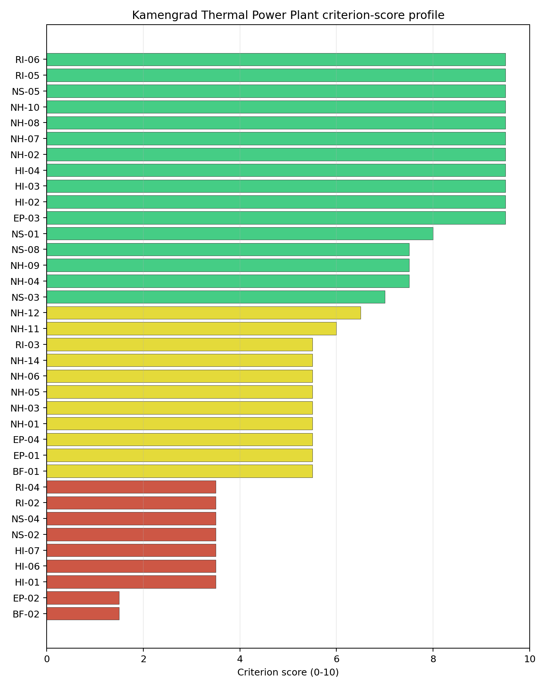
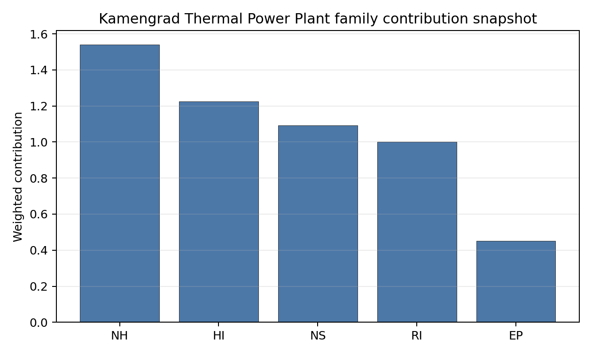

# Kamengrad Thermal Power Plant Site Profile

Kamengrad Thermal Power Plant is a coal/thermal site in Bosnia and Herzegovina that has been tested against the NuScale VOYGR-6 reference deployment envelope. This profile reads the screening evidence at a level that supports a decision to progress toward Stage 3 characterization. It is not a site-suitability determination, vendor recommendation, or licensing finding.

## Site Snapshot

| Field | Value |
| --- | --- |
| Site name | Kamengrad Thermal Power Plant |
| Coordinates | 44.7667, 16.6667 |
| Subnational unit | FBIH |
| Installed thermal capacity (source data) | 430 MW |
| Available surface area | 89.8 ha |
| Available surface area for development | 1.3 ha |
| Composite score (baseline weights) | 6.572 (5.886-7.131 MC band) |
| National stability band | H (top-10% hit rate 0%) |
| National rank | 4 |

_See the country status map in_ [Bosnia and Herzegovina Country Profile](../BA_country_prototype.md#country-status-map).

## Ownership and Coal-to-Nuclear Context

- **RMU Kamengrad dd** (100.00% share), headquartered in Bosnia and Herzegovina; immediate operator RMU Kamengrad dd. Path: RMU Kamengrad dd -> Kamengrad Thermal Power Plant Unit 2 [100.0%]
- **Unicredit SpA** (30.61% share), headquartered in Italy; immediate operator RMU Kamengrad dd. Path: Unicredit SpA -> UniCredit Bank dd [99.35%] -> RMU Kamengrad dd [30.81%] -> Kamengrad Thermal Power Plant Unit 1 [100.0%]
- **ZIF HERBOS FOND d.d. Mostar** (13.22% share), headquartered in Bosnia and Herzegovina; immediate operator RMU Kamengrad dd. Path: ZIF HERBOS FOND d.d. Mostar  -> RMU Kamengrad dd [13.22%] -> Kamengrad Thermal Power Plant Unit 2 [100.0%]
- **unknown** (44.04% share); immediate operator RMU Kamengrad dd. Path: unknown  -> RMU Kamengrad dd [44.04%] -> Kamengrad Thermal Power Plant Unit 1 [100.0%]
- **natural person(s)** (11.93% share); immediate operator RMU Kamengrad dd. Path: natural person(s)  -> RMU Kamengrad dd [11.93%] -> Kamengrad Thermal Power Plant Unit 1 [100.0%]
- **UniCredit Bank dd** (30.81% share), headquartered in Bosnia and Herzegovina; immediate operator RMU Kamengrad dd. Path: UniCredit Bank dd -> RMU Kamengrad dd [30.81%] -> Kamengrad Thermal Power Plant Unit 2 [100.0%]

Generating units on record: 2 cancelled.

## Natural Hazards (NH)

- **Seismic: Ground Motion (NH-01)** - score 5.5/10 (MC 5.0-6.0) — pass-mark band: At or below the score-5 risk boundary., weight 0.0455, data quality high. Evidence: PGA at 475-year return period 0.125 g; PGA at 2,475-year return period 0.269 g; Vs30 reference (m/s): 760.0.
- **Seismic: Surface Rupture (NH-02)** - score 9.5/10 (MC 9.0-10.0) — favorable: Very strong separation from mapped capable faults; surface-rupture concern effectively screened at desk-study level., weight n/a, data quality screening grade. Evidence: nearest mapped capable fault 27.6 km; fault slip rate 0.173 mm/yr; fault name: BACF006; E1 verdict (radius 5 km): outside the SSG-9 capable-fault screening envelope.
- **Geotechnical: Liquefaction (NH-03)** - score 5.5/10 (MC 5.0-6.0) — pass-mark band: Moderate susceptibility, or high/very-high with documented (or pending for `high`) mitigation., weight n/a, data quality medium. Evidence: liquefaction susceptibility: high; dominant soil type: clay_loam.
- **Geotechnical: Slope Stability (NH-04)** - score 7.5/10 (MC 7.0-8.0), weight n/a, data quality screening grade. Evidence: site slope 6.84 deg; max slope in 1 km box 83.0 deg; slope stability class: moderate.
- **Geotechnical: Subsidence (NH-05)** - score 5.5/10 (MC 5.0-6.0) — pass-mark band: At or above the mine-distance score-5 pivot; review possible., weight 0.0354, data quality medium. Evidence: karst present: no; karst severity: moderate; formation type: carbonate (Continuous carbonate rocks).
- **Geotechnical: Foundation (NH-06)** - score 5.5/10 (MC 5.0-6.0) — pass-mark band: Typical European mixed conditions (bearing 80-150 kPa)., weight 0.0253, data quality medium. Evidence: bearing capacity 85.3 kPa; depth to bedrock 23.1 m.
- **Volcanism (NH-07)** - score 9.5/10 (MC 9.0-10.0) — favorable: Very strong margin above the score-5 boundary (or connector confirmed no in-radius signal)., weight n/a, data quality high. Evidence: volcanic hazard class: negligible.
- **Coastal Flooding (NH-08)** - score 9.5/10 (MC 9.0-10.0) — favorable: Non-coastal OR elevation >= 50 m AMSL OR landlocked country, with no positive marine-hazard signal., weight 0.0303, data quality medium. Evidence: distance to coast 109.8 km.
- **River Flooding (NH-09)** - score 7.5/10 (MC 7.0-8.0), weight 0.0404, data quality medium. Evidence: flood zone class: negligible.
- **Extreme Winds (NH-10)** - score 9.5/10 (MC 9.0-10.0) — favorable: Lowest relative wind exposure in the current ERA5 monthly-means gust set (< 7.5 m/s)., weight 0.0152, data quality medium. Evidence: design wind speed 7.21 m/s.
- **Extreme Precipitation (NH-11)** - score 6.0/10 (MC 6.0-7.0) — pass-mark band: aggregated(mean_of_sub_scores), weight 0.0152, data quality medium. Evidence: extreme daily precipitation 0.29 mm; mean annual precipitation 38.8 mm/yr.
- **Extreme Temperatures (NH-12)** - score 6.5/10 (MC 6.0-7.0) — pass-mark band: aggregated(mean_of_sub_scores), weight 0.0202, data quality medium. Evidence: extreme high temperature 23.6 deg C; extreme low temperature -5.23 deg C.
- **Combined Hazards (NH-14)** - score 5.5/10 (MC 5.0-6.0) — pass-mark band: At least 5 resolved, exactly one moderate hazard (3-5) or moderate interaction only., weight 0.0152, data quality n/a. Evidence: values not in measurement tables.

### Interpretation - Natural Hazards (NH)

<!-- specialist key=family_natural_hazards scope=site site_id=344e0e9a-558e-4749-bb66-cd746be50cbd bundle=BA_kamengrad_thermal_power_plant_site_bundle.json status=pending -->
> _Specialist interpretation pending: Interpretation - Natural Hazards (NH). Cursor agent fills via `python -m scripts.run_specialist_pass show --country <CC> --site-name <name> --key family_natural_hazards` then `... patch --country <CC> --site-name <name> --key family_natural_hazards --text-file <draft.md>`._
<!-- /specialist key=family_natural_hazards -->

## Human-Induced and Security-Relevant Hazards (HI)

- **Aircraft Crash (HI-01)** - score 3.5/10 (MC 3.0-4.0), weight 0.0354, data quality high. Evidence: nearest airport 1.58 km; nearest flight path 0.79 km; airports within search radius 2; airport name: PPG Paragliding Field; airport type: small_airport.
- **Industrial Explosions (HI-02)** - score 9.5/10 (MC 9.0-10.0) — favorable: Very strong margin above the score-5 boundary (or completed search confirmed no in-radius signal)., weight 0.0354, data quality screening grade. Evidence: values not in measurement tables.
- **Toxic/Gas Releases (HI-03)** - score 9.5/10 (MC 9.0-10.0) — favorable: Very strong margin above the score-5 boundary (or completed search confirmed no in-radius signal)., weight 0.0354, data quality screening grade. Evidence: values not in measurement tables.
- **External Fires (HI-04)** - score 9.5/10 (MC 9.0-10.0) — favorable: > 15 km, or completed flammable-storage search found nothing in radius., weight 0.0303, data quality screening grade. Evidence: values not in measurement tables.
- **Military Installations (HI-06)** - score 3.5/10 (MC 3.0-4.0), weight 0.0303, data quality medium. Evidence: nearest military installation 25.0 km; military installations within radius 1; installation name: Kasarna "Žarko Zgonjanin" Prijedor.
- **Electromagnetic Interference (HI-07)** - score 3.5/10 (MC 3.0-4.0), weight 0.0101, data quality medium. Evidence: nearest high-power transmitter 4.84 km; transmitters within radius 13; transmitter type: minaret.

### Interpretation - Human-Induced and Security-Relevant Hazards (HI)

<!-- specialist key=family_human_hazards scope=site site_id=344e0e9a-558e-4749-bb66-cd746be50cbd bundle=BA_kamengrad_thermal_power_plant_site_bundle.json status=pending -->
> _Specialist interpretation pending: Interpretation - Human-Induced and Security-Relevant Hazards (HI). Cursor agent fills via `python -m scripts.run_specialist_pass show --country <CC> --site-name <name> --key family_human_hazards` then `... patch --country <CC> --site-name <name> --key family_human_hazards --text-file <draft.md>`._
<!-- /specialist key=family_human_hazards -->

## Radiological Impact and Emergency Planning (RI / EP)

- **Emergency Planning Feasibility (EP-01)** - score 5.5/10 (MC 5.0-6.0) — pass-mark band: At or above the composite score-5 boundary., weight n/a, data quality high. Evidence: EP feasibility composite 52.3 /100; road sub-score 27.0 /100; special-population sub-score 90.0 /100; geography sub-score 95.0 /100; population sub-score 60.0 /100; evacuation feasible: yes.
- **Evacuation Routes (EP-02)** - score 1.5/10 (MC 1.0-2.0), weight 0.0303, data quality medium. Evidence: road density in EPZ 0.27 km/km2; road length in EPZ 530.3 km; motorway access: no.
- **Physical Geography Constraints (EP-03)** - score 9.5/10 (MC 9.0-10.0) — favorable: No measured relief; open river/waterway context (interim screening)., weight 0.0253, data quality medium. Evidence: waterways crossing EPZ 0; major river barrier: no.
- **Special Populations (EP-04)** - score 5.5/10 (MC 5.0-6.0) — pass-mark band: 9-25., weight 0.0303, data quality medium. Evidence: hospitals in EPZ 13; prisons in EPZ 0; care homes in EPZ 0.
- **Atmospheric Dispersion (RI-01)** - score no native score (unscored — no band matched), weight 0.0303, data quality medium. Evidence: annual mean wind speed 0.45 m/s; atmospheric mixing height 391.6 m; prevailing wind direction: S.
- **Surface Water Dispersion (RI-02)** - score 3.5/10 (MC 3.0-4.0), weight 0.0253, data quality n/a. Evidence: values not in measurement tables.
- **Groundwater Dispersion (RI-03)** - score 5.5/10 (MC 5.0-6.0) — pass-mark band: Moderate-permeability aquifer screening proxy., weight 0.0253, data quality medium. Evidence: aquifer type: sedimentary sands.
- **Population Density at EPZ Radii (RI-04)** - score 3.5/10 (MC 3.0-4.0), weight 0.0404, data quality screening grade. Evidence: population density within 5 km 325.4 /km2; population density within 16 km 52.6 /km2; population density within 25 km 54.7 /km2; population density within 80 km 43.9 /km2; population within 25 km 107,431 people.
- **Distance to Population Centres (RI-05)** - score 9.5/10 (MC 9.0-10.0) — favorable: No >=50k population-centre proxy within screening envelope., weight 0.0505, data quality screening grade. Evidence: values not in measurement tables.
- **Population Projections (RI-06)** - score 9.5/10 (MC 9.0-10.0) — favorable: Declining (< -0.5 %/yr)., weight 0.0253, data quality screening grade. Evidence: annual population growth rate -1.071 %/yr; projected population at 25 km in 60 yr 58,956 people.

### Interpretation - Radiological Impact and Emergency Planning (RI / EP)

<!-- specialist key=family_radiological_emergency scope=site site_id=344e0e9a-558e-4749-bb66-cd746be50cbd bundle=BA_kamengrad_thermal_power_plant_site_bundle.json status=pending -->
> _Specialist interpretation pending: Interpretation - Radiological Impact and Emergency Planning (RI / EP). Cursor agent fills via `python -m scripts.run_specialist_pass show --country <CC> --site-name <name> --key family_radiological_emergency` then `... patch --country <CC> --site-name <name> --key family_radiological_emergency --text-file <draft.md>`._
<!-- /specialist key=family_radiological_emergency -->

## Non-Safety and Implementation Considerations (NS)

- **Grid Capacity Basic Filter (BF-01)** - score 5.5/10 (MC 5.0-6.0) — pass-mark band: Note: substation 15-30 km OR 110-219 kV; reinforcement plausible., weight n/a, data quality n/a. Evidence: values not in measurement tables.
- **Land Area Basic Filter (BF-02)** - score 1.5/10 (MC 1.0-2.0), weight 0.0253, data quality n/a. Evidence: values not in measurement tables.
- **Cooling Water Availability (NS-01)** - score 8.0/10 (MC 8.0-9.0) — favorable: aggregated(weighted_mean_of_sub_scores), weight 0.0404, data quality screening grade. Evidence: distance to cooling source 0.55 km; cooling source flow 18.2 m3/s; cooling source type: river; cooling source name: Zdena; water stress label: Low.
- **Grid Connection (NS-02)** - score 3.5/10 (MC 3.0-4.0), weight 0.0404, data quality high. Evidence: nearest substation 0.07 km; nearest high-voltage line 7.42 km; highest nearby line voltage 220.0 kV; grid export capacity 430.0 MW; substations within radius 31; HV lines within radius 50.
- **Transport Access (NS-03)** - score 7.0/10 (MC 5.0-8.0), weight 0.0404, data quality low. Evidence: nearest highway 1.18 km; nearest rail line 16.4 km; heavy-haul capable: yes.
- **Site Topography (NS-04)** - score 3.5/10 (MC 3.0-4.0), weight 0.0303, data quality screening grade. Evidence: favourable land cover 37.2 %; moderate land cover 35.4 %; unfavourable land cover 27.5 %; favourable area 89.8 ha; dominant land class: 321.
- **Site Footprint Adequacy (NS-05)** - score 9.5/10 (MC 7.5-10.0) — favorable: Very strong margin above the score-5 boundary., weight 0.0253, data quality low. Evidence: buildable area 1.32 ha; largest contiguous patch 1.32 ha; buildable patch count 4.
- **Existing Infrastructure (NS-06)** - score no native score (unscored — no band matched), weight 0.0253, data quality n/a. Evidence: not measured at this site (criterion remains unscored).
- **Ecological Sensitivity (NS-08)** - score 7.5/10 (MC 5.5-9.5), weight n/a, data quality insufficient. Evidence: natural land cover 27.5 %; Natura 2000 sensitivity class: unknown; protected-area overlap: no; protected-area sensitivity class: none; Natura 2000 sites within 5 km: 0.
- **Workforce Availability (NS-10)** - score no native score (unscored — no band matched), weight 0.0202, data quality n/a. Evidence: not measured at this site (criterion remains unscored).
- **Regulatory/Political Environment (NS-12)** - score no native score (unscored — no band matched), weight 0.0303, data quality n/a. Evidence: not measured at this site (criterion remains unscored).
- **Construction Logistics (NS-13)** - score no native score (unscored — no band matched), weight 0.0202, data quality n/a. Evidence: not measured at this site (criterion remains unscored).

### Interpretation - Non-Safety and Implementation Considerations (NS)

<!-- specialist key=family_infrastructure scope=site site_id=344e0e9a-558e-4749-bb66-cd746be50cbd bundle=BA_kamengrad_thermal_power_plant_site_bundle.json status=pending -->
> _Specialist interpretation pending: Interpretation - Non-Safety and Implementation Considerations (NS). Cursor agent fills via `python -m scripts.run_specialist_pass show --country <CC> --site-name <name> --key family_infrastructure` then `... patch --country <CC> --site-name <name> --key family_infrastructure --text-file <draft.md>`._
<!-- /specialist key=family_infrastructure -->

## Composite Score and Stability

Baseline composite score is 6.572, bracketed by Monte Carlo at 5.886-7.131. National stability band is `H` with a top-10% hit rate of 0% across 12 scored Monte Carlo scenarios.

<!-- specialist key=stability scope=site site_id=344e0e9a-558e-4749-bb66-cd746be50cbd bundle=BA_kamengrad_thermal_power_plant_site_bundle.json status=pending -->
> _Specialist interpretation pending: Composite stability and sensitivity (plain-English read). Cursor agent fills via `python -m scripts.run_specialist_pass show --country <CC> --site-name <name> --key stability` then `... patch --country <CC> --site-name <name> --key stability --text-file <draft.md>`._
<!-- /specialist key=stability -->

## Residual Risk Register

<!-- specialist key=residual_risk scope=site site_id=344e0e9a-558e-4749-bb66-cd746be50cbd bundle=BA_kamengrad_thermal_power_plant_site_bundle.json status=pending -->
> _Specialist interpretation pending: Residual risk register (specialist synthesis). Cursor agent fills via `python -m scripts.run_specialist_pass show --country <CC> --site-name <name> --key residual_risk` then `... patch --country <CC> --site-name <name> --key residual_risk --text-file <draft.md>`._
<!-- /specialist key=residual_risk -->

## Stage 3 Follow-Up Checklist

- [ ] Resolve **Aircraft Crash (HI-01)** avoidance flag - measured {"flight_path_distance_km": 0.79, "under_flight_path": false} vs threshold A4 — SSG-35: flight-path overhead / < 4 km from airway (large + medium classes only)..
- [ ] Resolve **Grid Connection (NS-02)** avoidance flag - measured {"grid_export_capacity_mw": 430.0} vs threshold Project A13: transmission >= reference SMR net MWe within feasible distance..
- [ ] Re-measure **Land Area Basic Filter (BF-02)** - native score 1.5/10 with confidence insufficient.
- [ ] Re-measure **Evacuation Routes (EP-02)** - native score 1.5/10 with confidence medium.
- [ ] Re-measure **Aircraft Crash (HI-01)** - native score 3.5/10 with confidence high.
- [ ] Re-measure **Military Installations (HI-06)** - native score 3.5/10 with confidence medium.
- [ ] Re-measure **Electromagnetic Interference (HI-07)** - native score 3.5/10 with confidence medium.
- [ ] Improve data quality for **Transport Access (NS-03)** - current flag `low`.
- [ ] Improve data quality for **Site Footprint Adequacy (NS-05)** - current flag `low`.

## Evidence Limitations

- Transport Access (NS-03) - quality `low`.
- Site Footprint Adequacy (NS-05) - quality `low`.
