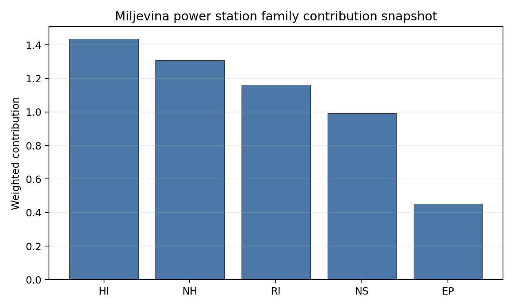

# Miljevina power station Site Profile

Miljevina power station is a coal/thermal site in Bosnia and Herzegovina that has been tested against the NuScale VOYGR-6 reference deployment envelope. This profile reads the screening evidence at a level that supports a decision to progress toward Stage 3 characterization. It is not a site-suitability determination, vendor recommendation, or licensing finding.

## Site Snapshot

| Field | Value |
| --- | --- |
| Site name | Miljevina power station |
| Coordinates | 43.5183, 18.6521 |
| Subnational unit | Republika Srpska |
| Installed thermal capacity (source data) | 220 MW |
| Available surface area | 106.2 ha |
| Available surface area for development | 106.2 ha |
| Composite score (baseline weights) | 6.622 (5.927-7.131 MC band) |
| National stability band | H (top-10% hit rate 0%) |
| National rank | 3 |

_See the country status map in_ [Bosnia and Herzegovina Country Profile](../BA_country_prototype.md#country-status-map).

## Ownership and Coal-to-Nuclear Context

Generating units on record: 2 cancelled.

## Natural Hazards (NH)

- **Seismic: Ground Motion (NH-01)** - score 5.5/10 (MC 5.0-6.0) — pass-mark band: At or below the score-5 risk boundary., weight 0.0455, data quality high. Evidence: PGA at 475-year return period 0.132 g; PGA at 2,475-year return period 0.273 g; Vs30 reference (m/s): 760.0.
- **Seismic: Surface Rupture (NH-02)** - score 7.5/10 (MC 7.0-8.0), weight n/a, data quality screening grade. Evidence: nearest mapped capable fault 13.6 km; fault slip rate 0.173 mm/yr; fault name: MECF007; E1 verdict (radius 5 km): outside the SSG-9 capable-fault screening envelope.
- **Geotechnical: Liquefaction (NH-03)** - score 9.5/10 (MC 9.0-10.0) — favorable: Negligible susceptibility (Stage-1 favourable default)., weight n/a, data quality medium. Evidence: liquefaction susceptibility: very_low; dominant soil type: loam.
- **Geotechnical: Slope Stability (NH-04)** - score 5.5/10 (MC 5.0-6.0) — pass-mark band: At or below the score-5 risk boundary., weight n/a, data quality screening grade. Evidence: site slope 18.7 deg; max slope in 1 km box 88.1 deg; slope stability class: very_steep.
- **Geotechnical: Subsidence (NH-05)** - score 1.5/10 (MC 1.0-2.0), weight 0.0354, data quality medium. Evidence: karst present: no; karst severity: moderate; formation type: carbonate (Continuous carbonate rocks).
- **Geotechnical: Foundation (NH-06)** - score 3.5/10 (MC 3.0-4.0), weight 0.0253, data quality medium. Evidence: bearing capacity 67.3 kPa; depth to bedrock 18.3 m.
- **Volcanism (NH-07)** - score 9.5/10 (MC 9.0-10.0) — favorable: Very strong margin above the score-5 boundary (or connector confirmed no in-radius signal)., weight n/a, data quality high. Evidence: volcanic hazard class: negligible.
- **Coastal Flooding (NH-08)** - score 9.5/10 (MC 9.0-10.0) — favorable: Non-coastal OR elevation >= 50 m AMSL OR landlocked country, with no positive marine-hazard signal., weight 0.0303, data quality medium. Evidence: distance to coast 104.0 km.
- **River Flooding (NH-09)** - score 7.5/10 (MC 7.0-8.0), weight 0.0404, data quality medium. Evidence: flood zone class: negligible.
- **Extreme Winds (NH-10)** - score 5.5/10 (MC 5.0-6.0) — pass-mark band: Middle relative wind exposure around the observed set mean (9.0-10.5 m/s)., weight 0.0152, data quality medium. Evidence: design wind speed 10.1 m/s.
- **Extreme Precipitation (NH-11)** - score 6.0/10 (MC 6.0-7.0) — pass-mark band: aggregated(mean_of_sub_scores), weight 0.0152, data quality medium. Evidence: extreme daily precipitation 0.26 mm; mean annual precipitation 33.8 mm/yr.
- **Extreme Temperatures (NH-12)** - score 7.5/10 (MC 7.0-8.0), weight 0.0202, data quality medium. Evidence: extreme high temperature 21.3 deg C; extreme low temperature -7.69 deg C.
- **Combined Hazards (NH-14)** - score 5.5/10 (MC 5.0-6.0) — pass-mark band: At least 5 resolved, exactly one moderate hazard (3-5) or moderate interaction only., weight 0.0152, data quality n/a. Evidence: values not in measurement tables.

### Interpretation - Natural Hazards (NH)

<!-- specialist key=family_natural_hazards scope=site site_id=aa0bdb5e-45aa-4d15-8aee-cb5b0e14f5d9 bundle=BA_miljevina_power_station_site_bundle.json status=pending -->

<!-- /specialist key=family_natural_hazards -->

## Human-Induced and Security-Relevant Hazards (HI)

- **Aircraft Crash (HI-01)** - score 9.5/10 (MC 9.0-10.0) — favorable: Nearest large/medium airport > 30 km, no flight-path proxy < 4 km, and no military airbase within 60 km., weight 0.0354, data quality high. Evidence: nearest airport 42.7 km; nearest flight path 21.4 km; airports within search radius 0; airport name: Sarajevo International Airport; airport type: large_airport.
- **Industrial Explosions (HI-02)** - score 9.5/10 (MC 9.0-10.0) — favorable: Very strong margin above the score-5 boundary (or completed search confirmed no in-radius signal)., weight 0.0354, data quality screening grade. Evidence: values not in measurement tables.
- **Toxic/Gas Releases (HI-03)** - score 9.5/10 (MC 9.0-10.0) — favorable: Very strong margin above the score-5 boundary (or completed search confirmed no in-radius signal)., weight 0.0354, data quality screening grade. Evidence: values not in measurement tables.
- **External Fires (HI-04)** - score 9.5/10 (MC 9.0-10.0) — favorable: > 15 km, or completed flammable-storage search found nothing in radius., weight 0.0303, data quality screening grade. Evidence: values not in measurement tables.
- **Military Installations (HI-06)** - score 1.5/10 (MC 1.0-2.0), weight 0.0303, data quality medium. Evidence: nearest military installation 7.42 km; military installations within radius 40; installation name: unnamed.
- **Electromagnetic Interference (HI-07)** - score 9.5/10 (MC 9.0-10.0) — favorable: Sparse and distant transmitter proxy: at most five transmitter-like features and none measured within 10 km., weight 0.0101, data quality medium. Evidence: nearest high-power transmitter 16.1 km; transmitters within radius 5; transmitter type: tower.

### Interpretation - Human-Induced and Security-Relevant Hazards (HI)

<!-- specialist key=family_human_hazards scope=site site_id=aa0bdb5e-45aa-4d15-8aee-cb5b0e14f5d9 bundle=BA_miljevina_power_station_site_bundle.json status=pending -->

<!-- /specialist key=family_human_hazards -->

## Radiological Impact and Emergency Planning (RI / EP)

- **Emergency Planning Feasibility (EP-01)** - score 5.5/10 (MC 5.0-6.0) — pass-mark band: At or above the composite score-5 boundary., weight n/a, data quality high. Evidence: EP feasibility composite 63.0 /100; road sub-score 21.1 /100; special-population sub-score 90.0 /100; geography sub-score 95.0 /100; population sub-score 95.0 /100; evacuation feasible: yes.
- **Evacuation Routes (EP-02)** - score 1.5/10 (MC 1.0-2.0), weight 0.0303, data quality medium. Evidence: road density in EPZ 0.211 km/km2; road length in EPZ 413.7 km; motorway access: no.
- **Physical Geography Constraints (EP-03)** - score 9.5/10 (MC 9.0-10.0) — favorable: No measured relief; open river/waterway context (interim screening)., weight 0.0253, data quality medium. Evidence: waterways crossing EPZ 0; major river barrier: no.
- **Special Populations (EP-04)** - score 5.5/10 (MC 5.0-6.0) — pass-mark band: 9-25., weight 0.0303, data quality medium. Evidence: hospitals in EPZ 9; prisons in EPZ 2; care homes in EPZ 0.
- **Atmospheric Dispersion (RI-01)** - score no native score (unscored — no band matched), weight 0.0303, data quality medium. Evidence: annual mean wind speed 0.53 m/s; atmospheric mixing height 461.8 m; prevailing wind direction: SSW.
- **Surface Water Dispersion (RI-02)** - score 1.5/10 (MC 1.0-2.0), weight 0.0253, data quality n/a. Evidence: values not in measurement tables.
- **Groundwater Dispersion (RI-03)** - score 5.5/10 (MC 5.0-6.0) — pass-mark band: Moderate-permeability aquifer screening proxy., weight 0.0253, data quality medium. Evidence: aquifer type: sedimentary sands.
- **Population Density at EPZ Radii (RI-04)** - score 7.5/10 (MC 7.0-8.0), weight 0.0404, data quality screening grade. Evidence: population density within 5 km 19.7 /km2; population density within 16 km 18.6 /km2; population density within 25 km 12.8 /km2; population density within 80 km 43.4 /km2; population within 25 km 25,220 people.
- **Distance to Population Centres (RI-05)** - score 9.5/10 (MC 9.0-10.0) — favorable: No >=50k population-centre proxy within screening envelope., weight 0.0505, data quality screening grade. Evidence: values not in measurement tables.
- **Population Projections (RI-06)** - score 9.5/10 (MC 9.0-10.0) — favorable: Declining (< -0.5 %/yr)., weight 0.0253, data quality screening grade. Evidence: annual population growth rate -1.328 %/yr; projected population at 25 km in 60 yr 13,845 people.

### Interpretation - Radiological Impact and Emergency Planning (RI / EP)

<!-- specialist key=family_radiological_emergency scope=site site_id=aa0bdb5e-45aa-4d15-8aee-cb5b0e14f5d9 bundle=BA_miljevina_power_station_site_bundle.json status=pending -->

<!-- /specialist key=family_radiological_emergency -->

## Non-Safety and Implementation Considerations (NS)

- **Grid Capacity Basic Filter (BF-01)** - score 5.5/10 (MC 5.0-6.0) — pass-mark band: Note: substation 15-30 km OR 110-219 kV; reinforcement plausible., weight n/a, data quality n/a. Evidence: values not in measurement tables.
- **Land Area Basic Filter (BF-02)** - score 9.5/10 (MC 9.0-10.0) — favorable: Contiguous and buildable >= ideal area (70 ha/module)., weight 0.0253, data quality n/a. Evidence: values not in measurement tables.
- **Cooling Water Availability (NS-01)** - score 8.0/10 (MC 7.0-8.0) — favorable: aggregated(weighted_mean_of_sub_scores), weight 0.0404, data quality screening grade. Evidence: distance to cooling source 0.25 km; cooling source flow 8.6 m3/s; cooling source type: small_river; cooling source name: Bistrica; water stress label: Low.
- **Grid Connection (NS-02)** - score 1.5/10 (MC 1.0-2.0), weight 0.0404, data quality high. Evidence: nearest substation 9.07 km; nearest high-voltage line 3.94 km; highest nearby line voltage 400.0 kV; grid export capacity 220.0 MW; substations within radius 35; HV lines within radius 22.
- **Transport Access (NS-03)** - score 8.0/10 (MC 6.0-9.0) — favorable: aggregated(weighted_mean_of_sub_scores), weight 0.0404, data quality low. Evidence: nearest highway 0.33 km; nearest waterway 13.1 km; heavy-haul capable: yes.
- **Site Topography (NS-04)** - score 1.5/10 (MC 1.0-2.0), weight 0.0303, data quality screening grade. Evidence: favourable land cover 5.5 %; moderate land cover 28.8 %; unfavourable land cover 65.7 %; favourable area 6.37 ha; dominant land class: 311.
- **Site Footprint Adequacy (NS-05)** - score 9.5/10 (MC 9.0-10.0) — favorable: Very strong margin above the score-5 boundary., weight 0.0253, data quality screening grade. Evidence: buildable area 106.2 ha; largest contiguous patch 154.4 ha; buildable patch count 23.
- **Existing Infrastructure (NS-06)** - score no native score (unscored — no band matched), weight 0.0253, data quality n/a. Evidence: not measured at this site (criterion remains unscored).
- **Ecological Sensitivity (NS-08)** - score 1.5/10 (MC 0.0-3.5), weight n/a, data quality insufficient. Evidence: natural land cover 65.7 %; distance to nearest protected area 1.181 km; Natura 2000 sensitivity class: unknown; protected-area overlap: no; protected-area sensitivity class: high; Natura 2000 sites within 5 km: 0; nearest protected-area designation: Nature Monument (RS law).
- **Workforce Availability (NS-10)** - score no native score (unscored — no band matched), weight 0.0202, data quality n/a. Evidence: not measured at this site (criterion remains unscored).
- **Regulatory/Political Environment (NS-12)** - score no native score (unscored — no band matched), weight 0.0303, data quality n/a. Evidence: not measured at this site (criterion remains unscored).
- **Construction Logistics (NS-13)** - score no native score (unscored — no band matched), weight 0.0202, data quality n/a. Evidence: not measured at this site (criterion remains unscored).

### Interpretation - Non-Safety and Implementation Considerations (NS)

<!-- specialist key=family_infrastructure scope=site site_id=aa0bdb5e-45aa-4d15-8aee-cb5b0e14f5d9 bundle=BA_miljevina_power_station_site_bundle.json status=pending -->

<!-- /specialist key=family_infrastructure -->

## Composite Score and Stability

Baseline composite score is 6.622, bracketed by Monte Carlo at 5.927-7.131. National stability band is `H` with a top-10% hit rate of 0% across 12 scored Monte Carlo scenarios.

<!-- specialist key=stability scope=site site_id=aa0bdb5e-45aa-4d15-8aee-cb5b0e14f5d9 bundle=BA_miljevina_power_station_site_bundle.json status=pending -->

<!-- /specialist key=stability -->

## Residual Risk Register

<!-- specialist key=residual_risk scope=site site_id=aa0bdb5e-45aa-4d15-8aee-cb5b0e14f5d9 bundle=BA_miljevina_power_station_site_bundle.json status=pending -->

<!-- /specialist key=residual_risk -->

## Stage 3 Follow-Up Checklist

- [ ] Resolve **Grid Connection (NS-02)** avoidance flag - measured {"grid_export_capacity_mw": 220.0} vs threshold Project A13: transmission >= reference SMR net MWe within feasible distance..
- [ ] Re-measure **Evacuation Routes (EP-02)** - native score 1.5/10 with confidence medium.
- [ ] Re-measure **Military Installations (HI-06)** - native score 1.5/10 with confidence medium.
- [ ] Re-measure **Geotechnical: Subsidence (NH-05)** - native score 1.5/10 with confidence medium.
- [ ] Re-measure **Grid Connection (NS-02)** - native score 1.5/10 with confidence high.
- [ ] Re-measure **Site Topography (NS-04)** - native score 1.5/10 with confidence medium.
- [ ] Improve data quality for **Transport Access (NS-03)** - current flag `low`.

## Evidence Limitations

- Transport Access (NS-03) - quality `low`.
