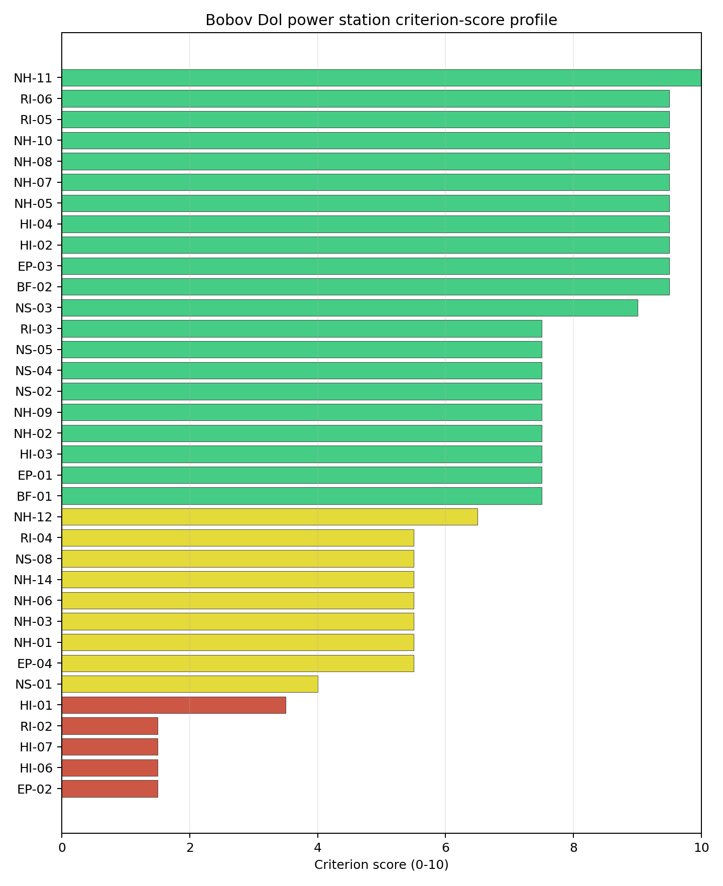
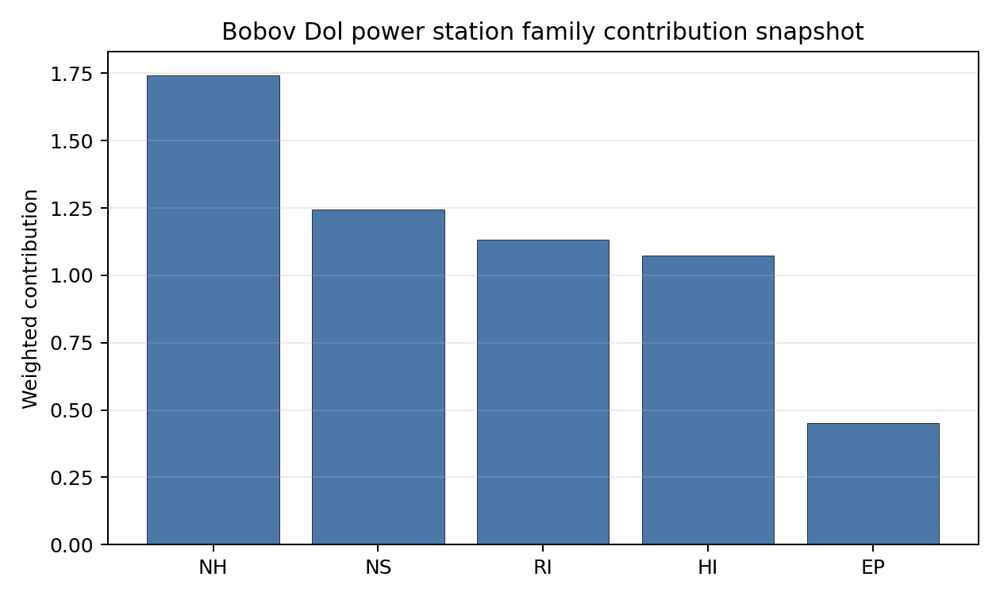

# Bobov Dol power station Site Profile

Bobov Dol power station is a coal/thermal site in Bulgaria that has been tested against the NuScale VOYGR-6 reference deployment envelope. This profile reads the screening evidence at a level that supports a decision to progress toward Stage 3 characterization. It is not a site-suitability determination, vendor recommendation, or licensing finding.

## Site Snapshot

| Field | Value |
| --- | --- |
| Site name | Bobov Dol power station |
| Coordinates | 42.2858, 23.0328 |
| Subnational unit | Kyustendil |
| Installed thermal capacity (source data) | 1,030 MW |
| Available surface area | 63.0 ha |
| Available surface area for development | 114.2 ha |
| Composite score (baseline weights) | 6.984 (6.220-7.525 MC band) |
| National stability band | H (top-10% hit rate 0%) |
| National rank | 5 |

_See the country status map in_ [Bulgaria Country Profile](../BG_country_prototype.md#country-status-map).

## Ownership and Coal-to-Nuclear Context

- **Newbury Management Ltd** (22.00% share); immediate operator Konsorcium Energia MK AD. Path: Newbury Management Ltd -> Konsorcium Energia MK AD [22.0%] -> Bobov Dol power station Unit 5 [100.0%]
- **Stoket Ltd** (64.00% share); immediate operator Konsorcium Energia MK AD. Path: Stoket Ltd -> Konsorcium Energia MK AD [64.0%] -> Bobov Dol power station Unit 2 [100.0%]
- **small shareholder(s)** (4.00% share); immediate operator Konsorcium Energia MK AD. Path: small shareholder(s)  -> Konsorcium Energia MK AD [4.0%] -> Bobov Dol power station Unit 5 [100.0%]
- **Cowlan Corp Ltd** (10.00% share); immediate operator Konsorcium Energia MK AD. Path: Cowlan Corp Ltd -> Konsorcium Energia MK AD [10.0%] -> Bobov Dol power station Unit 5 [100.0%]

Generating units on record: 2 cancelled, 3 operating.
Earliest unit commissioning: 1973; most recent: 1975.

## Natural Hazards (NH)

- **Seismic: Ground Motion (NH-01)** - score 5.5/10 (MC 5.0-6.0) — pass-mark band: At or below the score-5 risk boundary., weight 0.0455, data quality high. Evidence: PGA at 475-year return period 0.19 g; PGA at 2,475-year return period 0.393 g; Vs30 reference (m/s): 760.0.
- **Seismic: Surface Rupture (NH-02)** - score 7.5/10 (MC 7.0-8.0), weight n/a, data quality screening grade. Evidence: nearest mapped capable fault 11.1 km; fault slip rate 0.158 mm/yr; fault name: BGCF017; E1 verdict (radius 5 km): outside the SSG-9 capable-fault screening envelope.
- **Geotechnical: Liquefaction (NH-03)** - score 5.5/10 (MC 5.0-6.0) — pass-mark band: Moderate susceptibility, or high/very-high with documented (or pending for `high`) mitigation., weight n/a, data quality medium. Evidence: liquefaction susceptibility: moderate; dominant soil type: clay_loam.
- **Geotechnical: Slope Stability (NH-04)** - score no native score (unscored — no band matched), weight n/a, data quality screening grade. Evidence: not measured at this site (criterion remains unscored).
- **Geotechnical: Subsidence (NH-05)** - score 9.5/10 (MC 9.0-10.0) — favorable: No karst; mine-feature distance well above the score-5 pivot (or unknown)., weight 0.0354, data quality medium. Evidence: karst present: no; karst severity: none.
- **Geotechnical: Foundation (NH-06)** - score 5.5/10 (MC 5.0-6.0) — pass-mark band: Typical European mixed conditions (bearing 80-150 kPa)., weight 0.0253, data quality medium. Evidence: bearing capacity 88.7 kPa; depth to bedrock 19.5 m.
- **Volcanism (NH-07)** - score 9.5/10 (MC 9.0-10.0) — favorable: Very strong margin above the score-5 boundary (or connector confirmed no in-radius signal)., weight n/a, data quality high. Evidence: volcanic hazard class: negligible.
- **Coastal Flooding (NH-08)** - score 9.5/10 (MC 9.0-10.0) — favorable: Non-coastal OR elevation >= 50 m AMSL OR landlocked country, with no positive marine-hazard signal., weight 0.0303, data quality medium. Evidence: distance to coast 181.4 km.
- **River Flooding (NH-09)** - score 7.5/10 (MC 7.0-8.0), weight 0.0404, data quality medium. Evidence: flood zone class: negligible.
- **Extreme Winds (NH-10)** - score 9.5/10 (MC 9.0-10.0) — favorable: Lowest relative wind exposure in the current ERA5 monthly-means gust set (< 7.5 m/s)., weight 0.0152, data quality medium. Evidence: design wind speed 6.95 m/s.
- **Extreme Precipitation (NH-11)** - score 10.0/10 (MC 9.0-10.0) — favorable: aggregated(mean_of_sub_scores), weight 0.0152, data quality medium. Evidence: extreme daily precipitation 0.18 mm; mean annual precipitation 17.2 mm/yr.
- **Extreme Temperatures (NH-12)** - score 6.5/10 (MC 6.0-7.0) — pass-mark band: aggregated(mean_of_sub_scores), weight 0.0202, data quality medium. Evidence: extreme high temperature 24.4 deg C; extreme low temperature -4.61 deg C.
- **Combined Hazards (NH-14)** - score 5.5/10 (MC 5.0-6.0) — pass-mark band: At least 5 resolved, exactly one moderate hazard (3-5) or moderate interaction only., weight 0.0152, data quality n/a. Evidence: values not in measurement tables.

### Interpretation - Natural Hazards (NH)

<!-- specialist key=family_natural_hazards scope=site site_id=b01fe781-dbc7-40f8-a544-946288020042 bundle=BG_bobov_dol_power_station_site_bundle.json status=pending -->
> _Specialist interpretation pending: Interpretation - Natural Hazards (NH). Cursor agent fills via `python -m scripts.run_specialist_pass show --country <CC> --site-name <name> --key family_natural_hazards` then `... patch --country <CC> --site-name <name> --key family_natural_hazards --text-file <draft.md>`._
<!-- /specialist key=family_natural_hazards -->

## Human-Induced and Security-Relevant Hazards (HI)

- **Aircraft Crash (HI-01)** - score 3.5/10 (MC 3.0-4.0), weight 0.0354, data quality high. Evidence: nearest airport 3.62 km; nearest flight path 1.81 km; airports within search radius 3; airport name: Panicharevo Airfield; airport type: small_airport.
- **Industrial Explosions (HI-02)** - score 9.5/10 (MC 9.0-10.0) — favorable: Very strong margin above the score-5 boundary (or completed search confirmed no in-radius signal)., weight 0.0354, data quality high. Evidence: nearest industrial site 27.8 km.
- **Toxic/Gas Releases (HI-03)** - score 7.5/10 (MC 7.0-8.0), weight 0.0354, data quality high. Evidence: nearest toxic source 27.8 km.
- **External Fires (HI-04)** - score 9.5/10 (MC 9.0-10.0) — favorable: > 15 km, or completed flammable-storage search found nothing in radius., weight 0.0303, data quality high. Evidence: values not in measurement tables.
- **Military Installations (HI-06)** - score 1.5/10 (MC 1.0-2.0), weight 0.0303, data quality medium. Evidence: nearest military installation 10.8 km; military installations within radius 4; installation name: unnamed.
- **Electromagnetic Interference (HI-07)** - score 1.5/10 (MC 1.0-2.0), weight 0.0101, data quality medium. Evidence: nearest high-power transmitter 0.24 km; transmitters within radius 11; transmitter type: mast.

### Interpretation - Human-Induced and Security-Relevant Hazards (HI)

<!-- specialist key=family_human_hazards scope=site site_id=b01fe781-dbc7-40f8-a544-946288020042 bundle=BG_bobov_dol_power_station_site_bundle.json status=pending -->
> _Specialist interpretation pending: Interpretation - Human-Induced and Security-Relevant Hazards (HI). Cursor agent fills via `python -m scripts.run_specialist_pass show --country <CC> --site-name <name> --key family_human_hazards` then `... patch --country <CC> --site-name <name> --key family_human_hazards --text-file <draft.md>`._
<!-- /specialist key=family_human_hazards -->

## Radiological Impact and Emergency Planning (RI / EP)

- **Emergency Planning Feasibility (EP-01)** - score 7.5/10 (MC 7.0-8.0), weight n/a, data quality high. Evidence: EP feasibility composite 67.5 /100; road sub-score 38.9 /100; special-population sub-score 90.0 /100; geography sub-score 95.0 /100; population sub-score 95.0 /100; evacuation feasible: yes.
- **Evacuation Routes (EP-02)** - score 1.5/10 (MC 1.0-2.0), weight 0.0303, data quality medium. Evidence: road density in EPZ 0.289 km/km2; road length in EPZ 566.5 km; motorway access: yes.
- **Physical Geography Constraints (EP-03)** - score 9.5/10 (MC 9.0-10.0) — favorable: No measured relief; open river/waterway context (interim screening)., weight 0.0253, data quality medium. Evidence: waterways crossing EPZ 0; major river barrier: no.
- **Special Populations (EP-04)** - score 5.5/10 (MC 5.0-6.0) — pass-mark band: 9-25., weight 0.0303, data quality medium. Evidence: hospitals in EPZ 7; prisons in EPZ 2; care homes in EPZ 0.
- **Atmospheric Dispersion (RI-01)** - score no native score (unscored — no band matched), weight 0.0303, data quality medium. Evidence: annual mean wind speed 0.65 m/s; atmospheric mixing height 480.0 m; prevailing wind direction: N.
- **Surface Water Dispersion (RI-02)** - score 1.5/10 (MC 1.0-2.0), weight 0.0253, data quality n/a. Evidence: values not in measurement tables.
- **Groundwater Dispersion (RI-03)** - score 7.5/10 (MC 7.0-8.0), weight 0.0253, data quality medium. Evidence: aquifer type: low permeability.
- **Population Density at EPZ Radii (RI-04)** - score 5.5/10 (MC 5.0-6.0) — pass-mark band: aggregated(min_of_sub_scores), weight 0.0404, data quality screening grade. Evidence: population density within 5 km 39.0 /km2; population density within 16 km 65.7 /km2; population density within 25 km 41.1 /km2; population density within 80 km 104.7 /km2; population within 25 km 80,679 people.
- **Distance to Population Centres (RI-05)** - score 9.5/10 (MC 9.0-10.0) — favorable: Nearest >=50k population-centre proxy exceeds required distance by >= 50 %., weight 0.0505, data quality screening grade. Evidence: nearest city above 50k people 35.3 km; nearest city population 70,285 people; city name: Pernik.
- **Population Projections (RI-06)** - score 9.5/10 (MC 9.0-10.0) — favorable: Declining (< -0.5 %/yr)., weight 0.0253, data quality screening grade. Evidence: annual population growth rate -1.88 %/yr; projected population at 25 km in 60 yr 59,955 people.

### Interpretation - Radiological Impact and Emergency Planning (RI / EP)

<!-- specialist key=family_radiological_emergency scope=site site_id=b01fe781-dbc7-40f8-a544-946288020042 bundle=BG_bobov_dol_power_station_site_bundle.json status=pending -->
> _Specialist interpretation pending: Interpretation - Radiological Impact and Emergency Planning (RI / EP). Cursor agent fills via `python -m scripts.run_specialist_pass show --country <CC> --site-name <name> --key family_radiological_emergency` then `... patch --country <CC> --site-name <name> --key family_radiological_emergency --text-file <draft.md>`._
<!-- /specialist key=family_radiological_emergency -->

## Non-Safety and Implementation Considerations (NS)

- **Grid Capacity Basic Filter (BF-01)** - score 7.5/10 (MC 7.0-8.0), weight n/a, data quality n/a. Evidence: values not in measurement tables.
- **Land Area Basic Filter (BF-02)** - score 9.5/10 (MC 9.0-10.0) — favorable: Contiguous and buildable >= ideal area (70 ha/module)., weight 0.0253, data quality n/a. Evidence: values not in measurement tables.
- **Cooling Water Availability (NS-01)** - score 4.0/10 (MC 4.0-5.0), weight 0.0404, data quality screening grade. Evidence: distance to cooling source 6.26 km; cooling source flow 4.77 m3/s; cooling source type: small_river; cooling source name: Разметаница; water stress label: High.
- **Grid Connection (NS-02)** - score 7.5/10 (MC 7.0-8.0), weight 0.0404, data quality high. Evidence: nearest substation 0.12 km; nearest high-voltage line 0.32 km; highest nearby line voltage 220.0 kV; grid export capacity 570.0 MW; substations within radius 381; HV lines within radius 300.
- **Transport Access (NS-03)** - score 9.0/10 (MC 9.0-10.0) — favorable: aggregated(weighted_mean_of_sub_scores), weight 0.0404, data quality high. Evidence: nearest highway 1.56 km; nearest rail line 0.32 km; heavy-haul capable: yes.
- **Site Topography (NS-04)** - score 7.5/10 (MC 7.0-8.0), weight 0.0303, data quality screening grade. Evidence: favourable land cover 78.6 %; moderate land cover 21.4 %; unfavourable land cover 0 %; favourable area 206.4 ha; dominant land class: 211.
- **Site Footprint Adequacy (NS-05)** - score 7.5/10 (MC 7.0-8.0), weight 0.0253, data quality high. Evidence: buildable area 114.2 ha; largest contiguous patch 114.2 ha; buildable patch count 9.
- **Existing Infrastructure (NS-06)** - score no native score (unscored — no band matched), weight 0.0253, data quality n/a. Evidence: not measured at this site (criterion remains unscored).
- **Ecological Sensitivity (NS-08)** - score 5.5/10 (MC 5.0-6.0) — pass-mark band: Both networks NULL or >= 5 km., weight n/a, data quality high. Evidence: natural land cover 0 %; distance to nearest Natura 2000 site 5.836 km; distance to nearest protected area 9.78 km; Natura 2000 overlap: no; Natura 2000 sensitivity class: low; protected-area overlap: no; protected-area sensitivity class: low; nearest Natura 2000 site: Skrino; Natura 2000 sites within 5 km: 0; nearest protected-area designation: Protected Site.
- **Workforce Availability (NS-10)** - score no native score (unscored — no band matched), weight 0.0202, data quality n/a. Evidence: not measured at this site (criterion remains unscored).
- **Regulatory/Political Environment (NS-12)** - score no native score (unscored — no band matched), weight 0.0303, data quality n/a. Evidence: not measured at this site (criterion remains unscored).
- **Construction Logistics (NS-13)** - score no native score (unscored — no band matched), weight 0.0202, data quality n/a. Evidence: not measured at this site (criterion remains unscored).

### Interpretation - Non-Safety and Implementation Considerations (NS)

<!-- specialist key=family_infrastructure scope=site site_id=b01fe781-dbc7-40f8-a544-946288020042 bundle=BG_bobov_dol_power_station_site_bundle.json status=pending -->
> _Specialist interpretation pending: Interpretation - Non-Safety and Implementation Considerations (NS). Cursor agent fills via `python -m scripts.run_specialist_pass show --country <CC> --site-name <name> --key family_infrastructure` then `... patch --country <CC> --site-name <name> --key family_infrastructure --text-file <draft.md>`._
<!-- /specialist key=family_infrastructure -->

## Composite Score and Stability

Baseline composite score is 6.984, bracketed by Monte Carlo at 6.220-7.525. National stability band is `H` with a top-10% hit rate of 0% across 12 scored Monte Carlo scenarios.

<!-- specialist key=stability scope=site site_id=b01fe781-dbc7-40f8-a544-946288020042 bundle=BG_bobov_dol_power_station_site_bundle.json status=pending -->
> _Specialist interpretation pending: Composite stability and sensitivity (plain-English read). Cursor agent fills via `python -m scripts.run_specialist_pass show --country <CC> --site-name <name> --key stability` then `... patch --country <CC> --site-name <name> --key stability --text-file <draft.md>`._
<!-- /specialist key=stability -->

## Residual Risk Register

<!-- specialist key=residual_risk scope=site site_id=b01fe781-dbc7-40f8-a544-946288020042 bundle=BG_bobov_dol_power_station_site_bundle.json status=pending -->
> _Specialist interpretation pending: Residual risk register (specialist synthesis). Cursor agent fills via `python -m scripts.run_specialist_pass show --country <CC> --site-name <name> --key residual_risk` then `... patch --country <CC> --site-name <name> --key residual_risk --text-file <draft.md>`._
<!-- /specialist key=residual_risk -->

## Stage 3 Follow-Up Checklist

- [ ] Resolve **Aircraft Crash (HI-01)** avoidance flag - measured {"flight_path_distance_km": 1.81, "under_flight_path": false} vs threshold A4 — SSG-35: flight-path overhead / < 4 km from airway (large + medium classes only)..
- [ ] Re-measure **Evacuation Routes (EP-02)** - native score 1.5/10 with confidence medium.
- [ ] Re-measure **Military Installations (HI-06)** - native score 1.5/10 with confidence medium.
- [ ] Re-measure **Electromagnetic Interference (HI-07)** - native score 1.5/10 with confidence medium.
- [ ] Re-measure **Surface Water Dispersion (RI-02)** - native score 1.5/10 with confidence insufficient.
- [ ] Re-measure **Aircraft Crash (HI-01)** - native score 3.5/10 with confidence high.
- [ ] Improve data quality for **Geotechnical: Subsidence & Collapse (NH-05b)** - current flag `low`.

## Evidence Limitations

- Geotechnical: Subsidence & Collapse (NH-05b) - quality `low`.
