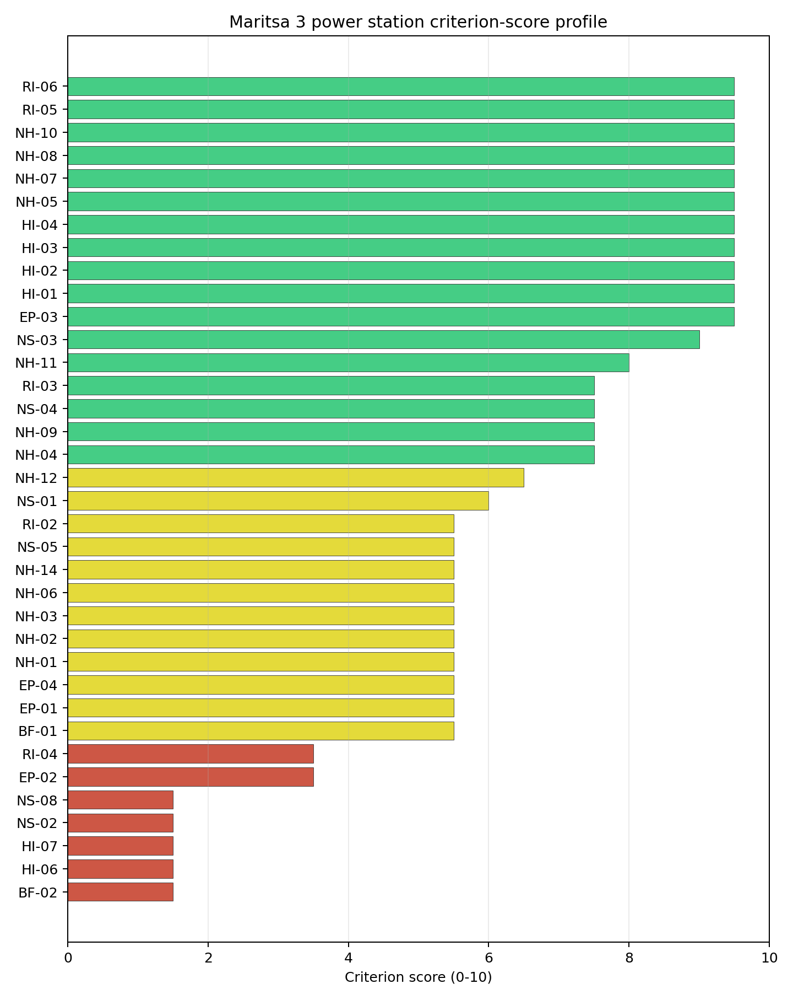
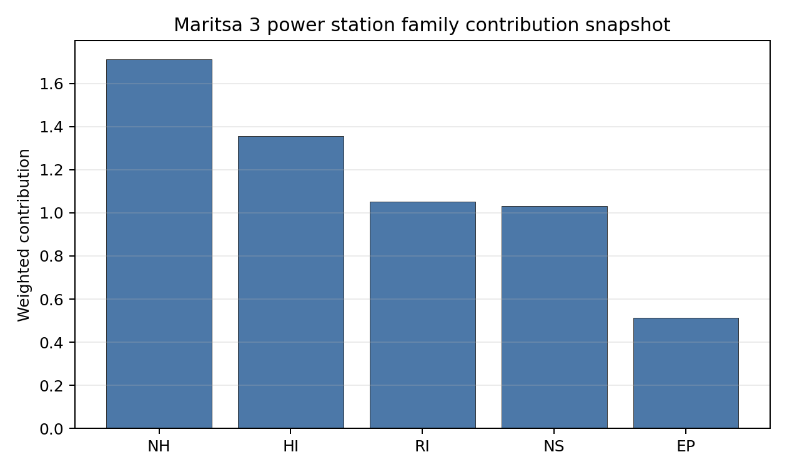

# Maritsa 3 power station Site Profile

Maritsa 3 power station is a coal/thermal site in Bulgaria that has been tested against the NuScale VOYGR-6 reference deployment envelope. This profile reads the screening evidence at a level that supports a decision to progress toward Stage 3 characterization. It is not a site-suitability determination, vendor recommendation, or licensing finding.

## Site Snapshot

| Field | Value |
| --- | --- |
| Site name | Maritsa 3 power station |
| Coordinates | 42.0519, 25.6233 |
| Subnational unit | Haskovo |
| Installed thermal capacity (source data) | 120 MW |
| Available surface area | 18.9 ha |
| Available surface area for development | 18.9 ha |
| Composite score (baseline weights) | 7.009 (6.240-7.569 MC band) |
| National stability band | H (top-10% hit rate 0%) |
| National rank | 4 |

_See the country status map in_ [Bulgaria Country Profile](../BG_country_prototype.md#country-status-map).

## Ownership and Coal-to-Nuclear Context

- **Draft EOOD** (46.01% share), headquartered in Bulgaria; immediate operator TEC Maritsa 3 AD. Path: Draft EOOD  -> TEC Maritsa 3 AD [46.01%] -> Maritsa 3 power station -- [100.0%]
- **Draft AG** (46.01% share), headquartered in Liechtenstein; immediate operator TEC Maritsa 3 AD. Path: Draft AG -> Draft EOOD  [100.0%] -> TEC Maritsa 3 AD [46.01%] -> Maritsa 3 power station -- [100.0%]
- **Heatherdell Ltd** (49.00% share), headquartered in United Kingdom; immediate operator TEC Maritsa 3 AD. Path: Heatherdell Ltd -> Top Group EOOD  [100.0%] -> TEC Maritsa 3 AD [49.0%] -> Maritsa 3 power station -- [100.0%]
- **TEC Maritsa 3 AD** (100.00% share), headquartered in Bulgaria; immediate operator TEC Maritsa 3 AD. Path: TEC Maritsa 3 AD -> Maritsa 3 power station -- [100.0%]
- **natural person(s)** (nan% share); immediate operator TEC Maritsa 3 AD. Path: natural person(s)  -> Heatherdell Ltd [unknown %] -> Top Group EOOD  [100.0%] -> TEC Maritsa 3 AD [49.0%] -> Maritsa 3 power station -- [100.0%]
- **Top Group EOOD** (49.00% share), headquartered in Bulgaria; immediate operator TEC Maritsa 3 AD. Path: Top Group EOOD  -> TEC Maritsa 3 AD [49.0%] -> Maritsa 3 power station -- [100.0%]

Generating units on record: 1 mothballed.
Earliest unit commissioning: 1971; most recent: 1971.

## Natural Hazards (NH)

- **Seismic: Ground Motion (NH-01)** - score 5.5/10 (MC 5.0-6.0) — pass-mark band: At or below the score-5 risk boundary., weight 0.0455, data quality high. Evidence: PGA at 475-year return period 0.202 g; PGA at 2,475-year return period 0.5 g; Vs30 reference (m/s): 760.0.
- **Seismic: Surface Rupture (NH-02)** - score 5.5/10 (MC 5.0-6.0) — pass-mark band: Borderline acceptable separation: meets the 5.0 km score boundary; check against the active run-profile screening radius and local capability evidence., weight n/a, data quality screening grade. Evidence: nearest mapped capable fault 9.77 km; fault slip rate 0.2 mm/yr; fault name: BGCF000; E1 verdict (radius 5 km): outside the SSG-9 capable-fault screening envelope.
- **Geotechnical: Liquefaction (NH-03)** - score 5.5/10 (MC 5.0-6.0) — pass-mark band: Moderate susceptibility, or high/very-high with documented (or pending for `high`) mitigation., weight n/a, data quality medium. Evidence: liquefaction susceptibility: high; dominant soil type: clay_loam.
- **Geotechnical: Slope Stability (NH-04)** - score 7.5/10 (MC 7.0-8.0), weight n/a, data quality screening grade. Evidence: site slope 7.17 deg; max slope in 1 km box 79.3 deg; slope stability class: moderate.
- **Geotechnical: Subsidence (NH-05)** - score 9.5/10 (MC 9.0-10.0) — favorable: No karst; mine-feature distance well above the score-5 pivot (or unknown)., weight 0.0354, data quality medium. Evidence: karst present: no; karst severity: none.
- **Geotechnical: Foundation (NH-06)** - score 5.5/10 (MC 5.0-6.0) — pass-mark band: Typical European mixed conditions (bearing 80-150 kPa)., weight 0.0253, data quality medium. Evidence: bearing capacity 92.0 kPa; depth to bedrock 24.1 m.
- **Volcanism (NH-07)** - score 9.5/10 (MC 9.0-10.0) — favorable: Very strong margin above the score-5 boundary (or connector confirmed no in-radius signal)., weight n/a, data quality high. Evidence: volcanic hazard class: negligible.
- **Coastal Flooding (NH-08)** - score 9.5/10 (MC 9.0-10.0) — favorable: Non-coastal OR elevation >= 50 m AMSL OR landlocked country, with no positive marine-hazard signal., weight 0.0303, data quality medium. Evidence: distance to coast 125.2 km.
- **River Flooding (NH-09)** - score 7.5/10 (MC 7.0-8.0), weight 0.0404, data quality medium. Evidence: flood zone class: negligible.
- **Extreme Winds (NH-10)** - score 9.5/10 (MC 9.0-10.0) — favorable: Lowest relative wind exposure in the current ERA5 monthly-means gust set (< 7.5 m/s)., weight 0.0152, data quality medium. Evidence: design wind speed 6.3 m/s.
- **Extreme Precipitation (NH-11)** - score 8.0/10 (MC 8.0-9.0) — favorable: aggregated(mean_of_sub_scores), weight 0.0152, data quality medium. Evidence: extreme daily precipitation 0.2 mm; mean annual precipitation 21.2 mm/yr.
- **Extreme Temperatures (NH-12)** - score 6.5/10 (MC 6.0-7.0) — pass-mark band: aggregated(mean_of_sub_scores), weight 0.0202, data quality medium. Evidence: extreme high temperature 27.7 deg C; extreme low temperature -3.2 deg C.
- **Combined Hazards (NH-14)** - score 5.5/10 (MC 5.0-6.0) — pass-mark band: At least 5 resolved, exactly one moderate hazard (3-5) or moderate interaction only., weight 0.0152, data quality n/a. Evidence: values not in measurement tables.

### Interpretation - Natural Hazards (NH)

<!-- specialist key=family_natural_hazards scope=site site_id=3bb6666f-de2f-4c6f-a28e-c3bddb71b54a bundle=BG_maritsa_3_power_station_site_bundle.json status=pending -->
> _Specialist interpretation pending: Interpretation - Natural Hazards (NH). Cursor agent fills via `python -m scripts.run_specialist_pass show --country <CC> --site-name <name> --key family_natural_hazards` then `... patch --country <CC> --site-name <name> --key family_natural_hazards --text-file <draft.md>`._
<!-- /specialist key=family_natural_hazards -->

## Human-Induced and Security-Relevant Hazards (HI)

- **Aircraft Crash (HI-01)** - score 9.5/10 (MC 9.0-10.0) — favorable: Nearest large/medium airport > 30 km, no flight-path proxy < 4 km, and no military airbase within 60 km., weight 0.0354, data quality high. Evidence: nearest airport 17.9 km; nearest flight path 8.92 km; airports within search radius 2; airport name: Gorski Izvor Airstrip; airport type: small_airport.
- **Industrial Explosions (HI-02)** - score 9.5/10 (MC 9.0-10.0) — favorable: Very strong margin above the score-5 boundary (or completed search confirmed no in-radius signal)., weight 0.0354, data quality medium. Evidence: values not in measurement tables.
- **Toxic/Gas Releases (HI-03)** - score 9.5/10 (MC 9.0-10.0) — favorable: Very strong margin above the score-5 boundary (or completed search confirmed no in-radius signal)., weight 0.0354, data quality medium. Evidence: values not in measurement tables.
- **External Fires (HI-04)** - score 9.5/10 (MC 9.0-10.0) — favorable: > 15 km, or completed flammable-storage search found nothing in radius., weight 0.0303, data quality medium. Evidence: values not in measurement tables.
- **Military Installations (HI-06)** - score 1.5/10 (MC 1.0-2.0), weight 0.0303, data quality medium. Evidence: nearest military installation 9.99 km; military installations within radius 6; installation name: unnamed.
- **Electromagnetic Interference (HI-07)** - score 1.5/10 (MC 1.0-2.0), weight 0.0101, data quality medium. Evidence: nearest high-power transmitter 0.54 km; transmitters within radius 34; transmitter type: mast.

### Interpretation - Human-Induced and Security-Relevant Hazards (HI)

<!-- specialist key=family_human_hazards scope=site site_id=3bb6666f-de2f-4c6f-a28e-c3bddb71b54a bundle=BG_maritsa_3_power_station_site_bundle.json status=pending -->
> _Specialist interpretation pending: Interpretation - Human-Induced and Security-Relevant Hazards (HI). Cursor agent fills via `python -m scripts.run_specialist_pass show --country <CC> --site-name <name> --key family_human_hazards` then `... patch --country <CC> --site-name <name> --key family_human_hazards --text-file <draft.md>`._
<!-- /specialist key=family_human_hazards -->

## Radiological Impact and Emergency Planning (RI / EP)

- **Emergency Planning Feasibility (EP-01)** - score 5.5/10 (MC 5.0-6.0) — pass-mark band: At or above the composite score-5 boundary., weight n/a, data quality high. Evidence: EP feasibility composite 56.9 /100; road sub-score 45.5 /100; special-population sub-score 90.0 /100; geography sub-score 95.0 /100; population sub-score 60.0 /100; evacuation feasible: yes.
- **Evacuation Routes (EP-02)** - score 3.5/10 (MC 3.0-4.0), weight 0.0303, data quality medium. Evidence: road density in EPZ 0.392 km/km2; road length in EPZ 770.0 km; motorway access: yes.
- **Physical Geography Constraints (EP-03)** - score 9.5/10 (MC 9.0-10.0) — favorable: No measured relief; open river/waterway context (interim screening)., weight 0.0253, data quality medium. Evidence: waterways crossing EPZ 0; major river barrier: no.
- **Special Populations (EP-04)** - score 5.5/10 (MC 5.0-6.0) — pass-mark band: 9-25., weight 0.0303, data quality medium. Evidence: hospitals in EPZ 15; prisons in EPZ 0; care homes in EPZ 0.
- **Atmospheric Dispersion (RI-01)** - score no native score (unscored — no band matched), weight 0.0303, data quality medium. Evidence: annual mean wind speed 0.78 m/s; atmospheric mixing height 482.1 m; prevailing wind direction: NW.
- **Surface Water Dispersion (RI-02)** - score 5.5/10 (MC 5.0-6.0) — pass-mark band: 30-100 m3/s., weight 0.0253, data quality n/a. Evidence: values not in measurement tables.
- **Groundwater Dispersion (RI-03)** - score 7.5/10 (MC 7.0-8.0), weight 0.0253, data quality medium. Evidence: aquifer type: low permeability.
- **Population Density at EPZ Radii (RI-04)** - score 3.5/10 (MC 3.0-4.0), weight 0.0404, data quality screening grade. Evidence: population density within 5 km 316.0 /km2; population density within 16 km 131.2 /km2; population density within 25 km 76.4 /km2; population density within 80 km 65.7 /km2; population within 25 km 149,923 people.
- **Distance to Population Centres (RI-05)** - score 9.5/10 (MC 9.0-10.0) — favorable: Nearest >=50k population-centre proxy exceeds required distance by >= 50 %., weight 0.0505, data quality screening grade. Evidence: nearest city above 50k people 18.0 km; nearest city population 67,086 people; city name: Haskovo.
- **Population Projections (RI-06)** - score 9.5/10 (MC 9.0-10.0) — favorable: Declining (< -0.5 %/yr)., weight 0.0253, data quality screening grade. Evidence: annual population growth rate -1.486 %/yr; projected population at 25 km in 60 yr 111,418 people.

### Interpretation - Radiological Impact and Emergency Planning (RI / EP)

<!-- specialist key=family_radiological_emergency scope=site site_id=3bb6666f-de2f-4c6f-a28e-c3bddb71b54a bundle=BG_maritsa_3_power_station_site_bundle.json status=pending -->
> _Specialist interpretation pending: Interpretation - Radiological Impact and Emergency Planning (RI / EP). Cursor agent fills via `python -m scripts.run_specialist_pass show --country <CC> --site-name <name> --key family_radiological_emergency` then `... patch --country <CC> --site-name <name> --key family_radiological_emergency --text-file <draft.md>`._
<!-- /specialist key=family_radiological_emergency -->

## Non-Safety and Implementation Considerations (NS)

- **Grid Capacity Basic Filter (BF-01)** - score 5.5/10 (MC 5.0-6.0) — pass-mark band: Note: substation 15-30 km OR 110-219 kV; reinforcement plausible., weight n/a, data quality n/a. Evidence: values not in measurement tables.
- **Land Area Basic Filter (BF-02)** - score 1.5/10 (MC 1.0-2.0), weight 0.0253, data quality n/a. Evidence: values not in measurement tables.
- **Cooling Water Availability (NS-01)** - score 6.0/10 (MC 6.0-7.0) — pass-mark band: aggregated(weighted_mean_of_sub_scores), weight 0.0404, data quality screening grade. Evidence: distance to cooling source 0.62 km; cooling source flow 76.0 m3/s; cooling source type: river; cooling source name: Maritsa; water stress label: High.
- **Grid Connection (NS-02)** - score 1.5/10 (MC 1.0-2.0), weight 0.0404, data quality high. Evidence: nearest substation 0.21 km; nearest high-voltage line 1.53 km; highest nearby line voltage 110.0 kV; grid export capacity 120.0 MW; substations within radius 339; HV lines within radius 261.
- **Transport Access (NS-03)** - score 9.0/10 (MC 9.0-10.0) — favorable: aggregated(weighted_mean_of_sub_scores), weight 0.0404, data quality high. Evidence: nearest highway 0.76 km; nearest rail line 0.32 km; nearest waterway 3.2 km; heavy-haul capable: yes.
- **Site Topography (NS-04)** - score 7.5/10 (MC 7.0-8.0), weight 0.0303, data quality screening grade. Evidence: favourable land cover 70.2 %; moderate land cover 7.4 %; unfavourable land cover 13.4 %; favourable area 159.2 ha; dominant land class: 211.
- **Site Footprint Adequacy (NS-05)** - score 5.5/10 (MC 5.0-6.0) — pass-mark band: At or above the score-5 boundary., weight 0.0253, data quality high. Evidence: buildable area 18.9 ha; largest contiguous patch 18.9 ha; buildable patch count 10.
- **Existing Infrastructure (NS-06)** - score no native score (unscored — no band matched), weight 0.0253, data quality n/a. Evidence: not measured at this site (criterion remains unscored).
- **Ecological Sensitivity (NS-08)** - score 1.5/10 (MC 1.0-2.0), weight n/a, data quality high. Evidence: natural land cover 13.4 %; distance to nearest Natura 2000 site 0.545 km; distance to nearest protected area 0.512 km; Natura 2000 overlap: no; Natura 2000 sensitivity class: high; protected-area overlap: no; protected-area sensitivity class: moderate; nearest Natura 2000 site: Reka Maritsa; Natura 2000 sites within 5 km: 3; nearest protected-area designation: Protected Site.
- **Workforce Availability (NS-10)** - score no native score (unscored — no band matched), weight 0.0202, data quality n/a. Evidence: not measured at this site (criterion remains unscored).
- **Regulatory/Political Environment (NS-12)** - score no native score (unscored — no band matched), weight 0.0303, data quality n/a. Evidence: not measured at this site (criterion remains unscored).
- **Construction Logistics (NS-13)** - score no native score (unscored — no band matched), weight 0.0202, data quality n/a. Evidence: not measured at this site (criterion remains unscored).

### Interpretation - Non-Safety and Implementation Considerations (NS)

<!-- specialist key=family_infrastructure scope=site site_id=3bb6666f-de2f-4c6f-a28e-c3bddb71b54a bundle=BG_maritsa_3_power_station_site_bundle.json status=pending -->
> _Specialist interpretation pending: Interpretation - Non-Safety and Implementation Considerations (NS). Cursor agent fills via `python -m scripts.run_specialist_pass show --country <CC> --site-name <name> --key family_infrastructure` then `... patch --country <CC> --site-name <name> --key family_infrastructure --text-file <draft.md>`._
<!-- /specialist key=family_infrastructure -->

## Composite Score and Stability

Baseline composite score is 7.009, bracketed by Monte Carlo at 6.240-7.569. National stability band is `H` with a top-10% hit rate of 0% across 12 scored Monte Carlo scenarios.

<!-- specialist key=stability scope=site site_id=3bb6666f-de2f-4c6f-a28e-c3bddb71b54a bundle=BG_maritsa_3_power_station_site_bundle.json status=pending -->
> _Specialist interpretation pending: Composite stability and sensitivity (plain-English read). Cursor agent fills via `python -m scripts.run_specialist_pass show --country <CC> --site-name <name> --key stability` then `... patch --country <CC> --site-name <name> --key stability --text-file <draft.md>`._
<!-- /specialist key=stability -->

## Residual Risk Register

<!-- specialist key=residual_risk scope=site site_id=3bb6666f-de2f-4c6f-a28e-c3bddb71b54a bundle=BG_maritsa_3_power_station_site_bundle.json status=pending -->
> _Specialist interpretation pending: Residual risk register (specialist synthesis). Cursor agent fills via `python -m scripts.run_specialist_pass show --country <CC> --site-name <name> --key residual_risk` then `... patch --country <CC> --site-name <name> --key residual_risk --text-file <draft.md>`._
<!-- /specialist key=residual_risk -->

## Stage 3 Follow-Up Checklist

- [ ] Resolve **Grid Connection (NS-02)** avoidance flag - measured {"grid_export_capacity_mw": 120.0} vs threshold Project A13: transmission >= reference SMR net MWe within feasible distance..
- [ ] Re-measure **Land Area Basic Filter (BF-02)** - native score 1.5/10 with confidence insufficient.
- [ ] Re-measure **Military Installations (HI-06)** - native score 1.5/10 with confidence medium.
- [ ] Re-measure **Electromagnetic Interference (HI-07)** - native score 1.5/10 with confidence medium.
- [ ] Re-measure **Grid Connection (NS-02)** - native score 1.5/10 with confidence high.
- [ ] Re-measure **Ecological Sensitivity (NS-08)** - native score 1.5/10 with confidence high.
- [ ] Improve data quality for **Geotechnical: Subsidence & Collapse (NH-05b)** - current flag `low`.

## Evidence Limitations

- Geotechnical: Subsidence & Collapse (NH-05b) - quality `low`.
