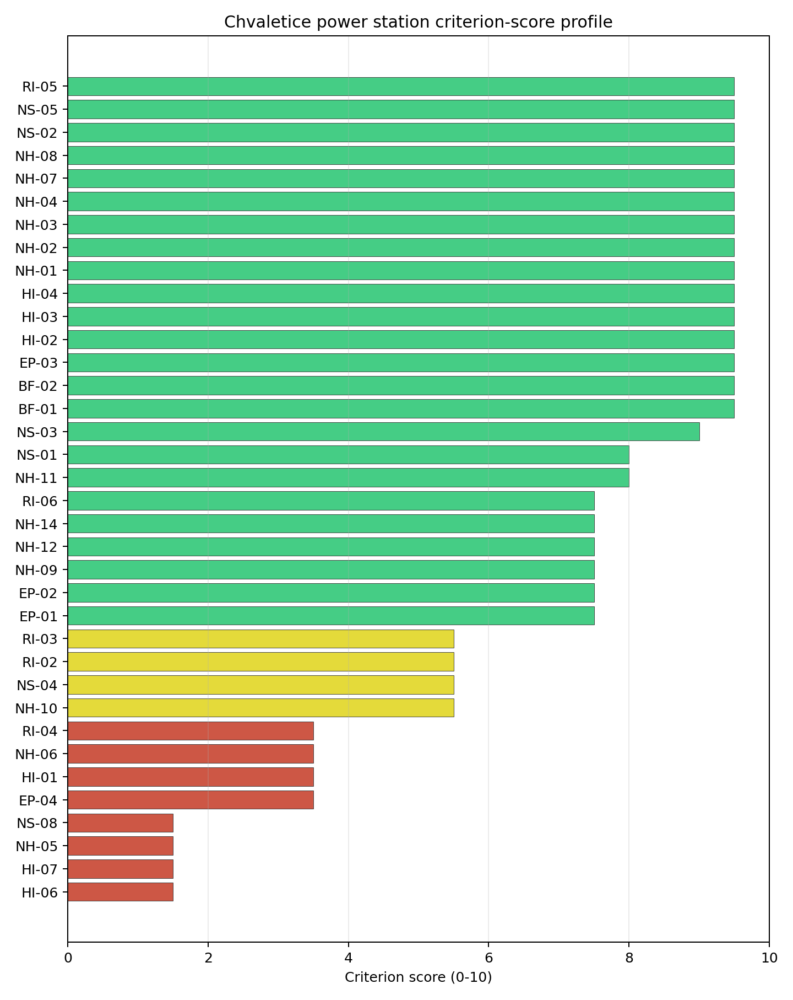
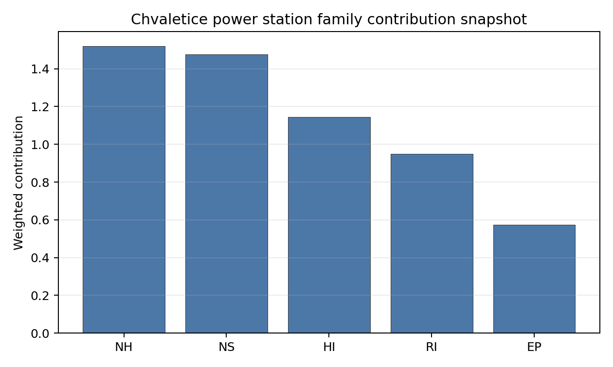

# Chvaletice power station Site Profile

Chvaletice power station is a coal/thermal site in Czechia that has been tested against the NuScale VOYGR-6 reference deployment envelope. This profile reads the screening evidence at a level that supports a decision to progress toward Stage 3 characterization. It is not a site-suitability determination, vendor recommendation, or licensing finding.

## Site Snapshot

| Field | Value |
| --- | --- |
| Site name | Chvaletice power station |
| Coordinates | 50.0281, 15.4505 |
| Subnational unit | Pardubický |
| Installed thermal capacity (source data) | 820 MW |
| Available surface area | 93.9 ha |
| Available surface area for development | 93.9 ha |
| Composite score (baseline weights) | 7.009 (6.240-7.594 MC band) |
| National stability band | D (top-10% hit rate 33%) |
| National rank | 3 |

_See the country status map in_ [Czechia Country Profile](../CZ_country_prototype.md#country-status-map).

## Ownership and Coal-to-Nuclear Context

- **natural person(s)** (100.00% share); immediate operator Sev.en Energy AG. Path: natural person(s)  -> Sev.en Energy AG [100.0%] -> Chvaletice power station Unit 1 [100.0%]
- **Sev.en Energy AG** (100.00% share), headquartered in Liechtenstein; immediate operator Sev.en Energy AG. Path: Sev.en Energy AG -> Chvaletice power station Unit 2 [100.0%]

Generating units on record: 4 operating.
Earliest unit commissioning: 1977; most recent: 1978.

## Natural Hazards (NH)

- **Seismic: Ground Motion (NH-01)** - score 9.5/10 (MC 9.0-10.0) — favorable: Well below the risk boundary., weight 0.0455, data quality high. Evidence: PGA at 475-year return period 0.015 g; PGA at 2,475-year return period 0.034 g; Vs30 reference (m/s): 760.0.
- **Seismic: Surface Rupture (NH-02)** - score 9.5/10 (MC 9.0-10.0) — favorable: Very strong separation from mapped capable faults; surface-rupture concern effectively screened at desk-study level., weight n/a, data quality screening grade. Evidence: nearest mapped capable fault 50.0 km; fault slip rate 0 mm/yr; fault name: none_in_search_radius; E1 verdict (radius 5 km): outside the SSG-9 capable-fault screening envelope.
- **Geotechnical: Liquefaction (NH-03)** - score 9.5/10 (MC 9.0-10.0) — favorable: Negligible susceptibility (Stage-1 favourable default)., weight n/a, data quality medium. Evidence: liquefaction susceptibility: very_low.
- **Geotechnical: Slope Stability (NH-04)** - score 9.5/10 (MC 9.0-10.0) — favorable: Well below the risk boundary., weight n/a, data quality screening grade. Evidence: site slope 4.76 deg; max slope in 1 km box 24.6 deg; slope stability class: gentle.
- **Geotechnical: Subsidence (NH-05)** - score 1.5/10 (MC 1.0-2.0), weight 0.0354, data quality medium. Evidence: karst present: no; karst severity: moderate; formation type: carbonate (Discontinuous carbonate rocks).
- **Geotechnical: Foundation (NH-06)** - score 3.5/10 (MC 3.0-4.0), weight 0.0253, data quality medium. Evidence: depth to bedrock 27.9 m.
- **Volcanism (NH-07)** - score 9.5/10 (MC 9.0-10.0) — favorable: Very strong margin above the score-5 boundary (or connector confirmed no in-radius signal)., weight n/a, data quality high. Evidence: volcanic hazard class: negligible.
- **Coastal Flooding (NH-08)** - score 9.5/10 (MC 9.0-10.0) — favorable: Non-coastal OR elevation >= 50 m AMSL OR landlocked country, with no positive marine-hazard signal., weight 0.0303, data quality medium. Evidence: distance to coast 406.2 km.
- **River Flooding (NH-09)** - score 7.5/10 (MC 5.5-9.5), weight 0.0404, data quality insufficient. Evidence: flood zone class: negligible.
- **Extreme Winds (NH-10)** - score 5.5/10 (MC 5.0-6.0) — pass-mark band: Middle relative wind exposure around the observed set mean (9.0-10.5 m/s)., weight 0.0152, data quality medium. Evidence: design wind speed 9.77 m/s.
- **Extreme Precipitation (NH-11)** - score 8.0/10 (MC 8.0-9.0) — favorable: aggregated(mean_of_sub_scores), weight 0.0152, data quality medium. Evidence: extreme daily precipitation 0.21 mm; mean annual precipitation 25.4 mm/yr.
- **Extreme Temperatures (NH-12)** - score 7.5/10 (MC 7.0-8.0), weight 0.0202, data quality medium. Evidence: extreme high temperature 22.9 deg C; extreme low temperature -4.65 deg C.
- **Combined Hazards (NH-14)** - score 7.5/10 (MC 7.0-8.0), weight 0.0152, data quality n/a. Evidence: values not in measurement tables.

### Interpretation - Natural Hazards (NH)

<!-- specialist key=family_natural_hazards scope=site site_id=d762ceeb-514f-43a6-9f91-a2d422ed6c60 bundle=CZ_chvaletice_power_station_site_bundle.json status=pending -->

<!-- /specialist key=family_natural_hazards -->

## Human-Induced and Security-Relevant Hazards (HI)

- **Aircraft Crash (HI-01)** - score 3.5/10 (MC 3.0-4.0), weight 0.0354, data quality high. Evidence: nearest airport 5.05 km; nearest flight path 2.53 km; airports within search radius 18; airport name: Škudly Airstrip; airport type: small_airport.
- **Industrial Explosions (HI-02)** - score 9.5/10 (MC 9.0-10.0) — favorable: Very strong margin above the score-5 boundary (or completed search confirmed no in-radius signal)., weight 0.0354, data quality medium. Evidence: values not in measurement tables.
- **Toxic/Gas Releases (HI-03)** - score 9.5/10 (MC 9.0-10.0) — favorable: Very strong margin above the score-5 boundary (or completed search confirmed no in-radius signal)., weight 0.0354, data quality medium. Evidence: values not in measurement tables.
- **External Fires (HI-04)** - score 9.5/10 (MC 9.0-10.0) — favorable: > 15 km, or completed flammable-storage search found nothing in radius., weight 0.0303, data quality medium. Evidence: values not in measurement tables.
- **Military Installations (HI-06)** - score 1.5/10 (MC 1.0-2.0), weight 0.0303, data quality medium. Evidence: nearest military installation 8.8 km; military installations within radius 174; installation name: ÚŽ-6a Mokošín.
- **Electromagnetic Interference (HI-07)** - score 1.5/10 (MC 1.0-2.0), weight 0.0101, data quality medium. Evidence: nearest high-power transmitter 0.86 km; transmitters within radius 384; transmitter type: communication.

### Interpretation - Human-Induced and Security-Relevant Hazards (HI)

<!-- specialist key=family_human_hazards scope=site site_id=d762ceeb-514f-43a6-9f91-a2d422ed6c60 bundle=CZ_chvaletice_power_station_site_bundle.json status=pending -->

<!-- /specialist key=family_human_hazards -->

## Radiological Impact and Emergency Planning (RI / EP)

- **Emergency Planning Feasibility (EP-01)** - score 7.5/10 (MC 7.0-8.0), weight n/a, data quality high. Evidence: EP feasibility composite 79.8 /100; road sub-score 76.0 /100; special-population sub-score 90.0 /100; geography sub-score 95.0 /100; population sub-score 95.0 /100; evacuation feasible: yes.
- **Evacuation Routes (EP-02)** - score 7.5/10 (MC 7.0-8.0), weight 0.0303, data quality medium. Evidence: road density in EPZ 1.038 km/km2; road length in EPZ 2,039 km; motorway access: yes.
- **Physical Geography Constraints (EP-03)** - score 9.5/10 (MC 9.0-10.0) — favorable: No measured relief; open river/waterway context (interim screening)., weight 0.0253, data quality medium. Evidence: waterways crossing EPZ 0; major river barrier: no.
- **Special Populations (EP-04)** - score 3.5/10 (MC 3.0-4.0), weight 0.0303, data quality medium. Evidence: hospitals in EPZ 28; prisons in EPZ 1; care homes in EPZ 1.
- **Atmospheric Dispersion (RI-01)** - score no native score (unscored — no band matched), weight 0.0303, data quality medium. Evidence: annual mean wind speed 1.27 m/s; atmospheric mixing height 560.0 m; prevailing wind direction: WSW.
- **Surface Water Dispersion (RI-02)** - score 5.5/10 (MC 5.0-6.0) — pass-mark band: 30-100 m3/s., weight 0.0253, data quality n/a. Evidence: values not in measurement tables.
- **Groundwater Dispersion (RI-03)** - score 5.5/10 (MC 5.0-6.0) — pass-mark band: Moderate-permeability aquifer screening proxy., weight 0.0253, data quality medium. Evidence: aquifer type: hard rocks.
- **Population Density at EPZ Radii (RI-04)** - score 3.5/10 (MC 3.0-4.0), weight 0.0404, data quality screening grade. Evidence: population density within 5 km 89.1 /km2; population density within 16 km 113.3 /km2; population density within 25 km 146.0 /km2; population density within 80 km 175.6 /km2; population within 25 km 286,669 people.
- **Distance to Population Centres (RI-05)** - score 9.5/10 (MC 9.0-10.0) — favorable: Nearest >=50k population-centre proxy exceeds required distance by >= 50 %., weight 0.0505, data quality screening grade. Evidence: nearest city above 50k people 22.4 km; nearest city population 88,520 people; city name: Pardubice.
- **Population Projections (RI-06)** - score 7.5/10 (MC 7.0-8.0), weight 0.0253, data quality screening grade. Evidence: annual population growth rate -0.065 %/yr; projected population at 25 km in 60 yr 276,242 people.

### Interpretation - Radiological Impact and Emergency Planning (RI / EP)

<!-- specialist key=family_radiological_emergency scope=site site_id=d762ceeb-514f-43a6-9f91-a2d422ed6c60 bundle=CZ_chvaletice_power_station_site_bundle.json status=pending -->

<!-- /specialist key=family_radiological_emergency -->

## Non-Safety and Implementation Considerations (NS)

- **Grid Capacity Basic Filter (BF-01)** - score 9.5/10 (MC 9.0-10.0) — favorable: Note: substation <= 5 km, >= 400 kV, headroom >= 600 MW., weight n/a, data quality n/a. Evidence: values not in measurement tables.
- **Land Area Basic Filter (BF-02)** - score 9.5/10 (MC 9.0-10.0) — favorable: Contiguous and buildable >= ideal area (70 ha/module)., weight 0.0253, data quality n/a. Evidence: values not in measurement tables.
- **Cooling Water Availability (NS-01)** - score 8.0/10 (MC 7.0-8.0) — favorable: aggregated(weighted_mean_of_sub_scores), weight 0.0404, data quality screening grade. Evidence: distance to cooling source 2.21 km; cooling source flow 52.5 m3/s; cooling source type: river; cooling source name: Morašický potok; water stress label: Low.
- **Grid Connection (NS-02)** - score 9.5/10 (MC 9.0-10.0) — favorable: aggregated(min_of_sub_scores), weight 0.0404, data quality high. Evidence: nearest substation 0.24 km; nearest high-voltage line 0.3 km; highest nearby line voltage 400.0 kV; grid export capacity 1,650 MW; substations within radius 1,039; HV lines within radius 666.
- **Transport Access (NS-03)** - score 9.0/10 (MC 9.0-10.0) — favorable: aggregated(weighted_mean_of_sub_scores), weight 0.0404, data quality high. Evidence: nearest highway 1.68 km; nearest rail line 0.01 km; nearest waterway 3.65 km; heavy-haul capable: yes.
- **Site Topography (NS-04)** - score 5.5/10 (MC 5.0-6.0) — pass-mark band: 40-60 %., weight 0.0303, data quality screening grade. Evidence: favourable land cover 55.3 %; moderate land cover 12.5 %; unfavourable land cover 19.2 %; favourable area 110.3 ha; dominant land class: 211.
- **Site Footprint Adequacy (NS-05)** - score 9.5/10 (MC 9.0-10.0) — favorable: Very strong margin above the score-5 boundary., weight 0.0253, data quality medium. Evidence: buildable area 93.9 ha; largest contiguous patch 93.9 ha; buildable patch count 12.
- **Existing Infrastructure (NS-06)** - score no native score (unscored — no band matched), weight 0.0253, data quality n/a. Evidence: not measured at this site (criterion remains unscored).
- **Ecological Sensitivity (NS-08)** - score 1.5/10 (MC 1.0-2.0), weight n/a, data quality high. Evidence: natural land cover 19.2 %; distance to nearest Natura 2000 site 1.913 km; distance to nearest protected area 4.001 km; Natura 2000 overlap: no; Natura 2000 sensitivity class: moderate; protected-area overlap: no; protected-area sensitivity class: moderate; nearest Natura 2000 site: Louky u Přelouče; Natura 2000 sites within 5 km: 3; nearest protected-area designation: Nature Reserve.
- **Workforce Availability (NS-10)** - score no native score (unscored — no band matched), weight 0.0202, data quality n/a. Evidence: not measured at this site (criterion remains unscored).
- **Regulatory/Political Environment (NS-12)** - score no native score (unscored — no band matched), weight 0.0303, data quality n/a. Evidence: not measured at this site (criterion remains unscored).
- **Construction Logistics (NS-13)** - score no native score (unscored — no band matched), weight 0.0202, data quality n/a. Evidence: not measured at this site (criterion remains unscored).

### Interpretation - Non-Safety and Implementation Considerations (NS)

<!-- specialist key=family_infrastructure scope=site site_id=d762ceeb-514f-43a6-9f91-a2d422ed6c60 bundle=CZ_chvaletice_power_station_site_bundle.json status=pending -->

<!-- /specialist key=family_infrastructure -->

## Composite Score and Stability

Baseline composite score is 7.009, bracketed by Monte Carlo at 6.240-7.594. National stability band is `D` with a top-10% hit rate of 33% across 12 scored Monte Carlo scenarios.

<!-- specialist key=stability scope=site site_id=d762ceeb-514f-43a6-9f91-a2d422ed6c60 bundle=CZ_chvaletice_power_station_site_bundle.json status=pending -->

<!-- /specialist key=stability -->

## Residual Risk Register

<!-- specialist key=residual_risk scope=site site_id=d762ceeb-514f-43a6-9f91-a2d422ed6c60 bundle=CZ_chvaletice_power_station_site_bundle.json status=pending -->

<!-- /specialist key=residual_risk -->

## Stage 3 Follow-Up Checklist

- [ ] Resolve **Aircraft Crash (HI-01)** avoidance flag - measured {"nearest_major_airport_km": 11.0} vs threshold A2 — Project: commercial / large / medium airport < 15 km (SSG-35 ≥ 16 km)..
- [ ] Resolve **Aircraft Crash (HI-01)** avoidance flag - measured {"flight_path_distance_km": 2.53, "under_flight_path": false} vs threshold A4 — SSG-35: flight-path overhead / < 4 km from airway (large + medium classes only)..
- [ ] Re-measure **Military Installations (HI-06)** - native score 1.5/10 with confidence medium.
- [ ] Re-measure **Electromagnetic Interference (HI-07)** - native score 1.5/10 with confidence medium.
- [ ] Re-measure **Geotechnical: Subsidence (NH-05)** - native score 1.5/10 with confidence medium.
- [ ] Re-measure **Ecological Sensitivity (NS-08)** - native score 1.5/10 with confidence high.
- [ ] Re-measure **Special Populations (EP-04)** - native score 3.5/10 with confidence medium.

## Evidence Limitations

- No criterion-family quality fields are flagged as low or missing in this bundle.
