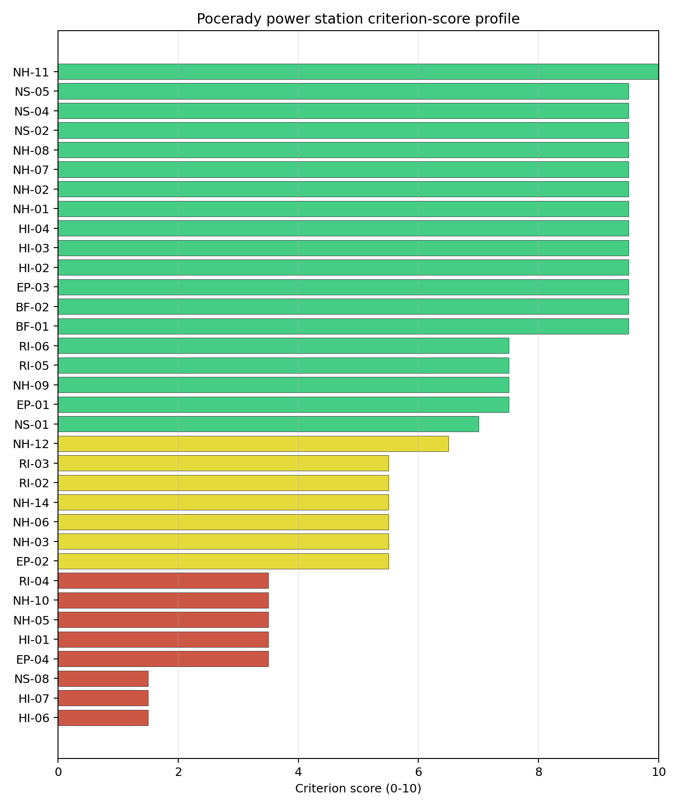
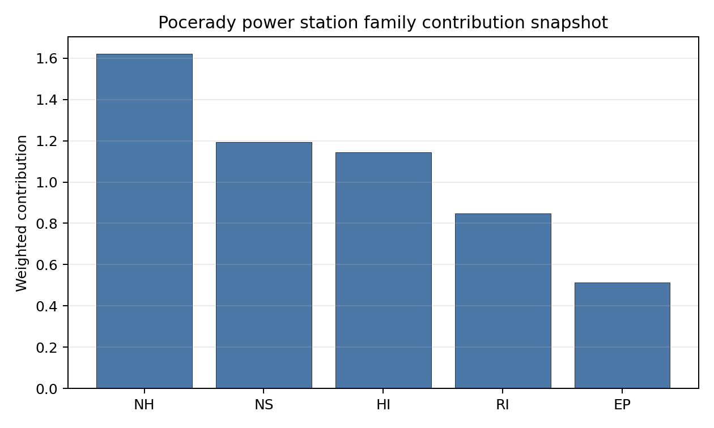

# Pocerady power station Site Profile

Pocerady power station is a coal/thermal site in Czechia that has been tested against the NuScale VOYGR-6 reference deployment envelope. This profile reads the screening evidence at a level that supports a decision to progress toward Stage 3 characterization. It is not a site-suitability determination, vendor recommendation, or licensing finding.

## Site Snapshot

| Field | Value |
| --- | --- |
| Site name | Pocerady power station |
| Coordinates | 50.4267, 13.6747 |
| Subnational unit | Ustecky |
| Installed thermal capacity (source data) | 1,000 MW |
| Available surface area | 90.8 ha |
| Available surface area for development | 90.8 ha |
| Composite score (baseline weights) | 6.931 (6.018-7.526 MC band) |
| National stability band | D (top-10% hit rate 0%) |
| National rank | 4 |

_See the country status map in_ [Czechia Country Profile](../CZ_country_prototype.md#country-status-map).

## Ownership and Coal-to-Nuclear Context

- **natural person(s)** (100.00% share); immediate operator Sev.en Energy AG. Path: natural person(s)  -> Sev.en Energy AG [100.0%] -> Pocerady power station Phase 2 Unit 2 [100.0%]
- **Sev.en Energy AG** (100.00% share), headquartered in Liechtenstein; immediate operator Sev.en Energy AG. Path: Sev.en Energy AG -> Pocerady power station Phase 1 Unit 4 [100.0%]

Generating units on record: 5 operating.
Earliest unit commissioning: 1970; most recent: 1977.

## Natural Hazards (NH)

- **Seismic: Ground Motion (NH-01)** - score 9.5/10 (MC 9.0-10.0) — favorable: Well below the risk boundary., weight 0.0455, data quality high. Evidence: PGA at 475-year return period 0.017 g; PGA at 2,475-year return period 0.034 g; Vs30 reference (m/s): 760.0.
- **Seismic: Surface Rupture (NH-02)** - score 9.5/10 (MC 9.0-10.0) — favorable: Very strong separation from mapped capable faults; surface-rupture concern effectively screened at desk-study level., weight n/a, data quality screening grade. Evidence: nearest mapped capable fault 50.0 km; fault slip rate 0 mm/yr; fault name: none_in_search_radius; E1 verdict (radius 5 km): outside the SSG-9 capable-fault screening envelope.
- **Geotechnical: Liquefaction (NH-03)** - score 5.5/10 (MC 5.0-6.0) — pass-mark band: Moderate susceptibility, or high/very-high with documented (or pending for `high`) mitigation., weight n/a, data quality medium. Evidence: liquefaction susceptibility: high; dominant soil type: clay_loam.
- **Geotechnical: Slope Stability (NH-04)** - score no native score (unscored — no band matched), weight n/a, data quality screening grade. Evidence: not measured at this site (criterion remains unscored).
- **Geotechnical: Subsidence (NH-05)** - score 3.5/10 (MC 3.0-4.0), weight 0.0354, data quality medium. Evidence: karst present: no; karst severity: none.
- **Geotechnical: Foundation (NH-06)** - score 5.5/10 (MC 5.0-6.0) — pass-mark band: Typical European mixed conditions (bearing 80-150 kPa)., weight 0.0253, data quality medium. Evidence: bearing capacity 84.0 kPa; depth to bedrock 27.6 m.
- **Volcanism (NH-07)** - score 9.5/10 (MC 9.0-10.0) — favorable: Very strong margin above the score-5 boundary (or connector confirmed no in-radius signal)., weight n/a, data quality high. Evidence: volcanic hazard class: negligible.
- **Coastal Flooding (NH-08)** - score 9.5/10 (MC 9.0-10.0) — favorable: Non-coastal OR elevation >= 50 m AMSL OR landlocked country, with no positive marine-hazard signal., weight 0.0303, data quality medium. Evidence: distance to coast 362.9 km.
- **River Flooding (NH-09)** - score 7.5/10 (MC 5.5-9.5), weight 0.0404, data quality insufficient. Evidence: flood zone class: negligible.
- **Extreme Winds (NH-10)** - score 3.5/10 (MC 3.0-4.0), weight 0.0152, data quality medium. Evidence: design wind speed 10.7 m/s.
- **Extreme Precipitation (NH-11)** - score 10.0/10 (MC 9.0-10.0) — favorable: aggregated(mean_of_sub_scores), weight 0.0152, data quality medium. Evidence: extreme daily precipitation 0.15 mm; mean annual precipitation 20.3 mm/yr.
- **Extreme Temperatures (NH-12)** - score 6.5/10 (MC 6.0-7.0) — pass-mark band: aggregated(mean_of_sub_scores), weight 0.0202, data quality medium. Evidence: extreme high temperature 23.0 deg C; extreme low temperature -5.68 deg C.
- **Combined Hazards (NH-14)** - score 5.5/10 (MC 5.0-6.0) — pass-mark band: At least 5 resolved, exactly one moderate hazard (3-5) or moderate interaction only., weight 0.0152, data quality n/a. Evidence: values not in measurement tables.

### Interpretation - Natural Hazards (NH)

<!-- specialist key=family_natural_hazards scope=site site_id=32484f7b-18a4-4b21-8e6a-6d68ae099d02 bundle=CZ_pocerady_power_station_site_bundle.json status=pending -->

<!-- /specialist key=family_natural_hazards -->

## Human-Induced and Security-Relevant Hazards (HI)

- **Aircraft Crash (HI-01)** - score 3.5/10 (MC 3.0-4.0), weight 0.0354, data quality high. Evidence: nearest airport 6.03 km; nearest flight path 3.01 km; airports within search radius 21; airport name: Rana Loumy Airfield; airport type: small_airport.
- **Industrial Explosions (HI-02)** - score 9.5/10 (MC 9.0-10.0) — favorable: Very strong margin above the score-5 boundary (or completed search confirmed no in-radius signal)., weight 0.0354, data quality medium. Evidence: values not in measurement tables.
- **Toxic/Gas Releases (HI-03)** - score 9.5/10 (MC 9.0-10.0) — favorable: Very strong margin above the score-5 boundary (or completed search confirmed no in-radius signal)., weight 0.0354, data quality medium. Evidence: values not in measurement tables.
- **External Fires (HI-04)** - score 9.5/10 (MC 9.0-10.0) — favorable: > 15 km, or completed flammable-storage search found nothing in radius., weight 0.0303, data quality medium. Evidence: values not in measurement tables.
- **Military Installations (HI-06)** - score 1.5/10 (MC 1.0-2.0), weight 0.0303, data quality medium. Evidence: nearest military installation 7.84 km; military installations within radius 321; installation name: C-13/21/A-220.
- **Electromagnetic Interference (HI-07)** - score 1.5/10 (MC 1.0-2.0), weight 0.0101, data quality medium. Evidence: nearest high-power transmitter 3.67 km; transmitters within radius 146; transmitter type: mast.

### Interpretation - Human-Induced and Security-Relevant Hazards (HI)

<!-- specialist key=family_human_hazards scope=site site_id=32484f7b-18a4-4b21-8e6a-6d68ae099d02 bundle=CZ_pocerady_power_station_site_bundle.json status=pending -->

<!-- /specialist key=family_human_hazards -->

## Radiological Impact and Emergency Planning (RI / EP)

- **Emergency Planning Feasibility (EP-01)** - score 7.5/10 (MC 7.0-8.0), weight n/a, data quality high. Evidence: EP feasibility composite 76.0 /100; road sub-score 73.2 /100; special-population sub-score 90.0 /100; geography sub-score 95.0 /100; population sub-score 95.0 /100; evacuation feasible: yes.
- **Evacuation Routes (EP-02)** - score 5.5/10 (MC 5.0-6.0) — pass-mark band: Adequate primary routes (0.5-1.0)., weight 0.0303, data quality medium. Evidence: road density in EPZ 0.926 km/km2; road length in EPZ 1,818 km; motorway access: yes.
- **Physical Geography Constraints (EP-03)** - score 9.5/10 (MC 9.0-10.0) — favorable: No measured relief; open river/waterway context (interim screening)., weight 0.0253, data quality medium. Evidence: waterways crossing EPZ 0; major river barrier: no.
- **Special Populations (EP-04)** - score 3.5/10 (MC 3.0-4.0), weight 0.0303, data quality medium. Evidence: hospitals in EPZ 22; prisons in EPZ 3; care homes in EPZ 1.
- **Atmospheric Dispersion (RI-01)** - score no native score (unscored — no band matched), weight 0.0303, data quality medium. Evidence: annual mean wind speed 1.22 m/s; atmospheric mixing height 556.0 m; prevailing wind direction: W.
- **Surface Water Dispersion (RI-02)** - score 5.5/10 (MC 5.0-6.0) — pass-mark band: 30-100 m3/s., weight 0.0253, data quality n/a. Evidence: values not in measurement tables.
- **Groundwater Dispersion (RI-03)** - score 5.5/10 (MC 5.0-6.0) — pass-mark band: Moderate-permeability aquifer screening proxy., weight 0.0253, data quality medium. Evidence: aquifer type: sedimentary sands.
- **Population Density at EPZ Radii (RI-04)** - score 3.5/10 (MC 3.0-4.0), weight 0.0404, data quality screening grade. Evidence: population density within 5 km 36.9 /km2; population density within 16 km 183.7 /km2; population density within 25 km 158.4 /km2; population density within 80 km 249.8 /km2; population within 25 km 310,916 people.
- **Distance to Population Centres (RI-05)** - score 7.5/10 (MC 7.0-8.0), weight 0.0505, data quality screening grade. Evidence: nearest city above 50k people 10.6 km; nearest city population 62,866 people; city name: Most.
- **Population Projections (RI-06)** - score 7.5/10 (MC 7.0-8.0), weight 0.0253, data quality screening grade. Evidence: annual population growth rate -0.271 %/yr; projected population at 25 km in 60 yr 299,608 people.

### Interpretation - Radiological Impact and Emergency Planning (RI / EP)

<!-- specialist key=family_radiological_emergency scope=site site_id=32484f7b-18a4-4b21-8e6a-6d68ae099d02 bundle=CZ_pocerady_power_station_site_bundle.json status=pending -->

<!-- /specialist key=family_radiological_emergency -->

## Non-Safety and Implementation Considerations (NS)

- **Grid Capacity Basic Filter (BF-01)** - score 9.5/10 (MC 9.0-10.0) — favorable: Note: substation <= 5 km, >= 400 kV, headroom >= 600 MW., weight n/a, data quality n/a. Evidence: values not in measurement tables.
- **Land Area Basic Filter (BF-02)** - score 9.5/10 (MC 9.0-10.0) — favorable: Contiguous and buildable >= ideal area (70 ha/module)., weight 0.0253, data quality n/a. Evidence: values not in measurement tables.
- **Cooling Water Availability (NS-01)** - score 7.0/10 (MC 7.0-8.0), weight 0.0404, data quality screening grade. Evidence: distance to cooling source 7.7 km; cooling source flow 31.1 m3/s; cooling source type: river; cooling source name: Počeradský potok; water stress label: Low.
- **Grid Connection (NS-02)** - score 9.5/10 (MC 9.0-10.0) — favorable: aggregated(min_of_sub_scores), weight 0.0404, data quality high. Evidence: nearest substation 1.54 km; nearest high-voltage line 0.5 km; highest nearby line voltage 400.0 kV; grid export capacity 1,000 MW; substations within radius 1,269; HV lines within radius 1,353.
- **Transport Access (NS-03)** - score no native score (unscored — no band matched), weight 0.0404, data quality low. Evidence: not measured at this site (criterion remains unscored).
- **Site Topography (NS-04)** - score 9.5/10 (MC 9.0-10.0) — favorable: > 80 %., weight 0.0303, data quality screening grade. Evidence: favourable land cover 90.9 %; moderate land cover 0 %; unfavourable land cover 0 %; favourable area 270.3 ha; dominant land class: 211.
- **Site Footprint Adequacy (NS-05)** - score 9.5/10 (MC 9.0-10.0) — favorable: Very strong margin above the score-5 boundary., weight 0.0253, data quality medium. Evidence: buildable area 90.8 ha; largest contiguous patch 90.8 ha; buildable patch count 4.
- **Existing Infrastructure (NS-06)** - score no native score (unscored — no band matched), weight 0.0253, data quality n/a. Evidence: not measured at this site (criterion remains unscored).
- **Ecological Sensitivity (NS-08)** - score 1.5/10 (MC 1.0-2.0), weight n/a, data quality high. Evidence: natural land cover 0 %; distance to nearest Natura 2000 site 5.879 km; distance to nearest protected area 1.746 km; Natura 2000 overlap: no; Natura 2000 sensitivity class: low; protected-area overlap: no; protected-area sensitivity class: high; nearest Natura 2000 site: Vrch Milá; Natura 2000 sites within 5 km: 0; nearest protected-area designation: Nature Monument.
- **Workforce Availability (NS-10)** - score no native score (unscored — no band matched), weight 0.0202, data quality n/a. Evidence: not measured at this site (criterion remains unscored).
- **Regulatory/Political Environment (NS-12)** - score no native score (unscored — no band matched), weight 0.0303, data quality n/a. Evidence: not measured at this site (criterion remains unscored).
- **Construction Logistics (NS-13)** - score no native score (unscored — no band matched), weight 0.0202, data quality n/a. Evidence: not measured at this site (criterion remains unscored).

### Interpretation - Non-Safety and Implementation Considerations (NS)

<!-- specialist key=family_infrastructure scope=site site_id=32484f7b-18a4-4b21-8e6a-6d68ae099d02 bundle=CZ_pocerady_power_station_site_bundle.json status=pending -->

<!-- /specialist key=family_infrastructure -->

## Composite Score and Stability

Baseline composite score is 6.931, bracketed by Monte Carlo at 6.018-7.526. National stability band is `D` with a top-10% hit rate of 0% across 12 scored Monte Carlo scenarios.

<!-- specialist key=stability scope=site site_id=32484f7b-18a4-4b21-8e6a-6d68ae099d02 bundle=CZ_pocerady_power_station_site_bundle.json status=pending -->

<!-- /specialist key=stability -->

## Residual Risk Register

<!-- specialist key=residual_risk scope=site site_id=32484f7b-18a4-4b21-8e6a-6d68ae099d02 bundle=CZ_pocerady_power_station_site_bundle.json status=pending -->

<!-- /specialist key=residual_risk -->

## Stage 3 Follow-Up Checklist

- [ ] Resolve **Aircraft Crash (HI-01)** avoidance flag - measured {"flight_path_distance_km": 3.01, "under_flight_path": false} vs threshold A4 — SSG-35: flight-path overhead / < 4 km from airway (large + medium classes only)..
- [ ] Re-measure **Military Installations (HI-06)** - native score 1.5/10 with confidence medium.
- [ ] Re-measure **Electromagnetic Interference (HI-07)** - native score 1.5/10 with confidence medium.
- [ ] Re-measure **Ecological Sensitivity (NS-08)** - native score 1.5/10 with confidence high.
- [ ] Re-measure **Special Populations (EP-04)** - native score 3.5/10 with confidence medium.
- [ ] Re-measure **Aircraft Crash (HI-01)** - native score 3.5/10 with confidence high.
- [ ] Improve data quality for **Transport Access (NS-03)** - current flag `low`.

## Evidence Limitations

- Transport Access (NS-03) - quality `low`.
