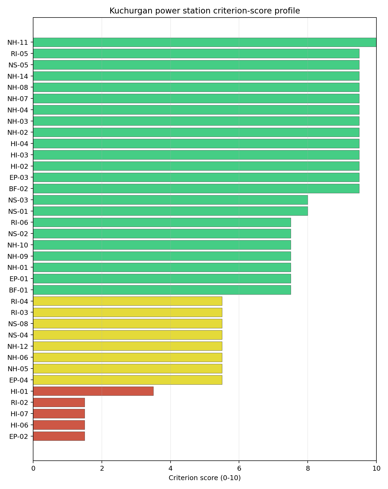
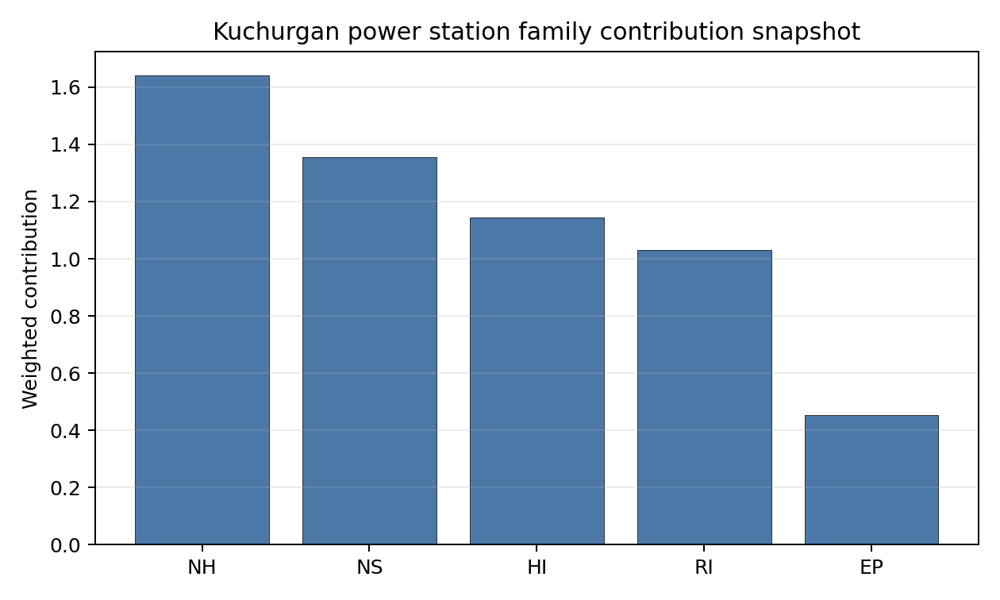

# Kuchurgan power station Site Profile

Kuchurgan power station is a coal/thermal site in Moldova that has been tested against the NuScale VOYGR-6 reference deployment envelope. This profile reads the screening evidence at a level that supports a decision to progress toward Stage 3 characterization. It is not a site-suitability determination, vendor recommendation, or licensing finding.

## Site Snapshot

| Field | Value |
| --- | --- |
| Site name | Kuchurgan power station |
| Coordinates | 46.6290, 29.9397 |
| Subnational unit | Transnistria |
| Installed thermal capacity (source data) | 1,400 MW |
| Available surface area | 200.0 ha |
| Available surface area for development | 186.2 ha |
| Composite score (baseline weights) | 6.959 (6.199-7.500 MC band) |
| National stability band | A (top-10% hit rate 100%) |
| National rank | 1 |

_See the country status map in_ [Moldova Country Profile](../MD_country_prototype.md#country-status-map).

## Ownership and Coal-to-Nuclear Context

- **Inter RAO Capital JSC** (29.56% share), headquartered in Russia; immediate operator Moldavskaya GRES CJSC. Path: Inter RAO Capital JSC -> Inter RAO PJSC [29.56%] -> Moldavskaya GRES CJSC [100.0%] -> Kuchurgan power station Unit 8 [100.0%]
- **Rosneftegaz JSC** (26.37% share), headquartered in Russia; immediate operator Moldavskaya GRES CJSC. Path: Rosneftegaz JSC -> Inter RAO PJSC [26.37%] -> Moldavskaya GRES CJSC [100.0%] -> Kuchurgan power station Unit 8 [100.0%]
- **Government of Russia** (6.45% share), headquartered in Russia; immediate operator Moldavskaya GRES CJSC. Path: Government of Russia  -> Federal Agency for State Property Management (Russia)  [100.0%] -> Federal Grid Company - Rosseti PJSC [75.28%] -> Inter RAO PJSC [8.57%] -> Moldavskaya GRES CJSC [100.0%] -> Kuchurgan power station Unit 6 [100.0%]
- **Inter RAO PJSC** (100.00% share), headquartered in Russia; immediate operator Moldavskaya GRES CJSC. Path: Inter RAO PJSC -> Moldavskaya GRES CJSC [100.0%] -> Kuchurgan power station Unit 8 [100.0%]
- **Federal Agency for State Property Management (Russia)** (6.45% share), headquartered in Russia; immediate operator Moldavskaya GRES CJSC. Path: Federal Agency for State Property Management (Russia)  -> Federal Grid Company - Rosseti PJSC [75.28%] -> Inter RAO PJSC [8.57%] -> Moldavskaya GRES CJSC [100.0%] -> Kuchurgan power station Unit 8 [100.0%]
- **Federal Grid Company - Rosseti PJSC** (8.57% share), headquartered in Russia; immediate operator Moldavskaya GRES CJSC. Path: Federal Grid Company - Rosseti PJSC -> Inter RAO PJSC [8.57%] -> Moldavskaya GRES CJSC [100.0%] -> Kuchurgan power station Unit 8 [100.0%]

Generating units on record: 7 mothballed.
Earliest unit commissioning: 1964; most recent: 1971.

## Natural Hazards (NH)

- **Seismic: Ground Motion (NH-01)** - score 7.5/10 (MC 7.0-8.0), weight 0.0455, data quality high. Evidence: PGA at 475-year return period 0.085 g; PGA at 2,475-year return period 0.156 g; Vs30 reference (m/s): 760.0.
- **Seismic: Surface Rupture (NH-02)** - score 9.5/10 (MC 9.0-10.0) — favorable: Very strong separation from mapped capable faults; surface-rupture concern effectively screened at desk-study level., weight n/a, data quality screening grade. Evidence: nearest mapped capable fault 50.0 km; fault slip rate 0 mm/yr; fault name: none_in_search_radius; E1 verdict (radius 5 km): outside the SSG-9 capable-fault screening envelope.
- **Geotechnical: Liquefaction (NH-03)** - score 9.5/10 (MC 9.0-10.0) — favorable: Negligible susceptibility (Stage-1 favourable default)., weight n/a, data quality medium. Evidence: liquefaction susceptibility: very_low; dominant soil type: silty_clay_loam.
- **Geotechnical: Slope Stability (NH-04)** - score 9.5/10 (MC 9.0-10.0) — favorable: Well below the risk boundary., weight n/a, data quality screening grade. Evidence: site slope 2.73 deg; max slope in 1 km box 47.9 deg; slope stability class: gentle.
- **Geotechnical: Subsidence (NH-05)** - score 5.5/10 (MC 5.0-6.0) — pass-mark band: At or above the mine-distance score-5 pivot; review possible., weight 0.0354, data quality medium. Evidence: karst present: no; karst severity: moderate; formation type: carbonate (Discontinuous carbonate rocks).
- **Geotechnical: Foundation (NH-06)** - score 5.5/10 (MC 5.0-6.0) — pass-mark band: Typical European mixed conditions (bearing 80-150 kPa)., weight 0.0253, data quality medium. Evidence: bearing capacity 84.7 kPa; depth to bedrock 26.7 m.
- **Volcanism (NH-07)** - score 9.5/10 (MC 9.0-10.0) — favorable: Very strong margin above the score-5 boundary (or connector confirmed no in-radius signal)., weight n/a, data quality high. Evidence: volcanic hazard class: negligible.
- **Coastal Flooding (NH-08)** - score 9.5/10 (MC 9.0-10.0) — favorable: Non-coastal OR elevation >= 50 m AMSL OR landlocked country, with no positive marine-hazard signal., weight 0.0303, data quality medium. Evidence: distance to coast 66.0 km.
- **River Flooding (NH-09)** - score 7.5/10 (MC 7.0-8.0), weight 0.0404, data quality medium. Evidence: flood zone class: negligible.
- **Extreme Winds (NH-10)** - score 7.5/10 (MC 7.0-8.0), weight 0.0152, data quality medium. Evidence: design wind speed 7.85 m/s.
- **Extreme Precipitation (NH-11)** - score 10.0/10 (MC 9.0-10.0) — favorable: aggregated(mean_of_sub_scores), weight 0.0152, data quality medium. Evidence: extreme daily precipitation 0.15 mm; mean annual precipitation 15.7 mm/yr.
- **Extreme Temperatures (NH-12)** - score 5.5/10 (MC 5.0-6.0) — pass-mark band: aggregated(mean_of_sub_scores), weight 0.0202, data quality medium. Evidence: extreme high temperature 26.4 deg C; extreme low temperature -6.86 deg C.
- **Combined Hazards (NH-14)** - score 9.5/10 (MC 9.0-10.0) — favorable: At least 5 underlying NH criteria resolved, all >= 7; no interaction pair below 7., weight 0.0152, data quality n/a. Evidence: values not in measurement tables.

### Interpretation - Natural Hazards (NH)

<!-- specialist key=family_natural_hazards scope=site site_id=b3eb5dd2-98cf-40c4-b9ee-2a86fd066093 bundle=MD_kuchurgan_power_station_site_bundle.json status=pending -->

<!-- /specialist key=family_natural_hazards -->

## Human-Induced and Security-Relevant Hazards (HI)

- **Aircraft Crash (HI-01)** - score 3.5/10 (MC 3.0-4.0), weight 0.0354, data quality high. Evidence: nearest airport 7.03 km; nearest flight path 3.52 km; airports within search radius 2; airport name: Lymanske Airfield; airport type: small_airport.
- **Industrial Explosions (HI-02)** - score 9.5/10 (MC 9.0-10.0) — favorable: Very strong margin above the score-5 boundary (or completed search confirmed no in-radius signal)., weight 0.0354, data quality screening grade. Evidence: values not in measurement tables.
- **Toxic/Gas Releases (HI-03)** - score 9.5/10 (MC 9.0-10.0) — favorable: Very strong margin above the score-5 boundary (or completed search confirmed no in-radius signal)., weight 0.0354, data quality screening grade. Evidence: values not in measurement tables.
- **External Fires (HI-04)** - score 9.5/10 (MC 9.0-10.0) — favorable: > 15 km, or completed flammable-storage search found nothing in radius., weight 0.0303, data quality screening grade. Evidence: values not in measurement tables.
- **Military Installations (HI-06)** - score 1.5/10 (MC 1.0-2.0), weight 0.0303, data quality medium. Evidence: nearest military installation 11.4 km; military installations within radius 13; installation name: ДОТ № 1202 ТиУР.
- **Electromagnetic Interference (HI-07)** - score 1.5/10 (MC 1.0-2.0), weight 0.0101, data quality medium. Evidence: nearest high-power transmitter 0.47 km; transmitters within radius 85; transmitter type: mast.

### Interpretation - Human-Induced and Security-Relevant Hazards (HI)

<!-- specialist key=family_human_hazards scope=site site_id=b3eb5dd2-98cf-40c4-b9ee-2a86fd066093 bundle=MD_kuchurgan_power_station_site_bundle.json status=pending -->

<!-- /specialist key=family_human_hazards -->

## Radiological Impact and Emergency Planning (RI / EP)

- **Emergency Planning Feasibility (EP-01)** - score 7.5/10 (MC 7.0-8.0), weight n/a, data quality high. Evidence: EP feasibility composite 67.0 /100; road sub-score 37.0 /100; special-population sub-score 90.0 /100; geography sub-score 95.0 /100; population sub-score 95.0 /100; evacuation feasible: yes.
- **Evacuation Routes (EP-02)** - score 1.5/10 (MC 1.0-2.0), weight 0.0303, data quality medium. Evidence: road density in EPZ 0.27 km/km2; road length in EPZ 529.7 km; motorway access: yes.
- **Physical Geography Constraints (EP-03)** - score 9.5/10 (MC 9.0-10.0) — favorable: No measured relief; open river/waterway context (interim screening)., weight 0.0253, data quality medium. Evidence: waterways crossing EPZ 0; major river barrier: no.
- **Special Populations (EP-04)** - score 5.5/10 (MC 5.0-6.0) — pass-mark band: 9-25., weight 0.0303, data quality medium. Evidence: hospitals in EPZ 15; prisons in EPZ 0; care homes in EPZ 0.
- **Atmospheric Dispersion (RI-01)** - score no native score (unscored — no band matched), weight 0.0303, data quality medium. Evidence: annual mean wind speed 1.07 m/s; atmospheric mixing height 578.8 m; prevailing wind direction: NNW.
- **Surface Water Dispersion (RI-02)** - score 1.5/10 (MC 1.0-2.0), weight 0.0253, data quality n/a. Evidence: values not in measurement tables.
- **Groundwater Dispersion (RI-03)** - score 5.5/10 (MC 5.0-6.0) — pass-mark band: Moderate-permeability aquifer screening proxy., weight 0.0253, data quality medium. Evidence: aquifer type: inland water.
- **Population Density at EPZ Radii (RI-04)** - score 5.5/10 (MC 5.0-6.0) — pass-mark band: aggregated(min_of_sub_scores), weight 0.0404, data quality screening grade. Evidence: population density within 5 km 95.5 /km2; population density within 16 km 48.7 /km2; population density within 25 km 41.7 /km2; population density within 80 km 106.5 /km2; population within 25 km 81,888 people.
- **Distance to Population Centres (RI-05)** - score 9.5/10 (MC 9.0-10.0) — favorable: No >=50k population-centre proxy within screening envelope., weight 0.0505, data quality screening grade. Evidence: values not in measurement tables.
- **Population Projections (RI-06)** - score 7.5/10 (MC 7.0-8.0), weight 0.0253, data quality screening grade. Evidence: annual population growth rate -0.471 %/yr; projected population at 25 km in 60 yr 44,025 people.

### Interpretation - Radiological Impact and Emergency Planning (RI / EP)

<!-- specialist key=family_radiological_emergency scope=site site_id=b3eb5dd2-98cf-40c4-b9ee-2a86fd066093 bundle=MD_kuchurgan_power_station_site_bundle.json status=pending -->

<!-- /specialist key=family_radiological_emergency -->

## Non-Safety and Implementation Considerations (NS)

- **Grid Capacity Basic Filter (BF-01)** - score 7.5/10 (MC 7.0-8.0), weight n/a, data quality n/a. Evidence: values not in measurement tables.
- **Land Area Basic Filter (BF-02)** - score 9.5/10 (MC 9.0-10.0) — favorable: Contiguous and buildable >= ideal area (70 ha/module)., weight 0.0253, data quality n/a. Evidence: values not in measurement tables.
- **Cooling Water Availability (NS-01)** - score 8.0/10 (MC 8.0-9.0) — favorable: aggregated(weighted_mean_of_sub_scores), weight 0.0404, data quality screening grade. Evidence: distance to cooling source 0.98 km; cooling source flow 6.73 m3/s; cooling source type: river; cooling source name: Kuchurhan River; water stress label: Low.
- **Grid Connection (NS-02)** - score 7.5/10 (MC 7.0-8.0), weight 0.0404, data quality high. Evidence: nearest substation 0.47 km; nearest high-voltage line 0.06 km; highest nearby line voltage 330.0 kV; grid export capacity 1,400 MW; substations within radius 408; HV lines within radius 693.
- **Transport Access (NS-03)** - score 8.0/10 (MC 8.0-9.0) — favorable: aggregated(weighted_mean_of_sub_scores), weight 0.0404, data quality high. Evidence: nearest highway 2.77 km; nearest rail line 0.2 km; nearest waterway 8.29 km; heavy-haul capable: yes.
- **Site Topography (NS-04)** - score 5.5/10 (MC 5.0-6.0) — pass-mark band: 40-60 %., weight 0.0303, data quality screening grade. Evidence: favourable land cover 44.1 %; moderate land cover 7.9 %; unfavourable land cover 48.0 %; favourable area 80.7 ha; dominant land class: 512.
- **Site Footprint Adequacy (NS-05)** - score 9.5/10 (MC 9.0-10.0) — favorable: Very strong margin above the score-5 boundary., weight 0.0253, data quality high. Evidence: buildable area 186.2 ha; largest contiguous patch 186.2 ha; buildable patch count 4.
- **Existing Infrastructure (NS-06)** - score no native score (unscored — no band matched), weight 0.0253, data quality n/a. Evidence: not measured at this site (criterion remains unscored).
- **Ecological Sensitivity (NS-08)** - score 5.5/10 (MC 3.5-7.5) — pass-mark band: Both networks NULL or >= 5 km., weight n/a, data quality insufficient. Evidence: natural land cover 48.0 %; distance to nearest protected area 8.444 km; Natura 2000 sensitivity class: unknown; protected-area overlap: no; protected-area sensitivity class: low; Natura 2000 sites within 5 km: 0; nearest protected-area designation: Emerald Network.
- **Workforce Availability (NS-10)** - score no native score (unscored — no band matched), weight 0.0202, data quality n/a. Evidence: not measured at this site (criterion remains unscored).
- **Regulatory/Political Environment (NS-12)** - score no native score (unscored — no band matched), weight 0.0303, data quality n/a. Evidence: not measured at this site (criterion remains unscored).
- **Construction Logistics (NS-13)** - score no native score (unscored — no band matched), weight 0.0202, data quality n/a. Evidence: not measured at this site (criterion remains unscored).

### Interpretation - Non-Safety and Implementation Considerations (NS)

<!-- specialist key=family_infrastructure scope=site site_id=b3eb5dd2-98cf-40c4-b9ee-2a86fd066093 bundle=MD_kuchurgan_power_station_site_bundle.json status=pending -->

<!-- /specialist key=family_infrastructure -->

## Composite Score and Stability

Baseline composite score is 6.959, bracketed by Monte Carlo at 6.199-7.500. National stability band is `A` with a top-10% hit rate of 100% across 12 scored Monte Carlo scenarios.

<!-- specialist key=stability scope=site site_id=b3eb5dd2-98cf-40c4-b9ee-2a86fd066093 bundle=MD_kuchurgan_power_station_site_bundle.json status=pending -->

<!-- /specialist key=stability -->

## Residual Risk Register

<!-- specialist key=residual_risk scope=site site_id=b3eb5dd2-98cf-40c4-b9ee-2a86fd066093 bundle=MD_kuchurgan_power_station_site_bundle.json status=pending -->

<!-- /specialist key=residual_risk -->

## Stage 3 Follow-Up Checklist

- [ ] Resolve **Aircraft Crash (HI-01)** avoidance flag - measured {"flight_path_distance_km": 3.52, "under_flight_path": false} vs threshold A4 — SSG-35: flight-path overhead / < 4 km from airway (large + medium classes only)..
- [ ] Re-measure **Evacuation Routes (EP-02)** - native score 1.5/10 with confidence medium.
- [ ] Re-measure **Military Installations (HI-06)** - native score 1.5/10 with confidence medium.
- [ ] Re-measure **Electromagnetic Interference (HI-07)** - native score 1.5/10 with confidence medium.
- [ ] Re-measure **Surface Water Dispersion (RI-02)** - native score 1.5/10 with confidence insufficient.
- [ ] Re-measure **Aircraft Crash (HI-01)** - native score 3.5/10 with confidence high.

## Evidence Limitations

- No criterion-family quality fields are flagged as low or missing in this bundle.
