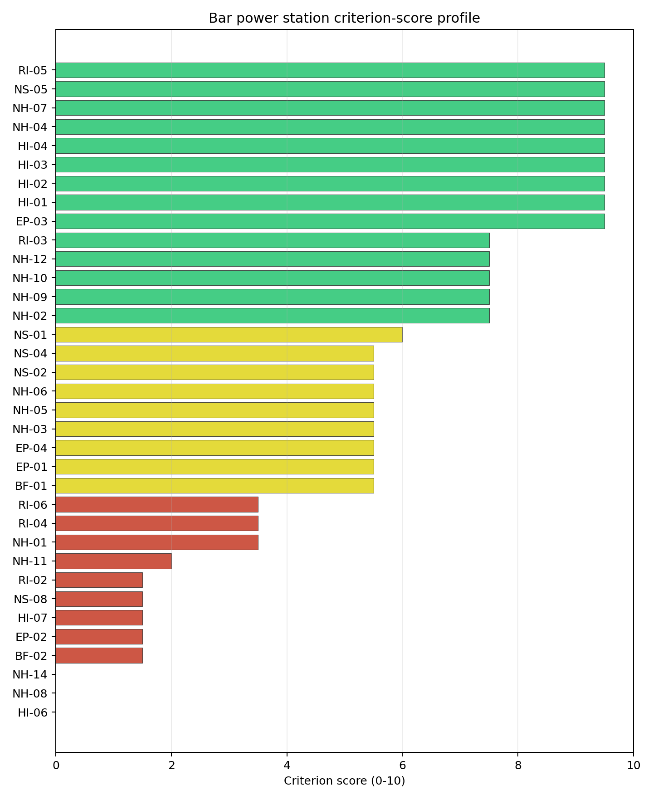
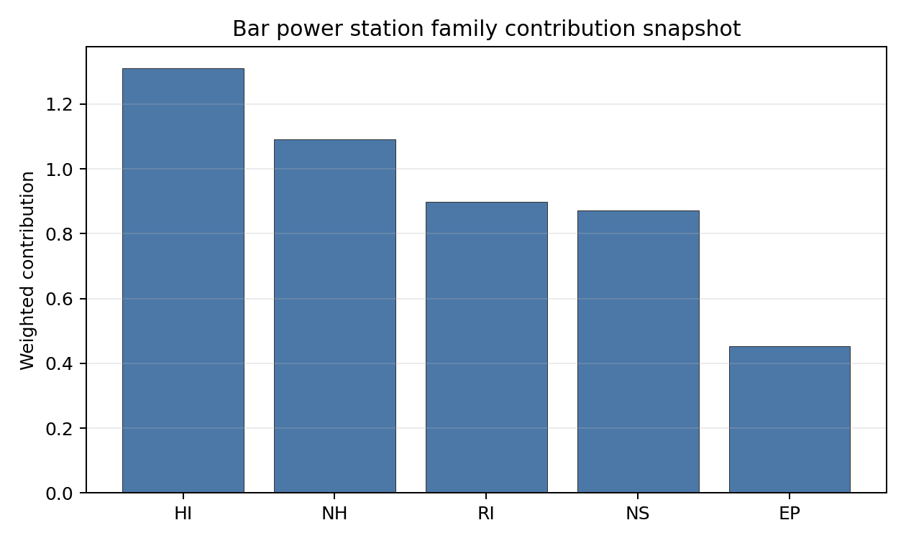

# Bar power station Site Profile

Bar power station is a coal/thermal site in Montenegro that has been tested against the NuScale VOYGR-6 reference deployment envelope. This profile reads the screening evidence at a level that supports a decision to progress toward Stage 3 characterization. It is not a site-suitability determination, vendor recommendation, or licensing finding.

## Site Snapshot

| Field | Value |
| --- | --- |
| Site name | Bar power station |
| Coordinates | 42.1000, 19.1000 |
| Subnational unit | Bar |
| Installed thermal capacity (source data) | 800 MW |
| Available surface area | 92.9 ha |
| Available surface area for development | 9.7 ha |
| Composite score (baseline weights) | 6.023 (5.321-6.467 MC band) |
| National stability band | F (top-10% hit rate 42%) |
| National rank | 1 |

_See the country status map in_ [Montenegro Country Profile](../ME_country_prototype.md#country-status-map).

## Ownership and Coal-to-Nuclear Context

- **Blackrock Advisors LLC** (nan% share), headquartered in United States; immediate operator Enel SpA. Path: Blackrock Advisors LLC -> BlackRock Inc [5.07%] -> Enel SpA [5.02%] -> Bar power station -- [unknown %]
- **Duferco Participations Holding SA** (nan% share), headquartered in Luxembourg; immediate operator Dufenergy Italia SpA. Path: Duferco Participations Holding SA -> Duferco SA [unknown %] -> Dufenergy Italia SpA [unknown %] -> Bar power station -- [unknown %]
- **Enel SpA** (nan% share), headquartered in Italy; immediate operator Enel SpA. Path: Enel SpA -> Bar power station -- [unknown %]
- **BlackRock Inc** (nan% share), headquartered in United States; immediate operator Enel SpA. Path: BlackRock Inc -> Enel SpA [5.02%] -> Bar power station -- [unknown %]
- **small shareholder(s)** (nan% share); immediate operator Enel SpA. Path: small shareholder(s)  -> Enel SpA [71.18%] -> Bar power station -- [unknown %]
- **The Vanguard Group Inc** (nan% share), headquartered in United States; immediate operator Enel SpA. Path: The Vanguard Group Inc -> BlackRock Inc [8.66%] -> Enel SpA [5.02%] -> Bar power station -- [unknown %]
- **Ministry of Economy and Finance (Italy)** (nan% share), headquartered in Italy; immediate operator Enel SpA. Path: Ministry of Economy and Finance (Italy)  -> Enel SpA [23.59%] -> Bar power station -- [unknown %]

Generating units on record: 1 cancelled.
Earliest unit commissioning: 2014; most recent: 2014.

## Natural Hazards (NH)

- **Seismic: Ground Motion (NH-01)** - score 3.5/10 (MC 3.0-4.0), weight 0.0455, data quality high. Evidence: PGA at 475-year return period 0.289 g; PGA at 2,475-year return period 0.689 g; Vs30 reference (m/s): 760.0.
- **Seismic: Surface Rupture (NH-02)** - score 7.5/10 (MC 7.0-8.0), weight n/a, data quality screening grade. Evidence: nearest mapped capable fault 10.4 km; fault slip rate 0.324 mm/yr; fault name: MECF005; E1 verdict (radius 5 km): outside the SSG-9 capable-fault screening envelope.
- **Geotechnical: Liquefaction (NH-03)** - score 5.5/10 (MC 5.0-6.0) — pass-mark band: Moderate susceptibility, or high/very-high with documented (or pending for `high`) mitigation., weight n/a, data quality medium. Evidence: liquefaction susceptibility: moderate; dominant soil type: silty_clay_loam.
- **Geotechnical: Slope Stability (NH-04)** - score 9.5/10 (MC 9.0-10.0) — favorable: Well below the risk boundary., weight n/a, data quality screening grade. Evidence: site slope 3.81 deg; max slope in 1 km box 67.6 deg; slope stability class: gentle.
- **Geotechnical: Subsidence (NH-05)** - score 5.5/10 (MC 5.0-6.0) — pass-mark band: At or above the mine-distance score-5 pivot; review possible., weight 0.0354, data quality medium. Evidence: karst present: no; karst severity: moderate; formation type: carbonate (Continuous carbonate rocks).
- **Geotechnical: Foundation (NH-06)** - score 5.5/10 (MC 5.0-6.0) — pass-mark band: Typical European mixed conditions (bearing 80-150 kPa)., weight 0.0253, data quality medium. Evidence: bearing capacity 87.3 kPa; depth to bedrock 23.0 m.
- **Volcanism (NH-07)** - score 9.5/10 (MC 9.0-10.0) — favorable: Very strong margin above the score-5 boundary (or connector confirmed no in-radius signal)., weight n/a, data quality high. Evidence: volcanic hazard class: negligible.
- **Coastal Flooding (NH-08)** - score 0.0/10 (MC 0.0-0.0), weight 0.0303, data quality medium. Evidence: distance to coast 1.56 km.
- **River Flooding (NH-09)** - score 7.5/10 (MC 7.0-8.0), weight 0.0404, data quality medium. Evidence: flood zone class: negligible.
- **Extreme Winds (NH-10)** - score 7.5/10 (MC 7.0-8.0), weight 0.0152, data quality medium. Evidence: design wind speed 8.79 m/s.
- **Extreme Precipitation (NH-11)** - score 2.0/10 (MC 2.0-3.0), weight 0.0152, data quality medium. Evidence: extreme daily precipitation 0.81 mm; mean annual precipitation 66.4 mm/yr.
- **Extreme Temperatures (NH-12)** - score 7.5/10 (MC 7.0-8.0), weight 0.0202, data quality medium. Evidence: extreme high temperature 27.0 deg C; extreme low temperature 6.14 deg C.
- **Combined Hazards (NH-14)** - score 0.0/10 (MC 0.0-0.0), weight 0.0152, data quality n/a. Evidence: values not in measurement tables.

### Interpretation - Natural Hazards (NH)

<!-- specialist key=family_natural_hazards scope=site site_id=3795824b-cb76-48dd-a65c-764c757ddc76 bundle=ME_bar_power_station_site_bundle.json status=pending -->
> _Specialist interpretation pending: Interpretation - Natural Hazards (NH). Cursor agent fills via `python -m scripts.run_specialist_pass show --country <CC> --site-name <name> --key family_natural_hazards` then `... patch --country <CC> --site-name <name> --key family_natural_hazards --text-file <draft.md>`._
<!-- /specialist key=family_natural_hazards -->

## Human-Induced and Security-Relevant Hazards (HI)

- **Aircraft Crash (HI-01)** - score 9.5/10 (MC 9.0-10.0) — favorable: Nearest large/medium airport > 30 km, no flight-path proxy < 4 km, and no military airbase within 60 km., weight 0.0354, data quality high. Evidence: nearest airport 28.0 km; nearest flight path 15.7 km; airports within search radius 1; airport name: Splendid Hotel Helipad; airport type: heliport.
- **Industrial Explosions (HI-02)** - score 9.5/10 (MC 9.0-10.0) — favorable: Very strong margin above the score-5 boundary (or completed search confirmed no in-radius signal)., weight 0.0354, data quality screening grade. Evidence: values not in measurement tables.
- **Toxic/Gas Releases (HI-03)** - score 9.5/10 (MC 9.0-10.0) — favorable: Very strong margin above the score-5 boundary (or completed search confirmed no in-radius signal)., weight 0.0354, data quality screening grade. Evidence: values not in measurement tables.
- **External Fires (HI-04)** - score 9.5/10 (MC 9.0-10.0) — favorable: > 15 km, or completed flammable-storage search found nothing in radius., weight 0.0303, data quality screening grade. Evidence: values not in measurement tables.
- **Military Installations (HI-06)** - score 0.0/10 (MC 0.0-0.0), weight 0.0303, data quality high. Evidence: nearest military installation 0.89 km; military installations within radius 8; installation name: unnamed.
- **Electromagnetic Interference (HI-07)** - score 1.5/10 (MC 1.0-2.0), weight 0.0101, data quality medium. Evidence: nearest high-power transmitter 0.46 km; transmitters within radius 56; transmitter type: tower.

### Interpretation - Human-Induced and Security-Relevant Hazards (HI)

<!-- specialist key=family_human_hazards scope=site site_id=3795824b-cb76-48dd-a65c-764c757ddc76 bundle=ME_bar_power_station_site_bundle.json status=pending -->
> _Specialist interpretation pending: Interpretation - Human-Induced and Security-Relevant Hazards (HI). Cursor agent fills via `python -m scripts.run_specialist_pass show --country <CC> --site-name <name> --key family_human_hazards` then `... patch --country <CC> --site-name <name> --key family_human_hazards --text-file <draft.md>`._
<!-- /specialist key=family_human_hazards -->

## Radiological Impact and Emergency Planning (RI / EP)

- **Emergency Planning Feasibility (EP-01)** - score 5.5/10 (MC 5.0-6.0) — pass-mark band: At or above the composite score-5 boundary., weight n/a, data quality high. Evidence: EP feasibility composite 52.7 /100; road sub-score 28.8 /100; special-population sub-score 90.0 /100; geography sub-score 95.0 /100; population sub-score 60.0 /100; evacuation feasible: yes.
- **Evacuation Routes (EP-02)** - score 1.5/10 (MC 1.0-2.0), weight 0.0303, data quality medium. Evidence: road density in EPZ 0.188 km/km2; road length in EPZ 369.4 km; motorway access: yes.
- **Physical Geography Constraints (EP-03)** - score 9.5/10 (MC 9.0-10.0) — favorable: No measured relief; open river/waterway context (interim screening)., weight 0.0253, data quality medium. Evidence: waterways crossing EPZ 0; major river barrier: no.
- **Special Populations (EP-04)** - score 5.5/10 (MC 5.0-6.0) — pass-mark band: 9-25., weight 0.0303, data quality medium. Evidence: hospitals in EPZ 10; prisons in EPZ 0; care homes in EPZ 0.
- **Atmospheric Dispersion (RI-01)** - score no native score (unscored — no band matched), weight 0.0303, data quality medium. Evidence: annual mean wind speed 1.4 m/s; atmospheric mixing height 425.8 m; prevailing wind direction: ENE.
- **Surface Water Dispersion (RI-02)** - score 1.5/10 (MC 1.0-2.0), weight 0.0253, data quality n/a. Evidence: values not in measurement tables.
- **Groundwater Dispersion (RI-03)** - score 7.5/10 (MC 7.0-8.0), weight 0.0253, data quality medium. Evidence: aquifer type: low permeability.
- **Population Density at EPZ Radii (RI-04)** - score 3.5/10 (MC 3.0-4.0), weight 0.0404, data quality screening grade. Evidence: population density within 5 km 396.1 /km2; population density within 16 km 59.2 /km2; population density within 25 km 34.9 /km2; population density within 80 km 40.8 /km2; population within 25 km 68,443 people.
- **Distance to Population Centres (RI-05)** - score 9.5/10 (MC 9.0-10.0) — favorable: No >=50k population-centre proxy within screening envelope., weight 0.0505, data quality screening grade. Evidence: values not in measurement tables.
- **Population Projections (RI-06)** - score 3.5/10 (MC 3.0-4.0), weight 0.0253, data quality screening grade. Evidence: annual population growth rate 0.497 %/yr; projected population at 25 km in 60 yr 50,059 people.

### Interpretation - Radiological Impact and Emergency Planning (RI / EP)

<!-- specialist key=family_radiological_emergency scope=site site_id=3795824b-cb76-48dd-a65c-764c757ddc76 bundle=ME_bar_power_station_site_bundle.json status=pending -->
> _Specialist interpretation pending: Interpretation - Radiological Impact and Emergency Planning (RI / EP). Cursor agent fills via `python -m scripts.run_specialist_pass show --country <CC> --site-name <name> --key family_radiological_emergency` then `... patch --country <CC> --site-name <name> --key family_radiological_emergency --text-file <draft.md>`._
<!-- /specialist key=family_radiological_emergency -->

## Non-Safety and Implementation Considerations (NS)

- **Grid Capacity Basic Filter (BF-01)** - score 5.5/10 (MC 5.0-6.0) — pass-mark band: Note: substation 15-30 km OR 110-219 kV; reinforcement plausible., weight n/a, data quality n/a. Evidence: values not in measurement tables.
- **Land Area Basic Filter (BF-02)** - score 1.5/10 (MC 1.0-2.0), weight 0.0253, data quality n/a. Evidence: values not in measurement tables.
- **Cooling Water Availability (NS-01)** - score 6.0/10 (MC 5.0-6.0) — pass-mark band: aggregated(weighted_mean_of_sub_scores), weight 0.0404, data quality screening grade. Evidence: distance to cooling source 13.5 km; cooling source flow 2.27 m3/s; cooling source type: small_river; cooling source name: Rena; water stress label: Low.
- **Grid Connection (NS-02)** - score 5.5/10 (MC 5.0-6.0) — pass-mark band: aggregated(min_of_sub_scores), weight 0.0404, data quality high. Evidence: nearest substation 0.26 km; nearest high-voltage line 1.01 km; highest nearby line voltage 110.0 kV; grid export capacity 800.0 MW; substations within radius 264; HV lines within radius 186.
- **Transport Access (NS-03)** - score no native score (unscored — no band matched), weight 0.0404, data quality low. Evidence: not measured at this site (criterion remains unscored).
- **Site Topography (NS-04)** - score 5.5/10 (MC 5.0-6.0) — pass-mark band: 40-60 %., weight 0.0303, data quality screening grade. Evidence: favourable land cover 41.7 %; moderate land cover 10.6 %; unfavourable land cover 47.7 %; favourable area 92.9 ha; dominant land class: 112.
- **Site Footprint Adequacy (NS-05)** - score 9.5/10 (MC 9.0-10.0) — favorable: Very strong margin above the score-5 boundary., weight 0.0253, data quality high. Evidence: buildable area 9.68 ha; largest contiguous patch 9.68 ha; buildable patch count 12.
- **Existing Infrastructure (NS-06)** - score no native score (unscored — no band matched), weight 0.0253, data quality n/a. Evidence: not measured at this site (criterion remains unscored).
- **Ecological Sensitivity (NS-08)** - score 1.5/10 (MC 0.0-3.5), weight n/a, data quality insufficient. Evidence: natural land cover 47.7 %; distance to nearest protected area 0.575 km; Natura 2000 sensitivity class: unknown; protected-area overlap: no; protected-area sensitivity class: high; Natura 2000 sites within 5 km: 0; nearest protected-area designation: Natural Monument.
- **Workforce Availability (NS-10)** - score no native score (unscored — no band matched), weight 0.0202, data quality n/a. Evidence: not measured at this site (criterion remains unscored).
- **Regulatory/Political Environment (NS-12)** - score no native score (unscored — no band matched), weight 0.0303, data quality n/a. Evidence: not measured at this site (criterion remains unscored).
- **Construction Logistics (NS-13)** - score no native score (unscored — no band matched), weight 0.0202, data quality n/a. Evidence: not measured at this site (criterion remains unscored).

### Interpretation - Non-Safety and Implementation Considerations (NS)

<!-- specialist key=family_infrastructure scope=site site_id=3795824b-cb76-48dd-a65c-764c757ddc76 bundle=ME_bar_power_station_site_bundle.json status=pending -->
> _Specialist interpretation pending: Interpretation - Non-Safety and Implementation Considerations (NS). Cursor agent fills via `python -m scripts.run_specialist_pass show --country <CC> --site-name <name> --key family_infrastructure` then `... patch --country <CC> --site-name <name> --key family_infrastructure --text-file <draft.md>`._
<!-- /specialist key=family_infrastructure -->

## Composite Score and Stability

Baseline composite score is 6.023, bracketed by Monte Carlo at 5.321-6.467. National stability band is `F` with a top-10% hit rate of 42% across 12 scored Monte Carlo scenarios.

<!-- specialist key=stability scope=site site_id=3795824b-cb76-48dd-a65c-764c757ddc76 bundle=ME_bar_power_station_site_bundle.json status=pending -->
> _Specialist interpretation pending: Composite stability and sensitivity (plain-English read). Cursor agent fills via `python -m scripts.run_specialist_pass show --country <CC> --site-name <name> --key stability` then `... patch --country <CC> --site-name <name> --key stability --text-file <draft.md>`._
<!-- /specialist key=stability -->

## Residual Risk Register

<!-- specialist key=residual_risk scope=site site_id=3795824b-cb76-48dd-a65c-764c757ddc76 bundle=ME_bar_power_station_site_bundle.json status=pending -->
> _Specialist interpretation pending: Residual risk register (specialist synthesis). Cursor agent fills via `python -m scripts.run_specialist_pass show --country <CC> --site-name <name> --key residual_risk` then `... patch --country <CC> --site-name <name> --key residual_risk --text-file <draft.md>`._
<!-- /specialist key=residual_risk -->

## Stage 3 Follow-Up Checklist

- [ ] Resolve **Seismic: Ground Motion (NH-01)** avoidance flag - measured {"pga_2475yr_g": 0.68879} vs threshold Project screening: PGA(2475 yr) > 0.5 g fails Phase 2..
- [ ] Resolve **Coastal Flooding (NH-08)** avoidance flag - measured {"coast_distance_km": 1.56, "elevation_m": 11.9, "storm_surge_class": null, "tsunami_zone_flag": null} vs threshold A9 caution: measured sea-coast distance is < 10 km at < 50 m AMSL, or positive storm-surge/tsunami proxy evidence exists for a low-elevation site. Missing coast distance alone is a data gap, not coastal exposure; confirm coastal flooding and tsunami exposure in Stage 3..
- [ ] Re-measure **Military Installations (HI-06)** - native score 0.0/10 with confidence high.
- [ ] Re-measure **Coastal Flooding (NH-08)** - native score 0.0/10 with confidence medium.
- [ ] Re-measure **Combined Hazards (NH-14)** - native score 0.0/10 with confidence insufficient.
- [ ] Re-measure **Land Area Basic Filter (BF-02)** - native score 1.5/10 with confidence insufficient.
- [ ] Re-measure **Evacuation Routes (EP-02)** - native score 1.5/10 with confidence medium.
- [ ] Improve data quality for **Geotechnical: Subsidence & Collapse (NH-05b)** - current flag `low`.
- [ ] Improve data quality for **Transport Access (NS-03)** - current flag `low`.

## Evidence Limitations

- Geotechnical: Subsidence & Collapse (NH-05b) - quality `low`.
- Transport Access (NS-03) - quality `low`.
