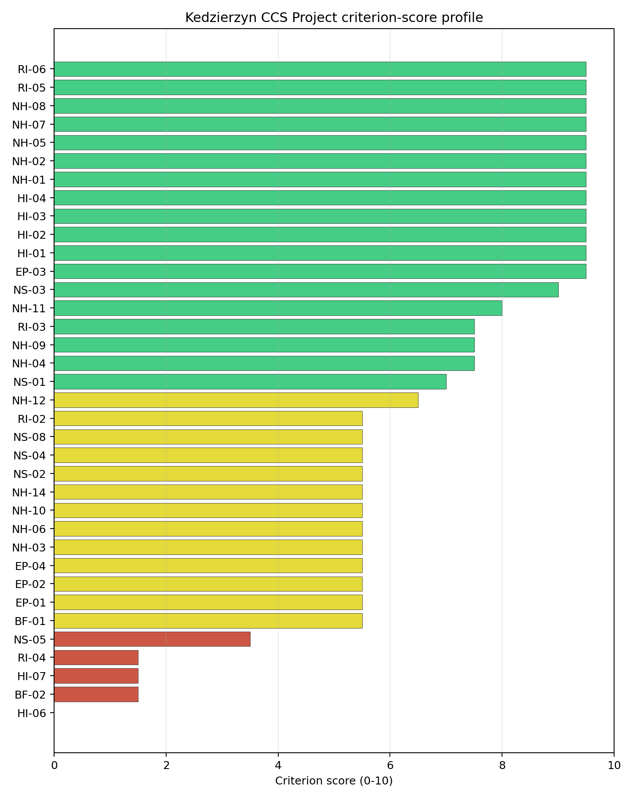
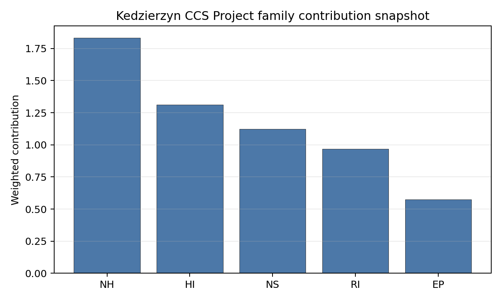

# Kedzierzyn CCS Project Site Profile

Kedzierzyn CCS Project is a coal/thermal site in Poland that has been tested against the NuScale VOYGR-6 reference deployment envelope. This profile reads the screening evidence at a level that supports a decision to progress toward Stage 3 characterization. It is not a site-suitability determination, vendor recommendation, or licensing finding.

## Site Snapshot

| Field | Value |
| --- | --- |
| Site name | Kedzierzyn CCS Project |
| Coordinates | 50.3499, 18.2262 |
| Subnational unit | Opolskie |
| Installed thermal capacity (source data) | 910 MW |
| Available surface area | 7.7 ha |
| Available surface area for development | 5.3 ha |
| Composite score (baseline weights) | 7.191 (6.386-7.737 MC band) |
| National stability band | C (top-10% hit rate 75%) |
| National rank | 5 |

_See the country status map in_ [Poland Country Profile](../PL_country_prototype.md#country-status-map).

## Ownership and Coal-to-Nuclear Context

- **KGHM Polska Miedź SA** (nan% share), headquartered in Poland; immediate operator ZAK-PKE Consortium. Path: KGHM Polska Miedź SA -> TAURON Polska Energia SA [10.39%] -> TAURON Wytwarzanie SA [100.0%] -> ZAK-PKE Consortium  [unknown %] -> Kedzierzyn CCS Project -- [100.0%]
- **Government of Poland** (nan% share), headquartered in Poland; immediate operator ZAK-PKE Consortium. Path: Government of Poland  -> TAURON Polska Energia SA [30.06%] -> TAURON Wytwarzanie SA [100.0%] -> ZAK-PKE Consortium  [unknown %] -> Kedzierzyn CCS Project -- [100.0%]
- **TAURON Polska Energia SA** (nan% share), headquartered in Poland; immediate operator ZAK-PKE Consortium. Path: TAURON Polska Energia SA -> TAURON Wytwarzanie SA [100.0%] -> ZAK-PKE Consortium  [unknown %] -> Kedzierzyn CCS Project -- [100.0%]
- **unknown** (nan% share); immediate operator ZAK-PKE Consortium. Path: unknown  -> KGHM Polska Miedź SA [58.14%] -> TAURON Polska Energia SA [10.39%] -> TAURON Wytwarzanie SA [100.0%] -> ZAK-PKE Consortium  [unknown %] -> Kedzierzyn CCS Project -- [100.0%]
- **Aviva Powszechne Towarzystwo Emerytalne Aviva Santander SA** (nan% share), headquartered in Poland; immediate operator ZAK-PKE Consortium. Path: Aviva Powszechne Towarzystwo Emerytalne Aviva Santander SA -> KGHM Polska Miedź SA [5.02%] -> TAURON Polska Energia SA [10.39%] -> TAURON Wytwarzanie SA [100.0%] -> ZAK-PKE Consortium  [unknown %] -> Kedzierzyn CCS Project -- [100.0%]
- **Nationale-Nederlanden Open Pension Fund** (nan% share), headquartered in Poland; immediate operator ZAK-PKE Consortium. Path: Nationale-Nederlanden Open Pension Fund  -> KGHM Polska Miedź SA [5.05%] -> TAURON Polska Energia SA [10.39%] -> TAURON Wytwarzanie SA [100.0%] -> ZAK-PKE Consortium  [unknown %] -> Kedzierzyn CCS Project -- [100.0%]
- **Zakłady Azotowe Kędzierzyn** (nan% share); immediate operator ZAK-PKE Consortium. Path: Zakłady Azotowe Kędzierzyn  -> ZAK-PKE Consortium  [unknown %] -> Kedzierzyn CCS Project -- [100.0%]

Generating units on record: 1 cancelled.
Earliest unit commissioning: 2011; most recent: 2011.

## Natural Hazards (NH)

- **Seismic: Ground Motion (NH-01)** - score 9.5/10 (MC 9.0-10.0) — favorable: Well below the risk boundary., weight 0.0455, data quality high. Evidence: PGA at 475-year return period 0.03 g; PGA at 2,475-year return period 0.082 g; Vs30 reference (m/s): 760.0.
- **Seismic: Surface Rupture (NH-02)** - score 9.5/10 (MC 9.0-10.0) — favorable: Very strong separation from mapped capable faults; surface-rupture concern effectively screened at desk-study level., weight n/a, data quality screening grade. Evidence: nearest mapped capable fault 50.0 km; fault slip rate 0 mm/yr; fault name: none_in_search_radius; E1 verdict (radius 5 km): outside the SSG-9 capable-fault screening envelope.
- **Geotechnical: Liquefaction (NH-03)** - score 5.5/10 (MC 5.0-6.0) — pass-mark band: Moderate susceptibility, or high/very-high with documented (or pending for `high`) mitigation., weight n/a, data quality medium. Evidence: liquefaction susceptibility: high; dominant soil type: loam.
- **Geotechnical: Slope Stability (NH-04)** - score 7.5/10 (MC 7.0-8.0), weight n/a, data quality screening grade. Evidence: site slope 9.63 deg; max slope in 1 km box 81.7 deg; slope stability class: moderate.
- **Geotechnical: Subsidence (NH-05)** - score 9.5/10 (MC 9.0-10.0) — favorable: No karst; mine-feature distance well above the score-5 pivot (or unknown)., weight 0.0354, data quality medium. Evidence: karst present: no; karst severity: none.
- **Geotechnical: Foundation (NH-06)** - score 5.5/10 (MC 5.0-6.0) — pass-mark band: Typical European mixed conditions (bearing 80-150 kPa)., weight 0.0253, data quality medium. Evidence: bearing capacity 82.7 kPa; depth to bedrock 18.9 m.
- **Volcanism (NH-07)** - score 9.5/10 (MC 9.0-10.0) — favorable: Very strong margin above the score-5 boundary (or connector confirmed no in-radius signal)., weight n/a, data quality high. Evidence: volcanic hazard class: negligible.
- **Coastal Flooding (NH-08)** - score 9.5/10 (MC 9.0-10.0) — favorable: Non-coastal OR elevation >= 50 m AMSL OR landlocked country, with no positive marine-hazard signal., weight 0.0303, data quality medium. Evidence: distance to coast 443.2 km.
- **River Flooding (NH-09)** - score 7.5/10 (MC 5.5-9.5), weight 0.0404, data quality insufficient. Evidence: flood zone class: negligible.
- **Extreme Winds (NH-10)** - score 5.5/10 (MC 5.0-6.0) — pass-mark band: Middle relative wind exposure around the observed set mean (9.0-10.5 m/s)., weight 0.0152, data quality medium. Evidence: design wind speed 9.55 m/s.
- **Extreme Precipitation (NH-11)** - score 8.0/10 (MC 7.0-8.0) — favorable: aggregated(mean_of_sub_scores), weight 0.0152, data quality medium. Evidence: extreme daily precipitation 0.35 mm; mean annual precipitation 24.5 mm/yr.
- **Extreme Temperatures (NH-12)** - score 6.5/10 (MC 6.0-7.0) — pass-mark band: aggregated(mean_of_sub_scores), weight 0.0202, data quality medium. Evidence: extreme high temperature 23.3 deg C; extreme low temperature -6.96 deg C.
- **Combined Hazards (NH-14)** - score 5.5/10 (MC 5.0-6.0) — pass-mark band: At least 5 resolved, exactly one moderate hazard (3-5) or moderate interaction only., weight 0.0152, data quality n/a. Evidence: values not in measurement tables.

### Interpretation - Natural Hazards (NH)

<!-- specialist key=family_natural_hazards scope=site site_id=239ea0eb-a9c4-43cc-ac5f-35271bdc6613 bundle=PL_kedzierzyn_ccs_project_site_bundle.json status=pending -->
> _Specialist interpretation pending: Interpretation - Natural Hazards (NH). Cursor agent fills via `python -m scripts.run_specialist_pass show --country <CC> --site-name <name> --key family_natural_hazards` then `... patch --country <CC> --site-name <name> --key family_natural_hazards --text-file <draft.md>`._
<!-- /specialist key=family_natural_hazards -->

## Human-Induced and Security-Relevant Hazards (HI)

- **Aircraft Crash (HI-01)** - score 9.5/10 (MC 9.0-10.0) — favorable: Nearest large/medium airport > 30 km, no flight-path proxy < 4 km, and no military airbase within 60 km., weight 0.0354, data quality high. Evidence: nearest airport 15.8 km; nearest flight path 7.93 km; airports within search radius 3; airport name: Kuźnia Raciborska Firefighting Airstrip; airport type: small_airport.
- **Industrial Explosions (HI-02)** - score 9.5/10 (MC 9.0-10.0) — favorable: Very strong margin above the score-5 boundary (or completed search confirmed no in-radius signal)., weight 0.0354, data quality medium. Evidence: values not in measurement tables.
- **Toxic/Gas Releases (HI-03)** - score 9.5/10 (MC 9.0-10.0) — favorable: Very strong margin above the score-5 boundary (or completed search confirmed no in-radius signal)., weight 0.0354, data quality medium. Evidence: values not in measurement tables.
- **External Fires (HI-04)** - score 9.5/10 (MC 9.0-10.0) — favorable: > 15 km, or completed flammable-storage search found nothing in radius., weight 0.0303, data quality medium. Evidence: values not in measurement tables.
- **Military Installations (HI-06)** - score 0.0/10 (MC 0.0-0.0), weight 0.0303, data quality high. Evidence: nearest military installation 3.1 km; military installations within radius 31; installation name: unnamed.
- **Electromagnetic Interference (HI-07)** - score 1.5/10 (MC 1.0-2.0), weight 0.0101, data quality medium. Evidence: nearest high-power transmitter 0.1 km; transmitters within radius 165; transmitter type: mast.

### Interpretation - Human-Induced and Security-Relevant Hazards (HI)

<!-- specialist key=family_human_hazards scope=site site_id=239ea0eb-a9c4-43cc-ac5f-35271bdc6613 bundle=PL_kedzierzyn_ccs_project_site_bundle.json status=pending -->
> _Specialist interpretation pending: Interpretation - Human-Induced and Security-Relevant Hazards (HI). Cursor agent fills via `python -m scripts.run_specialist_pass show --country <CC> --site-name <name> --key family_human_hazards` then `... patch --country <CC> --site-name <name> --key family_human_hazards --text-file <draft.md>`._
<!-- /specialist key=family_human_hazards -->

## Radiological Impact and Emergency Planning (RI / EP)

- **Emergency Planning Feasibility (EP-01)** - score 5.5/10 (MC 5.0-6.0) — pass-mark band: At or above the composite score-5 boundary., weight n/a, data quality high. Evidence: EP feasibility composite 61.0 /100; road sub-score 62.0 /100; special-population sub-score 90.0 /100; geography sub-score 95.0 /100; population sub-score 60.0 /100; evacuation feasible: yes.
- **Evacuation Routes (EP-02)** - score 5.5/10 (MC 5.0-6.0) — pass-mark band: Adequate primary routes (0.5-1.0)., weight 0.0303, data quality medium. Evidence: road density in EPZ 0.667 km/km2; road length in EPZ 1,309 km; motorway access: yes.
- **Physical Geography Constraints (EP-03)** - score 9.5/10 (MC 9.0-10.0) — favorable: No measured relief; open river/waterway context (interim screening)., weight 0.0253, data quality medium. Evidence: waterways crossing EPZ 0; major river barrier: no.
- **Special Populations (EP-04)** - score 5.5/10 (MC 5.0-6.0) — pass-mark band: 9-25., weight 0.0303, data quality medium. Evidence: hospitals in EPZ 14; prisons in EPZ 3; care homes in EPZ 1.
- **Atmospheric Dispersion (RI-01)** - score no native score (unscored — no band matched), weight 0.0303, data quality medium. Evidence: annual mean wind speed 1.41 m/s; atmospheric mixing height 543.7 m; prevailing wind direction: SSW.
- **Surface Water Dispersion (RI-02)** - score 5.5/10 (MC 5.0-6.0) — pass-mark band: 30-100 m3/s., weight 0.0253, data quality n/a. Evidence: values not in measurement tables.
- **Groundwater Dispersion (RI-03)** - score 7.5/10 (MC 7.0-8.0), weight 0.0253, data quality medium. Evidence: aquifer type: low permeability.
- **Population Density at EPZ Radii (RI-04)** - score 1.5/10 (MC 1.0-2.0), weight 0.0404, data quality screening grade. Evidence: population density within 5 km 537.7 /km2; population density within 16 km 146.7 /km2; population density within 25 km 120.7 /km2; population density within 80 km 273.8 /km2; population within 25 km 236,899 people.
- **Distance to Population Centres (RI-05)** - score 9.5/10 (MC 9.0-10.0) — favorable: Nearest >=50k population-centre proxy exceeds required distance by >= 50 %., weight 0.0505, data quality screening grade. Evidence: nearest city above 50k people 30.9 km; nearest city population 169,915 people; city name: Gliwice.
- **Population Projections (RI-06)** - score 9.5/10 (MC 9.0-10.0) — favorable: Declining (< -0.5 %/yr)., weight 0.0253, data quality screening grade. Evidence: annual population growth rate -0.663 %/yr; projected population at 25 km in 60 yr 186,170 people.

### Interpretation - Radiological Impact and Emergency Planning (RI / EP)

<!-- specialist key=family_radiological_emergency scope=site site_id=239ea0eb-a9c4-43cc-ac5f-35271bdc6613 bundle=PL_kedzierzyn_ccs_project_site_bundle.json status=pending -->
> _Specialist interpretation pending: Interpretation - Radiological Impact and Emergency Planning (RI / EP). Cursor agent fills via `python -m scripts.run_specialist_pass show --country <CC> --site-name <name> --key family_radiological_emergency` then `... patch --country <CC> --site-name <name> --key family_radiological_emergency --text-file <draft.md>`._
<!-- /specialist key=family_radiological_emergency -->

## Non-Safety and Implementation Considerations (NS)

- **Grid Capacity Basic Filter (BF-01)** - score 5.5/10 (MC 5.0-6.0) — pass-mark band: Note: substation 15-30 km OR 110-219 kV; reinforcement plausible., weight n/a, data quality n/a. Evidence: values not in measurement tables.
- **Land Area Basic Filter (BF-02)** - score 1.5/10 (MC 1.0-2.0), weight 0.0253, data quality n/a. Evidence: values not in measurement tables.
- **Cooling Water Availability (NS-01)** - score 7.0/10 (MC 6.0-8.0), weight 0.0404, data quality screening grade. Evidence: distance to cooling source 4.71 km; cooling source flow 66.5 m3/s; cooling source type: river; cooling source name: Kłodnica; water stress label: Low-Medium.
- **Grid Connection (NS-02)** - score 5.5/10 (MC 5.0-6.0) — pass-mark band: aggregated(min_of_sub_scores), weight 0.0404, data quality high. Evidence: nearest substation 0.1 km; nearest high-voltage line 0.11 km; highest nearby line voltage 110.0 kV; grid export capacity 910.0 MW; substations within radius 2,249; HV lines within radius 1,176.
- **Transport Access (NS-03)** - score 9.0/10 (MC 8.0-9.0) — favorable: aggregated(weighted_mean_of_sub_scores), weight 0.0404, data quality high. Evidence: nearest highway 0.58 km; nearest rail line 1.31 km; nearest waterway 0.74 km; heavy-haul capable: yes.
- **Site Topography (NS-04)** - score 5.5/10 (MC 5.0-6.0) — pass-mark band: 40-60 %., weight 0.0303, data quality screening grade. Evidence: favourable land cover 45.0 %; moderate land cover 8.8 %; unfavourable land cover 46.2 %; favourable area 7.65 ha; dominant land class: 312.
- **Site Footprint Adequacy (NS-05)** - score 3.5/10 (MC 3.0-4.0), weight 0.0253, data quality medium. Evidence: buildable area 5.34 ha; largest contiguous patch 5.34 ha; buildable patch count 4.
- **Existing Infrastructure (NS-06)** - score no native score (unscored — no band matched), weight 0.0253, data quality n/a. Evidence: not measured at this site (criterion remains unscored).
- **Ecological Sensitivity (NS-08)** - score 5.5/10 (MC 5.0-6.0) — pass-mark band: Both networks NULL or >= 5 km., weight n/a, data quality high. Evidence: natural land cover 46.2 %; distance to nearest Natura 2000 site 7.701 km; distance to nearest protected area 7.693 km; Natura 2000 overlap: no; Natura 2000 sensitivity class: low; protected-area overlap: no; protected-area sensitivity class: low; nearest Natura 2000 site: Góra Świętej Anny; Natura 2000 sites within 5 km: 0; nearest protected-area designation: Landscape Park.
- **Workforce Availability (NS-10)** - score no native score (unscored — no band matched), weight 0.0202, data quality n/a. Evidence: not measured at this site (criterion remains unscored).
- **Regulatory/Political Environment (NS-12)** - score no native score (unscored — no band matched), weight 0.0303, data quality n/a. Evidence: not measured at this site (criterion remains unscored).
- **Construction Logistics (NS-13)** - score no native score (unscored — no band matched), weight 0.0202, data quality n/a. Evidence: not measured at this site (criterion remains unscored).

### Interpretation - Non-Safety and Implementation Considerations (NS)

<!-- specialist key=family_infrastructure scope=site site_id=239ea0eb-a9c4-43cc-ac5f-35271bdc6613 bundle=PL_kedzierzyn_ccs_project_site_bundle.json status=pending -->
> _Specialist interpretation pending: Interpretation - Non-Safety and Implementation Considerations (NS). Cursor agent fills via `python -m scripts.run_specialist_pass show --country <CC> --site-name <name> --key family_infrastructure` then `... patch --country <CC> --site-name <name> --key family_infrastructure --text-file <draft.md>`._
<!-- /specialist key=family_infrastructure -->

## Composite Score and Stability

Baseline composite score is 7.191, bracketed by Monte Carlo at 6.386-7.737. National stability band is `C` with a top-10% hit rate of 75% across 12 scored Monte Carlo scenarios.

<!-- specialist key=stability scope=site site_id=239ea0eb-a9c4-43cc-ac5f-35271bdc6613 bundle=PL_kedzierzyn_ccs_project_site_bundle.json status=pending -->
> _Specialist interpretation pending: Composite stability and sensitivity (plain-English read). Cursor agent fills via `python -m scripts.run_specialist_pass show --country <CC> --site-name <name> --key stability` then `... patch --country <CC> --site-name <name> --key stability --text-file <draft.md>`._
<!-- /specialist key=stability -->

## Residual Risk Register

<!-- specialist key=residual_risk scope=site site_id=239ea0eb-a9c4-43cc-ac5f-35271bdc6613 bundle=PL_kedzierzyn_ccs_project_site_bundle.json status=pending -->
> _Specialist interpretation pending: Residual risk register (specialist synthesis). Cursor agent fills via `python -m scripts.run_specialist_pass show --country <CC> --site-name <name> --key residual_risk` then `... patch --country <CC> --site-name <name> --key residual_risk --text-file <draft.md>`._
<!-- /specialist key=residual_risk -->

## Stage 3 Follow-Up Checklist

- [ ] Resolve **Site Footprint Adequacy (NS-05)** avoidance flag - measured {"site_area_ha": 7.65} vs threshold Project A15: >= 14 ha canonical site area..
- [ ] Re-measure **Military Installations (HI-06)** - native score 0.0/10 with confidence high.
- [ ] Re-measure **Land Area Basic Filter (BF-02)** - native score 1.5/10 with confidence insufficient.
- [ ] Re-measure **Electromagnetic Interference (HI-07)** - native score 1.5/10 with confidence medium.
- [ ] Re-measure **Population Density at EPZ Radii (RI-04)** - native score 1.5/10 with confidence medium.
- [ ] Re-measure **Site Footprint Adequacy (NS-05)** - native score 3.5/10 with confidence medium.
- [ ] Improve data quality for **Geotechnical: Subsidence & Collapse (NH-05b)** - current flag `low`.

## Evidence Limitations

- Geotechnical: Subsidence & Collapse (NH-05b) - quality `low`.
