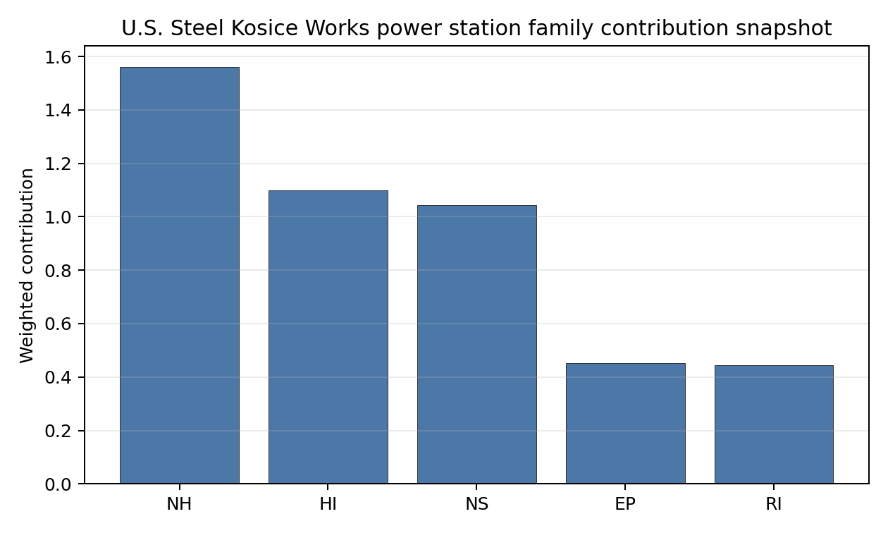

# U.S. Steel Kosice Works power station Site Profile

U.S. Steel Kosice Works power station is a coal/thermal site in Slovakia that has been tested against the NuScale VOYGR-6 reference deployment envelope. This profile reads the screening evidence at a level that supports a decision to progress toward Stage 3 characterization. It is not a site-suitability determination, vendor recommendation, or licensing finding.

## Site Snapshot

| Field | Value |
| --- | --- |
| Site name | U.S. Steel Kosice Works power station |
| Coordinates | 48.6159, 21.1946 |
| Subnational unit | Košice |
| Installed thermal capacity (source data) | 208 MW |
| Available surface area | 11.9 ha |
| Available surface area for development | 11.9 ha |
| Composite score (baseline weights) | 5.691 (5.174-6.181 MC band) |
| National stability band | H (top-10% hit rate 0%) |
| National rank | 5 |

_See the country status map in_ [Slovakia Country Profile](../SK_country_prototype.md#country-status-map).

## Ownership and Coal-to-Nuclear Context

- **Mitsubishi UFJ Financial Group Inc** (nan% share), headquartered in Japan; immediate operator US Steel Košice sro. Path: Mitsubishi UFJ Financial Group Inc -> Mitsubishi UFJ Trust and Banking Corp [100.0%] -> The Master Trust Bank of Japan Ltd [46.5%] -> Nippon Steel Corp [13.6%] -> Nippon Steel North America Inc [100.0%] -> United States Steel Corp [100.0%] -> U.S. Steel Holdings Inc [unknown %] -> U. S. Steel Global Holdings I BV [unknown %] -> U. S. Steel Global Holdings VI BV [unknown %] -> US Steel Košice sro [100.0%] -> U.S. Steel Kosice Works power station -- [100.0%]
- **The Master Trust Bank of Japan Ltd** (nan% share), headquartered in Japan; immediate operator US Steel Košice sro. Path: The Master Trust Bank of Japan Ltd -> Nippon Steel Corp [13.6%] -> Nippon Steel North America Inc [100.0%] -> United States Steel Corp [100.0%] -> U.S. Steel Holdings Inc [unknown %] -> U. S. Steel Global Holdings I BV [unknown %] -> U. S. Steel Global Holdings VI BV [unknown %] -> US Steel Košice sro [100.0%] -> U.S. Steel Kosice Works power station -- [100.0%]
- **Mizuho Financial Group Inc** (nan% share), headquartered in Japan; immediate operator US Steel Košice sro. Path: Mizuho Financial Group Inc -> Custody Bank of Japan Ltd [27.0%] -> Mitsubishi UFJ Financial Group Inc [5.85%] -> Mitsubishi UFJ Trust and Banking Corp [100.0%] -> The Master Trust Bank of Japan Ltd [46.5%] -> Nippon Steel Corp [13.6%] -> Nippon Steel North America Inc [100.0%] -> United States Steel Corp [100.0%] -> U.S. Steel Holdings Inc [unknown %] -> U. S. Steel Global Holdings I BV [unknown %] -> U. S. Steel Global Holdings VI BV [unknown %] -> US Steel Košice sro [100.0%] -> U.S. Steel Kosice Works power station -- [100.0%]
- **The Norinchukin Trust & Banking Co Ltd** (nan% share), headquartered in Japan; immediate operator US Steel Košice sro. Path: The Norinchukin Trust & Banking Co Ltd -> The Master Trust Bank of Japan Ltd [10.0%] -> Nippon Steel Corp [13.6%] -> Nippon Steel North America Inc [100.0%] -> United States Steel Corp [100.0%] -> U.S. Steel Holdings Inc [unknown %] -> U. S. Steel Global Holdings I BV [unknown %] -> U. S. Steel Global Holdings VI BV [unknown %] -> US Steel Košice sro [100.0%] -> U.S. Steel Kosice Works power station -- [100.0%]
- **Nippon Steel Corp** (nan% share), headquartered in Japan; immediate operator US Steel Košice sro. Path: Nippon Steel Corp -> Nippon Steel North America Inc [100.0%] -> United States Steel Corp [100.0%] -> U.S. Steel Holdings Inc [unknown %] -> U. S. Steel Global Holdings I BV [unknown %] -> U. S. Steel Global Holdings VI BV [unknown %] -> US Steel Košice sro [100.0%] -> U.S. Steel Kosice Works power station -- [100.0%]
- **Custody Bank of Japan Ltd** (nan% share), headquartered in Japan; immediate operator US Steel Košice sro. Path: Custody Bank of Japan Ltd -> Mitsubishi UFJ Financial Group Inc [5.85%] -> Mitsubishi UFJ Trust and Banking Corp [100.0%] -> The Master Trust Bank of Japan Ltd [46.5%] -> Nippon Steel Corp [13.6%] -> Nippon Steel North America Inc [100.0%] -> United States Steel Corp [100.0%] -> U.S. Steel Holdings Inc [unknown %] -> U. S. Steel Global Holdings I BV [unknown %] -> U. S. Steel Global Holdings VI BV [unknown %] -> US Steel Košice sro [100.0%] -> U.S. Steel Kosice Works power station -- [100.0%]
- **Norinchukin Bank** (nan% share), headquartered in Japan; immediate operator US Steel Košice sro. Path: Norinchukin Bank  -> The Norinchukin Trust & Banking Co Ltd [100.0%] -> The Master Trust Bank of Japan Ltd [10.0%] -> Nippon Steel Corp [13.6%] -> Nippon Steel North America Inc [100.0%] -> United States Steel Corp [100.0%] -> U.S. Steel Holdings Inc [unknown %] -> U. S. Steel Global Holdings I BV [unknown %] -> U. S. Steel Global Holdings VI BV [unknown %] -> US Steel Košice sro [100.0%] -> U.S. Steel Kosice Works power station -- [100.0%]
- **Asahi Mutual Life Insurance Co** (nan% share), headquartered in Japan; immediate operator US Steel Košice sro. Path: Asahi Mutual Life Insurance Co -> Custody Bank of Japan Ltd [5.0%] -> Mitsubishi UFJ Financial Group Inc [5.85%] -> Mitsubishi UFJ Trust and Banking Corp [100.0%] -> The Master Trust Bank of Japan Ltd [46.5%] -> Nippon Steel Corp [13.6%] -> Nippon Steel North America Inc [100.0%] -> United States Steel Corp [100.0%] -> U.S. Steel Holdings Inc [unknown %] -> U. S. Steel Global Holdings I BV [unknown %] -> U. S. Steel Global Holdings VI BV [unknown %] -> US Steel Košice sro [100.0%] -> U.S. Steel Kosice Works power station -- [100.0%]
- **The Dai-ichi Life Insurance Co Ltd** (nan% share), headquartered in Japan; immediate operator US Steel Košice sro. Path: The Dai-ichi Life Insurance Co Ltd -> Custody Bank of Japan Ltd [8.0%] -> Mitsubishi UFJ Financial Group Inc [5.85%] -> Mitsubishi UFJ Trust and Banking Corp [100.0%] -> The Master Trust Bank of Japan Ltd [46.5%] -> Nippon Steel Corp [13.6%] -> Nippon Steel North America Inc [100.0%] -> United States Steel Corp [100.0%] -> U.S. Steel Holdings Inc [unknown %] -> U. S. Steel Global Holdings I BV [unknown %] -> U. S. Steel Global Holdings VI BV [unknown %] -> US Steel Košice sro [100.0%] -> U.S. Steel Kosice Works power station -- [100.0%]
- **natural person(s)** (nan% share); immediate operator US Steel Košice sro. Path: natural person(s)  -> Sumitomo Mitsui Trust Holdings Inc [6.84%] -> Custody Bank of Japan Ltd [33.3%] -> Mitsubishi UFJ Financial Group Inc [5.85%] -> Mitsubishi UFJ Trust and Banking Corp [100.0%] -> The Master Trust Bank of Japan Ltd [46.5%] -> Nippon Steel Corp [13.6%] -> Nippon Steel North America Inc [100.0%] -> United States Steel Corp [100.0%] -> U.S. Steel Holdings Inc [unknown %] -> U. S. Steel Global Holdings I BV [unknown %] -> U. S. Steel Global Holdings VI BV [unknown %] -> US Steel Košice sro [100.0%] -> U.S. Steel Kosice Works power station -- [100.0%]
- **Sumitomo Mitsui Trust Holdings Inc** (nan% share), headquartered in Japan; immediate operator US Steel Košice sro. Path: Sumitomo Mitsui Trust Holdings Inc -> Custody Bank of Japan Ltd [33.3%] -> Mitsubishi UFJ Financial Group Inc [5.85%] -> Mitsubishi UFJ Trust and Banking Corp [100.0%] -> The Master Trust Bank of Japan Ltd [46.5%] -> Nippon Steel Corp [13.6%] -> Nippon Steel North America Inc [100.0%] -> United States Steel Corp [100.0%] -> U.S. Steel Holdings Inc [unknown %] -> U. S. Steel Global Holdings I BV [unknown %] -> U. S. Steel Global Holdings VI BV [unknown %] -> US Steel Košice sro [100.0%] -> U.S. Steel Kosice Works power station -- [100.0%]
- **Resona Bank Ltd** (nan% share), headquartered in Japan; immediate operator US Steel Košice sro. Path: Resona Bank Ltd -> Custody Bank of Japan Ltd [16.7%] -> Mitsubishi UFJ Financial Group Inc [5.85%] -> Mitsubishi UFJ Trust and Banking Corp [100.0%] -> The Master Trust Bank of Japan Ltd [46.5%] -> Nippon Steel Corp [13.6%] -> Nippon Steel North America Inc [100.0%] -> United States Steel Corp [100.0%] -> U.S. Steel Holdings Inc [unknown %] -> U. S. Steel Global Holdings I BV [unknown %] -> U. S. Steel Global Holdings VI BV [unknown %] -> US Steel Košice sro [100.0%] -> U.S. Steel Kosice Works power station -- [100.0%]
- **small shareholder(s)** (nan% share); immediate operator US Steel Košice sro. Path: small shareholder(s)  -> Nippon Steel Corp [86.4%] -> Nippon Steel North America Inc [100.0%] -> United States Steel Corp [100.0%] -> U.S. Steel Holdings Inc [unknown %] -> U. S. Steel Global Holdings I BV [unknown %] -> U. S. Steel Global Holdings VI BV [unknown %] -> US Steel Košice sro [100.0%] -> U.S. Steel Kosice Works power station -- [100.0%]
- **Nippon Life Insurance Co** (nan% share), headquartered in Japan; immediate operator US Steel Košice sro. Path: Nippon Life Insurance Co -> The Master Trust Bank of Japan Ltd [33.5%] -> Nippon Steel Corp [13.6%] -> Nippon Steel North America Inc [100.0%] -> United States Steel Corp [100.0%] -> U.S. Steel Holdings Inc [unknown %] -> U. S. Steel Global Holdings I BV [unknown %] -> U. S. Steel Global Holdings VI BV [unknown %] -> US Steel Košice sro [100.0%] -> U.S. Steel Kosice Works power station -- [100.0%]
- **Mitsubishi UFJ Trust and Banking Corp** (nan% share), headquartered in Japan; immediate operator US Steel Košice sro. Path: Mitsubishi UFJ Trust and Banking Corp -> The Master Trust Bank of Japan Ltd [46.5%] -> Nippon Steel Corp [13.6%] -> Nippon Steel North America Inc [100.0%] -> United States Steel Corp [100.0%] -> U.S. Steel Holdings Inc [unknown %] -> U. S. Steel Global Holdings I BV [unknown %] -> U. S. Steel Global Holdings VI BV [unknown %] -> US Steel Košice sro [100.0%] -> U.S. Steel Kosice Works power station -- [100.0%]
- **Meiji Yasuda Life Insurance Co** (nan% share), headquartered in Japan; immediate operator US Steel Košice sro. Path: Meiji Yasuda Life Insurance Co -> The Master Trust Bank of Japan Ltd [10.0%] -> Nippon Steel Corp [13.6%] -> Nippon Steel North America Inc [100.0%] -> United States Steel Corp [100.0%] -> U.S. Steel Holdings Inc [unknown %] -> U. S. Steel Global Holdings I BV [unknown %] -> U. S. Steel Global Holdings VI BV [unknown %] -> US Steel Košice sro [100.0%] -> U.S. Steel Kosice Works power station -- [100.0%]

Generating units on record: 1 operating.
Earliest unit commissioning: 2008; most recent: 2008.

## Natural Hazards (NH)

- **Seismic: Ground Motion (NH-01)** - score 5.5/10 (MC 5.0-6.0) — pass-mark band: At or below the score-5 risk boundary., weight 0.0455, data quality high. Evidence: PGA at 475-year return period 0.083 g; PGA at 2,475-year return period 0.221 g; Vs30 reference (m/s): 760.0.
- **Seismic: Surface Rupture (NH-02)** - score 9.5/10 (MC 9.0-10.0) — favorable: Very strong separation from mapped capable faults; surface-rupture concern effectively screened at desk-study level., weight n/a, data quality screening grade. Evidence: nearest mapped capable fault 50.0 km; fault slip rate 0 mm/yr; fault name: none_in_search_radius; E1 verdict (radius 5 km): outside the SSG-9 capable-fault screening envelope.
- **Geotechnical: Liquefaction (NH-03)** - score 5.5/10 (MC 5.0-6.0) — pass-mark band: Moderate susceptibility, or high/very-high with documented (or pending for `high`) mitigation., weight n/a, data quality medium. Evidence: liquefaction susceptibility: moderate.
- **Geotechnical: Slope Stability (NH-04)** - score 9.5/10 (MC 9.0-10.0) — favorable: Well below the risk boundary., weight n/a, data quality screening grade. Evidence: site slope 4 deg; max slope in 1 km box 29.7 deg; slope stability class: gentle.
- **Geotechnical: Subsidence (NH-05)** - score 7.5/10 (MC 7.0-8.0), weight 0.0354, data quality medium. Evidence: karst present: no; karst severity: none.
- **Geotechnical: Foundation (NH-06)** - score 3.5/10 (MC 3.0-4.0), weight 0.0253, data quality medium. Evidence: depth to bedrock 26.9 m.
- **Volcanism (NH-07)** - score 9.5/10 (MC 9.0-10.0) — favorable: Very strong margin above the score-5 boundary (or connector confirmed no in-radius signal)., weight n/a, data quality high. Evidence: volcanic hazard class: negligible.
- **Coastal Flooding (NH-08)** - score 9.5/10 (MC 9.0-10.0) — favorable: Non-coastal OR elevation >= 50 m AMSL OR landlocked country, with no positive marine-hazard signal., weight 0.0303, data quality medium. Evidence: distance to coast 622.7 km.
- **River Flooding (NH-09)** - score 7.5/10 (MC 7.0-8.0), weight 0.0404, data quality medium. Evidence: flood zone class: negligible.
- **Extreme Winds (NH-10)** - score 7.5/10 (MC 7.0-8.0), weight 0.0152, data quality medium. Evidence: design wind speed 8.51 m/s.
- **Extreme Precipitation (NH-11)** - score 8.0/10 (MC 8.0-9.0) — favorable: aggregated(mean_of_sub_scores), weight 0.0152, data quality medium. Evidence: extreme daily precipitation 0.21 mm; mean annual precipitation 22.3 mm/yr.
- **Extreme Temperatures (NH-12)** - score 6.5/10 (MC 6.0-7.0) — pass-mark band: aggregated(mean_of_sub_scores), weight 0.0202, data quality medium. Evidence: extreme high temperature 24.1 deg C; extreme low temperature -6.48 deg C.
- **Combined Hazards (NH-14)** - score 5.5/10 (MC 5.0-6.0) — pass-mark band: At least 5 resolved, exactly one moderate hazard (3-5) or moderate interaction only., weight 0.0152, data quality n/a. Evidence: values not in measurement tables.

### Interpretation - Natural Hazards (NH)

<!-- specialist key=family_natural_hazards scope=site site_id=a2d8261c-3d08-4015-946c-47dbddbd0b98 bundle=SK_u_s_steel_kosice_works_power_station_site_bundle.json status=pending -->
> _Specialist interpretation pending: Interpretation - Natural Hazards (NH). Cursor agent fills via `python -m scripts.run_specialist_pass show --country <CC> --site-name <name> --key family_natural_hazards` then `... patch --country <CC> --site-name <name> --key family_natural_hazards --text-file <draft.md>`._
<!-- /specialist key=family_natural_hazards -->

## Human-Induced and Security-Relevant Hazards (HI)

- **Aircraft Crash (HI-01)** - score 3.5/10 (MC 3.0-4.0), weight 0.0354, data quality high. Evidence: nearest airport 3.16 km; nearest flight path 1.58 km; airports within search radius 13; airport name: Letisko Veľká Ida; airport type: small_airport.
- **Industrial Explosions (HI-02)** - score 9.5/10 (MC 9.0-10.0) — favorable: Very strong margin above the score-5 boundary (or completed search confirmed no in-radius signal)., weight 0.0354, data quality medium. Evidence: values not in measurement tables.
- **Toxic/Gas Releases (HI-03)** - score 9.5/10 (MC 9.0-10.0) — favorable: Very strong margin above the score-5 boundary (or completed search confirmed no in-radius signal)., weight 0.0354, data quality medium. Evidence: values not in measurement tables.
- **External Fires (HI-04)** - score 9.5/10 (MC 9.0-10.0) — favorable: > 15 km, or completed flammable-storage search found nothing in radius., weight 0.0303, data quality medium. Evidence: values not in measurement tables.
- **Military Installations (HI-06)** - score 0.0/10 (MC 0.0-0.0), weight 0.0303, data quality high. Evidence: nearest military installation 4.02 km; military installations within radius 72; installation name: unnamed.
- **Electromagnetic Interference (HI-07)** - score 1.5/10 (MC 1.0-2.0), weight 0.0101, data quality medium. Evidence: nearest high-power transmitter 0.87 km; transmitters within radius 433; transmitter type: communication.

### Interpretation - Human-Induced and Security-Relevant Hazards (HI)

<!-- specialist key=family_human_hazards scope=site site_id=a2d8261c-3d08-4015-946c-47dbddbd0b98 bundle=SK_u_s_steel_kosice_works_power_station_site_bundle.json status=pending -->
> _Specialist interpretation pending: Interpretation - Human-Induced and Security-Relevant Hazards (HI). Cursor agent fills via `python -m scripts.run_specialist_pass show --country <CC> --site-name <name> --key family_human_hazards` then `... patch --country <CC> --site-name <name> --key family_human_hazards --text-file <draft.md>`._
<!-- /specialist key=family_human_hazards -->

## Radiological Impact and Emergency Planning (RI / EP)

- **Emergency Planning Feasibility (EP-01)** - score 7.5/10 (MC 7.0-8.0), weight n/a, data quality high. Evidence: EP feasibility composite 68.9 /100; road sub-score 53.6 /100; special-population sub-score 90.0 /100; geography sub-score 95.0 /100; population sub-score 80.0 /100; evacuation feasible: yes.
- **Evacuation Routes (EP-02)** - score 5.5/10 (MC 5.0-6.0) — pass-mark band: Adequate primary routes (0.5-1.0)., weight 0.0303, data quality medium. Evidence: road density in EPZ 0.527 km/km2; road length in EPZ 1,036 km; motorway access: yes.
- **Physical Geography Constraints (EP-03)** - score 9.5/10 (MC 9.0-10.0) — favorable: No measured relief; open river/waterway context (interim screening)., weight 0.0253, data quality medium. Evidence: waterways crossing EPZ 0; major river barrier: no.
- **Special Populations (EP-04)** - score 1.5/10 (MC 1.0-2.0), weight 0.0303, data quality medium. Evidence: hospitals in EPZ 59; prisons in EPZ 2; care homes in EPZ 0.
- **Atmospheric Dispersion (RI-01)** - score no native score (unscored — no band matched), weight 0.0303, data quality medium. Evidence: annual mean wind speed 0.94 m/s; atmospheric mixing height 488.7 m; prevailing wind direction: N.
- **Surface Water Dispersion (RI-02)** - score 1.5/10 (MC 1.0-2.0), weight 0.0253, data quality n/a. Evidence: values not in measurement tables.
- **Groundwater Dispersion (RI-03)** - score 5.5/10 (MC 5.0-6.0) — pass-mark band: Moderate-permeability aquifer screening proxy., weight 0.0253, data quality medium. Evidence: aquifer type: alluvial.
- **Population Density at EPZ Radii (RI-04)** - score 3.5/10 (MC 3.0-4.0), weight 0.0404, data quality screening grade. Evidence: population density within 5 km 169.0 /km2; population density within 16 km 350.3 /km2; population density within 25 km 188.1 /km2; population density within 80 km 109.1 /km2; population within 25 km 369,221 people.
- **Distance to Population Centres (RI-05)** - score 1.5/10 (MC 1.0-2.0), weight 0.0505, data quality screening grade. Evidence: nearest city above 50k people 10.3 km; nearest city population 227,458 people; city name: Košice.
- **Population Projections (RI-06)** - score 3.5/10 (MC 3.0-4.0), weight 0.0253, data quality screening grade. Evidence: annual population growth rate 0.51 %/yr; projected population at 25 km in 60 yr 306,059 people.

### Interpretation - Radiological Impact and Emergency Planning (RI / EP)

<!-- specialist key=family_radiological_emergency scope=site site_id=a2d8261c-3d08-4015-946c-47dbddbd0b98 bundle=SK_u_s_steel_kosice_works_power_station_site_bundle.json status=pending -->
> _Specialist interpretation pending: Interpretation - Radiological Impact and Emergency Planning (RI / EP). Cursor agent fills via `python -m scripts.run_specialist_pass show --country <CC> --site-name <name> --key family_radiological_emergency` then `... patch --country <CC> --site-name <name> --key family_radiological_emergency --text-file <draft.md>`._
<!-- /specialist key=family_radiological_emergency -->

## Non-Safety and Implementation Considerations (NS)

- **Grid Capacity Basic Filter (BF-01)** - score 5.5/10 (MC 5.0-6.0) — pass-mark band: Note: substation 15-30 km OR 110-219 kV; reinforcement plausible., weight n/a, data quality n/a. Evidence: values not in measurement tables.
- **Land Area Basic Filter (BF-02)** - score 1.5/10 (MC 1.0-2.0), weight 0.0253, data quality n/a. Evidence: values not in measurement tables.
- **Cooling Water Availability (NS-01)** - score 6.0/10 (MC 5.0-6.0) — pass-mark band: aggregated(weighted_mean_of_sub_scores), weight 0.0404, data quality screening grade. Evidence: distance to cooling source 9.97 km; cooling source flow 1.15 m3/s; cooling source type: small_river; cooling source name: Šacký kanál; water stress label: Low-Medium.
- **Grid Connection (NS-02)** - score 1.5/10 (MC 1.0-2.0), weight 0.0404, data quality high. Evidence: nearest substation 1.72 km; nearest high-voltage line 0.97 km; highest nearby line voltage 110.0 kV; grid export capacity 208.0 MW; substations within radius 419; HV lines within radius 288.
- **Transport Access (NS-03)** - score 9.0/10 (MC 9.0-10.0) — favorable: aggregated(weighted_mean_of_sub_scores), weight 0.0404, data quality high. Evidence: nearest highway 1.55 km; nearest rail line 0.15 km; heavy-haul capable: yes.
- **Site Topography (NS-04)** - score 9.5/10 (MC 9.0-10.0) — favorable: > 80 %., weight 0.0303, data quality screening grade. Evidence: favourable land cover 96.5 %; moderate land cover 3.5 %; unfavourable land cover 0.1 %; favourable area 301.1 ha; dominant land class: 121.
- **Site Footprint Adequacy (NS-05)** - score 3.5/10 (MC 3.0-4.0), weight 0.0253, data quality high. Evidence: buildable area 11.9 ha; largest contiguous patch 11.9 ha; buildable patch count 6.
- **Existing Infrastructure (NS-06)** - score no native score (unscored — no band matched), weight 0.0253, data quality n/a. Evidence: not measured at this site (criterion remains unscored).
- **Ecological Sensitivity (NS-08)** - score 3.5/10 (MC 3.0-4.0), weight n/a, data quality high. Evidence: natural land cover 0.1 %; distance to nearest Natura 2000 site 2.316 km; distance to nearest protected area 8.391 km; Natura 2000 overlap: no; Natura 2000 sensitivity class: moderate; protected-area overlap: no; protected-area sensitivity class: low; nearest Natura 2000 site: Košická kotlina; Natura 2000 sites within 5 km: 2; nearest protected-area designation: Protected Site / Private Protected Site.
- **Workforce Availability (NS-10)** - score no native score (unscored — no band matched), weight 0.0202, data quality n/a. Evidence: not measured at this site (criterion remains unscored).
- **Regulatory/Political Environment (NS-12)** - score no native score (unscored — no band matched), weight 0.0303, data quality n/a. Evidence: not measured at this site (criterion remains unscored).
- **Construction Logistics (NS-13)** - score no native score (unscored — no band matched), weight 0.0202, data quality n/a. Evidence: not measured at this site (criterion remains unscored).

### Interpretation - Non-Safety and Implementation Considerations (NS)

<!-- specialist key=family_infrastructure scope=site site_id=a2d8261c-3d08-4015-946c-47dbddbd0b98 bundle=SK_u_s_steel_kosice_works_power_station_site_bundle.json status=pending -->
> _Specialist interpretation pending: Interpretation - Non-Safety and Implementation Considerations (NS). Cursor agent fills via `python -m scripts.run_specialist_pass show --country <CC> --site-name <name> --key family_infrastructure` then `... patch --country <CC> --site-name <name> --key family_infrastructure --text-file <draft.md>`._
<!-- /specialist key=family_infrastructure -->

## Composite Score and Stability

Baseline composite score is 5.691, bracketed by Monte Carlo at 5.174-6.181. National stability band is `H` with a top-10% hit rate of 0% across 12 scored Monte Carlo scenarios.

<!-- specialist key=stability scope=site site_id=a2d8261c-3d08-4015-946c-47dbddbd0b98 bundle=SK_u_s_steel_kosice_works_power_station_site_bundle.json status=pending -->
> _Specialist interpretation pending: Composite stability and sensitivity (plain-English read). Cursor agent fills via `python -m scripts.run_specialist_pass show --country <CC> --site-name <name> --key stability` then `... patch --country <CC> --site-name <name> --key stability --text-file <draft.md>`._
<!-- /specialist key=stability -->

## Residual Risk Register

<!-- specialist key=residual_risk scope=site site_id=a2d8261c-3d08-4015-946c-47dbddbd0b98 bundle=SK_u_s_steel_kosice_works_power_station_site_bundle.json status=pending -->
> _Specialist interpretation pending: Residual risk register (specialist synthesis). Cursor agent fills via `python -m scripts.run_specialist_pass show --country <CC> --site-name <name> --key residual_risk` then `... patch --country <CC> --site-name <name> --key residual_risk --text-file <draft.md>`._
<!-- /specialist key=residual_risk -->

## Stage 3 Follow-Up Checklist

- [ ] Resolve **Aircraft Crash (HI-01)** avoidance flag - measured {"nearest_major_airport_km": 6.3} vs threshold A2 — Project: commercial / large / medium airport < 15 km (SSG-35 ≥ 16 km)..
- [ ] Resolve **Aircraft Crash (HI-01)** avoidance flag - measured {"flight_path_distance_km": 1.58, "under_flight_path": false} vs threshold A4 — SSG-35: flight-path overhead / < 4 km from airway (large + medium classes only)..
- [ ] Resolve **Grid Connection (NS-02)** avoidance flag - measured {"grid_export_capacity_mw": 208.0} vs threshold Project A13: transmission >= reference SMR net MWe within feasible distance..
- [ ] Resolve **Site Footprint Adequacy (NS-05)** avoidance flag - measured {"site_area_ha": 11.95} vs threshold Project A15: >= 14 ha canonical site area..
- [ ] Resolve **Distance to Population Centres (RI-05)** avoidance flag - measured {"nearest_city_50k_km": 10.33, "ri05_required_distance_km": 16.0} vs threshold Nearest >=50k population-centre proxy: 50k/>=8 km, 100k/>=16 km, 500k/>=32 km, 1M/>=48 km..
- [ ] Re-measure **Military Installations (HI-06)** - native score 0.0/10 with confidence high.
- [ ] Re-measure **Land Area Basic Filter (BF-02)** - native score 1.5/10 with confidence insufficient.
- [ ] Re-measure **Special Populations (EP-04)** - native score 1.5/10 with confidence medium.
- [ ] Re-measure **Electromagnetic Interference (HI-07)** - native score 1.5/10 with confidence medium.
- [ ] Re-measure **Grid Connection (NS-02)** - native score 1.5/10 with confidence high.

## Evidence Limitations

- No criterion-family quality fields are flagged as low or missing in this bundle.
