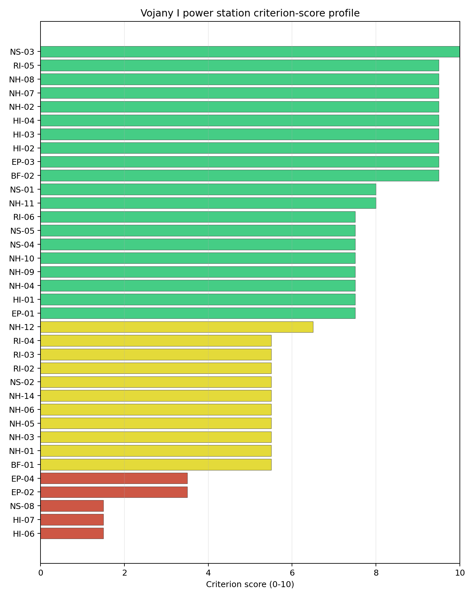

# Vojany I power station Site Profile

Vojany I power station is a coal/thermal site in Slovakia that has been tested against the NuScale VOYGR-6 reference deployment envelope. This profile reads the screening evidence at a level that supports a decision to progress toward Stage 3 characterization. It is not a site-suitability determination, vendor recommendation, or licensing finding.

## Site Snapshot

| Field | Value |
| --- | --- |
| Site name | Vojany I power station |
| Coordinates | 48.5525, 21.9726 |
| Subnational unit | Košice |
| Installed thermal capacity (source data) | 660 MW |
| Available surface area | 53.0 ha |
| Available surface area for development | 89.5 ha |
| Composite score (baseline weights) | 7.022 (6.250-7.481 MC band) |
| National stability band | A (top-10% hit rate 100%) |
| National rank | 1 |

_See the country status map in_ [Slovakia Country Profile](../SK_country_prototype.md#country-status-map).

## Ownership and Coal-to-Nuclear Context

- **Blackrock Advisors LLC** (0.08% share), headquartered in United States; immediate operator Slovenské Elektrárne AŞ. Path: Blackrock Advisors LLC -> BlackRock Inc [5.07%] -> Enel SpA [5.02%] -> Enel Italia SpA [100.0%] -> Enel Produzione SpA [100.0%] -> Slovak Power Holding BV [50.0%] -> Slovenské Elektrárne AŞ [66.0%] -> Vojany I power station Unit 4 [100.0%]
- **Government of Slovakia** (34.00% share), headquartered in Slovakia; immediate operator Slovenské Elektrárne AŞ. Path: Government of Slovakia  -> Ministry of Economy (Slovakia)  [100.0%] -> Slovenské Elektrárne AŞ [34.0%] -> Vojany I power station Unit 6 [100.0%]
- **Enel SpA** (33.00% share), headquartered in Italy; immediate operator Slovenské Elektrárne AŞ. Path: Enel SpA -> Enel Italia SpA [100.0%] -> Enel Produzione SpA [100.0%] -> Slovak Power Holding BV [50.0%] -> Slovenské Elektrárne AŞ [66.0%] -> Vojany I power station Unit 6 [100.0%]
- **BlackRock Inc** (1.66% share), headquartered in United States; immediate operator Slovenské Elektrárne AŞ. Path: BlackRock Inc -> Enel SpA [5.02%] -> Enel Italia SpA [100.0%] -> Enel Produzione SpA [100.0%] -> Slovak Power Holding BV [50.0%] -> Slovenské Elektrárne AŞ [66.0%] -> Vojany I power station Unit 4 [100.0%]
- **Ministry of Economy (Slovakia)** (34.00% share), headquartered in Slovakia; immediate operator Slovenské Elektrárne AŞ. Path: Ministry of Economy (Slovakia)  -> Slovenské Elektrárne AŞ [34.0%] -> Vojany I power station Unit 5 [100.0%]
- **small shareholder(s)** (23.49% share); immediate operator Slovenské Elektrárne AŞ. Path: small shareholder(s)  -> Enel SpA [71.18%] -> Enel Italia SpA [100.0%] -> Enel Produzione SpA [100.0%] -> Slovak Power Holding BV [50.0%] -> Slovenské Elektrárne AŞ [66.0%] -> Vojany I power station Unit 6 [100.0%]
- **The Vanguard Group Inc** (0.14% share), headquartered in United States; immediate operator Slovenské Elektrárne AŞ. Path: The Vanguard Group Inc -> BlackRock Inc [8.66%] -> Enel SpA [5.02%] -> Enel Italia SpA [100.0%] -> Enel Produzione SpA [100.0%] -> Slovak Power Holding BV [50.0%] -> Slovenské Elektrárne AŞ [66.0%] -> Vojany I power station Unit 4 [100.0%]
- **EP Slovakia BV** (33.00% share), headquartered in Netherlands; immediate operator Slovenské Elektrárne AŞ. Path: EP Slovakia BV -> Slovak Power Holding BV [50.0%] -> Slovenské Elektrárne AŞ [66.0%] -> Vojany I power station Unit 5 [100.0%]
- **Ministry of Economy and Finance (Italy)** (7.78% share), headquartered in Italy; immediate operator Slovenské Elektrárne AŞ. Path: Ministry of Economy and Finance (Italy)  -> Enel SpA [23.59%] -> Enel Italia SpA [100.0%] -> Enel Produzione SpA [100.0%] -> Slovak Power Holding BV [50.0%] -> Slovenské Elektrárne AŞ [66.0%] -> Vojany I power station Unit 6 [100.0%]

Generating units on record: 6 retired.
Earliest unit commissioning: 1965; most recent: 1966.
Retirements span 2008 to 2024, leaving brownfield grid, water, transport, and workforce assets that materially shorten Stage 3 site preparation.

## Natural Hazards (NH)

- **Seismic: Ground Motion (NH-01)** - score 5.5/10 (MC 5.0-6.0) — pass-mark band: At or below the score-5 risk boundary., weight 0.0455, data quality high. Evidence: PGA at 475-year return period 0.095 g; PGA at 2,475-year return period 0.237 g; Vs30 reference (m/s): 760.0.
- **Seismic: Surface Rupture (NH-02)** - score 9.5/10 (MC 9.0-10.0) — favorable: Very strong separation from mapped capable faults; surface-rupture concern effectively screened at desk-study level., weight n/a, data quality screening grade. Evidence: nearest mapped capable fault 50.0 km; fault slip rate 0 mm/yr; fault name: none_in_search_radius; E1 verdict (radius 5 km): outside the SSG-9 capable-fault screening envelope.
- **Geotechnical: Liquefaction (NH-03)** - score 5.5/10 (MC 5.0-6.0) — pass-mark band: Moderate susceptibility, or high/very-high with documented (or pending for `high`) mitigation., weight n/a, data quality medium. Evidence: liquefaction susceptibility: high; dominant soil type: silty_clay_loam.
- **Geotechnical: Slope Stability (NH-04)** - score 7.5/10 (MC 7.0-8.0), weight n/a, data quality screening grade. Evidence: site slope 5.45 deg; max slope in 1 km box 79.4 deg; slope stability class: moderate.
- **Geotechnical: Subsidence (NH-05)** - score 5.5/10 (MC 5.0-6.0) — pass-mark band: At or above the mine-distance score-5 pivot; review possible., weight 0.0354, data quality medium. Evidence: karst present: no; karst severity: none.
- **Geotechnical: Foundation (NH-06)** - score 5.5/10 (MC 5.0-6.0) — pass-mark band: Typical European mixed conditions (bearing 80-150 kPa)., weight 0.0253, data quality medium. Evidence: bearing capacity 88.0 kPa; depth to bedrock 22.9 m.
- **Volcanism (NH-07)** - score 9.5/10 (MC 9.0-10.0) — favorable: Very strong margin above the score-5 boundary (or connector confirmed no in-radius signal)., weight n/a, data quality high. Evidence: volcanic hazard class: negligible.
- **Coastal Flooding (NH-08)** - score 9.5/10 (MC 9.0-10.0) — favorable: Non-coastal OR elevation >= 50 m AMSL OR landlocked country, with no positive marine-hazard signal., weight 0.0303, data quality medium. Evidence: distance to coast 660.1 km.
- **River Flooding (NH-09)** - score 7.5/10 (MC 7.0-8.0), weight 0.0404, data quality medium. Evidence: flood zone class: negligible.
- **Extreme Winds (NH-10)** - score 7.5/10 (MC 7.0-8.0), weight 0.0152, data quality medium. Evidence: design wind speed 7.63 m/s.
- **Extreme Precipitation (NH-11)** - score 8.0/10 (MC 8.0-9.0) — favorable: aggregated(mean_of_sub_scores), weight 0.0152, data quality medium. Evidence: extreme daily precipitation 0.21 mm; mean annual precipitation 25.2 mm/yr.
- **Extreme Temperatures (NH-12)** - score 6.5/10 (MC 6.0-7.0) — pass-mark band: aggregated(mean_of_sub_scores), weight 0.0202, data quality medium. Evidence: extreme high temperature 25.3 deg C; extreme low temperature -5.87 deg C.
- **Combined Hazards (NH-14)** - score 5.5/10 (MC 5.0-6.0) — pass-mark band: At least 5 resolved, exactly one moderate hazard (3-5) or moderate interaction only., weight 0.0152, data quality n/a. Evidence: values not in measurement tables.

### Interpretation - Natural Hazards (NH)

<!-- specialist key=family_natural_hazards scope=site site_id=770f1d3c-e5fd-493c-a376-e708d2abec6c bundle=SK_vojany_i_power_station_site_bundle.json status=pending -->

<!-- /specialist key=family_natural_hazards -->

## Human-Induced and Security-Relevant Hazards (HI)

- **Aircraft Crash (HI-01)** - score 7.5/10 (MC 7.0-8.0), weight 0.0354, data quality high. Evidence: nearest airport 12.3 km; nearest flight path 6.14 km; airports within search radius 8; airport name: Kačanov Airstrip; airport type: small_airport.
- **Industrial Explosions (HI-02)** - score 9.5/10 (MC 9.0-10.0) — favorable: Very strong margin above the score-5 boundary (or completed search confirmed no in-radius signal)., weight 0.0354, data quality medium. Evidence: values not in measurement tables.
- **Toxic/Gas Releases (HI-03)** - score 9.5/10 (MC 9.0-10.0) — favorable: Very strong margin above the score-5 boundary (or completed search confirmed no in-radius signal)., weight 0.0354, data quality medium. Evidence: values not in measurement tables.
- **External Fires (HI-04)** - score 9.5/10 (MC 9.0-10.0) — favorable: > 15 km, or completed flammable-storage search found nothing in radius., weight 0.0303, data quality medium. Evidence: values not in measurement tables.
- **Military Installations (HI-06)** - score 1.5/10 (MC 1.0-2.0), weight 0.0303, data quality medium. Evidence: nearest military installation 14.9 km; military installations within radius 20; installation name: Už.
- **Electromagnetic Interference (HI-07)** - score 1.5/10 (MC 1.0-2.0), weight 0.0101, data quality medium. Evidence: nearest high-power transmitter 0.46 km; transmitters within radius 183; transmitter type: mast.

### Interpretation - Human-Induced and Security-Relevant Hazards (HI)

<!-- specialist key=family_human_hazards scope=site site_id=770f1d3c-e5fd-493c-a376-e708d2abec6c bundle=SK_vojany_i_power_station_site_bundle.json status=pending -->

<!-- /specialist key=family_human_hazards -->

## Radiological Impact and Emergency Planning (RI / EP)

- **Emergency Planning Feasibility (EP-01)** - score 7.5/10 (MC 7.0-8.0), weight n/a, data quality high. Evidence: EP feasibility composite 70.7 /100; road sub-score 51.8 /100; special-population sub-score 90.0 /100; geography sub-score 95.0 /100; population sub-score 95.0 /100; evacuation feasible: yes.
- **Evacuation Routes (EP-02)** - score 3.5/10 (MC 3.0-4.0), weight 0.0303, data quality medium. Evidence: road density in EPZ 0.496 km/km2; road length in EPZ 974.4 km; motorway access: yes.
- **Physical Geography Constraints (EP-03)** - score 9.5/10 (MC 9.0-10.0) — favorable: No measured relief; open river/waterway context (interim screening)., weight 0.0253, data quality medium. Evidence: waterways crossing EPZ 0; major river barrier: no.
- **Special Populations (EP-04)** - score 3.5/10 (MC 3.0-4.0), weight 0.0303, data quality medium. Evidence: hospitals in EPZ 36; prisons in EPZ 1; care homes in EPZ 0.
- **Atmospheric Dispersion (RI-01)** - score no native score (unscored — no band matched), weight 0.0303, data quality medium. Evidence: annual mean wind speed 0.9 m/s; atmospheric mixing height 487.6 m; prevailing wind direction: N.
- **Surface Water Dispersion (RI-02)** - score 5.5/10 (MC 5.0-6.0) — pass-mark band: 30-100 m3/s., weight 0.0253, data quality n/a. Evidence: values not in measurement tables.
- **Groundwater Dispersion (RI-03)** - score 5.5/10 (MC 5.0-6.0) — pass-mark band: Moderate-permeability aquifer screening proxy., weight 0.0253, data quality medium. Evidence: aquifer type: alluvial.
- **Population Density at EPZ Radii (RI-04)** - score 5.5/10 (MC 5.0-6.0) — pass-mark band: aggregated(min_of_sub_scores), weight 0.0404, data quality screening grade. Evidence: population density within 5 km 50.2 /km2; population density within 16 km 78.1 /km2; population density within 25 km 139.0 /km2; population density within 80 km 107.5 /km2; population within 25 km 272,837 people.
- **Distance to Population Centres (RI-05)** - score 9.5/10 (MC 9.0-10.0) — favorable: Nearest >=50k population-centre proxy exceeds required distance by >= 50 %., weight 0.0505, data quality screening grade. Evidence: nearest city above 50k people 57.3 km; nearest city population 227,458 people; city name: Košice.
- **Population Projections (RI-06)** - score 7.5/10 (MC 7.0-8.0), weight 0.0253, data quality screening grade. Evidence: annual population growth rate -0.172 %/yr; projected population at 25 km in 60 yr 226,167 people.

### Interpretation - Radiological Impact and Emergency Planning (RI / EP)

<!-- specialist key=family_radiological_emergency scope=site site_id=770f1d3c-e5fd-493c-a376-e708d2abec6c bundle=SK_vojany_i_power_station_site_bundle.json status=pending -->

<!-- /specialist key=family_radiological_emergency -->

## Non-Safety and Implementation Considerations (NS)

- **Grid Capacity Basic Filter (BF-01)** - score 5.5/10 (MC 5.0-6.0) — pass-mark band: Note: substation 15-30 km OR 110-219 kV; reinforcement plausible., weight n/a, data quality n/a. Evidence: values not in measurement tables.
- **Land Area Basic Filter (BF-02)** - score 9.5/10 (MC 9.0-10.0) — favorable: Contiguous and buildable >= ideal area (70 ha/module)., weight 0.0253, data quality n/a. Evidence: values not in measurement tables.
- **Cooling Water Availability (NS-01)** - score 8.0/10 (MC 7.0-8.0) — favorable: aggregated(weighted_mean_of_sub_scores), weight 0.0404, data quality screening grade. Evidence: distance to cooling source 1.37 km; cooling source flow 34.7 m3/s; cooling source type: river; cooling source name: Laborec; water stress label: Low-Medium.
- **Grid Connection (NS-02)** - score 5.5/10 (MC 5.0-6.0) — pass-mark band: aggregated(min_of_sub_scores), weight 0.0404, data quality high. Evidence: nearest substation 0.46 km; nearest high-voltage line 0.21 km; highest nearby line voltage 110.0 kV; grid export capacity 660.0 MW; substations within radius 194; HV lines within radius 384.
- **Transport Access (NS-03)** - score 10.0/10 (MC 9.0-10.0) — favorable: aggregated(weighted_mean_of_sub_scores), weight 0.0404, data quality medium. Evidence: nearest rail line 0.06 km; heavy-haul capable: yes.
- **Site Topography (NS-04)** - score 7.5/10 (MC 7.0-8.0), weight 0.0303, data quality screening grade. Evidence: favourable land cover 69.5 %; moderate land cover 12.9 %; unfavourable land cover 17.6 %; favourable area 195.6 ha; dominant land class: 211.
- **Site Footprint Adequacy (NS-05)** - score 7.5/10 (MC 7.0-8.0), weight 0.0253, data quality high. Evidence: buildable area 89.5 ha; largest contiguous patch 89.5 ha; buildable patch count 10.
- **Existing Infrastructure (NS-06)** - score no native score (unscored — no band matched), weight 0.0253, data quality n/a. Evidence: not measured at this site (criterion remains unscored).
- **Ecological Sensitivity (NS-08)** - score 1.5/10 (MC 1.0-2.0), weight n/a, data quality high. Evidence: natural land cover 17.6 %; distance to nearest Natura 2000 site 0.213 km; distance to nearest protected area 2.427 km; Natura 2000 overlap: no; Natura 2000 sensitivity class: high; protected-area overlap: no; protected-area sensitivity class: moderate; nearest Natura 2000 site: Medzibodrožie; Natura 2000 sites within 5 km: 7; nearest protected-area designation: Protected Landscape Area; second level of protection.
- **Workforce Availability (NS-10)** - score no native score (unscored — no band matched), weight 0.0202, data quality n/a. Evidence: not measured at this site (criterion remains unscored).
- **Regulatory/Political Environment (NS-12)** - score no native score (unscored — no band matched), weight 0.0303, data quality n/a. Evidence: not measured at this site (criterion remains unscored).
- **Construction Logistics (NS-13)** - score no native score (unscored — no band matched), weight 0.0202, data quality n/a. Evidence: not measured at this site (criterion remains unscored).

### Interpretation - Non-Safety and Implementation Considerations (NS)

<!-- specialist key=family_infrastructure scope=site site_id=770f1d3c-e5fd-493c-a376-e708d2abec6c bundle=SK_vojany_i_power_station_site_bundle.json status=pending -->

<!-- /specialist key=family_infrastructure -->

## Composite Score and Stability

Baseline composite score is 7.022, bracketed by Monte Carlo at 6.250-7.481. National stability band is `A` with a top-10% hit rate of 100% across 12 scored Monte Carlo scenarios.

<!-- specialist key=stability scope=site site_id=770f1d3c-e5fd-493c-a376-e708d2abec6c bundle=SK_vojany_i_power_station_site_bundle.json status=pending -->

<!-- /specialist key=stability -->

## Residual Risk Register

<!-- specialist key=residual_risk scope=site site_id=770f1d3c-e5fd-493c-a376-e708d2abec6c bundle=SK_vojany_i_power_station_site_bundle.json status=pending -->

<!-- /specialist key=residual_risk -->

## Stage 3 Follow-Up Checklist

- [ ] Re-measure **Military Installations (HI-06)** - native score 1.5/10 with confidence medium.
- [ ] Re-measure **Electromagnetic Interference (HI-07)** - native score 1.5/10 with confidence medium.
- [ ] Re-measure **Ecological Sensitivity (NS-08)** - native score 1.5/10 with confidence high.
- [ ] Re-measure **Evacuation Routes (EP-02)** - native score 3.5/10 with confidence medium.
- [ ] Re-measure **Special Populations (EP-04)** - native score 3.5/10 with confidence medium.

## Evidence Limitations

- No criterion-family quality fields are flagged as low or missing in this bundle.
