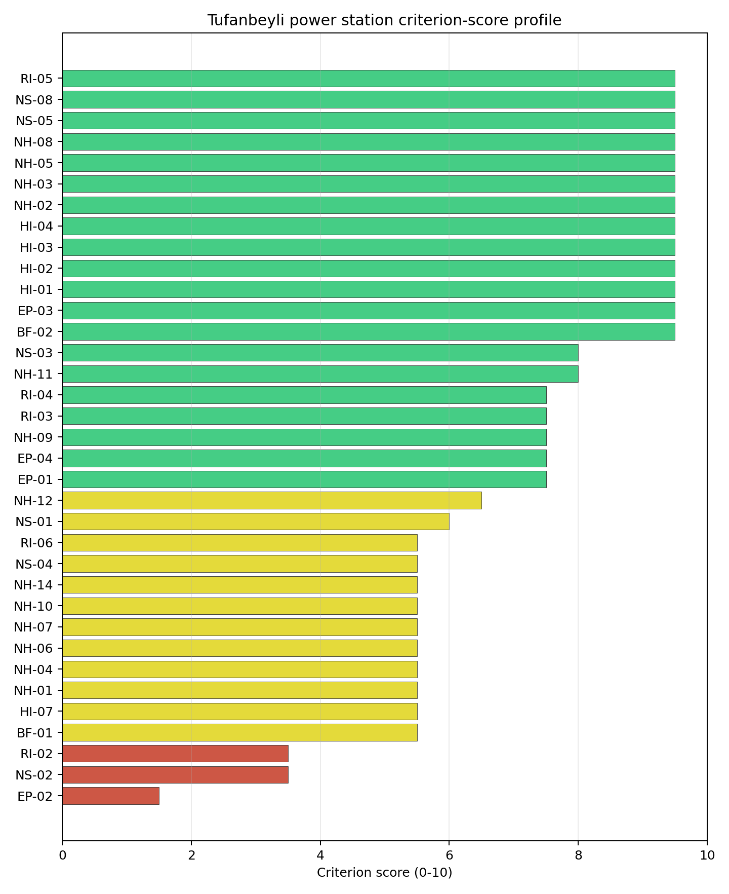
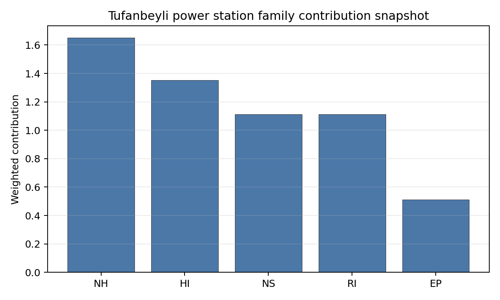

# Tufanbeyli power station Site Profile

Tufanbeyli power station is a coal/thermal site in Türkiye that has been tested against the NuScale VOYGR-6 reference deployment envelope. This profile reads the screening evidence at a level that supports a decision to progress toward Stage 3 characterization. It is not a site-suitability determination, vendor recommendation, or licensing finding.

## Site Snapshot

| Field | Value |
| --- | --- |
| Site name | Tufanbeyli power station |
| Coordinates | 38.1856, 36.2699 |
| Subnational unit | Adana |
| Installed thermal capacity (source data) | 450 MW |
| Available surface area | 312.0 ha |
| Available surface area for development | 312.0 ha |
| Composite score (baseline weights) | 7.380 (6.407-7.890 MC band) |
| National stability band | A (top-10% hit rate 100%) |
| National rank | 3 |

_See the country status map in_ [Türkiye Country Profile](../TR_country_prototype.md#country-status-map).

## Ownership and Coal-to-Nuclear Context

- **Qatar Investment Authority** (0.68% share), headquartered in Qatar; immediate operator Enerjisa Enerji Uretim AS. Path: Qatar Investment Authority  -> Qatar Holding LLC [100.0%] -> RWE AG [9.1%] -> E.ON SE [15.0%] -> Enerjisa Enerji Uretim AS [50.0%] -> Tufanbeyli power station Unit 1 [100.0%]
- **RWE AG** (7.50% share), headquartered in Germany; immediate operator Enerjisa Enerji Uretim AS. Path: RWE AG -> E.ON SE [15.0%] -> Enerjisa Enerji Uretim AS [50.0%] -> Tufanbeyli power station Unit 1 [100.0%]
- **Blackrock Advisors LLC** (0.14% share), headquartered in United States; immediate operator Enerjisa Enerji Uretim AS. Path: Blackrock Advisors LLC -> BlackRock Inc [5.07%] -> E.ON SE [5.4%] -> Enerjisa Enerji Uretim AS [50.0%] -> Tufanbeyli power station Unit 1 [100.0%]
- **Hacı Ömer Sabancı Holding AŞ** (50.00% share), headquartered in Türkiye; immediate operator Enerjisa Enerji Uretim AS. Path: Hacı Ömer Sabancı Holding AŞ -> Enerjisa Enerji Uretim AS [50.0%] -> Tufanbeyli power station Unit 2 [100.0%]
- **Qatar Holding LLC** (0.68% share), headquartered in Qatar; immediate operator Enerjisa Enerji Uretim AS. Path: Qatar Holding LLC -> RWE AG [9.1%] -> E.ON SE [15.0%] -> Enerjisa Enerji Uretim AS [50.0%] -> Tufanbeyli power station Unit 1 [100.0%]
- **Sakip Sabanci Holding AŞ** (7.03% share), headquartered in Türkiye; immediate operator Enerjisa Enerji Uretim AS. Path: Sakip Sabanci Holding AŞ -> Hacı Ömer Sabancı Holding AŞ [14.07%] -> Enerjisa Enerji Uretim AS [50.0%] -> Tufanbeyli power station Unit 2 [100.0%]
- **natural person(s)** (10.55% share); immediate operator Enerjisa Enerji Uretim AS. Path: natural person(s)  -> Hacı Ömer Sabancı Holding AŞ [21.1%] -> Enerjisa Enerji Uretim AS [50.0%] -> Tufanbeyli power station Unit 3 [100.0%]
- **Government of Qatar** (0.68% share), headquartered in Qatar; immediate operator Enerjisa Enerji Uretim AS. Path: Government of Qatar  -> Qatar Investment Authority  [100.0%] -> Qatar Holding LLC [100.0%] -> RWE AG [9.1%] -> E.ON SE [15.0%] -> Enerjisa Enerji Uretim AS [50.0%] -> Tufanbeyli power station Unit 1 [100.0%]
- **E.ON SE** (50.00% share), headquartered in Germany; immediate operator Enerjisa Enerji Uretim AS. Path: E.ON SE -> Enerjisa Enerji Uretim AS [50.0%] -> Tufanbeyli power station Unit 1 [100.0%]
- **BlackRock Inc** (2.70% share), headquartered in United States; immediate operator Enerjisa Enerji Uretim AS. Path: BlackRock Inc -> E.ON SE [5.4%] -> Enerjisa Enerji Uretim AS [50.0%] -> Tufanbeyli power station Unit 1 [100.0%]
- **small shareholder(s)** (32.42% share); immediate operator Enerjisa Enerji Uretim AS. Path: small shareholder(s)  -> Hacı Ömer Sabancı Holding AŞ [64.83%] -> Enerjisa Enerji Uretim AS [50.0%] -> Tufanbeyli power station Unit 3 [100.0%]
- **The Vanguard Group Inc** (0.23% share), headquartered in United States; immediate operator Enerjisa Enerji Uretim AS. Path: The Vanguard Group Inc -> BlackRock Inc [8.66%] -> E.ON SE [5.4%] -> Enerjisa Enerji Uretim AS [50.0%] -> Tufanbeyli power station Unit 1 [100.0%]

Generating units on record: 3 operating.
Earliest unit commissioning: 2016; most recent: 2016.

## Natural Hazards (NH)

- **Seismic: Ground Motion (NH-01)** - score 5.5/10 (MC 5.0-6.0) — pass-mark band: At or below the score-5 risk boundary., weight 0.0455, data quality high. Evidence: PGA at 475-year return period 0.199 g; PGA at 2,475-year return period 0.444 g; Vs30 reference (m/s): 760.0.
- **Seismic: Surface Rupture (NH-02)** - score 9.5/10 (MC 9.0-10.0) — favorable: Very strong separation from mapped capable faults; surface-rupture concern effectively screened at desk-study level., weight n/a, data quality screening grade. Evidence: nearest mapped capable fault 31.4 km; fault slip rate 2.449 mm/yr; fault name: TRCF03H; E1 verdict (radius 5 km): outside the SSG-9 capable-fault screening envelope.
- **Geotechnical: Liquefaction (NH-03)** - score 9.5/10 (MC 9.0-10.0) — favorable: Negligible susceptibility (Stage-1 favourable default)., weight n/a, data quality medium. Evidence: liquefaction susceptibility: very_low; dominant soil type: clay_loam.
- **Geotechnical: Slope Stability (NH-04)** - score 5.5/10 (MC 5.0-6.0) — pass-mark band: At or below the score-5 risk boundary., weight n/a, data quality screening grade. Evidence: site slope 16.0 deg; max slope in 1 km box 89.2 deg; slope stability class: very_steep.
- **Geotechnical: Subsidence (NH-05)** - score 9.5/10 (MC 9.0-10.0) — favorable: No karst; mine-feature distance well above the score-5 pivot (or unknown)., weight 0.0354, data quality medium. Evidence: karst present: no; karst severity: none.
- **Geotechnical: Foundation (NH-06)** - score 5.5/10 (MC 5.0-6.0) — pass-mark band: Typical European mixed conditions (bearing 80-150 kPa)., weight 0.0253, data quality medium. Evidence: bearing capacity 82.7 kPa; depth to bedrock 12.7 m.
- **Volcanism (NH-07)** - score 5.5/10 (MC 5.0-6.0) — pass-mark band: At or above the score-5 boundary., weight n/a, data quality medium. Evidence: nearest Holocene volcano 81.4 km; volcano name: Erciyes Volcanic Complex; volcanic hazard class: avoidance.
- **Coastal Flooding (NH-08)** - score 9.5/10 (MC 9.0-10.0) — favorable: Non-coastal OR elevation >= 50 m AMSL OR landlocked country, with no positive marine-hazard signal., weight 0.0303, data quality medium. Evidence: distance to coast 142.8 km.
- **River Flooding (NH-09)** - score 7.5/10 (MC 7.0-8.0), weight 0.0404, data quality medium. Evidence: flood zone class: negligible.
- **Extreme Winds (NH-10)** - score 5.5/10 (MC 5.0-6.0) — pass-mark band: Middle relative wind exposure around the observed set mean (9.0-10.5 m/s)., weight 0.0152, data quality medium. Evidence: design wind speed 9.99 m/s.
- **Extreme Precipitation (NH-11)** - score 8.0/10 (MC 8.0-9.0) — favorable: aggregated(mean_of_sub_scores), weight 0.0152, data quality medium. Evidence: extreme daily precipitation 0.2 mm; mean annual precipitation 19.6 mm/yr.
- **Extreme Temperatures (NH-12)** - score 6.5/10 (MC 6.0-7.0) — pass-mark band: aggregated(mean_of_sub_scores), weight 0.0202, data quality medium. Evidence: extreme high temperature 22.8 deg C; extreme low temperature -11.3 deg C.
- **Combined Hazards (NH-14)** - score 5.5/10 (MC 5.0-6.0) — pass-mark band: At least 5 resolved, exactly one moderate hazard (3-5) or moderate interaction only., weight 0.0152, data quality n/a. Evidence: values not in measurement tables.

### Interpretation - Natural Hazards (NH)

<!-- specialist key=family_natural_hazards scope=site site_id=6c9571c4-5d3b-4f88-a7be-fa8c21425eeb bundle=TR_tufanbeyli_power_station_site_bundle.json status=pending -->

<!-- /specialist key=family_natural_hazards -->

## Human-Induced and Security-Relevant Hazards (HI)

- **Aircraft Crash (HI-01)** - score 9.5/10 (MC 9.0-10.0) — favorable: Nearest large/medium airport > 30 km, no flight-path proxy < 4 km, and no military airbase within 60 km., weight 0.0354, data quality high. Evidence: nearest airport 85.6 km; nearest flight path 44.0 km; airports within search radius 0; airport name: Kayseri Provincial Health Directorate Helipad; airport type: heliport.
- **Industrial Explosions (HI-02)** - score 9.5/10 (MC 7.5-10.0) — favorable: Very strong margin above the score-5 boundary (or completed search confirmed no in-radius signal)., weight 0.0354, data quality low. Evidence: values not in measurement tables.
- **Toxic/Gas Releases (HI-03)** - score 9.5/10 (MC 7.5-10.0) — favorable: Very strong margin above the score-5 boundary (or completed search confirmed no in-radius signal)., weight 0.0354, data quality low. Evidence: values not in measurement tables.
- **External Fires (HI-04)** - score 9.5/10 (MC 7.5-10.0) — favorable: > 15 km, or completed flammable-storage search found nothing in radius., weight 0.0303, data quality low. Evidence: values not in measurement tables.
- **Military Installations (HI-06)** - score no native score (unscored — no band matched), weight 0.0303, data quality screening grade. Evidence: military installations within radius 0.
- **Electromagnetic Interference (HI-07)** - score 5.5/10 (MC 5.0-6.0) — pass-mark band: Scoreable ordinary RF environment from count/proximity evidence; power-class-specific severity deferred., weight 0.0101, data quality medium. Evidence: nearest high-power transmitter 5.62 km; transmitters within radius 18; transmitter type: communication.

### Interpretation - Human-Induced and Security-Relevant Hazards (HI)

<!-- specialist key=family_human_hazards scope=site site_id=6c9571c4-5d3b-4f88-a7be-fa8c21425eeb bundle=TR_tufanbeyli_power_station_site_bundle.json status=pending -->

<!-- /specialist key=family_human_hazards -->

## Radiological Impact and Emergency Planning (RI / EP)

- **Emergency Planning Feasibility (EP-01)** - score 7.5/10 (MC 7.0-8.0), weight n/a, data quality high. Evidence: EP feasibility composite 67.1 /100; road sub-score 37.3 /100; special-population sub-score 90.0 /100; geography sub-score 95.0 /100; population sub-score 95.0 /100; evacuation feasible: yes.
- **Evacuation Routes (EP-02)** - score 1.5/10 (MC 1.0-2.0), weight 0.0303, data quality medium. Evidence: road density in EPZ 0.273 km/km2; road length in EPZ 535.2 km; motorway access: yes.
- **Physical Geography Constraints (EP-03)** - score 9.5/10 (MC 9.0-10.0) — favorable: No measured relief; open river/waterway context (interim screening)., weight 0.0253, data quality medium. Evidence: waterways crossing EPZ 0; major river barrier: no.
- **Special Populations (EP-04)** - score 7.5/10 (MC 7.0-8.0), weight 0.0303, data quality medium. Evidence: hospitals in EPZ 3; prisons in EPZ 1; care homes in EPZ 0.
- **Atmospheric Dispersion (RI-01)** - score no native score (unscored — no band matched), weight 0.0303, data quality medium. Evidence: annual mean wind speed 0.92 m/s; atmospheric mixing height 529.4 m; prevailing wind direction: NNW.
- **Surface Water Dispersion (RI-02)** - score 3.5/10 (MC 3.0-4.0), weight 0.0253, data quality n/a. Evidence: values not in measurement tables.
- **Groundwater Dispersion (RI-03)** - score 7.5/10 (MC 7.0-8.0), weight 0.0253, data quality medium. Evidence: aquifer type: low permeability.
- **Population Density at EPZ Radii (RI-04)** - score 7.5/10 (MC 7.0-8.0), weight 0.0404, data quality screening grade. Evidence: population density within 5 km 22.3 /km2; population density within 16 km 22.6 /km2; population density within 25 km 15.2 /km2; population density within 80 km 25.4 /km2; population within 25 km 29,824 people.
- **Distance to Population Centres (RI-05)** - score 9.5/10 (MC 9.0-10.0) — favorable: No >=50k population-centre proxy within screening envelope., weight 0.0505, data quality screening grade. Evidence: values not in measurement tables.
- **Population Projections (RI-06)** - score 5.5/10 (MC 5.0-6.0) — pass-mark band: 0 % to +0.3 %., weight 0.0253, data quality screening grade. Evidence: annual population growth rate 0.074 %/yr; projected population at 25 km in 60 yr 32,695 people.

### Interpretation - Radiological Impact and Emergency Planning (RI / EP)

<!-- specialist key=family_radiological_emergency scope=site site_id=6c9571c4-5d3b-4f88-a7be-fa8c21425eeb bundle=TR_tufanbeyli_power_station_site_bundle.json status=pending -->

<!-- /specialist key=family_radiological_emergency -->

## Non-Safety and Implementation Considerations (NS)

- **Grid Capacity Basic Filter (BF-01)** - score 5.5/10 (MC 5.0-6.0) — pass-mark band: Note: substation 15-30 km OR 110-219 kV; reinforcement plausible., weight n/a, data quality n/a. Evidence: values not in measurement tables.
- **Land Area Basic Filter (BF-02)** - score 9.5/10 (MC 9.0-10.0) — favorable: Contiguous and buildable >= ideal area (70 ha/module)., weight 0.0253, data quality n/a. Evidence: values not in measurement tables.
- **Cooling Water Availability (NS-01)** - score 6.0/10 (MC 6.0-7.0) — pass-mark band: aggregated(weighted_mean_of_sub_scores), weight 0.0404, data quality screening grade. Evidence: distance to cooling source 1.92 km; cooling source flow 10.7 m3/s; cooling source type: river; cooling source name: Sarız Çayı; water stress label: High.
- **Grid Connection (NS-02)** - score 3.5/10 (MC 3.0-4.0), weight 0.0404, data quality medium. Evidence: nearest substation 0.33 km; nearest high-voltage line 26.8 km; highest nearby line voltage 380.0 kV; grid export capacity 450.0 MW; substations within radius 6; HV lines within radius 16.
- **Transport Access (NS-03)** - score 8.0/10 (MC 7.0-8.0) — favorable: aggregated(weighted_mean_of_sub_scores), weight 0.0404, data quality medium. Evidence: nearest highway 5.5 km; heavy-haul capable: yes.
- **Site Topography (NS-04)** - score 5.5/10 (MC 5.0-6.0) — pass-mark band: 40-60 %., weight 0.0303, data quality screening grade. Evidence: favourable land cover 46.4 %; moderate land cover 52.4 %; unfavourable land cover 1.2 %; favourable area 143.5 ha; dominant land class: 321.
- **Site Footprint Adequacy (NS-05)** - score 9.5/10 (MC 9.0-10.0) — favorable: Very strong margin above the score-5 boundary., weight 0.0253, data quality screening grade. Evidence: buildable area 312.0 ha; largest contiguous patch 1,242 ha; buildable patch count 1.
- **Existing Infrastructure (NS-06)** - score no native score (unscored — no band matched), weight 0.0253, data quality n/a. Evidence: not measured at this site (criterion remains unscored).
- **Ecological Sensitivity (NS-08)** - score 9.5/10 (MC 7.5-10.0) — favorable: Both networks NULL or > 25 km AND eco_pct NULL or < 15 %., weight n/a, data quality insufficient. Evidence: natural land cover 1.2 %; Natura 2000 sensitivity class: unknown; protected-area overlap: no; protected-area sensitivity class: none; Natura 2000 sites within 5 km: 0.
- **Workforce Availability (NS-10)** - score no native score (unscored — no band matched), weight 0.0202, data quality n/a. Evidence: not measured at this site (criterion remains unscored).
- **Regulatory/Political Environment (NS-12)** - score no native score (unscored — no band matched), weight 0.0303, data quality n/a. Evidence: not measured at this site (criterion remains unscored).
- **Construction Logistics (NS-13)** - score no native score (unscored — no band matched), weight 0.0202, data quality n/a. Evidence: not measured at this site (criterion remains unscored).

### Interpretation - Non-Safety and Implementation Considerations (NS)

<!-- specialist key=family_infrastructure scope=site site_id=6c9571c4-5d3b-4f88-a7be-fa8c21425eeb bundle=TR_tufanbeyli_power_station_site_bundle.json status=pending -->

<!-- /specialist key=family_infrastructure -->

## Composite Score and Stability

Baseline composite score is 7.380, bracketed by Monte Carlo at 6.407-7.890. National stability band is `A` with a top-10% hit rate of 100% across 12 scored Monte Carlo scenarios.

<!-- specialist key=stability scope=site site_id=6c9571c4-5d3b-4f88-a7be-fa8c21425eeb bundle=TR_tufanbeyli_power_station_site_bundle.json status=pending -->

<!-- /specialist key=stability -->

## Residual Risk Register

<!-- specialist key=residual_risk scope=site site_id=6c9571c4-5d3b-4f88-a7be-fa8c21425eeb bundle=TR_tufanbeyli_power_station_site_bundle.json status=pending -->

<!-- /specialist key=residual_risk -->

## Stage 3 Follow-Up Checklist

- [ ] Resolve **Grid Connection (NS-02)** avoidance flag - measured {"grid_export_capacity_mw": 450.0} vs threshold Project A13: transmission >= reference SMR net MWe within feasible distance..
- [ ] Re-measure **Evacuation Routes (EP-02)** - native score 1.5/10 with confidence medium.
- [ ] Re-measure **Grid Connection (NS-02)** - native score 3.5/10 with confidence medium.
- [ ] Re-measure **Surface Water Dispersion (RI-02)** - native score 3.5/10 with confidence insufficient.
- [ ] Re-measure **Military Installations (HI-06)** - native score 5.0/10 with confidence medium.
- [ ] Re-measure **Existing Infrastructure (NS-06)** - native score 5.0/10 with confidence insufficient.
- [ ] Improve data quality for **Geotechnical: Subsidence & Collapse (NH-05b)** - current flag `low`.
- [ ] Improve data quality for **Industrial Explosions (HI-02)** - current flag `low`.
- [ ] Improve data quality for **Toxic/Gas Releases (HI-03)** - current flag `low`.
- [ ] Improve data quality for **External Fires (HI-04)** - current flag `low`.

## Evidence Limitations

- Geotechnical: Subsidence & Collapse (NH-05b) - quality `low`.
- Industrial Explosions (HI-02) - quality `low`.
- Toxic/Gas Releases (HI-03) - quality `low`.
- External Fires (HI-04) - quality `low`.
