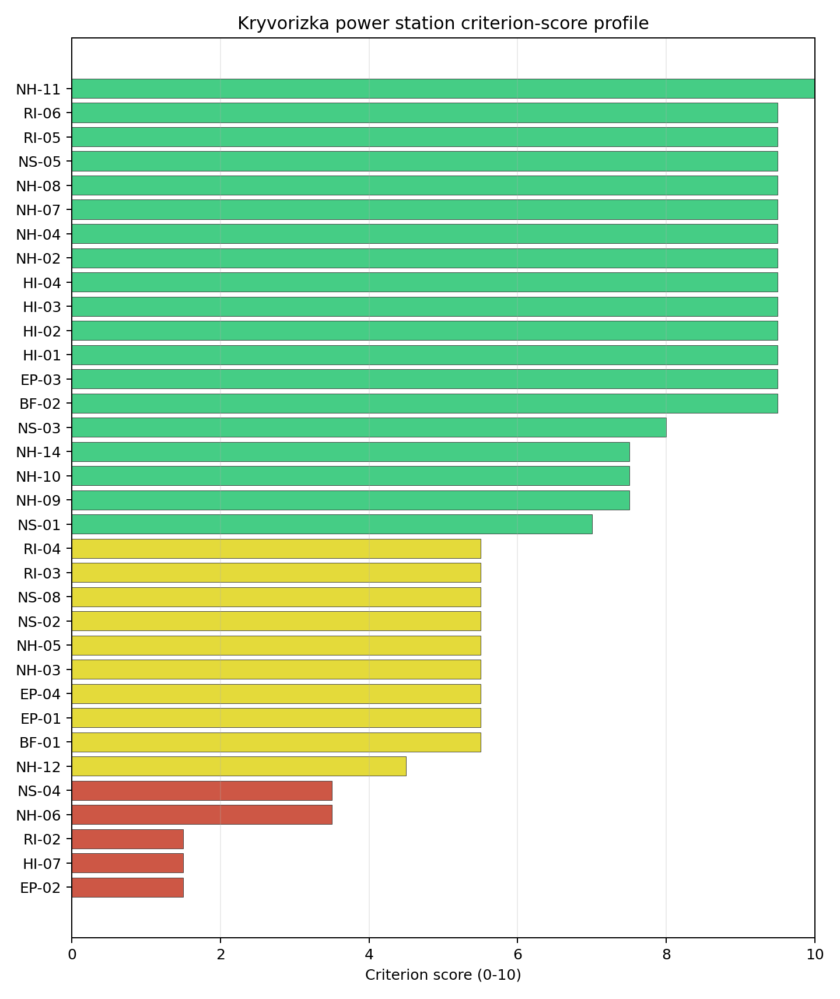
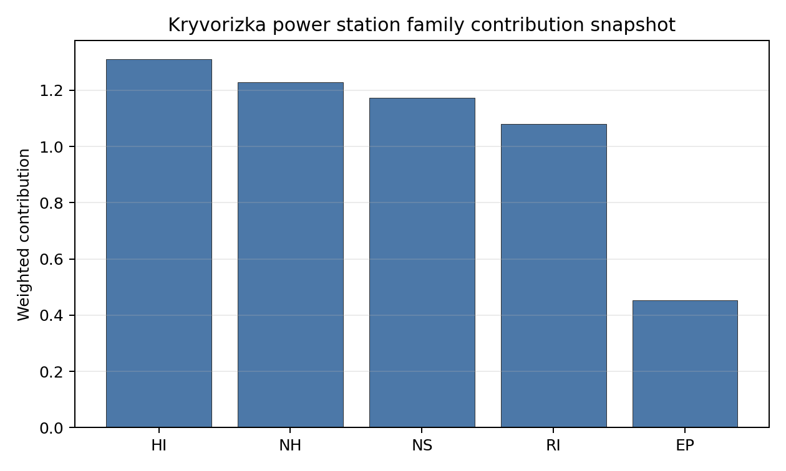

# Kryvorizka power station Site Profile

Kryvorizka power station is a coal/thermal site in Ukraine that has been tested against the NuScale VOYGR-6 reference deployment envelope. This profile reads the screening evidence at a level that supports a decision to progress toward Stage 3 characterization. It is not a site-suitability determination, vendor recommendation, or licensing finding.

## Site Snapshot

| Field | Value |
| --- | --- |
| Site name | Kryvorizka power station |
| Coordinates | 47.5432, 33.6595 |
| Subnational unit | Dnipropetrovsk |
| Installed thermal capacity (source data) | 2,925 MW |
| Available surface area | 456.0 ha |
| Available surface area for development | 133.9 ha |
| Composite score (baseline weights) | 7.166 (6.051-7.655 MC band) |
| National stability band | D (top-10% hit rate 0%) |
| National rank | 4 |

_See the country status map in_ [Ukraine Country Profile](../UA_country_prototype.md#country-status-map).

## Ownership and Coal-to-Nuclear Context

- **DTEK Group BV** (nan% share), headquartered in Netherlands; immediate operator DTEK Dniproenergo JSC. Path: DTEK Group BV -> DTEK Energy Holdings BV [100.0%] -> DTEK Energy BV [unknown %] -> DTEK Dniproenergo JSC [48.8%] -> Kryvorizka power station Unit 6 [100.0%]
- **DTEK Energy Holdings BV** (nan% share), headquartered in Netherlands; immediate operator DTEK Dniproenergo JSC. Path: DTEK Energy Holdings BV -> DTEK Energy BV [unknown %] -> DTEK Dniproenergo JSC [48.8%] -> Kryvorizka power station Unit 6 [100.0%]
- **DTEK Energy BV** (48.80% share), headquartered in Netherlands; immediate operator DTEK Dniproenergo JSC. Path: DTEK Energy BV -> DTEK Dniproenergo JSC [48.8%] -> Kryvorizka power station Unit 6 [100.0%]
- **GPL Power Ltd** (9.50% share), headquartered in Cyprus; immediate operator DTEK Dniproenergo JSC. Path: GPL Power Ltd -> DTEK Dniproenergo JSC [9.5%] -> Kryvorizka power station Unit 6 [100.0%]
- **DTEK Holdings Ltd** (25.00% share), headquartered in Cyprus; immediate operator DTEK Dniproenergo JSC. Path: DTEK Holdings Ltd -> DTEK Dniproenergo JSC [25.0%] -> Kryvorizka power station Unit 6 [100.0%]
- **natural person(s)** (nan% share); immediate operator DTEK Dniproenergo JSC. Path: natural person(s)  -> DTEK Holdings Ltd [unknown %] -> DTEK Dniproenergo JSC [25.0%] -> Kryvorizka power station Unit 2 [100.0%]
- **System Capital Management Ltd** (nan% share), headquartered in Cyprus; immediate operator DTEK Dniproenergo JSC. Path: System Capital Management Ltd -> DTEK Group BV [100.0%] -> DTEK Energy Holdings BV [100.0%] -> DTEK Energy BV [unknown %] -> DTEK Dniproenergo JSC [48.8%] -> Kryvorizka power station Unit 6 [100.0%]
- **GPL Ingen Power Ltd** (15.50% share), headquartered in Cyprus; immediate operator DTEK Dniproenergo JSC. Path: GPL Ingen Power Ltd -> DTEK Dniproenergo JSC [15.5%] -> Kryvorizka power station Unit 6 [100.0%]

Generating units on record: 7 mothballed, 3 retired.
Earliest unit commissioning: 1963; most recent: 1972.
Retirements span 2018 to 2018, leaving brownfield grid, water, transport, and workforce assets that materially shorten Stage 3 site preparation.

## Natural Hazards (NH)

- **Seismic: Ground Motion (NH-01)** - score no native score (unscored — no band matched), weight 0.0455, data quality medium. Evidence: PGA at 475-year return period 0.01 g; Vs30 reference (m/s): 760.0.
- **Seismic: Surface Rupture (NH-02)** - score 9.5/10 (MC 9.0-10.0) — favorable: Very strong separation from mapped capable faults; surface-rupture concern effectively screened at desk-study level., weight n/a, data quality screening grade. Evidence: nearest mapped capable fault 50.0 km; fault slip rate 0 mm/yr; fault name: none_in_search_radius; E1 verdict (radius 5 km): outside the SSG-9 capable-fault screening envelope.
- **Geotechnical: Liquefaction (NH-03)** - score 5.5/10 (MC 5.0-6.0) — pass-mark band: Moderate susceptibility, or high/very-high with documented (or pending for `high`) mitigation., weight n/a, data quality medium. Evidence: liquefaction susceptibility: moderate.
- **Geotechnical: Slope Stability (NH-04)** - score 9.5/10 (MC 9.0-10.0) — favorable: Well below the risk boundary., weight n/a, data quality screening grade. Evidence: site slope 3.36 deg; max slope in 1 km box 77.5 deg; slope stability class: gentle.
- **Geotechnical: Subsidence (NH-05)** - score 5.5/10 (MC 5.0-6.0) — pass-mark band: At or above the mine-distance score-5 pivot; review possible., weight 0.0354, data quality medium. Evidence: karst present: no; karst severity: moderate; formation type: carbonate (Discontinuous carbonate rocks).
- **Geotechnical: Foundation (NH-06)** - score 3.5/10 (MC 3.0-4.0), weight 0.0253, data quality medium. Evidence: depth to bedrock 27.4 m.
- **Volcanism (NH-07)** - score 9.5/10 (MC 9.0-10.0) — favorable: Very strong margin above the score-5 boundary (or connector confirmed no in-radius signal)., weight n/a, data quality high. Evidence: volcanic hazard class: negligible.
- **Coastal Flooding (NH-08)** - score 9.5/10 (MC 9.0-10.0) — favorable: Non-coastal OR elevation >= 50 m AMSL OR landlocked country, with no positive marine-hazard signal., weight 0.0303, data quality medium. Evidence: distance to coast 131.8 km.
- **River Flooding (NH-09)** - score 7.5/10 (MC 7.0-8.0), weight 0.0404, data quality medium. Evidence: flood zone class: negligible.
- **Extreme Winds (NH-10)** - score 7.5/10 (MC 7.0-8.0), weight 0.0152, data quality medium. Evidence: design wind speed 8.31 m/s.
- **Extreme Precipitation (NH-11)** - score 10.0/10 (MC 9.0-10.0) — favorable: aggregated(mean_of_sub_scores), weight 0.0152, data quality medium. Evidence: extreme daily precipitation 0.13 mm; mean annual precipitation 16.6 mm/yr.
- **Extreme Temperatures (NH-12)** - score 4.5/10 (MC 4.0-5.0) — pass-mark band: aggregated(mean_of_sub_scores), weight 0.0202, data quality medium. Evidence: extreme high temperature 26.6 deg C; extreme low temperature -8.51 deg C.
- **Combined Hazards (NH-14)** - score 7.5/10 (MC 7.0-8.0), weight 0.0152, data quality n/a. Evidence: values not in measurement tables.

### Interpretation - Natural Hazards (NH)

<!-- specialist key=family_natural_hazards scope=site site_id=83fede8b-5f92-429d-920d-9a8928a74780 bundle=UA_kryvorizka_power_station_site_bundle.json status=pending -->

<!-- /specialist key=family_natural_hazards -->

## Human-Induced and Security-Relevant Hazards (HI)

- **Aircraft Crash (HI-01)** - score 9.5/10 (MC 9.0-10.0) — favorable: Nearest large/medium airport > 30 km, no flight-path proxy < 4 km, and no military airbase within 60 km., weight 0.0354, data quality high. Evidence: nearest airport 14.6 km; nearest flight path 7.28 km; airports within search radius 1; airport name: Apostolove Airfield; airport type: small_airport.
- **Industrial Explosions (HI-02)** - score 9.5/10 (MC 9.0-10.0) — favorable: Very strong margin above the score-5 boundary (or completed search confirmed no in-radius signal)., weight 0.0354, data quality screening grade. Evidence: values not in measurement tables.
- **Toxic/Gas Releases (HI-03)** - score 9.5/10 (MC 9.0-10.0) — favorable: Very strong margin above the score-5 boundary (or completed search confirmed no in-radius signal)., weight 0.0354, data quality screening grade. Evidence: values not in measurement tables.
- **External Fires (HI-04)** - score 9.5/10 (MC 9.0-10.0) — favorable: > 15 km, or completed flammable-storage search found nothing in radius., weight 0.0303, data quality screening grade. Evidence: values not in measurement tables.
- **Military Installations (HI-06)** - score no native score (unscored — no band matched), weight 0.0303, data quality screening grade. Evidence: military installations within radius 0.
- **Electromagnetic Interference (HI-07)** - score 1.5/10 (MC 1.0-2.0), weight 0.0101, data quality medium. Evidence: nearest high-power transmitter 0.55 km; transmitters within radius 35; transmitter type: tower.

### Interpretation - Human-Induced and Security-Relevant Hazards (HI)

<!-- specialist key=family_human_hazards scope=site site_id=83fede8b-5f92-429d-920d-9a8928a74780 bundle=UA_kryvorizka_power_station_site_bundle.json status=pending -->

<!-- /specialist key=family_human_hazards -->

## Radiological Impact and Emergency Planning (RI / EP)

- **Emergency Planning Feasibility (EP-01)** - score 5.5/10 (MC 5.0-6.0) — pass-mark band: At or above the composite score-5 boundary., weight n/a, data quality high. Evidence: EP feasibility composite 59.1 /100; road sub-score 26.5 /100; special-population sub-score 90.0 /100; geography sub-score 95.0 /100; population sub-score 80.0 /100; evacuation feasible: yes.
- **Evacuation Routes (EP-02)** - score 1.5/10 (MC 1.0-2.0), weight 0.0303, data quality medium. Evidence: road density in EPZ 0.265 km/km2; road length in EPZ 520.8 km; motorway access: no.
- **Physical Geography Constraints (EP-03)** - score 9.5/10 (MC 9.0-10.0) — favorable: No measured relief; open river/waterway context (interim screening)., weight 0.0253, data quality medium. Evidence: waterways crossing EPZ 0; major river barrier: no.
- **Special Populations (EP-04)** - score 5.5/10 (MC 5.0-6.0) — pass-mark band: 9-25., weight 0.0303, data quality medium. Evidence: hospitals in EPZ 23; prisons in EPZ 0; care homes in EPZ 0.
- **Atmospheric Dispersion (RI-01)** - score no native score (unscored — no band matched), weight 0.0303, data quality medium. Evidence: annual mean wind speed 1.25 m/s; atmospheric mixing height 587.2 m; prevailing wind direction: NE.
- **Surface Water Dispersion (RI-02)** - score 1.5/10 (MC 1.0-2.0), weight 0.0253, data quality n/a. Evidence: values not in measurement tables.
- **Groundwater Dispersion (RI-03)** - score 5.5/10 (MC 5.0-6.0) — pass-mark band: Moderate-permeability aquifer screening proxy., weight 0.0253, data quality medium. Evidence: aquifer type: inland water.
- **Population Density at EPZ Radii (RI-04)** - score 5.5/10 (MC 5.0-6.0) — pass-mark band: aggregated(min_of_sub_scores), weight 0.0404, data quality screening grade. Evidence: population density within 5 km 111.9 /km2; population density within 16 km 49.6 /km2; population density within 25 km 35.7 /km2; population density within 80 km 61.8 /km2; population within 25 km 70,083 people.
- **Distance to Population Centres (RI-05)** - score 9.5/10 (MC 9.0-10.0) — favorable: No >=50k population-centre proxy within screening envelope., weight 0.0505, data quality screening grade. Evidence: values not in measurement tables.
- **Population Projections (RI-06)** - score 9.5/10 (MC 9.0-10.0) — favorable: Declining (< -0.5 %/yr)., weight 0.0253, data quality screening grade. Evidence: annual population growth rate -1.562 %/yr; projected population at 25 km in 60 yr 41,960 people.

### Interpretation - Radiological Impact and Emergency Planning (RI / EP)

<!-- specialist key=family_radiological_emergency scope=site site_id=83fede8b-5f92-429d-920d-9a8928a74780 bundle=UA_kryvorizka_power_station_site_bundle.json status=pending -->

<!-- /specialist key=family_radiological_emergency -->

## Non-Safety and Implementation Considerations (NS)

- **Grid Capacity Basic Filter (BF-01)** - score 5.5/10 (MC 5.0-6.0) — pass-mark band: Note: substation 15-30 km OR 110-219 kV; reinforcement plausible., weight n/a, data quality n/a. Evidence: values not in measurement tables.
- **Land Area Basic Filter (BF-02)** - score 9.5/10 (MC 9.0-10.0) — favorable: Contiguous and buildable >= ideal area (70 ha/module)., weight 0.0253, data quality n/a. Evidence: values not in measurement tables.
- **Cooling Water Availability (NS-01)** - score 7.0/10 (MC 6.0-7.0), weight 0.0404, data quality screening grade. Evidence: distance to cooling source 2.78 km; cooling source flow 0.54 m3/s; cooling source type: small_river; cooling source name: HYRIV-20439786; water stress label: Low.
- **Grid Connection (NS-02)** - score 5.5/10 (MC 5.0-6.0) — pass-mark band: aggregated(min_of_sub_scores), weight 0.0404, data quality high. Evidence: nearest substation 0.44 km; nearest high-voltage line 0.3 km; highest nearby line voltage 150.0 kV; grid export capacity 2,925 MW; substations within radius 293; HV lines within radius 728.
- **Transport Access (NS-03)** - score 8.0/10 (MC 8.0-9.0) — favorable: aggregated(weighted_mean_of_sub_scores), weight 0.0404, data quality high. Evidence: nearest highway 9.17 km; nearest rail line 0.33 km; heavy-haul capable: yes.
- **Site Topography (NS-04)** - score 3.5/10 (MC 3.0-4.0), weight 0.0303, data quality screening grade. Evidence: favourable land cover 35.7 %; moderate land cover 6 %; unfavourable land cover 58.3 %; favourable area 48.2 ha; dominant land class: 512.
- **Site Footprint Adequacy (NS-05)** - score 9.5/10 (MC 9.0-10.0) — favorable: Very strong margin above the score-5 boundary., weight 0.0253, data quality screening grade. Evidence: buildable area 133.9 ha; largest contiguous patch 500.7 ha; buildable patch count 6.
- **Existing Infrastructure (NS-06)** - score no native score (unscored — no band matched), weight 0.0253, data quality n/a. Evidence: not measured at this site (criterion remains unscored).
- **Ecological Sensitivity (NS-08)** - score 5.5/10 (MC 3.5-7.5) — pass-mark band: Both networks NULL or >= 5 km., weight n/a, data quality insufficient. Evidence: natural land cover 58.3 %; distance to nearest protected area 9.973 km; Natura 2000 sensitivity class: unknown; protected-area overlap: no; protected-area sensitivity class: low; Natura 2000 sites within 5 km: 0; nearest protected-area designation: Emerald Network.
- **Workforce Availability (NS-10)** - score no native score (unscored — no band matched), weight 0.0202, data quality n/a. Evidence: not measured at this site (criterion remains unscored).
- **Regulatory/Political Environment (NS-12)** - score no native score (unscored — no band matched), weight 0.0303, data quality n/a. Evidence: not measured at this site (criterion remains unscored).
- **Construction Logistics (NS-13)** - score no native score (unscored — no band matched), weight 0.0202, data quality n/a. Evidence: not measured at this site (criterion remains unscored).

### Interpretation - Non-Safety and Implementation Considerations (NS)

<!-- specialist key=family_infrastructure scope=site site_id=83fede8b-5f92-429d-920d-9a8928a74780 bundle=UA_kryvorizka_power_station_site_bundle.json status=pending -->

<!-- /specialist key=family_infrastructure -->

## Composite Score and Stability

Baseline composite score is 7.166, bracketed by Monte Carlo at 6.051-7.655. National stability band is `D` with a top-10% hit rate of 0% across 12 scored Monte Carlo scenarios.

<!-- specialist key=stability scope=site site_id=83fede8b-5f92-429d-920d-9a8928a74780 bundle=UA_kryvorizka_power_station_site_bundle.json status=pending -->

<!-- /specialist key=stability -->

## Residual Risk Register

<!-- specialist key=residual_risk scope=site site_id=83fede8b-5f92-429d-920d-9a8928a74780 bundle=UA_kryvorizka_power_station_site_bundle.json status=pending -->

<!-- /specialist key=residual_risk -->

## Stage 3 Follow-Up Checklist

- [ ] Re-measure **Evacuation Routes (EP-02)** - native score 1.5/10 with confidence medium.
- [ ] Re-measure **Electromagnetic Interference (HI-07)** - native score 1.5/10 with confidence medium.
- [ ] Re-measure **Surface Water Dispersion (RI-02)** - native score 1.5/10 with confidence insufficient.
- [ ] Re-measure **Geotechnical: Foundation (NH-06)** - native score 3.5/10 with confidence medium.
- [ ] Re-measure **Site Topography (NS-04)** - native score 3.5/10 with confidence medium.

## Evidence Limitations

- No criterion-family quality fields are flagged as low or missing in this bundle.
