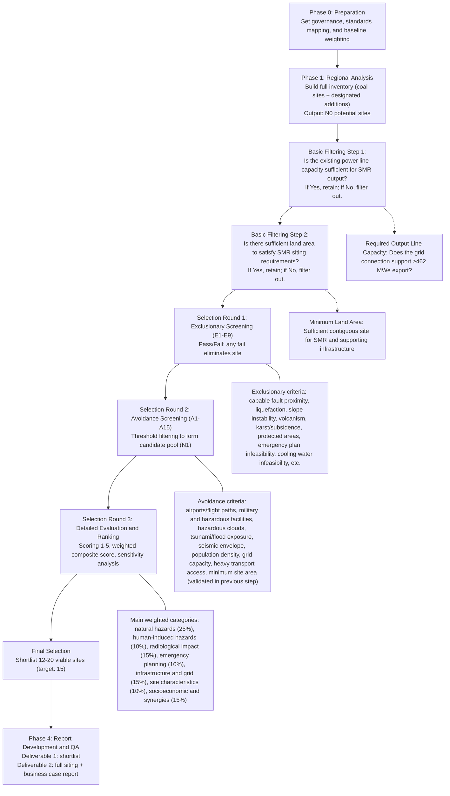

# SMR Siting Assessment — Requirements Index

**Project Title:** Assessment of Coal Power Plant Sites for Small Modular Reactor (SMR) Deployment in Central, Eastern, and Southern Europe

**Prepared for:** Government of Romania / Nuclearelectrica S.A. (SNN)

**Reference Technology:** NuScale VOYGR-6 (6 × 77 MWe = 462 MWe)

**Version:** 1.0

**Date:** March 2026

---

## Table of Contents

| File                                                     | Contents                                                                                             | Original Sections |
| -------------------------------------------------------- | ---------------------------------------------------------------------------------------------------- | ----------------- |
| [01_overview.md](01_overview.md)                         | Executive Summary, Context, Scope                                                                    | S1, S2, S3        |
| [02_deliverables.md](02_deliverables.md)                 | Deliverables                                                                                         | S4                |
| [03_regulatory_framework.md](03_regulatory_framework.md) | Regulatory and Standards Framework                                                                   | S5                |
| [04_siting_methodology.md](04_siting_methodology.md)     | Siting Methodology                                                                                   | S6                |
| [05_siting_criteria.md](05_siting_criteria.md)           | Siting Criteria Specification                                                                        | S7                |
| [06_scoring_matrix.md](06_scoring_matrix.md)             | Scoring Matrix Design                                                                                | S8                |
| [07_data_requirements.md](07_data_requirements.md)       | Data Requirements and Databases                                                                      | S9                |
| [08_automated_system.md](08_automated_system.md)         | Automated Site Evaluation System (pointer → [architecture/specs](../architecture/specs/00_index.md)) | S10               |
| [09_business_case.md](09_business_case.md)               | Business Case Framework                                                                              | S11               |
| [10_execution_plan.md](10_execution_plan.md)             | Project Execution Plan                                                                               | S12               |
| [11_quality_assurance.md](11_quality_assurance.md)       | Quality Assurance and Management System                                                              | S13               |
| [12_references.md](12_references.md)                     | References                                                                                           | S14               |

---

## Phase-to-File Mapping

| Phase       | Description         | Files to Open                                                                                                   |
| ----------- | ------------------- | --------------------------------------------------------------------------------------------------------------- |
| **Phase 0** | Preparation         | 01_overview, 03_regulatory_framework, 10_execution_plan                                                         |
| **Phase 1** | Data Infrastructure | 01_overview, 07_data_requirements, 08_automated_system, [architecture/specs](../architecture/specs/00_index.md) |
| **Phase 2** | Screening           | 04_siting_methodology, 05_siting_criteria                                                                       |
| **Phase 3** | Detailed Evaluation | 04_siting_methodology, 06_scoring_matrix                                                                        |
| **Phase 4** | Report Development  | 02_deliverables, 09_business_case, 11_quality_assurance                                                         |
| **Always**  | Reference material  | 00_index, 12_references                                                                                         |

---

## End-to-End Siting Process (At-a-Glance)

---

## Audit Trail

Per IAEA QA requirement 13.1.6 (see [11_quality_assurance.md](11_quality_assurance.md)), all correspondence and decision records are preserved in the project repository:

| Folder                                            | Contents                                                                                        |
| ------------------------------------------------- | ----------------------------------------------------------------------------------------------- |
| [`audit/conversations/`](../audit/conversations/) | Structured log of every AI-assisted work session (objective, decisions, files changed, outcome) |
| [`audit/plans/`](../audit/plans/)                 | Copy of every plan created and implemented for this project                                     |

Conventions are documented in [`audit/README.md`](../audit/README.md).
